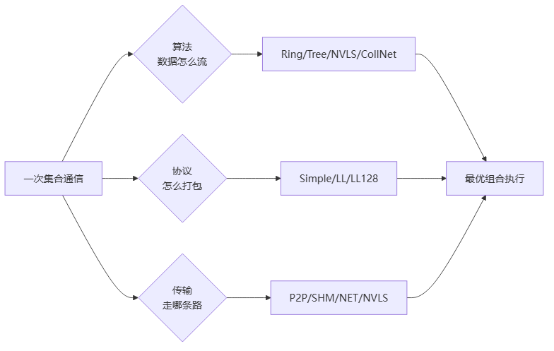

# NCCL 集合通信库

> 知乎专栏第9–22、61–105篇重写（~56 篇，专栏绝对主体）。NCCL 是 NVIDIA 多 GPU/多节点集合通信库，分布式训练软件栈的事实标准底座——数据并行第⑤步 AllReduce 就靠它。

## 推荐阅读顺序

1. [[NCCL架构总览]] — Host/Device 分层、三大维度（算法/协议/传输）、ncclComm、初始化流程
2. [[NCCL拓扑算法]] — Ring/Tree/2D-Mesh/NVLS/CollNet 怎么选 + 环境变量指定
3. [[NCCL传输层]] — P2P/SHM/NET/NVLS/CollNet 物理传输详解
4. [[NCCL协议与机制]] — LL/LL128/Simple 协议 + Bootstrap/Proxy/Group/Plugin/GDR
5. [[NCCL核心模块]] — Channel/Graph/Init/Enqueue/Symmetric Kernel/Proxy 等模块代码级分析
6. [[NCCL性能优化]] — 延迟带宽模型与调优
7. [[NCCL国产化需求]] — 国产芯片如何对标 NCCL
8. [[NCCL未来演进]] — NVLink/GPU 架构/网络 3-5 年预测

## NCCL 三维度主线

> 图解源文件：[`01-NCCL-三维度主线-flowchart.mmd`](../../../_attachments/ai-infra/nccl/index/whiteboard-mermaid/01-NCCL-三维度主线-flowchart.mmd)。

**给应届生**：NCCL 所有能力归到三个正交维度——算法（Ring/Tree…）、协议（Simple/LL…）、传输（P2P/NET…）。初始化时探测硬件拓扑，三维各选最优组合。理解 NCCL = 理解这三个维度各自选什么、为什么。

## 概念锚点

[[AllReduce]] · [[Ring-AllReduce]] · [[通信隐藏]] · [[集合通信原语]] · [[NVLink]] · [[GPUDirect-RDMA]]

## 延伸

- [[wiki/ai-infra/index|ai-infra 专区首页]]
- [[wiki/ai-infra/distributed-training/index|分布式训练基础]] — NCCL 在第⑤步的位置
- [[wiki/ai-infra/comm-libs/index|其他通信库]] — NVSHMEM/UCX/Gloo 等与 NCCL 互补
- [[wiki/ai-infra/llm-inference/index|LLM推理]] — PD 分离/MoE 通信对标 NCCL（如 [[wiki/ai-infra/llm-inference/DeepEP|DeepEP]] 的 MoE all-to-all）
- 专栏地址：https://www.zhihu.com/column/c_1491039346714746880
