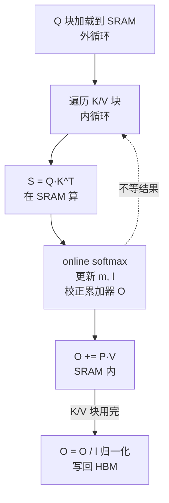

# FlashAttention

> **一句话**：FlashAttention 是一个**快速且省显存**的精确注意力实现，靠「IO 感知 + 分块（tiling）+ 在线 softmax」把标准 Attention 对 HBM 的 O(N²) 读写降到 O(N)，不在显存里物化完整的 N×N 注意力矩阵。结果完全精确（不是近似），只是把中间结果留在片上 SRAM 里算完。它让长序列（8K–128K）训练成为可能，是大模型训练的标配算子。

## FlashAttention 解决什么问题

标准 Attention：`O = Softmax(Q·K^T / √d) · V`。问题出在中间的注意力分数矩阵 `S = Q·K^T` 是 **N×N**——序列一长（比如 8K），这个矩阵巨大，且算 softmax、乘 V 都要反复在 HBM（显存）和 SRAM 之间搬运。GPU 算力很高但 HBM 带宽有限，计算单元经常在「等数据从显存搬过来」，这就是**内存墙**。

- 标准 Attention：HBM 访问量 O(N²d)，存完整 N×N 矩阵
- FlashAttention：HBM 访问量 O(Nd)，只存 log-sum-exp 统计量

**给应届生**：标准 Attention 像「把整本字典搬到桌上查一个词，查完搬回去，再搬来查下一个」——反复搬运 N×N 的巨表。FlashAttention 的 IO 感知 = 「先算哪块读哪块，算完立刻用，不在桌上摊开整本字典」。关键不是算得更快，而是**少跑显存来回**——计算量没变，但 IO 少了十几倍。

## 核心算法：tiling + online softmax

FlashAttention 把 Q/K/V 切成小块（tile），分块加载到 GPU 的片上 SRAM（共享内存）里算，**永远不在 HBM 里写出完整的 N×N 矩阵**。难点是 softmax 需要「全局归一化」（每行要除以该行所有 exp 之和），而分块后你一次只看到一部分 K/V——这靠 **online softmax** 解决。

**online softmax 思路**：维护两个统计量——行最大值 `m` 和指数和 `l`。每加载一个新的 K/V 块，就用新块的局部最大值更新 `m`，并校正之前累加的结果（乘以 `exp(m_old - m_new)` 重新缩放），边算边更新，最后用最新的 `m, l` 归一化输出。这样不需要先看完所有 K/V 再算 softmax，流式推进即可。

**为什么精确**：数学上 online softmax 和标准 softmax 完全等价，只是换了计算顺序（先减最大值再 exp、流式累加），没有近似。省的是「不物化 N×N 矩阵到 HBM」的 IO 开销。

**给应届生**：tiling ≈ 把一大锅汤分小碗喝，每碗喝完再盛下一碗，不在桌上同时摆一百碗。online softmax ≈ 边喝边记账——「这碗比之前最烫的还烫，就把之前的味道按比例修正一下」，不用等所有碗都摆齐再算总账。这两个技巧合起来，让长序列不再 OOM、不再卡在显存带宽上。

## 4+1 架构简述

FlashAttention 是一个分层系统：Python API（`flash_attn_func`）→ C++ Binding → CUDA Kernel 分发 → 根据 GPU 架构选 kernel（SM80 A100 / SM90 H100）。

- **核心层**：Forward kernel（算 `Softmax(QK^T)V`）、Backward kernel（算 dQ/dK/dV，靠存的 LSE 统计量重算）、Specialized kernel（KV Cache 推理、Paged Attention、Split-K 长序列）。
- **内存层**：Shared Memory tiling、online softmax、寄存器管理。
- **优化层**：IO 感知调度、work partitioning（FA-2 改进并行）、warp specialization（FA-3 的 Producer/Consumer 分离——一组 warp 异步加载 K/V，另一组算）。
- **演进**：FA-1 提出 tiling+online softmax；FA-2 减少非 matmul 计算、优化并行划分，A100 上 2x；FA-3 用 Hopper 的 TMA（异步张量加载）+ WGMMA + warp specialization，H100 上再 1.5–2.5x。

## 性能优化要点

- **Split-K**：batch×heads 小、序列长时，把 K/V 维度切给多个 SM 并行算再合并，提高 GPU 利用率（H100 有 132 个 SM）。
- **VarLen 变长批处理**：不同长度序列拼成一维用 `cu_seqlens` 索引，避免 padding 浪费——推理 serving 标配。
- **KV Cache 推理**：`flash_attn_with_kvcache` 自动管理缓存，decode 阶段只算新 token，支持 Paged（分页）KV。
- **数据类型**：训练用 BF16（数值稳），Hopper 推理用 FP16（吞吐高），FP8 仅前向 +20-30% 加速。
- **tile 自动选择**：FA 内部按 head_dim/seqlen/causal 自动选 BlockM/BlockN，用户无需手调。

## 国产芯片启示

FlashAttention 对芯片硬件有明确要求，国产/自研芯片要兼容 FA 必须满足：

1. **大 SRAM / 共享内存**：tiling 要把 Q/K/V 块常驻片上，每 SM 至少 128 KB，推荐 192–228 KB；head_dim=256 时要 256+ KB。还要硬件 XOR-Swizzle 自动消除 bank conflict、多端口供 Tensor Core 和 SIMT 并发访问。
2. **softmax 指令 + SFU**：online softmax 用 `exp2`（2 的幂）+ FMA + warp shuffle 归约。每 SM 至少 4 个 SFU 单元支持 FP32 超越函数，理想是融合 Exp2+Max 指令。
3. **异步内存拷贝**：FA-3 的 Producer/Consumer 流水靠 `cp.async`（P0）和 TMA（P1，多维张量 bulk 传输 + 硬件边界检查 + L2 cache hint）。没有异步拷贝，加载和计算无法 overlap，性能腰斩。
4. **Barrier 同步**：block 内 `__syncthreads` 是基础；FA-3 还要 Named Barrier（8–16 个独立同步点 + mbarrier 集成 TMA 完成信号）和 Cluster Barrier（跨 CTA 共享）。这是 producer-consumer 异步流水的命脉。
5. **FP32 累加的 Tensor Core**：MMA 要 FP16/BF16 输入 + **FP32 累加器**，WGMMA 更大 tile（64×128），还要支持 FP8（E4M3 前向 + E5M2 梯度）。

**给应届生**：一句话——FlashAttention 是「内存层次敏感」的算法，它的速度不取决于你算多快，而取决于你能不能把数据聪明地放在离计算单元最近的地方（SRAM）并让加载和计算重叠。国产芯片要做 FA，先把「共享内存够大 + 异步拷贝 + 同步原语」这三件套补齐。

## 延伸

- [[Megatron与张量并行]] — Megatron 的 Attention 层就用 FlashAttention（经 TE）
- [[TransformerEngine与TorchTitan]] — TE 把 FlashAttention 封装成 fused kernel
- [[什么是分布式训练]] — Attention 是一次迭代里前向/反向最重的算子
- 专栏原文：[知乎 · 第38篇 FlashAttention 4+1架构视图](https://zhuanlan.zhihu.com/p/1974138168816191282) ｜[第39篇 对国产AI芯片设计的兼容性需求](https://zhuanlan.zhihu.com/p/1974138731356258893) ｜[第40篇 性能优化建议与示例](https://zhuanlan.zhihu.com/p/1974142341917979253)
