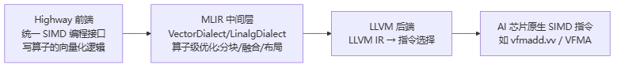
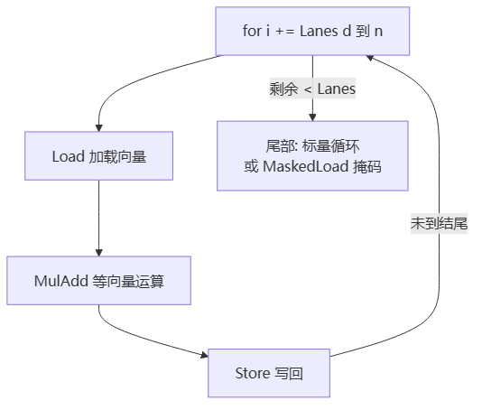

# Google Highway 向量化

> **一句话**：Google Highway（HWY）是一个 C++ 跨架构 SIMD 向量化库——**一份代码**生成 x86 AVX / ARM SVE / RISC-V RVV / POWER / WASM 等多种 SIMD 指令。配上 MLIR/LLVM，就搭出一条「高层算子 → 向量化优化 → 芯片原生指令」的编译流水线。它是国产/自研 AI 芯片想复用算子代码、又不放弃性能的关键抽象。

## Highway 是什么

SIMD（单指令多数据）= 一条指令同时处理多个数据 lane（如一条指令算 8 个 FP32）。但每家架构的 SIMD 指令集不同（x86 的 AVX、ARM 的 NEON/SVE、RISC-V 的 RVV），直接写 intrinsic（内在函数）会被绑死在一种架构上。Highway 解决这个：

- **性能可移植**：同一份向量化代码跑在多平台，保持较好性能（目标达手写汇编 80–90%）。
- **API 统一**：用 `Add/Mul/MulAdd/Load/Store/IfThenElse` 一套函数统一封装不同指令集。
- **支持可伸缩向量**：特别支持 Arm SVE 与 RISC-V RVV 这类**向量长度编译期未知**的架构——`Lanes(d)` 在运行时才确定。

**给应届生**：跨架构 SIMD ≈ 一份菜谱适配各种灶台。你写「向量加法」，Highway 在 x86 上编译成 `vaddps`（AVX），在 ARM 上编成 `fadd`（SVE），在 RISC-V 上编成 `vfadd.vv`（RVV）——同一段 C++，三套机器码。没有 Highway 你就得为每种架构手写一遍 intrinsic，算子库维护成本爆炸。

## 为什么国产芯片需要它

国产/自研 AI 芯片通常有**自己的 SIMD 指令集**（自定义向量宽度、自定义指令），但又想**复用社区已有的算子代码**（矩阵乘、卷积、LayerNorm、Softmax）。两条路：
- 直接把算子用各架构 intrinsic 重写 N 遍——成本高、易错、难维护。
- 用 Highway 写一遍，再扩展一个新 `Target` 适配自家指令——一次编写，多架构受益。

这正是 Highway + MLIR/LLVM 融合的价值：既降低跨架构 SIMD 开发成本（Highway 抽象），又保留对芯片的定制优化能力（MLIR/LLVM）。

## Highway + MLIR/LLVM 向量化流程

三者分工协作，构成面向 AI 芯片算子的编译流水线：

> 图解源文件：[`01-Highway-+-MLIR-LLVM-向量化流程-flowchart.mmd`](../../../_attachments/ai-infra/training-framework/Google-Highway向量化/whiteboard-mermaid/01-Highway-+-MLIR-LLVM-向量化流程-flowchart.mmd)。

- **Highway（前端）**：用统一接口写算子向量化逻辑，只关注「算法」不关心底层指令。如 INT8 矩阵乘，核心是 `Load → MulAdd（a×b+c）→ Store` 的向量循环。
- **MLIR（中间优化）**：把 Highway 逻辑转成 MLIR 的 `VectorDialect`（向量 IR）或 `LinalgDialect`（张量 IR），做 AI 算子级优化：循环分块适配缓存、指令融合（mul+add→FMA）、内存布局调整、向量长度适配（256bit→512bit）。
- **LLVM（后端）**：MLIR 用 `ConvertVectorToLLVM` Pass 转 LLVM IR，再由扩展的 Target 后端做指令选择，把 `FMULADD` 映射成芯片原生 SIMD 指令（如 `VFMADD_VV`）。

**INT8 矩阵乘示例**（第111篇）：假设自研 `AIChip-NPU`（RISC-V V 扩展 + 自定义 256bit 向量单元）。步骤：① Highway 封装 256bit INT8 乘加原语 `VecMulAddInt8`（INT8 相乘扩到 INT32 累加防溢出）；② MLIR 定义 `aichip` Dialect，封装 `matmul_int8` 算子并 Lowering 到 Highway 的 C 接口；③ LLVM 后端扩展指令选择器，把 `Mul+Add` 映射到 `vfmadd.vv`；④ 编译 + 在模拟器/硬件验证。一条链路从高层算子直达机器码。

**给应届生**：这套流程 ≈ 「高级语言 → 编译器优化 → 汇编」。Highway 是你写的高级向量化代码，MLIR 是编译器的「优化中端」（分块、融合），LLVM 是「后端」（选哪条机器指令）。国产芯片的活主要在最后两步——定义自己的 Dialect + 扩展 LLVM 后端。

## RISC-V RVV 编程要点

RISC-V 的向量扩展（RVV）有个反直觉特性：**向量长度编译期未知**，要靠运行时 `vsetvl` 确定。Highway 把这层复杂性藏起来，但写代码时要遵守几条规矩：

- **sizeless 向量类型**：RVV 的向量是编译器内建类型，**不能**当类成员、不能放进数组、不能 `sizeof`、不能做指针算术。正确做法：用标量数组 `T*` 做输入输出，靠 `Load(d, ptr)/Store` 在标量和向量间搬运。
- **Tag（D/d）+ Lanes**：`ScalableTag<float> d` 是零大小类型，只用来选重载和决定向量长度；`Lanes(d)` 返回当前向量 lane 数（运行时值，不能当 `constexpr` 数组大小）。
- **LMUL**：RVV 的寄存器组大小参数（1/2/4/8），决定每条指令用多少物理寄存器。`HWY_FULL(float, 2)` 会生成 `vfloat32m2_t`。大 LMUL 提吞吐但占寄存器多易溢出。
- **strip-mining 循环**：外层按 `i += Lanes(d)` 推进，尾部用标量或掩码 `MaskedLoad/MaskedStore` 处理（`FirstN` 构造前 N 个 lane 的掩码）。这是「向量长度无关」写法的核心模式。

> 图解源文件：[`02-RISC-V-RVV-编程要点-flowchart.mmd`](../../../_attachments/ai-infra/training-framework/Google-Highway向量化/whiteboard-mermaid/02-RISC-V-RVV-编程要点-flowchart.mmd)。

**常用接口**（够覆盖大多数算子）：初始化 `Zero/Set/Iota`；访存 `Load/Store/MaskedLoad`；算术 `Add/Mul/MulAdd/Max/Min`；比较+选择 `Gt/Lt → IfThenElse`（用掩码代替分支，ReLU 就是 `Max(x, 0)`）；归约 `SumOfLanes/MaxOfLanes`（RVV 上映射 `vfredsum/vfredmax`）；类型转换 `PromoteTo/DemoteTo/ConvertTo/BitCast`。第120篇给了 Softmax/LayerNorm/GEMM 微核等完整算子示例，全部向量长度无关、跨平台可编译。

**给应届生**：写 RVV 算子的心法——「永远不要假设向量有多宽」。用 `Lanes(d)` 控循环步长、用标量数组+Load/Store 搬数据、用掩码代替 if 分支。这样写出来的代码 x86/ARM/RISC-V 一套通吃，这是 Highway 性能可移植的根基。

## 延伸

- [[Megatron与张量并行]] — 训练框架层的并行，对应这里算子层的向量化（道/法/术/器的「术/器」层）
- [[TransformerEngine与TorchTitan]] — TE 的 fused kernel 底层也依赖高效向量化算子
- [[什么是分布式训练]] — 分布式训练的「器」层：算子库/编译器
- 专栏原文：[知乎 · 第110篇 Highway与MLIR/LLVM融合](https://zhuanlan.zhihu.com/p/1988018964505321845) ｜[第111篇 INT8矩阵乘示例详解](https://zhuanlan.zhihu.com/p/1988029941103755435) ｜[第120篇 基于Highway的RISC-V向量化算子编程指南](https://zhuanlan.zhihu.com/p/1994539967670677554)
