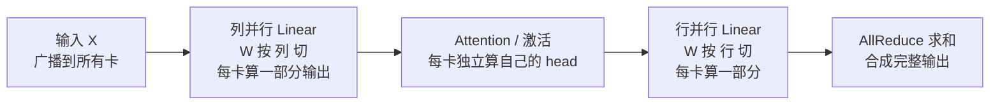
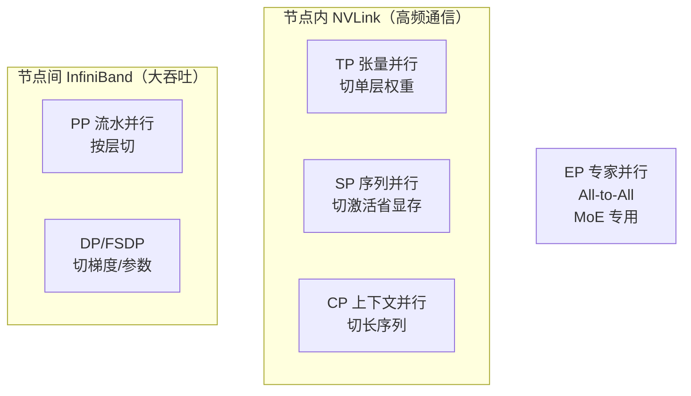

# Megatron 与张量并行

> **一句话**：Megatron-LM 是 NVIDIA 的大模型分布式训练框架，是张量并行（TP）/流水并行（PP）/数据并行（DP）/序列并行（SP）等并行策略的「发源地」。它解决的核心问题：模型太大单卡装不下、算不动，就把一层层的权重矩阵切到多卡上一起算。难点不在切，而在切完怎么拼回去不丢精度——HuggingFace 权重强转 Megatron 格式就是这条路上最容易踩的坑。

## Megatron-LM 是什么

NVIDIA 开源的、面向大规模 Transformer 的 GPU 优化训练库，支持数千 GPU 分布式训练。代码分两大块：

- **Megatron Core**（`megatron/core/`）：可组合的 GPU 优化构件库——模型（GPT/LLaMA/Mixtral/Mamba）、Transformer 层、各并行策略、分布式优化器。
- **Megatron Training**（`megatron/training/`）：训练循环、Checkpoint、参数解析（`arguments.py`）。

它底下依赖 PyTorch、Transformer Engine（TE）、NCCL。TE 见 [[TransformerEngine与TorchTitan]]，NCCL 见 [[wiki/ai-infra/nccl/index|NCCL]]。

**给应届生**：把 Megatron 想成「NVIDIA 官方的大模型训练脚手架」。和 HuggingFace `Trainer` 的区别——HF 适合中小模型单机调，Megatron 从第一天就是为「千卡、万亿参数」设计的，每一层都内置了并行切分。面试常问「大模型怎么训」，答 Megatron + TP/PP/DP 准没错。

## 张量并行原理：列切与行切

张量并行（Tensor Parallelism, TP）把**单个 Transformer 层的权重矩阵**按列或按行切到多卡上，每卡只存一部分权重。这是 Megatron 最核心的贡献。

**列并行（Column Parallel）**——用于第一个 Linear（QKV 投影、FFN 第一层）：
- 权重 `W[h, 4h]` 按列切成 `W[h, 4h/tp]`
- 输入广播到所有卡，每卡算出**部分输出**（在隐藏维度上切分）

**行并行（Row Parallel）**——用于第二个 Linear（Attention 输出投影、FFN 第二层）：
- 权重 `W[4h, h]` 按行切成 `W[4h/tp, h]`
- 输入已经是切分好的（来自上一层列并行），每卡算一部分，最后 **AllReduce** 聚合

**数学上为什么能切**：标准 Attention 是 `Y = Softmax(QK^T/√d) · V = Softmax((XWq)(XWk)^T) · (XWv)`。把 `Wq/Wk/Wv` 按列切，每卡拿一段，算出的 `Yi` 拼接（concat）就等于完整结果——因为不同 head 之间本就独立。而行并行那层，`Y = (X1·W1) + (X2·W2) + ...`，每卡算一项，AllReduce 加起来即可。

**给应届生**：张量并行 ≈ 把一个大矩阵切成几块，每卡算一块。**列切** = 切输出维度（每卡算一部分输出，拼起来完整）；**行切** = 切输入维度（每卡拿一部分输入，最后 AllReduce 加和）。一列一行配成一对，是 Megatron Transformer 层的标准 CP→RP 组合，这样一层只需一次 AllReduce。

## HuggingFace → Megatron 格式转换的坑

很多同学嫌自己写 TP/PP 切分麻烦，选择「取巧」：从 HuggingFace 下载权重，用 Megatron 自带转换器转成 Megatron 格式直接微调。这其实是从一个小坑跳进一个大坑——**格式转换会引起准确率下降**。

转换必须正确设置 TP（如 Llama-2：7B→TP=1，13B→TP=2，70B→TP=8），因为转换器要按 TP 把权重预先切好。主要掉坑点：

1. **QKV 合并/拆分**：HF 里 Q/K/V 是分开存的，Megatron 常把三者合并成一个 `qkv` 矩阵，切分维度和顺序必须对齐。
2. **LayerNorm 参数**：切分边界要和 TP/PP 配置严格一致，错位就拼不回去。
3. **RoPE 实现差异**：Megatron 用 sin/cos 实现，Llama 用极坐标/复数实现，结果有微小数值差异。
4. **精度下降**：Megatron 用批量矩阵乘（`baddbmm`）+ FP16 默认 dtype，Llama 用 `matmul` + 显式 `set_default_dtype(float16)`。实测 80 项基准测试平均误差约 **0.15%**——不大，但部分厂家不能接受排行榜掉分。

**给应届生**：HF→Megatron 转换 ≈ 把一份按「整块」存的权重，重新按你的「切分方案（TP×PP）」重新摆盘。切错了要么拼不回去（形状对不上直接报错），要么精度悄悄掉（能跑但分数低）。记住：**转换时 TP/PP 值要和后续训练一致**，否则要重新切。

## 4+1 架构：六种并行策略

Megatron 把一个大模型的训练拆成多种并行正交组合，总 GPU 数 = TP × PP × CP × EP × DP：

| 并行 | 缩写 | 切什么 | 通信 | 适用 |
|---|---|---|---|---|
| 张量并行 | TP | 单层权重矩阵 | AllReduce（高频小数据）| 节点内 NVLink |
| 流水并行 | PP | 按层切模型 | Send/Recv（激活值）| 跨节点 IB |
| 数据并行 | DP | 切数据 batch | AllReduce（梯度）| 任意 |
| 上下文并行 | CP | 切长序列 | Ring 交换 KV | 长上下文 32K+ |
| 专家并行 | EP | 切 MoE 专家 | All-to-All | MoE 模型 |
| 序列并行 | SP | TP 组内切序列 | AllGather/ReduceScatter | 配合 TP 降显存 |

**配置示例**（LLaMA-3 405B / 1024 GPU）：TP=8、PP=8、CP=2，DP = 1024/(8×8×2) = 8。决策顺序：单层太大→上 TP；总层数太多→上 PP；序列太长→上 CP；MoE→上 EP；剩余 GPU 给 DP/FSDP。

SP 是 TP 的扩展：TP 只切权重、激活仍是完整副本（冗余），SP 进一步把 LayerNorm/Dropout 的激活在序列维度切分，把 TP 的 AllReduce 换成 ReduceScatter，省 TP 倍激活显存（代价是通信次数翻倍、吞吐降约 5%，很划算）。**规则：只要用 TP 就开 SP；但 SP 和 CP 都切序列，二选一**。

## 给应届生：TP vs PP 怎么选

面试高频问题。一句话区分：
- **TP** 切**一层内**的权重，像「一道菜几个人同时切」——节点内 NVLink 高频小数据 AllReduce，适合单层参数过大的情况。
- **PP** 切**层与层之间**，像「流水线传菜」——每卡负责连续几层，micro-batch 流过去，跨节点 IB 也扛得住，适合层数多的超大模型。

记忆口诀：**TP 看单层大小，PP 看总层数**。实际千卡训练两者都用：TP 放节点内吃 NVLink，PP 放节点间吃 IB，DP 填满剩余卡。

## 延伸

- [[什么是分布式训练]] — 分布式训练一次迭代 6 步，TP/PP/DP 是其中三种切法
- [[集合通信原语]] — TP 的 AllReduce、SP 的 ReduceScatter 都在这里
- [[TransformerEngine与TorchTitan]] — Megatron 用的 FP8 算子库 TE、PyTorch 官方训练栈 TorchTitan
- [[wiki/ai-infra/distributed-training/index|分布式训练基础]] — 集群1 分布式训练基础
- 专栏原文：[知乎 · 第7篇 HuggingFace格式大模型强转为Megatron格式的掉坑点](https://zhuanlan.zhihu.com/p/699490536) ｜[第42篇 Megatron-LM 4+1架构视图深入分析](https://zhuanlan.zhihu.com/p/1974206331419375002)
