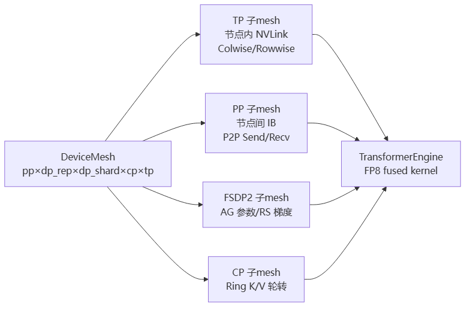
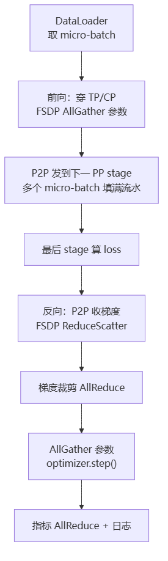

# TransformerEngine 与 TorchTitan

> **一句话**：TransformerEngine（TE）是 NVIDIA 的 FP8/混合精度 Transformer 算子库——把 LayerNorm/GEGLU/Softmax/Flash Attention/Adam 等算子融合成单个 kernel，并用 FP8 缩放榨干 Tensor Core。TorchTitan 是 PyTorch 官方参考训练栈，把 TP/PP/CP/SP/EP/DP 全套并行策略组合起来、用 TE 做量化、兼容 FSDP。两者合起来就是「大模型怎么训」的现代标准答案。

## TransformerEngine 是什么

NVIDIA 开源的 Transformer 算子库，核心做两件事：

1. **融合 kernel（fused kernel）**：标准实现里 LayerNorm→Linear→激活→Linear 是几个独立 kernel，每个都要把中间结果写回 HBM 再读出。TE 把它们融成一个 kernel，中间结果留在片上，省掉往返 IO。GEMM 占训练时间 70–80%，剩下的全在这些逐算子内存往返里——TE 就是来 reclaim 这部分带宽的。
2. **FP8/混合精度**：把权重/激活压成 FP8，配 **缩放器（scaler）** 保证精度——E4M3 用于权重/激活（前向，最大值 448），E5M2 用于梯度（反向，动态范围更大到 57344），累加用 FP32。

**给应届生**：TE ≈ 把做一道菜的「切菜→炒→调味→装盘」合并成一个不可中断的动作，食材不过夜（不落回显存），还用更小的保鲜盒（FP8）装食材提高吞吐。[[FlashAttention]] 也被 TE 封装成 fused kernel 之一。

## TorchTitan 是什么

PyTorch 官方（Meta 主导）的参考训练栈，一个最小、干净的 PyTorch 原生平台，把所有并行策略组合起来：

- **并行**：TP / PP / CP / SP / EP / DP（FSDP）正交组合，总 GPU = dp_replicate × dp_shard × cp × tp × pp（+ EP/ETP）。
- **用 TE 做量化**、**兼容 FSDP2**、**支持 MoE**（DeepSeek-V3/Qwen3）。
- **可插拔**：靠 `TrainSpec` 协议——要加新模型，实现「模型 + parallelize_fn + pipelining_fn」注册一个 TOML 即可，不碰 Trainer。

**给应届生**：TorchTitan ≈ PyTorch 官方版「Megatron」。区别是 Megatron 是 NVIDIA 自研、工程化重；TorchTitan 是 PyTorch 原生（基于 DTensor/DeviceMesh/FSDP2），更干净、更易读、更易扩展。看大模型训练怎么组合并行，TorchTitan 是最好的参考实现。

## 并行策略与架构

TorchTitan 的核心抽象是 **DTensor + DeviceMesh**：一个多维 `DeviceMesh`（维度是 `[pp, dp_replicate, dp_shard, cp, tp]`），各并行策略就是从这个 mesh 上切子网格。**声明式 plan**——`tp_plan` 是一张「层名→ColwiseParallel/RowwiseParallel」的表，`fully_shard(layer, mesh=world_mesh["dp"])` 声明 FSDP 切分，PP 按 stage 切分 + 选调度（ZeroBubbleV/Interleaved1F1B）。

| 策略 | 通信原语 |
|---|---|
| FSDP2 | 前向 AllGather 参数 / 反向 ReduceScatter 梯度 |
| TP | Colwise 本地 GEMM；Rowwise AllGather 输入 |
| PP | P2P Send/Recv 激活（按 micro-batch id 标记）|
| CP | Ring Attention，K/V 块在 CP 组内环形轮转 |

> 图解源文件：[`01-并行策略与架构-flowchart.mmd`](../../../_attachments/ai-infra/training-framework/TransformerEngine与TorchTitan/whiteboard-mermaid/01-并行策略与架构-flowchart.mmd)。

**关键内存技巧**：Meta 设备初始化 → 转换 → PP 切分 → 应用 TP → 应用 FSDP → 物化。这个 apply 顺序避免大模型在显存适中的卡上重复分配。

## 一个训练步的数据流

> 图解源文件：[`02-一个训练步的数据流-flowchart.mmd`](../../../_attachments/ai-infra/training-framework/TransformerEngine与TorchTitan/whiteboard-mermaid/02-一个训练步的数据流-flowchart.mmd)。

Llama-3 70B / 64 GPU 上一步约 1s，吞吐约 500K tokens/s，MFU ~45%。

## 国产芯片启示

TE 对硬件的要求（来自第41篇），国产芯片要兼容 TE 必须满足：

1. **FP8 Tensor Core（混合精度）**：E4M3（权重/激活）+ E5M2（梯度）+ **FP32 累加器**。没有原生 FP8 TC，FP8 训练根本跑不起来。Hopper 上 FP8 GEMM 还要求 TN 布局（转置权重）。
2. **E8M0 scale / block scaling**：TE 保精度的主路径是 per-32 元素 E8M0 缩放或 per-128/128×128 块缩放。芯片要支持缩放向量 matmul 模式（等价 cuBLAS LT 12.8/12.9）和 E8M0 数据类型。
3. **FP32 累加的低精度归约/AllReduce**：TE 的 fused LayerNorm/Adam 统计量留 FP32，要求低精度输入 + FP32 归约，否则精度崩。
4. **acquire-release 一致性 + Inter-CTA/Grid barrier**：协同 LayerNorm、Amax 原子更新、Producer-Consumer 原子 GEMM 计数器都需要它。**这是国产芯片最难移植的一项**——涉及 PTX 级 `ld.global.acquire` / `red.release.add` 语义。

其他：TMA 等价异步 2D 拷贝、≥128KB/SM SRAM、宽向量 128/256bit 对齐访存、硬件 SFU（tanh/exp/sqrt，ULP≤2）、atomicMaxFloat、多流多队列。软件栈要 CUDA 12.x + cuBLAS LT + cuDNN + NVRTC 等价 JIT。

**给应届生**：TE 把「FP8 训练」这件事从「每个算子自己量化」升级成「库统一管缩放 + 硬件原生 FP8 矩阵乘」。国产芯片要做 TE 兼容，**FP8 Tensor Core + E8M0 缩放 + FP32 累加归约**是三件硬通货，缺一个 FP8 训练就不可用。

## 性能优化要点

- **async TP / async checkpoint**：TP 通信、checkpoint 写盘各自走独立 CUDA stream/后台线程，和计算 overlap。
- **selective 激活重计算**：默认只对 Attention+FFN 重计算，省 30–50% 显存，代价 20–30% 计算。
- **FSDP2 `reshard_after_forward=True`**：前向后立刻丢参数，激进回收显存（代价是下次前向多一次 AllGather）。
- **PP 调度可插拔**：ZeroBubbleV / Interleaved1F1B / GPipe 按工作负载选，ZeroBubble 用反向梯度气泡填空。
- **容错（TorchFT）可选**：健康检查 + 快照 + `ParallelDims` 重 mesh（如 64→56 GPU），节点回来再重分片回去——这是 TorchTitan 区别于 Megatron 的招牌能力。

## 延伸

- [[FlashAttention]] — TE 封装的 fused kernel 之一
- [[Megatron与张量并行]] — NVIDIA 自研训练栈，对照 TorchTitan 看
- [[集合通信原语]] — TP 的 AllReduce、FSDP 的 AllGather/ReduceScatter、PP 的 P2P
- [[wiki/ai-infra/nccl/index|NCCL]] — 上述通信原语的底层实现
- 专栏原文：[知乎 · 第41篇 TransformerEngine对国产AI芯片硬件需求](https://zhuanlan.zhihu.com/p/1974161303875655328) ｜[第47篇 TorchTitan 4+1架构视图](https://zhuanlan.zhihu.com/p/1974594937627641530) ｜[第48篇 TorchTitan性能优化建议与示例](https://zhuanlan.zhihu.com/p/1974602999725826823)
