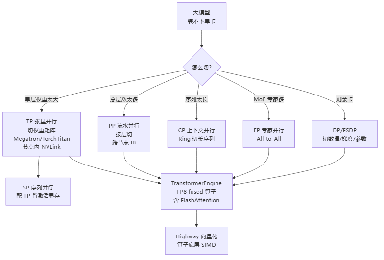

# 训练框架与算子

> 知乎专栏第7、38–48、110–111、120篇重写。大模型训练「用什么框架跑、靠什么算子快」——从 Megatron/TorchTitan 的并行策略组合，到 FlashAttention/TransformerEngine 的 IO 感知算子，再到 Highway 的跨架构向量化，一条从系统到指令的链路。

## 推荐阅读顺序

1. [[Megatron与张量并行]] — Megatron-LM 是什么 + 张量并行（列切/行切）原理 + HuggingFace→Megatron 格式转换的坑
2. [[FlashAttention]] — IO 感知注意力：tiling + online softmax 怎么把 HBM 读写从 O(N²) 降到 O(N) + 国产芯片硬件需求
3. [[TransformerEngine与TorchTitan]] — TE 的 FP8 fused 算子库 + TorchTitan 全并行策略组合的训练栈
4. [[Google-Highway向量化]] — 一份 C++ 生成多架构 SIMD 指令，配 MLIR/LLVM 打通「算子→芯片原生指令」编译流水线

## 并行策略关系

Megatron 与 TorchTitan 把一个大模型的训练拆成多种并行正交组合，总 GPU 数 = TP × PP × CP × EP × DP：

> 图解源文件：[`01-并行策略关系-flowchart.mmd`](../../../_attachments/ai-infra/training-framework/index/whiteboard-mermaid/01-并行策略关系-flowchart.mmd)。

- **TP/SP/CP** 层内并行，通信高频小数据，放**节点内 NVLink**；SP 是 TP 的扩展（省激活显存，和 CP 二选一）。
- **PP** 层间并行，P2P 传激活，放**节点间 IB**，靠 micro-batch 流水线填气泡。
- **DP/FSDP** 填满剩余卡，梯度/参数 AllGather+ReduceScatter。
- **EP** MoE 专用，All-to-All 通信。

## 概念锚点

这些页面反复用到集群1/集群2 的基础概念，遇到不熟的词回查：
- [[什么是分布式训练]] — 一次迭代 6 步，TP/PP/DP 是其中三种切法
- [[集合通信原语]] — AllReduce / AllGather / ReduceScatter / All-to-All / P2P
- [[AllReduce]] / [[Ring-AllReduce]] — TP 和 DP 的核心通信
- [[通信隐藏]] — async TP、overlap 计算与通信的思路

## 延伸

- [[wiki/ai-infra/distributed-training/index|分布式训练基础]] — 集群1，并行策略的原理底座
- [[wiki/ai-infra/nccl/index|NCCL]] — 集群2，上述所有通信原语的底层实现
- [[千卡训练性能优化]] — 集群9，千卡训练性能调优总览
