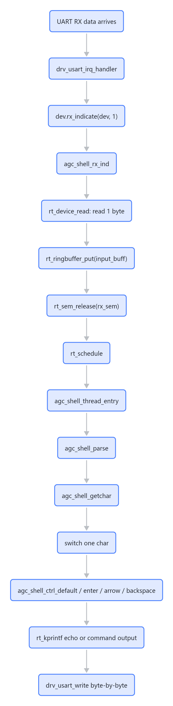
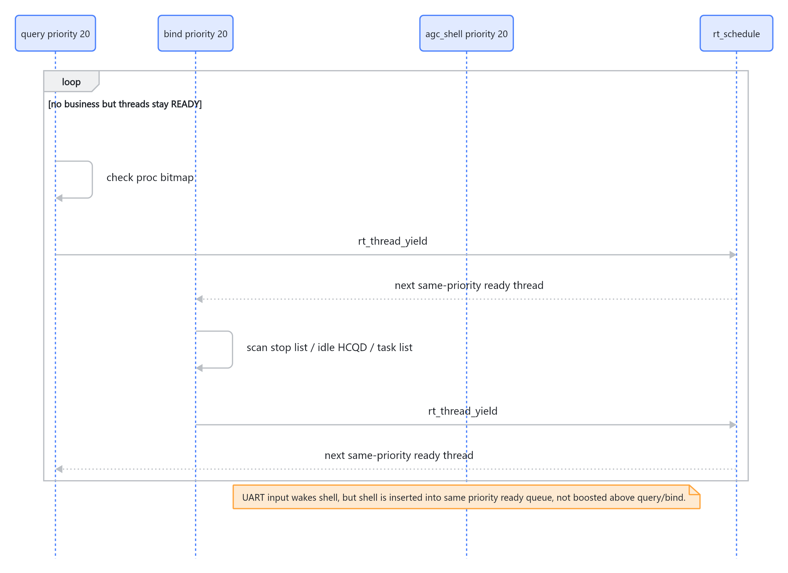

---
type: analysis
title: "agc_shell CLI 输入输出路径与 cp master 卡顿分析"
created: 2026-05-14
updated: 2026-05-14
tags:
  - fw
  - cp-master
  - agc-shell
  - cli
  - rt-thread
  - uart
status: active
source:
  - "remote:/home/shuaishuai.zhu/fw/test/framework/shell/agc_shell.c"
  - "remote:/home/shuaishuai.zhu/fw/aigc_sdk/grace/drivers/usart/drv_usart.c"
  - "remote:/home/shuaishuai.zhu/fw/rtthread/src/ipc.c"
  - "remote:/home/shuaishuai.zhu/fw/rtthread/src/scheduler.c"
  - "remote:/home/shuaishuai.zhu/fw/rtthread/src/thread.c"
---

# agc_shell CLI 输入输出路径与 cp master 卡顿分析

本文记录 `cp_master` CLI 的实际代码路径。重点不是 shell 线程时间片本身，而是 UART 字符输入、RT-Thread semaphore 唤醒、同优先级 ready 队列、同步 UART 输出，以及 `query` / `bind` 后台线程 busy-yield 之间的组合影响。

源码主入口：`/home/shuaishuai.zhu/fw/test/framework/shell/agc_shell.c`

本地临时拷贝：`C:\tmp\fw_agc_shell.c`

## 必须记住的路径

```text
UART interrupt
  -> rx_indicate
  -> rt_sem_release
  -> rt_schedule
  -> agc_shell parse 1 char
  -> rt_kprintf echo/write
```

这条路径说明：CLI 不是一次性批量处理整行输入，而是以 UART 字符为粒度被唤醒、解析、回显。任何同优先级 busy loop、UART 同步输出、后台日志，都会被放大成用户体感上的卡顿。

## 总览图



> 图解源文件：[`01-总览图-flowchart.mmd`](../../../_attachments/fw/cli/agc_shell-cli-path/whiteboard-mermaid/01-总览图-flowchart.mmd)。由 lark-whiteboard `whiteboard-cli` 从原 Mermaid 渲染。

## 代码路径索引

| 层级 | 文件 | 关键函数/位置 | 作用 |
|---|---|---|---|
| UART ISR | `aigc_sdk/grace/drivers/usart/drv_usart.c:655-693` | `drv_usart_irq_handler()` | RX FIFO 非空时调用 `pdev->dev.rx_indicate(&pdev->dev, 1)`，一次通知 1 字节。 |
| 设备回调注册 | `rtthread/components/drivers/core/device.c:445-453` | `rt_device_set_rx_indicate()` | 把 `agc_shell_rx_ind` 注册为 console 设备 RX 回调。 |
| shell 设备绑定 | `test/framework/shell/agc_shell.c:320-353` | `agc_shell_set_device()` | 打开 console device，使用 `RT_DEVICE_FLAG_INT_RX`，并设置 RX callback。 |
| RX callback | `test/framework/shell/agc_shell.c:280-318` | `agc_shell_rx_ind()` | 从 device 读数据，写入 shell ringbuffer，然后 `rt_sem_release(&shell->rx_sem)`。 |
| IPC 唤醒 | `rtthread/src/ipc.c:433-480` | `rt_sem_release()` | 如果有线程等在 semaphore 上，resume 该线程并触发 `rt_schedule()`。 |
| 线程恢复 | `rtthread/src/thread.c:754-787` | `rt_thread_resume()` | 从 suspend list 移除线程，再插入 ready queue。 |
| ready 插入 | `rtthread/src/scheduler.c:275-312` | `rt_schedule_insert_thread()` | 使用 `rt_list_insert_before(priority_table, tlist)` 插入同优先级 ready 队列尾部。 |
| 调度选择 | `rtthread/src/scheduler.c:194-240` | `rt_schedule()` | 从最高 ready 优先级队列头部选出下一个线程。 |
| shell 阻塞读字符 | `test/framework/shell/agc_shell.c:109-127` | `agc_shell_getchar()` | ringbuffer 空时 `rt_sem_take(..., RT_WAITING_FOREVER)` 阻塞；非空时取 1 字节。 |
| shell 解析字符 | `test/framework/shell/agc_shell.c:130-179` | `agc_shell_parse()` | 每次返回一个有效字符或控制键。 |
| shell 主循环 | `test/framework/shell/agc_shell.c:546-590` | `agc_shell_thread_entry()` | 每轮只处理 `agc_shell_parse()` 返回的一个字符。 |
| 普通字符回显 | `test/framework/shell/agc_shell.c:500-544` | `agc_shell_ctrl_default()` | 正常字符写入当前行，并通过 `rt_kprintf("%c", ch)` 同步回显。 |
| 回车执行命令 | `test/framework/shell/agc_shell.c:468-498` | `agc_shell_ctrl_enter()` | 换行、执行命令、更新历史、重绘 prompt。 |
| 命令解析执行 | `test/framework/shell/agc_shell.c:196-252` | `agc_shell_exec()` | 拆 `argv`，无条件 `agc_shell_dump_argv()`，再调用 `agc_cli_cmd()`。 |
| console 输出 | `rtthread/src/kservice.c:1164-1195` | `rt_kprintf()` | 格式化到静态 buffer，再 `rt_device_write()` 到 console。 |
| UART 写 | `aigc_sdk/grace/drivers/usart/drv_usart.c:500-509` | `drv_usart_write()` | 逐字节调用 `drv_usart_send_data()`。 |
| UART 发送 | `aigc_sdk/grace/drivers/usart/drv_usart.c:181-194` | `drv_usart_send_data()` | 等 TX FIFO 不满后写字节；遇到 `\n` 还会先写 `\r`。 |

## agc_shell 线程自身行为

`agc_shell` 的线程参数在 `agc_shell.c:20-22`：

```c
#define AGCSH_THREAD_STACK_SIZE    (4096)
#define AGCSH_THREAD_PRIORITY      (20)
#define AGCSH_THREAD_TICK          (2)
```

线程创建在 `agc_shell.c:613-644`：

```c
rt_thread_init(&shell->thread, "agc_shell",
               agc_shell_thread_entry, RT_NULL,
               shell->stack, AGCSH_THREAD_STACK_SIZE,
               AGCSH_THREAD_PRIORITY, AGCSH_THREAD_TICK);

rt_sem_init(&shell->rx_sem, "agc_sem", 0, RT_IPC_FLAG_PRIO);
rt_ringbuffer_init(&shell->input_buff, shell->input_buff_pool, AGCSH_INPUT_BUFFER_SIZE);
rt_thread_startup(&shell->thread);
```

含义：

- `agc_shell` 是 priority 20。
- RX 输入由 semaphore 驱动，没输入时阻塞。
- ringbuffer 大小只有 64 字节。
- 主循环每次只处理一个 `agc_shell_parse()` 返回值。

## 字符输入为什么容易被放大成卡顿

`drv_usart_irq_handler()` 发现 RX FIFO 非空后，只调用：

```c
pdev->dev.rx_indicate(&pdev->dev, 1);
```

这代表当前框架以 1 字节为粒度通知 shell。`agc_shell_rx_ind()` 再用 `rt_device_read()` 读这个字节，并放进 ringbuffer：

```c
read_size = rt_device_read(dev, 0, input_buf, read_size);
rt_ringbuffer_put(&shell->input_buff, input_buf, read_size);
rt_sem_release(&shell->rx_sem);
```

因此，输入一串命令时，路径接近：

```text
每个字符：
  UART RX interrupt
  -> rx_indicate(size = 1)
  -> rt_device_read(1 byte)
  -> ringbuffer_put
  -> sem_release
  -> schedule
  -> shell parse one char
  -> echo one char
```

如果后台线程持续占 ready 队列，或者 UART 输出被后台 log 占住，每个字符都会受到影响。

## rt_sem_release 不等于 shell 立即执行

`rt_sem_release()` 的关键逻辑：

```c
if (!rt_list_isempty(&sem->parent.suspend_thread))
{
    rt_ipc_list_resume(&(sem->parent.suspend_thread));
    need_schedule = RT_TRUE;
}
...
if (need_schedule == RT_TRUE)
    rt_schedule();
```

`rt_ipc_list_resume()` 调用 `rt_thread_resume()`，`rt_thread_resume()` 再调用：

```c
rt_schedule_insert_thread(thread);
```

而 `rt_schedule_insert_thread()` 的插入方式是：

```c
rt_list_insert_before(&(rt_thread_priority_table[thread->current_priority]),
                      &(thread->tlist));
```

这会把被唤醒线程插入该优先级 ready queue 的尾部。也就是说，shell 被 UART 唤醒后，如果同优先级上已经有 `query` / `bind` 等线程处于 READY 状态，shell 仍然需要按同优先级队列顺序排队。

## cp master 中同优先级 busy-yield 的影响

当前 `cp_master` 里，`agc_shell`、`query`、`bind` 都是 priority 20。

`qdma_query_task()` 的空闲路径：

```c
while (1)
{
    proc_bitmap = qdma_get_valid_proc_bitmap();
    if (proc_bitmap != QDMA_PROC_MASK_BITS_INVALID)
    {
        ...
    }

    rt_thread_yield();
}
```

`bdma_bind_task()` 的空闲路径：

```c
while (1)
{
    bdma_check_stop_wait_list();
    hcqd_bitmap = bdma_find_idle_hcqd();
    priority_list_node_cnt = bdma_get_priority_list_node_cnt();
    ...
    rt_thread_yield();
}
```

`rt_thread_yield()` 的实现不是 sleep：

```c
rt_list_remove(&(thread->tlist));
rt_list_insert_before(&(rt_thread_priority_table[thread->current_priority]),
                      &(thread->tlist));
rt_schedule();
```

它只是把当前线程放回同优先级 ready queue 的尾部。线程仍然是 READY。

因此，“没有业务”时系统不是空闲，而是变成：



> 图解源文件：[`02-cp-master-中同优先级-busy-yield-的影响-sequenceDiagram.mmd`](../../../_attachments/fw/cli/agc_shell-cli-path/whiteboard-mermaid/02-cp-master-中同优先级-busy-yield-的影响-sequenceDiagram.mmd)。由 lark-whiteboard `whiteboard-cli` 从原 Mermaid 渲染。

这就是为什么“两个线程只是走个过场，然后立马 yield”仍然会让 CLI 卡：这个“过场”会以 CPU 能跑多快就跑多快的频率重复。它不是一次成本，而是持续调度压力。

## 输出路径也是同步阻塞

`agc_shell_ctrl_default()` 普通字符回显：

```c
rt_kprintf("%c", ch);
```

`agc_shell_display_line()` prompt 重绘：

```c
rt_kprintf("\r\033[2K\ragcsh$ %s \b", str);
```

`agc_shell_exec()` 还会无条件打印 argv：

```c
agc_shell_dump_argv(argc, argv);
```

`rt_kprintf()` 不是异步日志队列，它直接写 console device：

```c
rt_device_write(_console_device, 0, rt_log_buf, length);
```

UART write 又是逐字节 blocking：

```c
for (rt_size_t i = 0; i < size; i++)
{
    drv_usart_send_data(..., &c[i]);
}
```

`drv_usart_send_data()` 会等待 FIFO 非满：

```c
while (reg->status & USART_STATUS_FULL);
reg->txdata.tx_data = *Data & 0xFF;
```

因此 CLI 卡顿可能有两个叠加来源：

- shell 被同优先级 `query` / `bind` busy-yield 延迟调度。
- shell 一旦拿到 CPU，又在同步 UART 输出上等待。

## 为什么 IMC CLI 可能没这么卡

从框架层面看，IMC 和 CP Master 的 shell 框架相同，但运行拓扑不同。CP Master 额外有 `query` / `bind` 这类常驻后台线程，并且它们当前与 `agc_shell` 同 priority。如果 IMC 没有同样的同优先级 busy-yield 线程，或者空闲路径有 delay/block，那么 CLI 体感会明显更好。

因此，差异不一定在 shell 代码本身，而在 shell 所处的线程环境。

## 当前最可能的根因排序

1. `query` / `bind` 与 `agc_shell` 同 priority 20，且空闲路径 `while(1) + rt_thread_yield()`，导致同优先级 ready queue 高频轮转。
2. `agc_shell` 是 1 字符粒度处理，RX callback 当前一次通知 1 字节，调度成本被每个字符放大。
3. `rt_kprintf()` / UART write 是同步逐字节输出，回显、prompt、命令输出和后台 log 共用同一条阻塞 console 路径。
4. `agc_shell_dump_argv()` 每次命令执行都无条件打印 `[exec] argv[...]`，属于 CLI 路径上的额外输出成本。
5. 如果 CP Master 当前 clock 较低，这些软件路径成本会被进一步放大。

## 建议验证实验

### 实验 1：只验证 busy-yield 是否是主因

把 `qdma_query_task()` 和 `bdma_bind_task()` 的 no-work 路径临时改成：

```c
rt_thread_delay(1);
```

预期：如果 CLI 明显变顺，说明主要瓶颈是同优先级 busy-yield 造成的调度压力。

### 实验 2：验证 shell 是否被同优先级排队拖慢

临时把 `AGCSH_THREAD_PRIORITY` 从 20 改成 19。

预期：如果 CLI 明显变顺，说明 shell 被 priority 20 的 `query` / `bind` 同级竞争影响。

注意：这只是验证手段，不一定是最终方案。最终方案仍应减少后台线程空闲轮询。

### 实验 3：验证输出路径成本

临时去掉或宏控：

```c
agc_shell_dump_argv(argc, argv);
```

同时减少后台 `LOG_D` / `LOG_I` 输出。

预期：如果回车执行命令后的卡顿降低，说明 console 输出路径是重要放大因素。

### 实验 4：计数器确认 no-work loop 频率

给 `query` / `bind` 加低频计数器，例如每秒统计一次 loop 次数。不要每轮打印，否则测量本身会污染结果。

预期：无业务时如果 loop 每秒仍然跑大量次数，就能证明“走个过场”实际上是持续 busy loop。

## 推荐修复方向

### 短期修复

- `query` / `bind` 在确认没有工作时使用 `rt_thread_delay(1)` 或自适应 backoff。
- `agc_shell_dump_argv()` 放到 debug 宏下，默认关闭。
- 保持 `agc_shell` priority 不低于后台轮询线程；如果为了调试体验，可以让 shell priority 临时高一级。

### 中期修复

- `query` / `bind` 从 polling 模式改成 event/semaphore 驱动。
- IPC create stream、doorbell、stop/release 等事件到来时唤醒对应线程。
- 空闲时线程真正 suspend，而不是一直 READY。

### 长期修复

- console 输出改成带缓冲的异步 TX，减少 shell 对 UART FIFO 的同步等待。
- RX ISR 尽量 drain FIFO 或按实际 FIFO 数据量批量通知，而不是固定 `size = 1`。
- 后台 log 和交互 shell 分离优先级或输出通道，避免后台打印阻塞用户输入。

## 一句话结论

`cp_master` CLI 卡顿的框架根因不是 shell 时间片短，而是 `agc_shell` 与 `query` / `bind` 同优先级运行，并且后台线程在无业务时仍通过 `while(1) + rt_thread_yield()` 保持 READY 高频轮转；同时 shell 又是 1 字符粒度、同步 UART 回显，所以每个字符都会受到调度和输出路径的叠加影响。