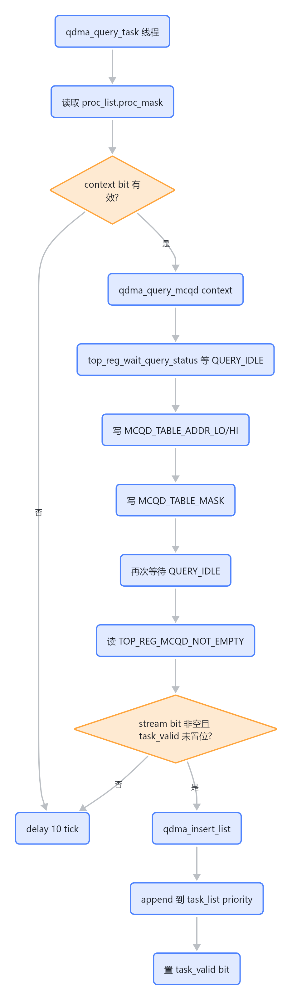
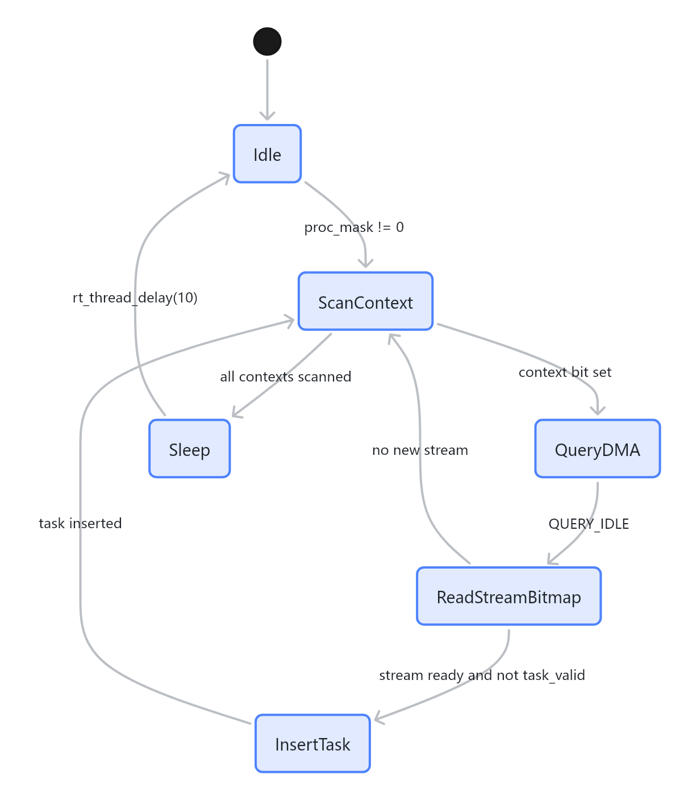
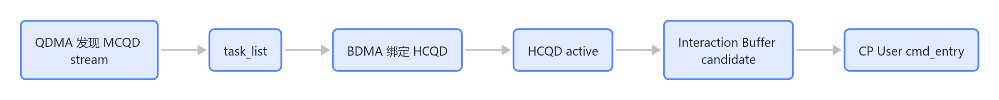

# QDMA 查询与入队

QDMA 的作用是把“哪些 context/stream 有待处理 MCQD”变成软件侧的 `task_list[priority]`。它不绑定 HCQD，也不执行 packet；它只负责发现工作并排队。

## 核心数据结构

```c
proc_list_info_t proc_list;
rt_slist_t task_list[DMA_MAX_TASK_PRIORITY];
```

| 字段 | 含义 |
|---|---|
| `proc_list.proc_mask` | 32 个 context 的有效 bitmap |
| `proc_table[context].mcqd_mask` | 当前 context 下 32 个 stream 的 MCQD bitmap |
| `proc_table[context].task_valid` | stream 是否已经进入 task list，防重复入队 |
| `proc_table[context].mcqd_priority[stream]` | stream 优先级 |
| `proc_table[context].mcqd_addr[stream]` | stream 对应 MCQD 地址 |

## 查询流程



> 图解源文件：[`01-查询流程-flowchart.mmd`](../../../_attachments/fw/cp-master/qdma/whiteboard-mermaid/01-查询流程-flowchart.mmd)。由 lark-whiteboard `whiteboard-cli` 从原 Mermaid 渲染。

## 状态机视角



> 图解源文件：[`02-状态机视角-stateDiagram-v2.mmd`](../../../_attachments/fw/cp-master/qdma/whiteboard-mermaid/02-状态机视角-stateDiagram-v2.mmd)。由 lark-whiteboard `whiteboard-cli` 从原 Mermaid 渲染。

## 寄存器参与

QDMA 使用的 TOP 寄存器集中在 query DMA：

| 寄存器 | offset | 用途 |
|---|---:|---|
| `TOP_REG_MCQD_TABLE_ADDR_LO` | `0x144` | query DMA 输入：MCQD table 地址低 32 位 |
| `TOP_REG_MCQD_TABLE_ADDR_HI` | `0x148` | query DMA 输入：MCQD table 地址高 32 位 |
| `TOP_REG_MCQD_TABLE_MASK` | `0x14C` | query DMA 输入：当前 context 的 stream mask |
| `TOP_REG_QUERY_STATUS` | `0x150` | query DMA 状态，等待 `QUERY_IDLE` |
| `TOP_REG_MCQD_NOT_EMPTY` | `0x154` | query DMA 输出：非空 stream bitmap |

## 地址处理细节

`qdma_query_mcqd()` 会修改 `mcqd_addr` 的高 32 位：保留低 16 bit，把 `proc_id` 写入高 32 位的 bit[20:16]。`bdma_bind_hcqd()` 里也做了同样处理。这说明硬件通过地址高位携带 context/proc 信息，wiki 后续分析地址映射时必须保留这一点。

## 当前实现中的重要事实

`qdma_get_mcqd_ready_status()` 会读取：

- MCQD 内的 `doorbell_id`
- MCQD 内的 `wrptr_addr`
- doorbell 寄存器值
- write pointer 值

然后比较 `doorbell >= write_pointer`。但这段检查在 `qdma_find_stream_insert_list()` 中被注释掉了。当前入队依据是：

```text
MCQD_NOT_EMPTY bitmap 有 bit && task_valid 没有 bit
```

这意味着当前 QDMA 相信 query DMA 给出的 stream bitmap，未额外用 doorbell/write pointer 再过滤一次。

## 与 CP User 的间接关系

QDMA 不直接访问 CP User 的 IB，也不直接触发 `cmd_entry`。它的影响是通过后续 BDMA 绑定传递的：



> 图解源文件：[`03-与-CP-User-的间接关系-flowchart.mmd`](../../../_attachments/fw/cp-master/qdma/whiteboard-mermaid/03-与-CP-User-的间接关系-flowchart.mmd)。由 lark-whiteboard `whiteboard-cli` 从原 Mermaid 渲染。

所以如果 CP User 侧看不到 candidate，排查顺序应先确认：

1. `proc_list.proc_mask` 是否包含 context。
2. `TOP_REG_MCQD_NOT_EMPTY` 是否返回 stream bit。
3. `task_valid` 是否已经被错误置位导致不再入队。
4. BDMA 是否真的把 task 绑定到了 HCQD。
5. HCQD active 后，User 侧 `ib_get_candidate_bitmask()` 是否能看到对应 bit。

## 与 BDMA 的交接

QDMA 插入的是 `task_info_list_t`，关键字段：

| 字段 | 来源 |
|---|---|
| `context_id` | IPC create stream 的 context_id |
| `stream_id` | IPC create stream 的 stream_id |
| `priority` | IPC create stream 的 priority |
| `mcqd_addr` | IPC create stream 的 mcqd_addr |
| `hcqd_id` | 入队时为 `UNVALID_HCQDID`，BDMA 绑定时填充 |
| `exc_cnt` | `exc_cnt[priority]`，BDMA 用于决定何时 stop/unbind |

## 需要验证的点

- `task_valid` 是否在所有释放路径上都能被清掉；否则该 stream 后续不会再次入队。
- `qdma_query_task()` 每轮固定 `rt_thread_delay(10)`，需要结合性能目标确认 query latency 是否可接受。
- 被注释的 doorbell/write pointer 检查是否仍然需要；如果硬件 `MCQD_NOT_EMPTY` 足够可靠，可以删掉死代码，否则应恢复并文档化。