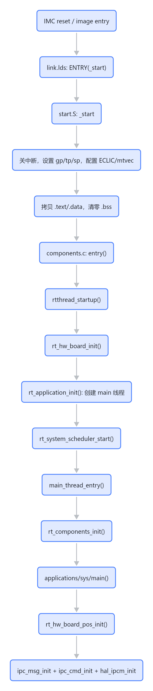
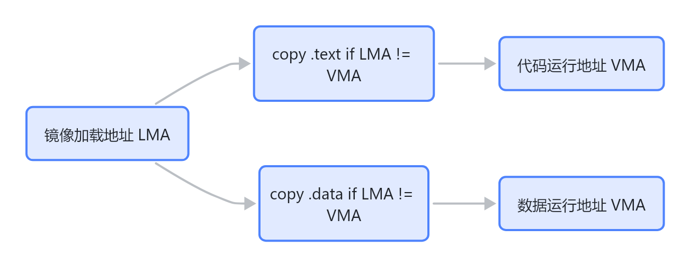
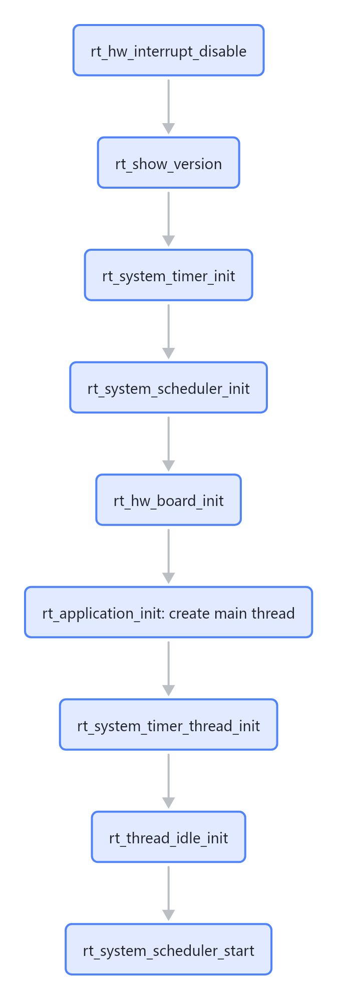
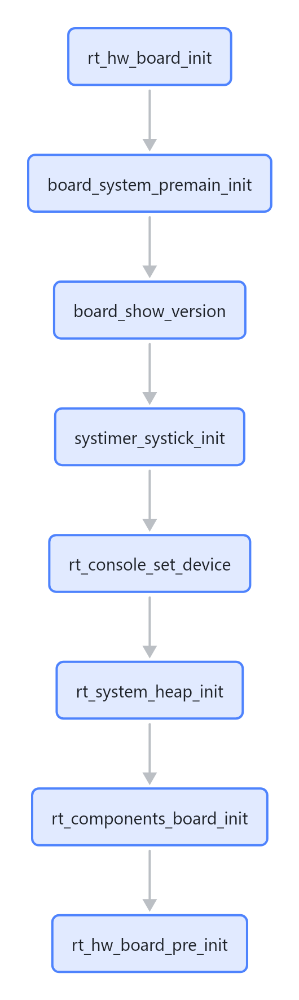
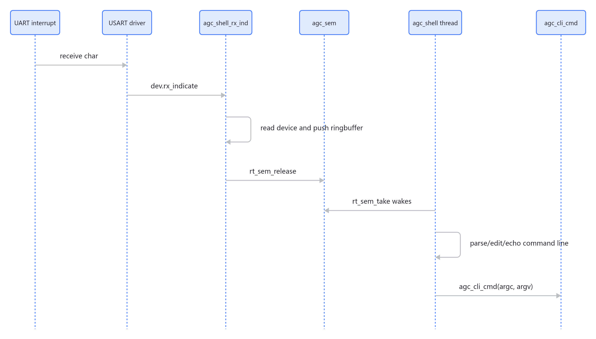
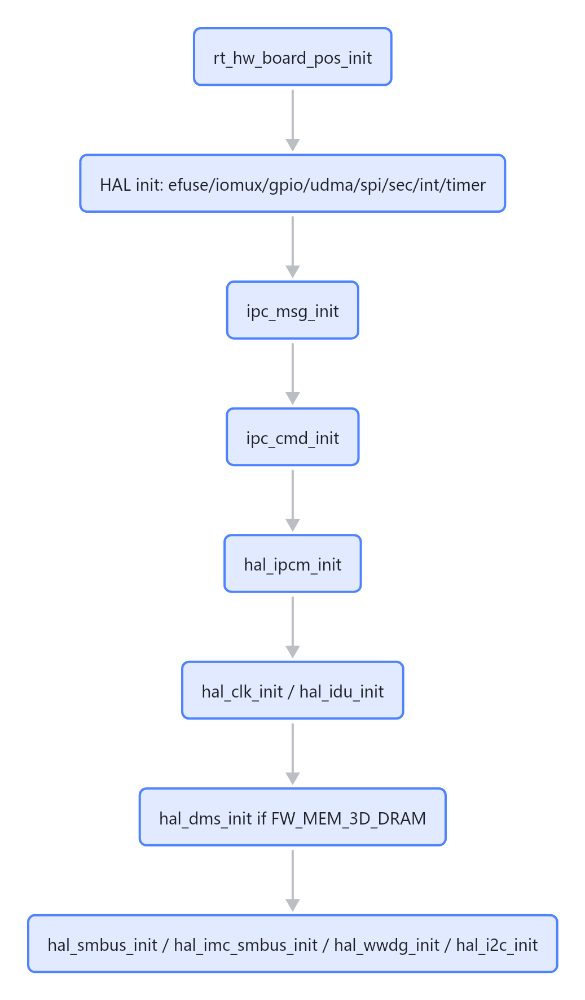
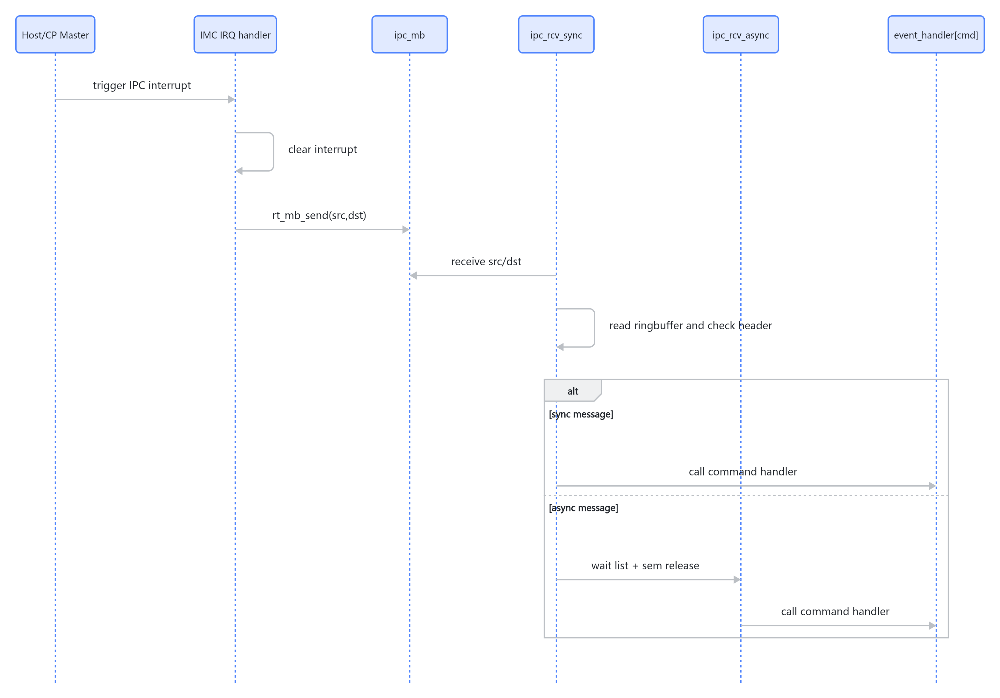

# IMC 启动到 main 流程

这篇用于面试讲述。重点不是背函数名，而是说明每一步为什么存在、它依赖哪些资源、它完成后系统多了什么能力。

## 总结

IMC 复位后不会直接进入 C 的 `main()`。入口由 IMC linker script 固定到 `_start`。`_start` 是启动汇编，先建立最小可运行环境：关中断、设置 `gp/tp/sp`、配置 ECLIC 向量和异常入口、拷贝 `.text/.data`、清零 `.bss`。随后 `_start` 调用 RT-Thread 的 `entry()`，`entry()` 进入 `rtthread_startup()`。RT-Thread 初始化 timer、scheduler、board、heap，创建 `main` 线程、timer 线程和 idle 线程，再启动调度器。调度器开始运行后，`main_thread_entry()` 先执行 RT components 自动初始化，然后调用 `applications/sys/main.c:main()`。当前 IMC 的 `main()` 只调用 `rt_hw_board_pos_init()`，这里才建立 HAL、IPC message、IPC command、IPCM、clock、IDU、DMS 等服务。



> 图解源文件：[`01-总结-flowchart.mmd`](../../../_attachments/fw/imc/startup-to-main/whiteboard-mermaid/01-总结-flowchart.mmd)。由 lark-whiteboard `whiteboard-cli` 从原 Mermaid 渲染。

## 源码证据

| 阶段 | 文件 | 行号 | 证据 |
|---|---|---:|---|
| 构建 IMC | `/home/shuaishuai.zhu/fw/build_fw.sh` | 63-68 | 先执行 `gpu_fw_build.sh -f imc` 构建 IMC。 |
| IMC 编译宏 | `aigc_sdk/grace/board/imc/build_script/rtconfig.py` | 99-107 | debug 加 `-DIMC_DEBUG`，`GPU_FW=imc` 加 `-DFW_IMC`。 |
| RT 配置 | `aigc_sdk/grace/board/imc/build_script/rtconfig.h` | 24-36, 100-123, 228-240 | 打开 components init、user main、heap、console、IMC app、IPC、AGC CLI。 |
| 链接入口 | `aigc_sdk/grace/board/imc/linker_scripts/link.lds` | 15-35, 52, 102-116, 169-198 | 定义 IMC 内存布局，`ENTRY(_start)`，保留 RT init 表、CLI/test 表。 |
| 启动汇编 | `aigc_sdk/grace/board/lib/start.S` | 46-177 | `_start` 建立 C/RTOS 前置运行环境后 `call entry`。 |
| RT entry/startup | `rtthread/src/components.c` | 156-243 | `entry()` 调 `rtthread_startup()`，startup 创建 RTOS 基础线程并启动 scheduler。 |
| IMC board init | `aigc_sdk/grace/board/imc/src/board.c` | 127-333 | 三段式 board init：premain、pre、pos。 |
| C main | `aigc_sdk/grace/applications/sys/main.c` | 53-77 | 当前 `main()` 只调用 `rt_hw_board_pos_init()`。 |
| IPC message | `aigc_sdk/grace/applications/ipc/ipc_msg.c` | 16-35, 500-552 | 建 ringbuffer/mailbox/semaphore 和 3 个 IPC 线程。 |
| IMC IPC command | `aigc_sdk/grace/applications/imc/ipc_cmd/ipc_cmd.c` | 238-247 | 注册 `IPC_CMD_SUB_RESET` 和 Host/CP Master 到 IMC 中断。 |
| AGC shell | `test/framework/shell/agc_shell.c` | 280-352, 546-643 | 注册 UART RX 回调，创建 `agc_shell` 线程，解析 CLI 输入。 |

## 第 0 步：构建参数决定 IMC 固件身份

`build_fw.sh` 中 IMC 是三段固件构建的第一段：

```bash
./gpu_fw_build.sh -p grace -b debug -f imc -t gcc -l normal -m 3d-dram -c l2c_enable -d "${DIE_STR}" -e "${PE}"
```

`-f imc` 最重要。IMC 的 `rtconfig.py` 会根据 `GPU_FW=imc` 加 `-DFW_IMC`。公共 IPC 代码会用这个宏判断当前是否由 IMC 初始化共享 ringbuffer。例如 `ipc_msg_ring_buffer_init()` 在 `FW_IMC` 下会清空 ringbuffer，并调用 `rt_ringbuffer_init()`。

debug 构建使用 `-O0 -ggdb -DIMC_DEBUG`，release 使用 `-O2 -DIMC_RELEASE`。面试里如果被问为什么 debug 和 release 行为可能不同，可以从优化级别、宏和代码布局三个角度回答。

## 第 1 步：linker script 指定 `_start`

IMC linker script 中有：

```ld
ENTRY(_start)
```

这说明镜像启动入口不是 C `main()`，而是 `start.S` 的 `_start`。同时 linker script 还定义了 IMC 的关键内存区域：

| 区域 | 地址 | 大小 | 用途 |
|---|---:|---:|---|
| ILM normal | `0x01010000` | `0x70000` | normal bin 的代码和只读段。 |
| ILM debug | `0x0100B000` | `0x75000` | debug bin 的代码和只读段。 |
| DLM | `0x01080000` | `0x34000` | `.data`、`.bss`、TLS 等运行期数据。 |
| heap | `0x010B4000` | `0xA000` | RT-Thread 动态内存池。 |
| stack | `0x010BE000` | `0x2000` | 启动栈，`__STACK_SIZE = 8192`。 |

linker script 还保留了 `.rti_fn*`、`FSymTab`、`VSymTab`、`.agc_cli.*`、`.agc_syscall.*`。这些 section 很关键，因为 RT-Thread 自动初始化和 AGC CLI 命令注册都依赖 linker 保留表项。

## 第 2 步：`vector_base` 跳到 `_start`

`start.S` 的 `.init` 段先定义 `vector_base`：

```asm
vector_base:
    j _start
```

`vector_base` 同时服务两个目的：一是启动时落到 `_start`，二是后续作为 ECLIC vector table 的基址。后面紧跟默认异常/中断 handler 表。

## 第 3 步：`_start` 第一件事是关全局中断

`_start` 开头执行：

```asm
csrc CSR_MSTATUS, MSTATUS_MIE
```

这会清掉 `mstatus.MIE`，禁止全局中断。原因是此时栈、`.data`、`.bss`、异常入口都还没准备好。启动早期如果进中断，C 函数和全局变量都不可靠，风险很高。

面试表达：启动汇编先把系统放到不可被打断的确定状态，等运行环境准备完，再交给 RTOS。

## 第 4 步：设置 `gp`、`tp`、`sp`

`_start` 设置：

```asm
la gp, __global_pointer$
la tp, __tls_base
la sp, _sp
```

| 寄存器 | 作用 | 为什么早设 |
|---|---|---|
| `gp` | RISC-V small data/global pointer | 编译器可能用 `gp` 相对寻址访问小全局变量。 |
| `tp` | TLS base | TLS 或线程局部访问依赖它。 |
| `sp` | 栈指针 | 后续 `call entry`、异常上下文保存和 C 调用都依赖栈。 |

这一步后，汇编具备调用 C 函数的基本条件，但完整 C runtime 还没准备好，因为 `.data/.bss` 还没处理。

## 第 5 步：配置 ECLIC 和 early exception

`_start` 随后配置中断和异常入口：

1. 设置 `CSR_MMISC_CTL`，让 NMI base 与 `mtvec` 共享。
2. 根据编译特性打开或关闭 Zc。
3. `CSR_MTVT = vector_base`，配置 ECLIC vector interrupt base。
4. `CSR_MTVT2 = irq_entry`，配置 non-vector interrupt entry。
5. `CSR_MTVEC = early_exc_entry`，启动早期异常先进入 WFI 死循环。

`early_exc_entry` 的目的不是恢复，而是在环境未完成时停住，避免继续执行导致现场更乱。等内存段初始化完成后，`_start` 会把 `mtvec` 切到正式 `exc_entry`。

## 第 6 步：启用 `mcycle` 和 `minstret`

`_start` 执行：

```asm
csrci CSR_MCOUNTINHIBIT, 0x5
```

这会打开 cycle 和 retired instruction 计数器。后续性能测量、调试统计、时间相关逻辑可以读取这些 CSR。

## 第 7 步：拷贝 `.text` 和 `.data`

启动汇编会比较 LMA 和 VMA：

- `_text_lma` vs `_text`
- `_data_lma` vs `_data`

如果加载地址和运行地址不同，就逐字拷贝。`.data` 必须拷贝，否则已初始化全局变量没有正确初值。`.text` 是否需要拷贝取决于镜像加载布局和运行布局。



> 图解源文件：[`02-第-7-步-拷贝-.text-和-.data-flowchart.mmd`](../../../_attachments/fw/imc/startup-to-main/whiteboard-mermaid/02-第-7-步-拷贝-.text-和-.data-flowchart.mmd)。由 lark-whiteboard `whiteboard-cli` 从原 Mermaid 渲染。

## 第 8 步：清零 `.bss`

`.bss` 保存未初始化或零初始化全局变量。C 语言要求进入 C 代码前这些变量为 0。RT-Thread 的全局链表、静态对象、计数器、指针也依赖这个条件。

如果 `.bss` 没清干净，scheduler、heap、device object 都可能以随机状态启动。

## 第 9 步：切换正式异常入口并调用 `entry()`

内存段准备完后，`_start` 把 `CSR_MTVEC` 切到正式 `exc_entry`，然后：

```asm
li a0, 0
li a1, 0
call entry
```

`entry()` 来自 `rtthread/src/components.c`，GCC 路径下就是：

```c
int entry(void)
{
    rtthread_startup();
    return 0;
}
```

关键点：`entry()` 不是业务入口，它只是把裸机启动汇编接到 RT-Thread startup。

## 第 10 步：`rtthread_startup()` 初始化 RTOS 框架

`rtthread_startup()` 顺序如下：



> 图解源文件：[`03-第-10-步-rtthread_startup-初始化-RTOS-框架-flowchart.mmd`](../../../_attachments/fw/imc/startup-to-main/whiteboard-mermaid/03-第-10-步-rtthread_startup-初始化-RTOS-框架-flowchart.mmd)。由 lark-whiteboard `whiteboard-cli` 从原 Mermaid 渲染。

每一步的意义：

| 步骤 | 作用 |
|---|---|
| `rt_hw_interrupt_disable()` | 保持初始化过程不可被普通中断打断。 |
| `rt_show_version()` | 打印 RT-Thread 版本信息。 |
| `rt_system_timer_init()` | 初始化 timer 对象系统。 |
| `rt_system_scheduler_init()` | 初始化 ready queue 和 scheduler 状态。 |
| `rt_hw_board_init()` | 进入 IMC board 级初始化。 |
| `rt_application_init()` | 创建并 startup `main` 线程。 |
| `rt_system_timer_thread_init()` | 创建 timer 线程。 |
| `rt_thread_idle_init()` | 创建 idle 线程。 |
| `rt_system_scheduler_start()` | 开始真正调度线程。 |

`rt_application_init()` 创建线程但不立即执行 `main()`。`main_thread_entry()` 要等 scheduler start 后才会运行。

## 第 11 步：`rt_hw_board_init()` 完成 IMC board 前半段

IMC 的 `rt_hw_board_init()` 顺序是：



> 图解源文件：[`04-第-11-步-rt_hw_board_init-完成-IMC-board-前半段-flowchart.mmd`](../../../_attachments/fw/imc/startup-to-main/whiteboard-mermaid/04-第-11-步-rt_hw_board_init-完成-IMC-board-前半段-flowchart.mmd)。由 lark-whiteboard `whiteboard-cli` 从原 Mermaid 渲染。

### `board_system_premain_init()`

这是 heap 前的早期 C 层初始化，主要做：

1. `board_system_init()`：读取 secure boot info，必要时设置 OISA PCIe switch。
2. `cache_fence()`：保证前序 cache/instruction 状态对后续可见。
3. `eclic_init()`：初始化 ECLIC 的基础控制。
4. `drv_subsys_init()` 和 `hal_subsys_init()`：初始化 subsys/CRG 相关能力。
5. `drv_usart_init()`：先准备 UART driver。
6. `board_system_info()`：打印 IMC build time、version、CPU frequency。
7. `trap_init()`：初始化默认异常处理。

这段不能依赖 heap，因为 heap 还没初始化。

### `systimer_systick_init()`

这一步把硬件 systimer 接到 RT-Thread tick。后续 `rt_thread_mdelay()`、timeout、时间片调度都依赖 tick。

### `rt_console_set_device()`

IMC 打开 `RT_USING_CONSOLE`。board init 会通过 `drv_usart_get_id()` 得到 UART 设备名，然后调用 `rt_console_set_device()`。这一步让 `rt_kprintf()` 绑定到 console。

### `rt_system_heap_init()`

IMC 打开 `RT_USING_HEAP` 和 `RT_USING_SMALL_MEM`。这里把 linker script 中的 heap 区交给 RT-Thread。后续 `rt_malloc()`、`rt_calloc()`、动态线程创建都依赖它。

### `rt_components_board_init()`

RT-Thread 自动初始化表分两段。`rt_components_board_init()` 只执行 board 阶段，也就是 `rti_board_start` 到 `rti_board_end`。component/app 阶段在 `main_thread_entry()` 中执行。

### `rt_hw_board_pre_init()`

这个函数在 heap 之后、scheduler 之前执行。IMC 这里初始化 driver 层能力：

- `hal_usart_init()`
- `agc_shell_init()`
- `drv_efuse_init()`
- `drv_iomux_init()`
- `drv_gpio_init()`
- `drv_udma_init()`
- `drv_qspi_init()`
- `drv_sec_hash_init()` / `drv_sec_acryp_init()`
- `drv_int_ctrl_init()`
- `drv_basic_timer_init()` / `drv_advanced_timer_init()`
- `drv_ipcm_init()`
- `drv_clk_init()`
- `drv_idu_init()`
- `drv_dms_init()` 或 `drv_eddr_init()`
- `drv_smbus_init()` / `drv_imc_smbus_init()`
- `drv_wwdg_init()`
- `drv_i2c_init()`
- `drv_cp_init()`

这里创建的线程对象会进入 ready queue，但 scheduler 还没启动，所以线程不会立刻跑。

## 第 12 步：`agc_shell_init()` 创建 CLI 线程

IMC 配置打开 `AGC_USING_CLI_DEVICE` 和 `AGC_USING_CLI_CMD`，所以 `rt_hw_board_pre_init()` 会调用 `agc_shell_init()`。

`agc_shell_init()` 做：

1. `rt_calloc()` 分配 `agc_shell_t`。
2. `rt_thread_init()` 初始化 `agc_shell` 线程，优先级 `20`，时间片 `2`。
3. `rt_sem_init()` 初始化 `agc_sem`。
4. `rt_ringbuffer_init()` 初始化 16 字节输入 buffer。
5. `rt_thread_startup()` 把 shell 线程放入 ready queue。

调度器启动后，`agc_shell_thread_entry()` 才运行。它会绑定 console device，打开 UART 中断 RX，注册 `agc_shell_rx_ind()` 回调，然后循环解析输入。

UART 输入链路是：



> 图解源文件：[`05-第-12-步-agc_shell_init-创建-CLI-线程-sequenceDiagram.mmd`](../../../_attachments/fw/imc/startup-to-main/whiteboard-mermaid/05-第-12-步-agc_shell_init-创建-CLI-线程-sequenceDiagram.mmd)。由 lark-whiteboard `whiteboard-cli` 从原 Mermaid 渲染。

## 第 13 步：`rt_application_init()` 创建 main 线程

IMC 打开 heap，所以 RT-Thread 使用 `rt_thread_create()` 创建 `main` 线程：

```c
rt_thread_create("main", main_thread_entry, RT_NULL,
                 RT_MAIN_THREAD_STACK_SIZE, RT_MAIN_THREAD_PRIORITY, 20);
```

IMC 配置里 `RT_MAIN_THREAD_STACK_SIZE = 1024`。这意味着 main 线程栈只有 1KB。面试里可以补一句：main 里不适合放大数组、深递归、复杂临时对象，初始化型工作应该拆到明确线程或静态对象中。

## 第 14 步：scheduler 启动后线程才真正运行

`rtthread_startup()` 继续创建 timer 线程和 idle 线程，然后调用 `rt_system_scheduler_start()`。从这一刻开始，系统从单线程启动流程变成 RTOS 多线程运行。

此时至少有这些线程：

| 线程 | 来源 | 作用 |
|---|---|---|
| `main` | `rt_application_init()` | 调用 `main_thread_entry()`，最终执行用户 `main()`。 |
| `timer` | `rt_system_timer_thread_init()` | 处理 timer。 |
| `idle` | `rt_thread_idle_init()` | 没有 runnable 线程时运行。 |
| `agc_shell` | `agc_shell_init()` | CLI 输入解析和命令执行。 |

## 第 15 步：`main_thread_entry()` 先 components init，再 main

`main_thread_entry()` 的顺序是：

```c
rt_components_init();
main();
```

`rt_components_init()` 遍历 `rti_board_end` 到 `rti_end`，顺序覆盖：

1. `DEVICE_EXPORT`
2. `COMPONENT_EXPORT`
3. `FS_EXPORT`
4. `ENV_EXPORT`
5. `APP_EXPORT`

这解释了为什么一些模块没有显式调用也会初始化：它们被 linker script 保留在 `.rti_fn*` 中，再由 RT-Thread 统一遍历。

当前 IMC 应用目录下没有看到 IMC 自己的 `INIT_APP_EXPORT` 线程入口。IMC 主要应用级初始化是 `main()` 显式调用 `rt_hw_board_pos_init()`。

## 第 16 步：实际 C main 来自 `applications/sys/main.c`

IMC rtconfig 打开：

```c
#define APP_USING_SYS_DUMMY
#define APP_USING_IMC
```

`applications/SConscript` 因此会编译 `applications/sys` 和 `applications/imc`。实际 `main()` 在 `applications/sys/main.c`：

```c
int main(void)
{
    rt_hw_board_pos_init();
#if 0
    ... demo thread disabled ...
#endif
}
```

当前 main 不创建 demo 线程，也没有 while loop。它执行完 `rt_hw_board_pos_init()` 后返回。系统仍然能继续运行，因为 scheduler、idle、timer、shell、IPC 线程已经存在或即将被创建。

## 第 17 步：`rt_hw_board_pos_init()` 让 IMC 服务真正可用

`rt_hw_board_pos_init()` 注释是 `after heap init`，但它实际在 main 线程上下文里执行。它的顺序是：



> 图解源文件：[`06-第-17-步-rt_hw_board_pos_init-让-IMC-服务真正可用-flowchart.mmd`](../../../_attachments/fw/imc/startup-to-main/whiteboard-mermaid/06-第-17-步-rt_hw_board_pos_init-让-IMC-服务真正可用-flowchart.mmd)。由 lark-whiteboard `whiteboard-cli` 从原 Mermaid 渲染。

可以把 IMC board init 分成三层理解：

| 阶段 | 调用点 | 主要作用 |
|---|---|---|
| `premain` | `rt_hw_board_init()` 前半 | 早期 SoC、UART、ECLIC、trap，不能依赖 heap。 |
| `pre` | heap 后、scheduler 前 | driver 注册、shell 线程对象创建。 |
| `pos` | `main()` 中 | HAL 服务、IPC message、IPC command、IPCM 等对外能力。 |

## 第 18 步：`ipc_msg_init()` 建立 IPC message 框架

`ipc_msg.c` 里 `ipc_manager` 定义 6 条 event 通道：

| event type | source | destination | 方向 |
|---|---|---|---|
| `EVENT_TYPE_HOST_TO_IMC` | Host | IMC | Host 发给 IMC。 |
| `EVENT_TYPE_IMC_TO_HOST` | IMC | Host | IMC 发给 Host。 |
| `EVENT_TYPE_HOST_TO_CP_MASTER` | Host | CP Master | Host 发给 CP Master。 |
| `EVENT_TYPE_CP_MASTER_TO_HOST` | CP Master | Host | CP Master 发给 Host。 |
| `EVENT_TYPE_CP_MASTER_TO_IMC` | CP Master | IMC | CP Master 发给 IMC。 |
| `EVENT_TYPE_IMC_TO_CP_MASTER` | IMC | CP Master | IMC 发给 CP Master。 |

`ipc_msg_init()` 做：

1. `ipc_msg_ring_buffer_init()`：为每个 event type 建共享 ringbuffer。`FW_IMC` 下会清空并初始化 ringbuffer。
2. 创建 mailbox：`ipc_mb`。
3. 创建 receive semaphore：`ipc_msg_rcv_sem`。
4. 创建 send semaphore：`ipc_msg_send_sem`。
5. 初始化 receive/send wait list。
6. 创建 `ipc_rcv_sync` 线程。
7. 创建 `ipc_rcv_async` 线程。
8. 创建 `ipc_send` 线程。

IPC 设计要点：中断只做轻量唤醒，复杂业务放到线程上下文。



> 图解源文件：[`07-第-18-步-ipc_msg_init-建立-IPC-message-框架-sequenceDiagram.mmd`](../../../_attachments/fw/imc/startup-to-main/whiteboard-mermaid/07-第-18-步-ipc_msg_init-建立-IPC-message-框架-sequenceDiagram.mmd)。由 lark-whiteboard `whiteboard-cli` 从原 Mermaid 渲染。

## 第 19 步：`ipc_cmd_init()` 注册 IMC command

`rt_hw_board_pos_init()` 里 `ipc_msg_init()` 后面紧跟 `ipc_cmd_init()`。这个顺序合理，因为要先有 message 框架，再注册 command handler 和中断入口。

`ipc_cmd_init()` 做：

1. `ipc_msg_handler_register(IPC_CMD_SUB_RESET, ipc_cmd_sub_reset)`。
2. 注册 `IPC_HOST_TO_IMC_IRQ`，handler 是 `ipc_cmd_irq_handler_host_to_imc()`。
3. 注册 `IPC_CP_MASTER_TO_IMC_IRQ`，handler 是 `ipc_cmd_irq_handler_cp_to_imc()`。

这两个 handler 都只是调用公共入口：

```c
ipc_msg_irq_handler(IPC_HOST_TO_IMC_IRQ);
ipc_msg_irq_handler(IPC_CP_MASTER_TO_IMC_IRQ);
```

真正的 src/dst 解析、清中断、mailbox 投递都在 `ipc_msg_irq_handler()` 中。

## 第 20 步：`IPC_CMD_SUB_RESET` 处理 cluster 和 CP reset

当前 IMC command handler 是 `ipc_cmd_sub_reset()`。它读取 payload 中的 reset bitmap：

- `cluster0` 到 `cluster3`：调用 `ipc_cmd_reset_cluster(cluster_id)`。
- `cp`：调用 `ipc_cmd_reset_cp()`。

`ipc_cmd_reset_cluster()` 走 `ipc_cmd_subsys_reset_flow()`，顺序是：

1. enable level 1 clock。
2. release level 1 reset。
3. enable level 2 clock。
4. release level 2 reset。

`ipc_cmd_reset_cp()` 除了 clock/reset，还写 CP top、SDMA、GCTRL 相关寄存器，并写 firmware run 地址，拉起 CP 相关功能。

处理完后，`ipc_cmd_fill_ack_cmd_header()` 反转 source/target，设置 ACK 标志，返回 `IPC_EVENT_DONE_ACK`。公共 IPC handler 看到这个结果后会调用 `ipc_msg_send()` 回 ACK。

## 启动阶段资源可用性

| 阶段 | 栈 | `.data/.bss` | heap | scheduler | console | shell | IPC |
|---|---|---|---|---|---|---|---|
| `_start` 刚进入 | 不可用 | 不可用 | 不可用 | 不可用 | 不可用 | 不可用 | 不可用 |
| 设置 `sp` 后 | 可用 | 不可用 | 不可用 | 不可用 | 不可用 | 不可用 | 不可用 |
| 拷贝 `.data`、清 `.bss` 后 | 可用 | 可用 | 不可用 | 不可用 | 不可用 | 不可用 | 不可用 |
| `rt_hw_board_init()` 前半 | 可用 | 可用 | 初始化前 | 初始化中 | UART driver 初始化中 | 不可用 | 不可用 |
| heap 初始化后 | 可用 | 可用 | 可用 | 初始化中 | console device 可设置 | 可创建线程对象 | 不可用 |
| scheduler start 后 | 可用 | 可用 | 可用 | 可用 | 可用 | shell 线程可运行 | 取决于 main 是否已执行 |
| `rt_hw_board_pos_init()` 后 | 可用 | 可用 | 可用 | 可用 | 可用 | 可用 | 可用 |

## 面试讲法

可以这样组织：

> IMC 固件不是直接进入 C main。linker script 指定入口为 `_start`，所以复位后先跑启动汇编。启动汇编负责建立 C 环境：关中断，设置 gp、tp、sp，配置 ECLIC 和 early exception，拷贝 text/data，清 bss。准备好后调用 RT-Thread 的 `entry()`，再进入 `rtthread_startup()`。RT-Thread 初始化 timer、scheduler 和 IMC board，board init 中会配置 UART、console、heap、driver，并创建 agc_shell 线程对象。之后 RT-Thread 创建 main、timer、idle 线程并启动 scheduler。main 线程先执行 components auto init，再调用 `applications/sys/main.c` 的 `main()`。当前 IMC main 只调用 `rt_hw_board_pos_init()`，这里才初始化 HAL、IPC message、IPC command 和 IPCM，所以 IMC 对 Host/CP Master 的命令响应能力是在 main 之后建立的。

## 常见追问

### 为什么不直接从 `_start` 调 `main()`？

因为工程运行在 RT-Thread 上。`main()` 被设计成线程入口，不是裸机主循环。直接调 `main()` 会绕过 scheduler、timer、heap、idle thread、components init。

### 为什么要拷贝 `.data`、清零 `.bss`？

这是 C runtime 的基本约定。`.data` 保存已初始化全局变量的初值，必须从镜像加载地址拷到运行地址。`.bss` 保存零初始化全局变量，进入 C 前必须清零。

### 为什么 board init 分三段？

因为依赖不同。`premain` 不能依赖 heap，做早期 SoC/UART/ECLIC/trap。`pre` 在 heap 后、scheduler 前，注册 driver 和创建 shell 线程对象。`pos` 在 main 线程中执行，初始化 HAL 和 IPC 服务。

### CLI 什么时候可用？

`agc_shell_init()` 只是在 scheduler 启动前创建 shell 线程对象。scheduler 启动后，shell 线程运行，绑定 console device，注册 UART RX callback，之后 UART 输入才能唤醒 shell 线程解析命令。

### IMC IPC 什么时候可用？

`main()` 调用 `rt_hw_board_pos_init()` 后才完整可用。`ipc_msg_init()` 创建 IPC 框架和线程，`ipc_cmd_init()` 注册命令 handler 和中断入口。

### `main()` 返回后系统会停吗？

当前 main 执行完 `rt_hw_board_pos_init()` 后会返回，但系统不会停，因为 RTOS scheduler、idle、timer、shell、IPC 线程仍在运行。如果未来 main 需要常驻逻辑，应显式创建线程或写清楚循环。

## 推荐阅读顺序

1. `aigc_sdk/grace/board/imc/linker_scripts/link.lds`
2. `aigc_sdk/grace/board/lib/start.S`
3. `rtthread/src/components.c`
4. `aigc_sdk/grace/board/imc/src/board.c`
5. `aigc_sdk/grace/applications/sys/main.c`
6. `aigc_sdk/grace/applications/ipc/ipc_msg.c`
7. `aigc_sdk/grace/applications/imc/ipc_cmd/ipc_cmd.c`
8. `test/framework/shell/agc_shell.c`

## 相关页面

- [[wiki/fw/imc/index|IMC 索引]]
- [[wiki/fw/index|FW 技术知识库]]
- [[wiki/fw/cli/agc_shell-cli-path|agc_shell CLI 输入输出路径与 cp master 卡顿分析]]
- [[wiki/fw/rt-thread/rt_thread_yield|RT-Thread rt_thread_yield 实现与使用风险]]
