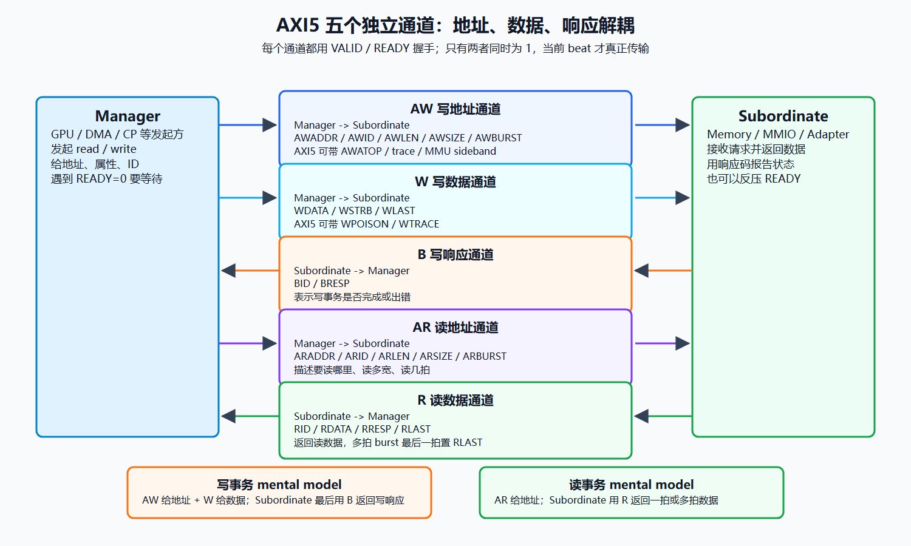
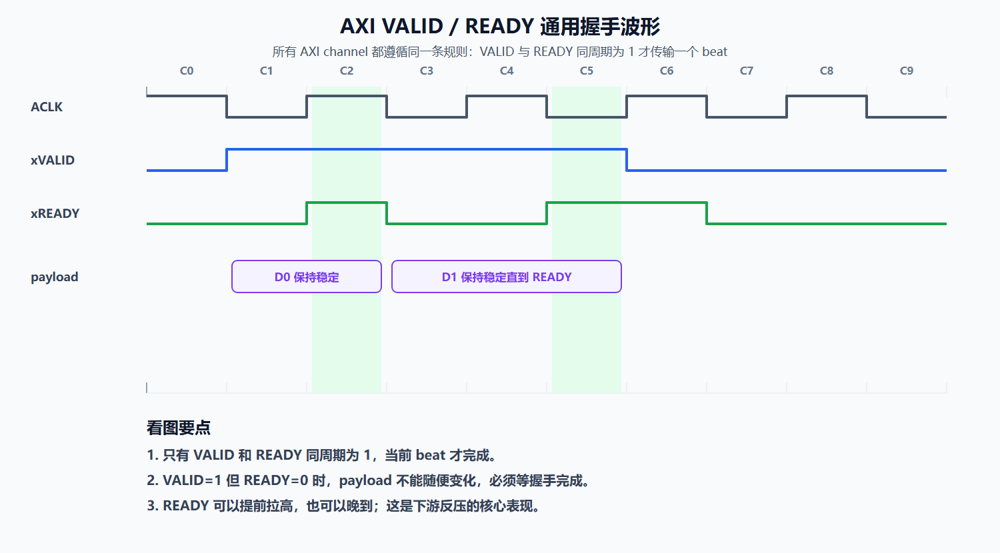
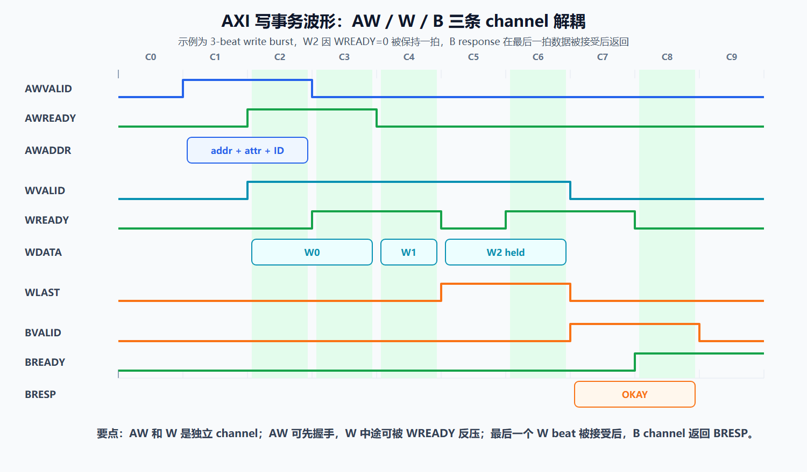
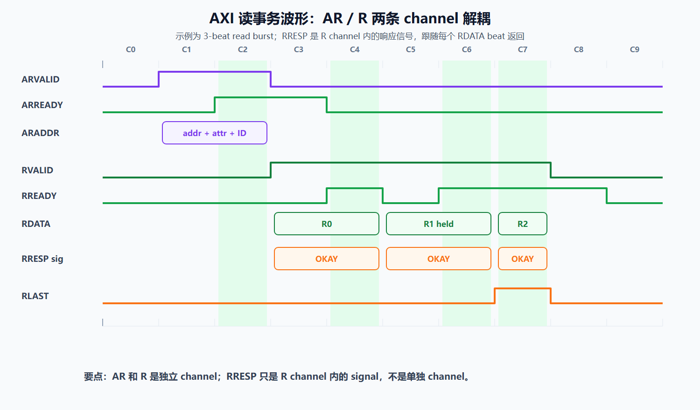
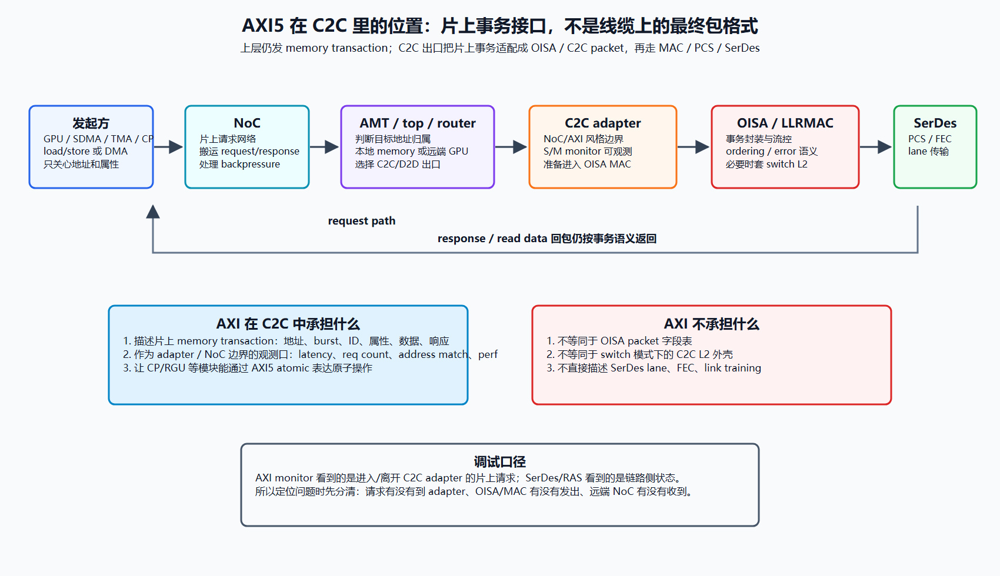

---
type: learning-guide
title: "AXI5 协议详解与 C2C 中 AXI 的作用"
created: 2026-06-08
updated: 2026-06-08
tags:
  - fw
  - interconnect
  - c2c
  - axi5
  - amba
  - noc
  - atomic
status: active
sources:
  - Arm AMBA 5 overview: https://www.arm.com/architecture/system-architectures/amba/amba-5
  - Arm AMBA AXI and ACE Protocol Specification IHI0022H: https://developer.arm.com/-/media/Arm%20Developer%20Community/PDF/IHI0022H_amba_axi_protocol_spec.pdf
  - C:\home\for_ai\.raw\dingtalk\c2c\raw\10.6-c2c-ras和testable.md
  - C:\home\for_ai\.raw\notes\mas\2026-05-09-GraceC-CP-MAS-v1.4-extracted.md
  - C:\home\for_ai\.raw\mas\RguCore\RGU_Design_Spec_Core_V1.2.txt
  - C:\home\for_ai\.raw\mas\RguCore\RGU_Design_Spec_Sys_V1.2.txt
related:
  - ./c2c-dingtalk-study.md
  - ./c2c-transaction-routing-and-encapsulation.md
  - ./c2c-macphy-wrapper-subsystem.md
---

# AXI5 协议详解与 C2C 中 AXI 的作用

## 0. 结论边界

- **Source-confirmed**：AXI/AXI5 的五通道、VALID/READY 握手、读写事务、AXI5 新增能力来自 Arm AMBA 5 页面和 Arm `IHI0022H` 协议文档。
- **Wiki-confirmed**：C2C 资料里能确认 `AXI monitor`、`S/M monitor`、latency/req count/address match/perf 统计，以及 AXI 口宽 `1024b = 128B`。
- **Local-source-confirmed**：MAS/RGU 材料能确认 CP/RGU 使用 AXI5 接口，并出现 `AWATOP`、atomic load.add/swap/cmpswap 和“通过 AXI5 返回原值”的描述。
- **Inference**：C2C adapter 把 NoC/AXI 风格事务适配为 OISA/C2C 传输事务；当前资料没有公开逐字段 RTL，所以本文不把 OISA header 或 switch L2 header 的具体字段讲死。

## 1. 一句话 mental model

**AXI5 是片上 memory-mapped transaction 协议。** 它把一次读/写拆成独立的地址、数据、响应通道，用 `VALID/READY` 做逐拍握手，用 `ID/burst/size/attribute/user/atomic` 等字段描述事务。

放到 C2C 里，AXI 的角色不是“线缆上的协议”。更准确的说法是：

- GPU/SDMA/TMA/CP 上层发起的是 memory transaction。
- NoC/AMT/top/mesh_router 根据地址和拓扑把事务送到本地目标或 C2C 出口。
- C2C adapter 在 NoC/AXI 风格事务与 OISA/C2C packet 之间做适配。
- SerDes/PCS/FEC 负责链路传输；switch 模式还可能需要额外的 C2C L2 外壳。

## 2. AXI5 在 AMBA 里的位置

Arm AMBA 是 SoC 内部 IP 互联协议族。AXI 属于高性能 memory-mapped 接口，适合 CPU/GPU/DMA/NoC/缓存控制器/内存控制器这类需要高吞吐、可并发、可 burst 的路径。

| 协议 | 典型用途 | 特点 |
|---|---|---|
| AXI5 | 高性能 memory-mapped 数据通路 | 多 outstanding、burst、ID、QoS、optional atomic/cache/trace/tag 等能力 |
| AXI5-Lite | 寄存器/MMIO 控制口 | 单拍、简单、低面积，常用于 CSR 配置 |
| ACE5 | cache-coherent 扩展 | 在 AXI 基础上加入一致性语义 |
| CHI | 更现代的大规模一致性互联 | 用于复杂多核/多 agent coherent fabric |
| APB | 低速外设寄存器 | 简单、低功耗、非高吞吐 |

对 C2C 学习来说，最关键的是 AXI5 和 AXI5-Lite 的区别：配置寄存器更像 AXI-Lite/APB 思路；真正搬远端显存访问、DMA、atomic、性能统计时，关注的是 AXI5 memory transaction。

## 3. 五个独立通道

AXI 的读写不是一根“请求线 + 响应线”，而是五个相互独立的 channel。每个 channel 都有自己的 `VALID/READY` 握手，因此可以被独立反压，也可以让地址和数据在流水中解耦。

[SVG source](../../../_attachments/fw/interconnect/c2c/axi5-protocol/axi5-five-channels.svg)

| 通道 | 方向 | 做什么 | 常见关键信号 |
|---|---|---|---|
| AW | Manager -> Subordinate | 写地址和写事务属性 | `AWVALID/AWREADY/AWADDR/AWID/AWLEN/AWSIZE/AWBURST/AWATOP` |
| W | Manager -> Subordinate | 写数据 beat | `WVALID/WREADY/WDATA/WSTRB/WLAST` |
| B | Subordinate -> Manager | 写响应 | `BVALID/BREADY/BID/BRESP` |
| AR | Manager -> Subordinate | 读地址和读事务属性 | `ARVALID/ARREADY/ARADDR/ARID/ARLEN/ARSIZE/ARBURST` |
| R | Subordinate -> Manager | 读数据 beat，并携带每 beat 的读响应状态 | `RVALID/RREADY/RID/RDATA/RRESP/RLAST` |

这里的 `Manager/Subordinate` 是新版文档常用叫法，很多老代码或 RTL 里仍会看到 `Master/Slave`。在读旧设计时，不要因为命名差异误判方向。

## 4. VALID / READY 握手规则

AXI 每个 channel 的传输单位可以理解为一个 beat。一次 beat 只有在同一个周期内 `xVALID=1` 且 `xREADY=1` 时才算真正完成。

| 信号 | 谁驱动 | 含义 | 调试含义 |
|---|---|---|---|
| `xVALID` | source | 当前 channel 上有有效 payload | VALID 长时间为 0，说明源端没发、被上游堵住或事务没生成 |
| `xREADY` | destination | 目标端当前能接收 payload | READY 长时间为 0，说明目标端反压、FIFO 满、仲裁没给或下游堵住 |
| payload | source | 地址、数据、ID、属性、响应等 | VALID 拉起后 payload 需要保持稳定直到握手完成 |

常见面试陷阱是把 AXI 说成“valid 发出去就完成”。这是错的。`VALID` 只是源端声明“我这里有东西”；只有 `READY` 同时为 1 才完成当前 beat。

### 4.1 波形图：VALID/READY 通用握手

下面的波形是学习用示例，不代表某个具体 RTL 的唯一时序。它只强调 AXI 所有 channel 都共用的核心规则：`VALID` 与 `READY` 同周期为 1 时，一个 beat 才完成；在 `VALID=1` 但 `READY=0` 的等待周期里，payload 必须保持稳定。

[SVG source](../../../_attachments/fw/interconnect/c2c/axi5-protocol/axi5-valid-ready-waveform.svg)

### 4.2 波形图：写事务 AW / W / B

写路径有三类 channel：`AW` 提交写地址与属性，`W` 提交写数据，`B` 返回写响应。`AW` 和 `W` 独立握手，所以地址可以先被接受，数据也可以中途被 `WREADY=0` 反压；只有最后一个写数据 beat 被接受后，目标侧才有条件返回 `BRESP`。

[SVG source](../../../_attachments/fw/interconnect/c2c/axi5-protocol/axi5-write-waveform.svg)

### 4.3 波形图：读事务 AR / R

读路径里 `AR` 和 `R` 也是独立 channel。`AR` 只提交读地址和属性；`R` 是 Read Data Channel，它返回 `RDATA`，同时携带每个 read data beat 的 `RRESP`，并用 `RLAST` 标记 burst 最后一拍。注意：`RRESP` 不是 channel，图里单独画一行只是按 signal waveform 展示它。

[SVG source](../../../_attachments/fw/interconnect/c2c/axi5-protocol/axi5-read-waveform.svg)

## 5. 写事务流程

写事务最容易混淆的是 AW 和 W 是两个独立 channel。读事务里的 AR 和 R 也同样是两个独立 channel；这里只是先讲写路径，因为“写地址”和“写数据”分开更容易被误解：

1. Manager 在 AW channel 发送写地址和属性，比如 `AWADDR/AWLEN/AWSIZE/AWBURST/AWID`。
2. Manager 在 W channel 发送写数据 beat，比如 `WDATA/WSTRB/WLAST`。
3. Subordinate 收到足够信息并完成写入后，在 B channel 返回 `BRESP`。

AW 和 W 独立意味着：地址和数据不一定同周期到，也不一定被同一个 FIFO 处理。很多高性能设计会把地址仲裁、数据缓存、写响应生成拆开。调试写 hang 时，要分开看 AW 是否握手、W 是否握手、B 是否返回，而不是只看一根“write request”。

## 6. 读事务流程

读事务相对直观，但也要记住：AR 和 R 仍然是两个独立 channel。AR 只负责提交读地址和属性；R channel 返回读数据，并携带 `RRESP` 读响应信号。两者有各自的 VALID/READY，可以分别被反压。

1. Manager 在 AR channel 发送读地址和属性。
2. Subordinate 在 R channel 返回一个或多个 data beat。
3. 如果是 burst，最后一个 beat 用 `RLAST` 标记结束。

AR 和 R 独立意味着：读地址握手完成，只代表请求被目标侧接受，并不代表读数据已经返回。读路径常见问题是 R channel backpressure：AR 已经握手，但 R 不回来，可能是目标端没取到数据、跨 C2C 回包丢失、ordering 阻塞、远端 NoC 没有注入成功，也可能是 Manager 侧 `RREADY=0` 自己不收。

## 7. Burst、size、strobe 和响应码

| 概念 | 作用 | 需要记住的点 |
|---|---|---|
| `AxLEN` | burst 里有多少个 data beat | 实际 beat 数通常按编码值加一理解，具体以协议配置为准 |
| `AxSIZE` | 每个 beat 的字节数 | 和总线位宽共同决定一次 beat 能搬多少数据 |
| `AxBURST` | 地址如何递增或包裹 | 常见是固定、递增、wrap |
| `WSTRB` | 写数据字节使能 | 决定 `WDATA` 哪些 byte lane 真正有效 |
| `WLAST/RLAST` | burst 结束标记 | 多 beat 事务必须靠 LAST 收尾 |
| `BRESP/RRESP` | 响应状态 | 常见语义包括 OKAY、EXOKAY、SLVERR、DECERR |

在 C2C 性能估算里，`AxSIZE/AxLEN` 和实际 C2C AXI 口宽会直接影响吞吐换算。当前 C2C RAS/testable 材料里把 AXI request size 按 `1024b` 口宽计算，也就是 `128B`。

## 8. ID、outstanding 和 ordering

AXI 支持多个 outstanding transaction。`AWID/ARID` 用来标识事务，`BID/RID` 用来把响应对应回原始事务。

你可以这样理解：

- 没有 ID，Manager 同时发多个请求后，很难知道回来的数据或响应属于哪一笔。
- 有 ID，互联和 subordinate 可以在允许的规则内并发处理和返回。
- 同 ID 和不同 ID 的 ordering 约束不同，具体要按协议和系统实现的 ordering 域判断。

放到 C2C 场景，ID 更重要：请求跨过 adapter、OISA/MAC、SerDes、远端 NoC 之后，回包仍要被正确匹配到源端事务。任何跨 C2C 的 reorder、retry、错误恢复都不能破坏上层期待的 AXI/NoC 事务语义。

## 9. AXI5 相比 AXI4 重要新增点

Arm 文档明确说明：如果 AXI5 的额外属性没有启用，AXI5 可以和 AXI4 行为保持一致。AXI5 真正值得关注的是一批 optional capability：

| 能力 | 典型信号/概念 | 用途 | C2C 学习价值 |
|---|---|---|---|
| Atomic transactions | `AWATOP` | 在互联事务里表达 atomic store/load/swap/compare 等操作 | CP/RGU atomic 和跨 C2C 原子语义需要重点看 |
| Cache stash / deallocation / persist CMO | cache maintenance 类事务 | 缓存数据放置、释放、持久化控制 | 如果 C2C 参与 cache/coherent 路径，会影响一致性和性能 |
| Tag / poison | tag operation、`RPOISON/WPOISON` | 标记或传播数据错误 | RAS、错误注入、数据完整性调试有价值 |
| Trace / loopback | `AxTRACE/RTRACE/WTRACE`、loopback sideband | 事务追踪和测试 | 和 C2C monitor、loopback、bring-up 调试相关 |
| Untranslated transaction | MMU stream/substream/stage 信息 | 携带未翻译地址和 MMU 上下文 | IOMMU/ATS/跨 agent 地址语义相关 |
| Wakeup | wakeup sideband | 低功耗唤醒 | 低功耗 C2C idle/wakeup 场景会用到 |

不要把这些能力理解成“AXI5 必然全有”。AXI5 是协议能力集合，具体 IP 支持哪些，取决于 design parameter、RTL 连接和系统需求。

## 10. AXI5 atomic：为什么 C2C 会关心

AXI5 用 `AWATOP` 在写地址通道表达 atomic 操作类型。Arm 协议把 atomic 分成 AtomicStore、AtomicLoad、AtomicSwap、AtomicCompare 等类别；本地 MAS/RGU 材料里能看到 CP atomic load.add、atomic swap、atomic cmpswap，以及 RGU 的 `datam_awatop/datas_awatop` 6-bit 信号。

atomic 的关键不是“写一笔数据”这么简单，而是：

- 目标端要以不可分割的方式读取旧值、计算新值、写回新值。
- 某些 atomic 需要把旧值返回给发起方。
- 这要求 NoC、目标模块、C2C 路径和回包路径都保留事务身份和 ordering 语义。

如果 atomic 目标在远端 GPU/die，C2C 不能只把它当普通 write data 丢过去。它必须保留 AXI5 atomic 语义，让目标侧能识别这是 atomic，并把返回值或状态送回源端。当前材料确认“通过 AXI5 接口实现原值返回”，但没有公开完整返回通道细节；实现分析时要回到 RTL 或协议配置确认。

## 11. AXI 在 C2C 中的作用

[SVG source](../../../_attachments/fw/interconnect/c2c/axi5-protocol/axi5-c2c-role.svg)

### 11.1 AXI 是片上事务边界

C2C 之前，GPU/SDMA/TMA/CP 看到的是本地 SoC 的 memory transaction。这个 transaction 可以用 AXI/NoC 风格表达：地址、读写方向、burst、ID、属性、数据、响应。

C2C adapter 接在 NoC 与 OISA/MAC/PCS/SerDes 之间。它面向 NoC 的一侧更像 AXI/NoC 事务接口；面向链路的一侧更像 C2C/OISA packet 和 flow-control 接口。

### 11.2 AXI 是 C2C monitor 的统计口径

C2C RAS/testable 资料里的 AXI monitor 很关键：

| 统计项 | 看什么 | 调试用途 |
|---|---|---|
| latency | 从第一笔 AXI request 到 response 的周期数 | 判断事务是否穿过 adapter/C2C/远端 NoC 并返回 |
| req count | 一段时间内 AXI 请求数量 | 判断是否真的有请求进入该 port |
| address match | 指定地址范围命中 | 验证路由、地址替换、loopback 目标是否正确 |
| perf | 指定请求数量下的性能 | 粗看吞吐、阻塞和链路效率 |

这解释了为什么调 C2C 时经常先问“AXI monitor 有没有计数”：它是片上事务有没有到 C2C 边界的直接证据。

### 11.3 AXI 不是 OISA，也不是 switch L2

在 C2C 里容易把几层混在一起：

| 层 | 负责什么 | 典型问题 |
|---|---|---|
| AXI/NoC transaction | 本地片上读写语义 | 地址、ID、burst、atomic、响应、ordering |
| C2C adapter | NoC/AXI 事务和 C2C 事务之间适配 | 端口选择、S/M monitor、请求/回包匹配 |
| OISA / C2C packet | 跨 die/chip 事务语义和链路流控 | packet 格式、flow control、错误恢复 |
| C2C L2 wrapper | switch/fabric 可转发外壳 | DA/SA/EthType/VLAN/FCS/私有 ID 等 |
| PCS/SerDes | 物理链路传输 | lane、FEC、training、环回、误码 |

因此回答“C2C 中 AXI 做什么”时，推荐说：AXI 描述和观测片上 memory transaction；C2C adapter/OISA 把这种事务封装成跨芯片可传的 C2C 事务；如果走 switch，还需要出口硬件套上 switch 能转发的 L2 外壳。

## 12. C2C 调试 checklist：从 AXI 开始分层

| 现象 | 先看 AXI 什么 | 下一层看什么 |
|---|---|---|
| 软件发起访问但无响应 | AW/AR 是否握手，req count 是否增加 | AMT/portmap 是否把地址送到 C2C adapter |
| 只有地址无数据 | W channel 是否握手，WSTRB/WLAST 是否正确 | adapter 数据 FIFO、OISA flow control |
| 读请求发出但 R 不回 | AR 是否握手，RVALID/RREADY 是否卡住 | 远端 NoC、远端 memory、回包路径 |
| 写请求完成不了 | B channel 是否返回，BRESP 是什么 | 目标错误、DECERR/SLVERR、C2C 回包丢失 |
| latency 很大 | VALID/READY 谁在反压 | NoC 仲裁、adapter FIFO、SerDes link、远端目标 |
| 地址匹配异常 | AXI monitor address match | top loopback 地址替换、portmap、GPU/die ID |
| atomic 不符合预期 | AWATOP 是否正确，返回值是否回来 | 目标 atomic unit、ordering、远端返回路径 |

## 13. 面试常问问题

### Q1: AXI5 的五个 channel 是什么？为什么要拆五个？

答：AW 写地址、W 写数据、B 写响应、AR 读地址、R 读数据。拆五个是为了让读写、地址、数据、响应独立握手和独立反压，提高流水并发能力。

### Q2: VALID/READY 的完成条件是什么？

答：同一周期 `VALID=1` 且 `READY=1`。VALID 单独为 1 不代表传输完成，READY 单独为 1 也不代表有有效 payload。

### Q3: 写事务为什么 AW 和 W 分开？

答：地址仲裁和数据搬运的时序、缓存、反压可能不同。分开后，互联可以更高效地流水处理，但调试时也必须分别看 AW/W/B。

### Q4: AXI burst 里 `AxLEN/AxSIZE/AxBURST` 分别是什么？

答：`AxLEN` 描述 beat 数，`AxSIZE` 描述每 beat 字节数，`AxBURST` 描述地址递增方式。三者决定一次事务访问的地址序列和总数据量。

### Q5: `WSTRB` 有什么用？

答：它是写数据字节使能。总线一次 beat 可能很宽，但不是每个 byte 都要写，`WSTRB` 决定哪些 byte lane 有效。

### Q6: `WLAST/RLAST` 为什么重要？

答：它们标记 burst 的最后一个 data beat。没有 LAST，接收方无法可靠判断多拍事务何时结束。

### Q7: AXI 的 ID 有什么用？

答：ID 让系统支持多个 outstanding transaction，并把返回的 B/R response 对应回原始请求。跨 C2C 时，ID 和事务身份更重要，因为回包经过多层路径后仍要正确匹配。

### Q8: AXI5 相比 AXI4 最大的新增点是什么？

答：如果不启用新增属性，AXI5 可以像 AXI4 一样工作。AXI5 重点新增 optional 能力，包括 atomic、cache stash、deallocation、persist CMO、tag/poison、trace、untranslated transaction、wakeup 等。

### Q9: `AWATOP` 是什么？

答：`AWATOP` 是 AXI5 写地址通道上的 atomic operation 编码，用来表达 AtomicStore/AtomicLoad/AtomicSwap/AtomicCompare 等原子事务类型。本地 RGU 材料里也能看到 6-bit `datam_awatop/datas_awatop`。

### Q10: AXI5 atomic 和普通 write 有什么区别？

答：普通 write 只是写入数据并返回写响应；atomic 需要目标端不可分割地读旧值、计算、写新值，某些操作还要把旧值返回。跨 C2C 时必须保留这种语义。

### Q11: AXI5-Lite 和 AXI5 有什么区别？

答：AXI5-Lite 面向简单寄存器访问，通常没有复杂 burst 和多 outstanding 数据通路；AXI5 面向高性能 memory transaction。CSR 配置看 Lite/APB 思路，数据搬运看 AXI5。

### Q12: C2C 里 AXI 是不是 SerDes 上跑的协议？

答：不是。AXI 是片上事务接口和观测口径；SerDes 上看到的是经过 C2C adapter/OISA/MAC/PCS 处理后的链路侧数据。

### Q13: C2C adapter 和 AXI 的关系是什么？

答：adapter 是 NoC/AXI 风格事务与 C2C/OISA packet 的边界。源端接收本地 NoC 请求，目标端把 C2C packet 还原成能注入远端 NoC 的请求或响应。

### Q14: 为什么 C2C RAS 里会有 AXI monitor？

答：因为 AXI monitor 能证明片上请求有没有到 C2C 边界，并统计 latency、request count、address match 和 perf。它比只看 SerDes link up 更接近软件访问是否真的进入 C2C datapath。

### Q15: 如果 AXI monitor 没有 req count，但软件说已经发访问，怎么排？

答：先查地址是否命中 C2C address map，AMT/top/mesh_router 是否把目标判成远端，portmap 是否配置，NoC 到 adapter 的路径是否被反压或权限拦截。

### Q16: 如果 req count 有，但 response 不回来，怎么排？

答：先看 B/R channel 是否有返回，再看 OISA/MAC/PCS/SerDes、远端 adapter、远端 NoC 和目标 memory。req count 只能证明请求进了边界，不能证明全链路成功。

### Q17: switch 模式下 AXI 行为会变吗？

答：GPU 上层仍发 memory transaction，AXI/NoC 语义不应该因为直连或 switch 而暴露给软件改变。变化主要在 C2C 出口选择和 packet 外壳：switch 模式需要能被 switch/fabric 转发的 C2C L2 wrapper。

### Q18: AXI response 的错误码在 C2C 里有什么价值？

答：`SLVERR/DECERR` 这类响应可以把目标错误、地址 decode 错误或访问失败反馈给发起方。调 C2C hang 时，如果有错误响应，说明至少回包路径还能返回错误；完全无响应则更像路径阻塞或回包丢失。

### Q19: AXI 口宽 1024b 等于多少字节？和 perf 怎么联系？

答：1024 bit = 128 byte。若每个 cycle 都能有效传输一拍，理论字节吞吐可以按 `128B * 有效 beat 数 / 时间` 粗算；实际还要扣掉 burst 间隙、反压、协议开销、链路侧编码和远端响应延迟。

### Q20: 面试时如何一句话讲清 AXI 在 C2C 中的作用？

答：AXI 是 C2C 入口/出口看到的片上 memory transaction 语义和 monitor 口径；C2C adapter/OISA/MAC 把它转换成跨 die/chip 可传输的 packet，SerDes 只负责更底层的物理传输。

## 14. 速记

- AXI5 五通道：AW/W/B/AR/R。
- 每个 channel 独立 `VALID/READY`，同时为 1 才完成 beat。
- 写：AW + W -> B；读：AR -> R。
- `ID` 支持 outstanding 和 response 匹配。
- `AxLEN/AxSIZE/AxBURST/WSTRB/LAST` 是 burst 和数据有效性的核心。
- AXI5 相比 AXI4 的重点新增能力是 optional atomic、cache/tag/poison/trace/MMU/wakeup 等。
- C2C 中 AXI 是片上事务边界和 monitor 口径，不是 OISA，不是 switch L2，也不是 SerDes lane 协议。
- 遇到 C2C hang，先用 AXI monitor 判断请求有没有到 adapter，再逐层查 OISA/MAC/PCS/SerDes/远端 NoC。

## 15. 后续阅读

- [C2C 互联学习文档](<./c2c-dingtalk-study.md>)
- [C2C transaction routing 与 OISA/L2 封装](<./c2c-transaction-routing-and-encapsulation.md>)
- [C2C 子系统结构图拆解](<./c2c-macphy-wrapper-subsystem.md>)
- [Portmap 路由表数字图解](<./portmap-routing-table.md>)
- Arm AMBA 5 overview: https://www.arm.com/architecture/system-architectures/amba/amba-5
- Arm AMBA AXI and ACE Protocol Specification IHI0022H: https://developer.arm.com/-/media/Arm%20Developer%20Community/PDF/IHI0022H_amba_axi_protocol_spec.pdf
