# C2C 互联学习文档

> 这篇 wiki 用来把钉钉 10.x 互联文档整理成一份可复习、可追问的学习材料。证据边界：正文以本地迁移的 DingTalk/Alidocs 抽取材料、源截图和后续专题页为准；推断内容会单独标出。

## 1. 一句话理解

C2C 互联要解决的问题是：多 GPU、多 die 或多 chip 之间，如何把“地址、请求、数据、拓扑、错误状态”可靠地连起来，让上层软件可以把远端设备的显存当成受控的 peer resource 来访问。

可以先用这个心智模型理解：

```text
软件看到的是 device / VA / allocation
驱动管理的是 VA -> PA / peer mapping / 权限 / 生命周期
硬件执行的是 NoC -> adapter -> OISA/MSS/SerDes -> remote die/device 的事务传输
```

一句话记忆：

> KMD 负责全局视角，FW 负责链路和端口事实，AMT 把地址翻译成 C2C 出口，硬件链路负责把请求送到远端。

## 2. 系统视角：C2C 在互联里的位置

C2C 不是单纯的一根高速线。它通常包含几层含义：

| 层级 | 关注点 | 典型问题 |
|---|---|---|
| 软件 / 驱动层 | allocation、VA/PA、peer mapping、unmap 生命周期 | device0 怎么访问 device1 的显存 |
| 协议 / 适配层 | NoC 事务如何变成互联报文 | request/response、ordering、error 怎么保持 |
| 链路层 | OISA MAC、PCS、MSS、SerDes | 带宽、lane、link training、loopback、可靠性 |
| 拓扑层 | port、die、chip、cluster ID | 多场景 topo 如何发现、编号、配置 |

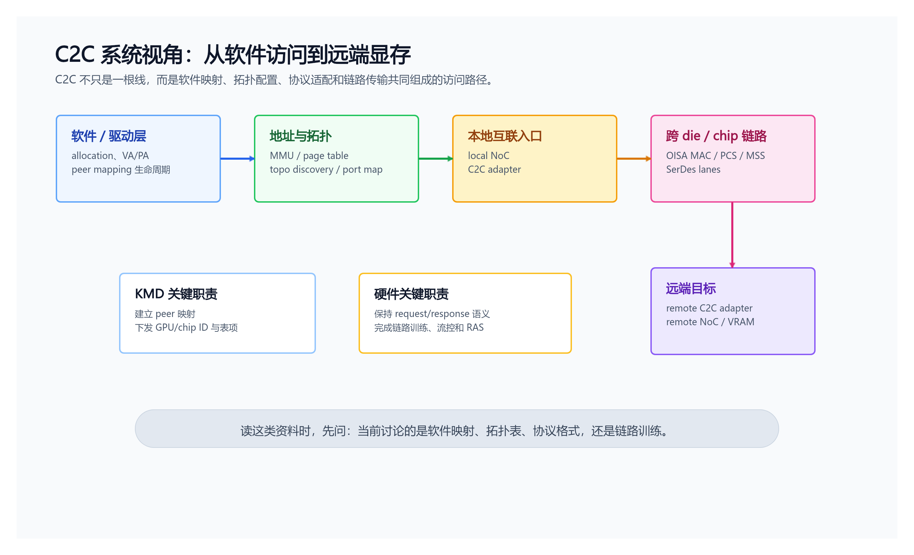

这张图要抓住两条线：

1. 控制线：KMD/FW 先把拓扑、GPU ID、端口关系、route table 准备好。
2. 数据线：真正的 LD/ST 访问从本地 NoC 进入 AMT，再从 C2C adapter/OISA/SerDes 到远端 NoC 和显存。

## 3. 先分清三类“地址”

互联文档里最容易混的是 VA、PA、device local PA。建议按“属于谁的地址空间”来记：

| 名称 | 属于谁 | 含义 | 能不能被别的 device 直接用 |
|---|---|---|---|
| `va0` | device0 的 VA space | device0 本地 allocation 的虚拟地址 | device0 可以直接用 |
| `pa0` | device0 / gpu0 | `va0` 对应的本地 GPU physical address | 需要通过 device0 的 MMU/driver 管理 |
| `va1` | device1 的 VA space | device1 本地 allocation 的虚拟地址 | device0 不能直接解释 |
| `pa1` | device1 / gpu1 | device1 allocation 对应的 GPU physical address | 可以被 export/import 后作为 peer target |
| `va2` | device0 的 VA space | device0 为远端 `pa1` 建立的 peer VA | device0 触发 copy/kernel 时应使用它 |

关键点：`va1` 和 `va2` 都可能指向同一个远端物理资源 `pa1`，但它们属于不同 device 的 VA space。

## 4. 10.1：M 公司互联可以怎么读

10.1 是理解 C2C 的核心入口。它不是只描述一条链路，而是在描述多 GPU / 多 die 之间怎样形成 LD/ST 风格互联。

学习时重点看三件事：

- 谁和谁互联：GPU-GPU、die-die、chip-chip，还是 GPU-CPU。
- 互联承载什么事务：普通 memory read/write、cache/coherent transaction、doorbell、interrupt，还是管理报文。
- 软件暴露什么抽象：单设备、多 device、peer access、统一 VA，还是显式 copy。

C2C 和其他互联方式的区别：

| 方案 | 访问模型 | 地址空间 | 数据路径 | 主要难点 |
|---|---|---|---|---|
| C2C LD/ST | 像访问内存一样访问远端 GPU memory | 倾向统一 global memory address | NoC -> AMT -> C2C -> remote NoC/memory | topo discovery、AMT 路由、死锁/自环、全局地址规划 |
| HWJ / RDMA 式互联 | kernel 发起 copy/reduce/gather | 每张卡保留自己的 PA/VA | tiny core / RDMA packet | 不支持直接 LD/ST，不适合 CUDA multi-device shared memory 风格 |
| PCIe 互联 | BAR/ATU/MMIO/DMA 访问 | 依赖 BAR window 和 outbound ATU | RP/EP + PCIe fabric | RP/EP 角色固定、拓扑不灵活、BDF/枚举/映射复杂 |

## 5. 10.2：OISA 介绍

OISA 可以先理解为互联里的协议/链路适配层：它把上层 NoC 或自定义事务，整理成适合跨 chip/die 传输的报文和流控语义。

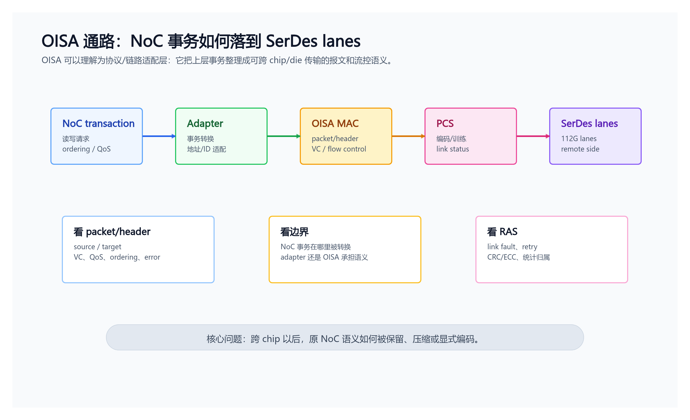

读 OISA 时建议关注：

- packet/header 里是否携带 source/target、VC、QoS、ordering、error 等信息；
- 和 NoC 的边界在哪里，是 adapter 做转换，还是 OISA 本身理解 NoC 事务；
- link fault、retry、CRC/ECC、RAS 统计由哪一层负责；
- 自定义 L2 报文是否要经过 switch，以及 switch 会不会修改、学习或丢弃相关字段。

## 6. 10.4：PCIe 互联视角

PCIe 视角更偏“系统软件如何枚举和管理多个 device”。在多 die / 多 GPU 设计里，每个 die 可能被 host 看成独立 PCIe device，也可能通过内部互联隐藏成一个更大的逻辑 device。

需要分清：

| 视角 | 关心的问题 |
|---|---|
| Host / PCIe | device 枚举、BAR、ATS/PASID、DMA 地址空间 |
| GPU driver | 哪些 device 可以 peer access，哪些路径需要 SDMA 或 kernel copy |
| C2C/D2D | device 间真实走哪条物理链路，带宽和错误状态如何反馈 |

PCIe 可以作为互联选择，但它更受标准拓扑和枚举机制约束。C2C 的优势是能为 GPU-to-GPU memory access 设计更直接的链路和路由模型。

## 7. 10.5：Topo discovery / port mapping

Topo discovery 的目标是让系统知道：当前有几个 die/chip/device，每个 port 连向谁，链路状态如何，以及逻辑 ID 如何映射到物理端口。

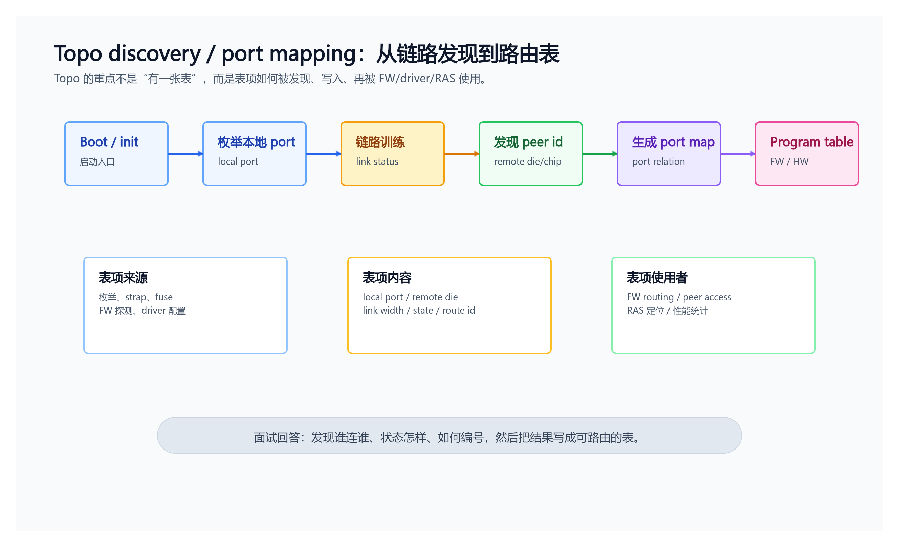

面试里如果被问 topo，回答重点不是“有一个表”，而是：

- 表项来源：枚举、strap、fuse、FW 探测、driver 配置；
- 表项内容：local port、remote device/die、link width、link state、routing id；
- 使用者：FW routing、driver peer access、RAS 定位、性能统计。

只知道“我这个 port link up”还不够，因为 link up 只能说明物理链路通了，不能说明对端是谁、对端 port 编号是什么、双方记录是否一致，也不能排除把自己连回自己的错误路径。

## 8. Peer mapping / D2D copy 时序

这张图解释的是：device0 如何申请本地 buffer，要求 device1 申请远端 buffer，然后 device0 把远端 `pa1` import 成自己的 `va2`，最后用 `va0` 和 `va2` 触发 D2D copy。

> Diagram image: `_attachments/fw/interconnect/c2c/source/peer-mapping-d2d-copy-sequence.png`. Mermaid source is kept at `.raw/dingtalk/c2c/peer-mapping-d2d-copy-sequence.mmd` for future edits.

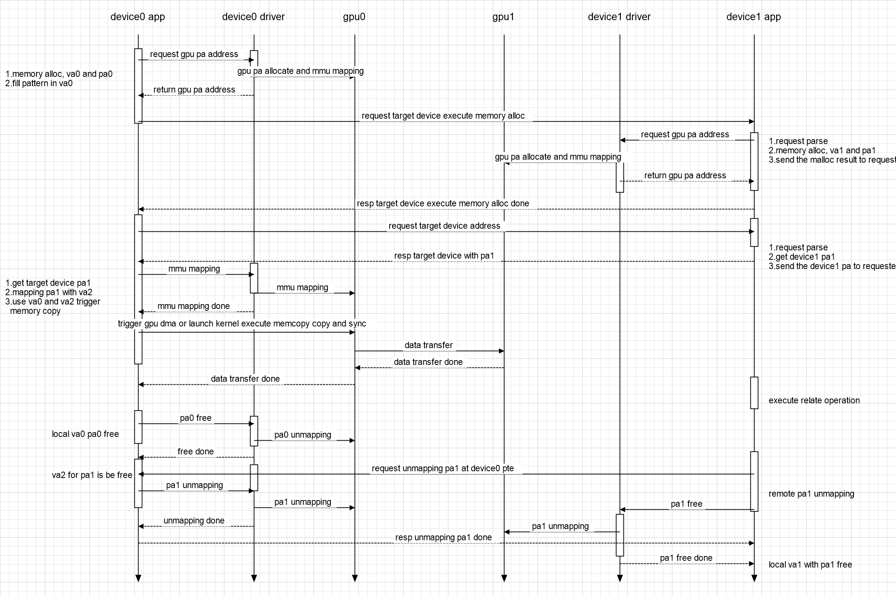

### 这张图里 `va2` 是什么？

`va2` 是 device0 VA space 里的一个虚拟地址，用来映射远端 device1 的 `pa1`。它不是 device1 的 VA，也不是 device0 的本地物理地址。

可以理解成：

```text
device1:
  va1 -> pa1

device0:
  va0 -> pa0
  va2 -> remote pa1
```

### device1 的 `va1/pa1` 是 device0 的 `pa0` 吗？

不是。`pa0` 是 device0 本地 allocation 的物理地址；`pa1` 是 device1 本地 allocation 的物理地址。D2D copy 的本质是把 device0 的 `pa0` 对应数据，通过互联写到 device1 的 `pa1` 对应位置。

### device0 可以直接用 `va1` 吗？

一般不可以。`va1` 属于 device1 的 VA space，device0 的 MMU/page table 不能直接解释它。device0 要访问远端 `pa1`，需要在自己的 VA space 里建立一个 peer mapping，也就是图里的 `va2`。

### 正确触发 copy 应该用哪两个 VA？

如果是 device0 发起 kernel TMA copy 或 SDMA D2D copy，应该使用：

```text
src = va0  // device0 local buffer
dst = va2  // device0 VA that maps remote device1 pa1
```

所以图里的关键句应理解为：`use va0 and va2 trigger memory copy`。

## 9. C2C / D2D / 多 die 配置

10.5 给出的实现策略：

| 项目 | 信息 |
|---|---|
| C2C 物理实现 | adapter + OISA MAC + PCS + 112G SerDes |
| C2C 子系统结构图 | [C2C 子系统结构图拆解](<./c2c-macphy-wrapper-subsystem.md>) | 将 MACPHY_WRAPPER 拆成 Adapter0/1/2、LLRMAC、PCS/FEC/RlmHSX8、Hss112GX4Wrapper、CSR/SRAM/APB。 |
| C2C 端口配置 | 支持 x2/x4，可形成 6 x 200G 或 3 x 400G；后续若无 SerDes lane 问题，可能按 3 x 400G 讨论 |
| D2D 实现 | uxcs + adapter + 24G SerDes |
| D2D 端口 | 2 ports，每 port 8 links |
| 封装场景 | 1 chip 2 die、1 chip 4 die |
| PCIe 视角 | 每个 die 可以作为一个 device，有自己的 PCIe |

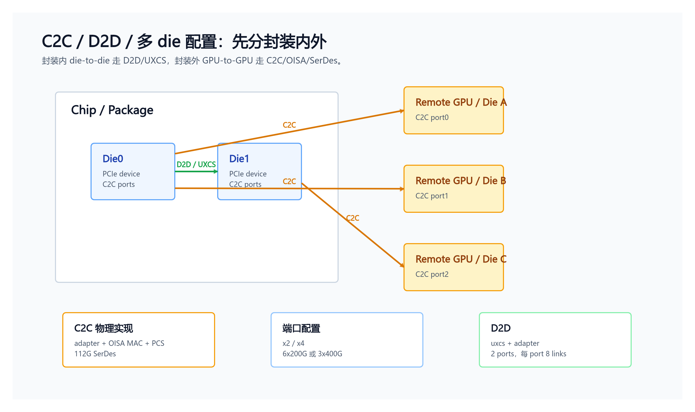

2DIE 与 4DIE 拓扑注意点：

- topo discovery 不是只要链路通就行，还必须和产品形态、封装形态、switch/direct-connect 场景一致。
- 4DIE form 2 曾被标注为只存在于 direct-connect 场景，在 switch 场景下会出错；这类信息不能只靠 port up 判断。
- route table 的表项需要同时体现 source chip/port、destination chip/port 和转发出口。

## 10. RAS 和 testable

10.6 的核心观点：C2C 不能只设计数据通路，还要能测、能定位、能统计。

### AXI monitor 视角

更系统的 AXI5 协议背景、五通道握手、atomic 和 C2C 中 AXI 的边界作用，见 [AXI5 协议详解与 C2C 中 AXI 的作用](<./axi5-protocol-and-c2c-role.md>)。

| 名称 | 含义 |
|---|---|
| C2C slave | 请求从 NoC 进入 C2C。例如 GPU0 访问 GPU1 时，GPU0 侧 C2C 接收本地 NoC 请求。 |
| C2C master | C2C 向 NoC 发请求。例如 GPU0 访问 GPU1 时，GPU1 侧 C2C 向 GPU1 NoC 发请求。 |

三组 adapter 都有 Slave/Master monitor：S0/M0、S1/M1、S2/M2。

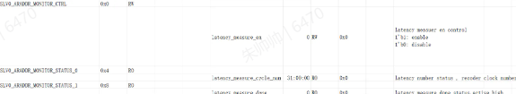

latency 统计从第一笔 AXI request 到 response 结束的 cycle 数。cycle 按 C2C main clock 900MHz 统计，AXI request size 按 AXI 口宽度 1024b，即 128B 计算。

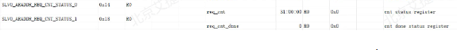

request count 用来统计一段时间内该 port 的 AXI 请求数量。软件清 counter、启动统计、停止统计、poll done，最后读取 cnt。

10.6 还描述了 address match 和 perf 统计：

| 功能 | 软件动作 | 用途 |
|---|---|---|
| latency | enable 后 poll done，再读 cycle | 测链路延迟，定位慢路径 |
| req cnt | clear/start/stop/poll done/read cnt | 测吞吐和请求密度 |
| address match | 配 target_addr low/high，poll match | 验证地址路由，定位异常访问 |
| perf | 配 target_cnt，统计到第 N 个 request 的总 cycle | 统计 port 收发指定请求量的耗时 |

## 11. Loopback 测试

10.9 给出了多个 loopback 层级。它们不是一个固定串行链路，而是一组分层测试点。

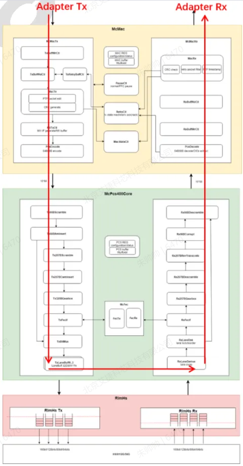

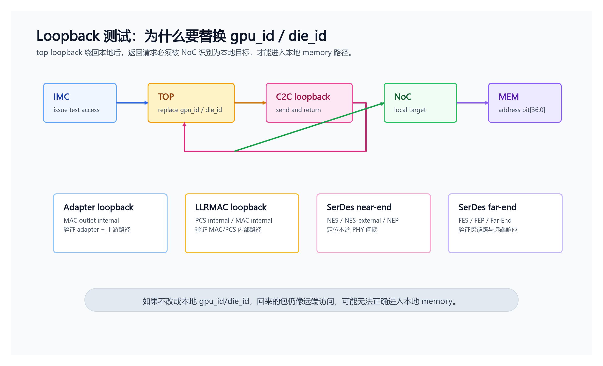

| 层级 | 模式 | 用途 |
|---|---|---|
| Top loopback | top_reg 控制 + 地址替换 | 让 IMC 测 C2C path 时，回来的请求能被本地 NoC 当成本地目标接收 |
| Adapter | MAC outlet internal loopback | 不出 MAC/PHY，先验证 adapter 和上游路径 |
| LLRMAC | PCS internal loopback、MAC internal loopback | 验证 MAC/PCS 内部路径 |
| SerDes near-end | NES、NES-external、NEP | 定位本端 PHY 问题 |
| SerDes far-end | FES、FEP、Far-End Error External | 验证跨链路路径和远端响应 |

近端环回、远端环回和 Adapter/LLRMAC/Top 环回的详细区别，见 [C2C PHY 近端环回与远端环回详解](c2c-loopback-near-far.md)。

### Top loopback 为什么要替换地址

IMC 要测试 C2C path 时，请求可能本来指向远端 GPU/die。开启 top loopback 后，top 需要把进入 C2C 的地址信息中的 `gpu_id/die_id` 替换成本地 GPU/die ID。这样数据 loopback 回来后，top 才会认为这是本地请求，并让 NoC 接收，最后由 NoC 用低地址位路由到 memory。

源码材料中的典型例子是：

| 步骤 | 行为 |
|---|---|
| 1 | `top_reg 0x90 bit0` 打开 top loopback |
| 2 | IMC 访问形如 `0xD1_0400_0000` 的地址 |
| 3 | top 替换地址中的 bit[47:37]，把 `gpu_id/die_id` 替换成本地 ID |
| 4 | C2C path loopback 回来 |
| 5 | top/NoC 把低位 bit[36:0] 当作本地 memory 地址路由 |

步骤 3 到 5 是硬件行为，软件侧不需要感知中间 loopback 细节。

## 12. MSS / SerDes 结构

10.7 正文抽取较少，主要价值在图。以下内容只基于已嵌入源图可见结构整理。

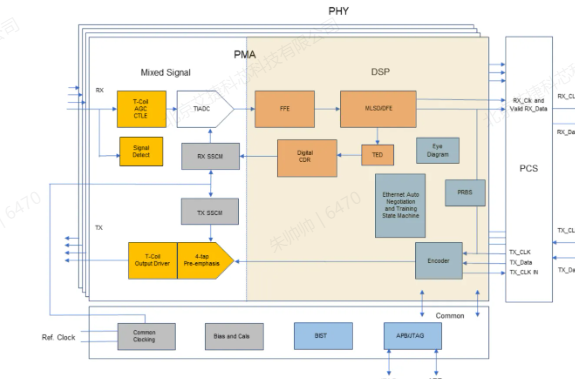

zeusCORE 图把 PHY 分成 PMA 和 PCS 相关部分。PMA 里能看到 mixed signal、DSP、CTLE、FFE、MLSDDFE、digital CDR、TED、Eye Diagram、PRBS、APB/JTAG 等模块，说明它不只是“串并转换器”，还包含均衡、时钟恢复、误码/眼图/测试和寄存器访问能力。

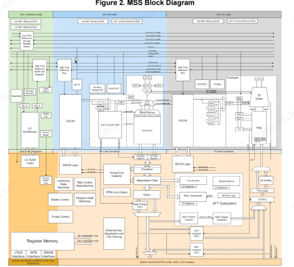

MSS block diagram 更细：包含 AFE common/rxlane/txlane、SSCM、register memory、BIST、TX/RX datapath、DFT subsystem 等。FW 侧关心的是这些模块背后的寄存器配置顺序、training 状态、lock 状态、loopback 和错误计数。

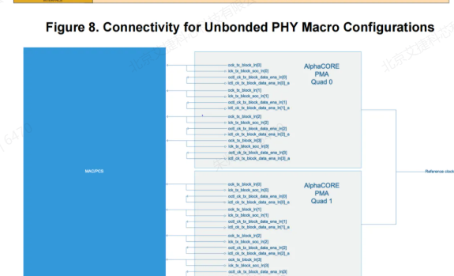

ANLT/lane connectivity 图提醒一个常见坑：逻辑 lane 和物理 lane 不一定天然一一对应，lane reorder / lane mapping 错了会造成训练成功率、带宽或方向性问题。

## 13. OISA 格式、C2C L2 格式和 switch 适配

10.8 讨论的是为了适配不同 vendor 交换机，需要研究 C2C L2 报文和 switch 行为。

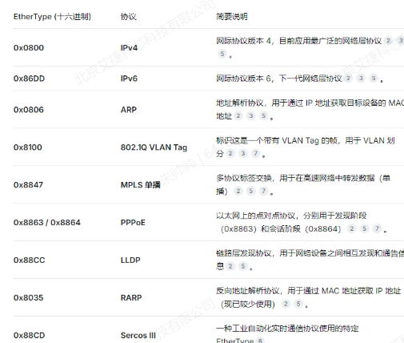

### 13.1 先说结论：两种格式解决的问题不一样

OISA 格式更像 C2C 内部协议视角，关注 NoC/C2C 事务怎样被封装、流控和恢复；C2C L2 格式更像走 switch/fabric 时的线缆侧或以太二层适配视角，关注 DA/SA/EthType 这类字段能不能被交换机接受和正确转发。

### 13.2 标准 L2 格式是什么

标准 L2 至少包括：

| 字段 | 含义 |
|---|---|
| DA | Destination MAC |
| SA | Source MAC |
| EthType | Packet type |
| Payload | 上层协议或私有协议载荷 |
| FCS | 帧校验 |

VLAN 场景还会加入 TPID、TCI、PCP、DEI、VID 等字段。

### 13.3 C2C L2 格式在标准 L2 上加了什么

10.8 提到 C2C 盛科自定义报文里 `EthType=0x8110`，并且对 DA/SA 做了改造，字段涉及 length、desid、sourceid、gpu id、die id、port id 等。这里要注意：这些字段能否直接被 switch 识别，取决于它们落在标准二层头里，还是落在自定义 payload / 私有解析位置。

### 13.4 OISA 格式和 C2C L2 格式的核心区别

| 维度 | OISA 格式 | C2C L2 格式 |
|---|---|---|
| 关注层级 | C2C 内部协议/链路适配 | 经过 switch 时的二层封装 |
| 主要字段 | source/target、事务语义、流控、错误处理 | DA/SA/EthType、私有 ID 字段、可能的 VLAN/交换行为 |
| 使用者 | C2C adapter、OISA MAC、FW bring-up/debug | switch、外部链路、C2C 交换适配逻辑 |
| 风险 | 协议语义错、ordering/error 不一致 | switch 丢包、误学习、字段被改写或不能转发 |

### 13.5 为什么要有两种帧格式

内部 C2C 事务要服务于 GPU memory access，不只是普通以太二层包；但一旦走外部 switch，报文又必须满足交换机可接收、可转发、可隔离的要求。因此工程上会同时有内部协议格式和外部二层适配格式。

### 13.6 软件 / FW / 硬件分别要关心什么

| 角色 | 关心点 |
|---|---|
| 软件/KMD | 哪些拓扑走 direct-connect，哪些走 switch，route table 如何生成 |
| FW/IMC | link training、port-chip relation、错误统计、loopback 和 bring-up |
| 硬件 | L2 字段封装、OISA 语义保留、switch 场景下出口选择和回包路径 |

### 13.7 工程验证重点

- 自定义字段是否能被不同 switch 接受。
- switch 是否会修改、丢弃或错误学习这类报文。
- 静态 MAC、动态 MAC、黑洞 MAC、VLAN 域是否和 C2C 转发预期一致。
- OISA/C2C 的流控、错误处理是否与标准 L2 交换行为冲突。
- Switch 模式转发规则见 [portmap routing table 的 switch 图解](portmap-routing-table.md#71-switch-模式转发规则详细图解)。

### 13.8 面试速记

可以这样回答：OISA 是内部互联协议语义，C2C L2 是为了在二层交换环境里承载这种语义。前者保证 GPU 事务和链路控制正确，后者保证报文能被 switch 按预期转发。

更细的逐层解释见 [C2C transaction routing 与 OISA/L2 封装](<./c2c-transaction-routing-and-encapsulation.md>)：它把 `GPU/SDMA/TMA -> NoC -> AMT/top/mesh_router -> portmap -> C2C adapter -> OISA/L2 -> SerDes` 的运行时路径拆开说明。

## 14. GPU ID / 集群 ID 基础设施

AI集群ID基础设施调研讨论的是标识问题。它讲 GPUID、MIG、Kubernetes device plugin、vGPU UUID、Node ID 等；10.1 则只明确说 KMD 会把 GPU ID / chip ID 下发给 FW。

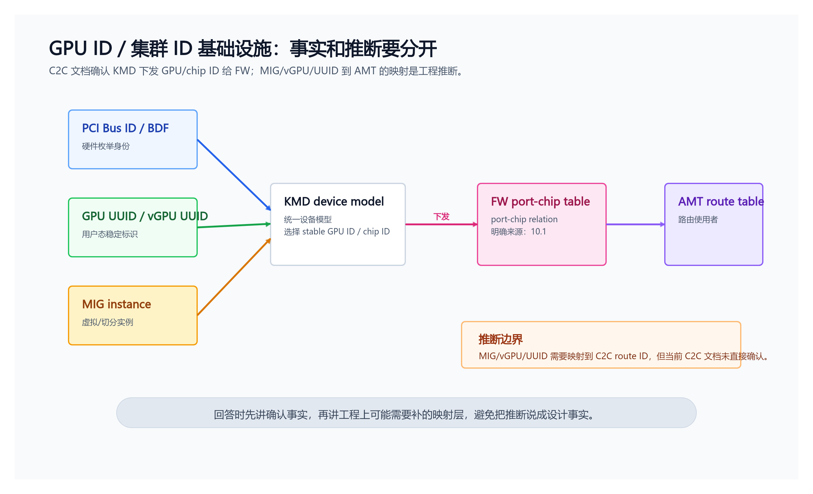

需要区分事实和推断：

| 内容 | 证据级别 |
|---|---|
| KMD 根据 BDF 配置 chip ID，并下发给 FW | 10.1 明确描述 |
| FW 基于 GPU ID/chip ID 形成 port-chip relation | 10.1 明确描述 |
| MIG/vGPU/UUID 需要映射到 C2C route ID | 工程推断，不是当前 C2C 文档已确认设计 |

如果 GPU ID 不稳定，C2C 会出现非常严重的问题：AMT route table 可能把访问送到错误 GPU，或者 KMD/FW 对同一个 port 的对端身份理解不一致。

## 15. 面试怎么回答

### Q1: C2C 互联主要解决什么问题？

答：C2C 主要解决多 GPU / 多 die 间的高带宽、低延迟直接访问问题。它不是简单 PCIe copy，也不是传统 RDMA 网络传输，而是希望支持类似 LD/ST 的远端显存访问模型。核心组件包括 SerDes/PCS/OISA MAC、adapter、NoC、AMT route table，以及 KMD/FW 协同的 topo discovery。

### Q2: FW 和 KMD 怎么分工？

答：FW 贴近硬件，负责 SerDes/PCS/OISA link training、端口关系发现、trigger message、ACK/re-ACK、链路异常处理。KMD 有系统全局视角，负责 BDF/GPU ID/chip ID 管理、拓扑确认、最优路径选择和协同配置 AMT route table。

### Q3: AMT 是什么，为什么需要它？

答：AMT 是 C2C 地址路由的关键单元。它根据 global memory address 判断目标 GPU 或 memory range，再查 route table 选择 C2C 出口。没有 AMT，硬件只知道收到地址请求，但不知道该走本地 memory 还是哪个 C2C port。

### Q4: 为什么 link up 后还要 topology discovery？

答：link up 只说明物理链路通，不说明对端是谁、对端 port 编号是什么、source/dest 是否一致、有没有自环。trigger message、ACK、re-ACK 的作用是把物理链路事实变成 KMD/FW 可以使用的拓扑事实。

### Q5: RAS/testable 怎么落地？

答：用 AXI monitor、latency/req count/address match/perf 统计来观察路径；用 top/adapter/LLRMAC/PCS/SerDes loopback 分层隔离问题；用错误计数、BIST 和 link 状态来定位 PHY、MAC、adapter 或 NoC 边界。

### Q6: OISA 格式和 C2C L2 格式有什么区别，为什么要有两种？

答：OISA 格式服务于 C2C 内部互联语义，关注事务、流控、错误处理；C2C L2 格式服务于 switch/fabric 承载，关注 DA/SA/EthType 和交换机兼容性。两者同时存在，是因为内部 GPU 事务要正确，外部二层转发也要正确。

## 16. 源文档地图

| 文档 | 本页使用方式 | 原始抽取 |
|---|---|---|
| 10.1 m公司互联 | LD/ST 模型、AMT、FW/KMD 分工、topo discovery | [raw](../../../.raw/dingtalk/c2c/raw/10.1-m公司互联.md) |
| 10.2 OISA介绍 | OISA 背景和截图证据 | [raw](../../../.raw/dingtalk/c2c/raw/10.2-OISA介绍.md) |
| 10.3 hwj 互联 | RDMA/network-style 互联对比 | [raw](../../../.raw/dingtalk/c2c/raw/10.3-hwj-互联.md) |
| 10.4 pcie互联 | PCIe 互联约束 | [raw](../../../.raw/dingtalk/c2c/raw/10.4-pcie互联.md) |
| 10.5 topo discovery | port mapping、C2C/D2D、多 die 拓扑 | [raw](../../../.raw/dingtalk/c2c/raw/10.5-topo-discovery-port-mapping-configuration.md) |
| 10.6 c2c ras和testable | AXI monitor、address match、perf、RAS | [raw](../../../.raw/dingtalk/c2c/raw/10.6-c2c-ras和testable.md) |
| 10.7 MSS | SerDes/MSS 架构图 | [raw](../../../.raw/dingtalk/c2c/raw/10.7-Multi-Standard-Serdes（MSS）.md) |
| 10.8 C2C 自定义L2报文 | C2C L2、EthType、switch 适配 | [raw](../../../.raw/dingtalk/c2c/raw/10.8-C2C-自定义L2报文调研分析.md) |
| 10.9 C2C loopback功能 | Adapter/LLRMAC/SerDes/top loopback | [raw](../../../.raw/dingtalk/c2c/raw/10.9-C2C-loopback功能.md) |
| 10.10 多场景topo | 2DIE/4DIE package 和 form | [raw](../../../.raw/dingtalk/c2c/raw/10.10-多场景topo发现流程补充方案.md) |
| AI集群ID基础设施调研 | GPU ID / MIG / Kubernetes device plugin / route ID 稳定性 | [raw](../../../.raw/dingtalk/c2c/raw/AI集群ID基础设施调研.md) |

## 17. 仍需补齐的问题

| 问题 | 原因 | 后续动作 |
|---|---|---|
| OISA 技术细节仍偏少 | 10.2 是图片/PPT 型资料 | 对截图逐页 OCR 或手工复核。 |
| MSS 寄存器配置顺序未闭合 | 当前只整理了结构图和 10.9 loopback 配置片段 | 查 MSS/SerDes 寄存器表或 FW bring-up 代码。 |
| AMT 表项格式未见 | 当前材料只说明 route table 概念 | 后续查寄存器表、portmap 方案或 FW 配置代码。 |
| Switch 多厂商兼容性未闭合 | 10.8 指出要适配 vendor switch，但未给完整测试矩阵 | 补充 switch 模式测试项、字段保留规则和异常路径。 |
| 远端环回 FES/FEP-err 配置不完整 | 10.9 对 FEP 给了较多配置，对 FES/FEP-err 细节较少 | 继续查 PHY/MSS 手册或 DV case。 |

