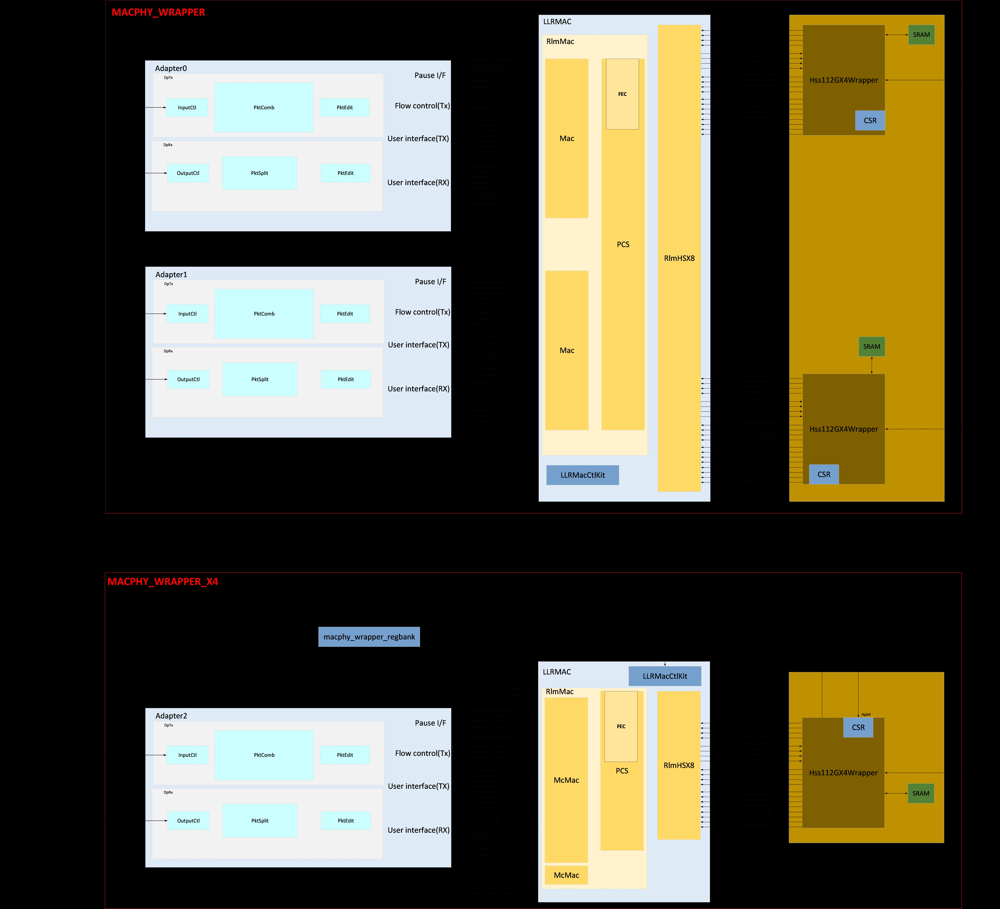
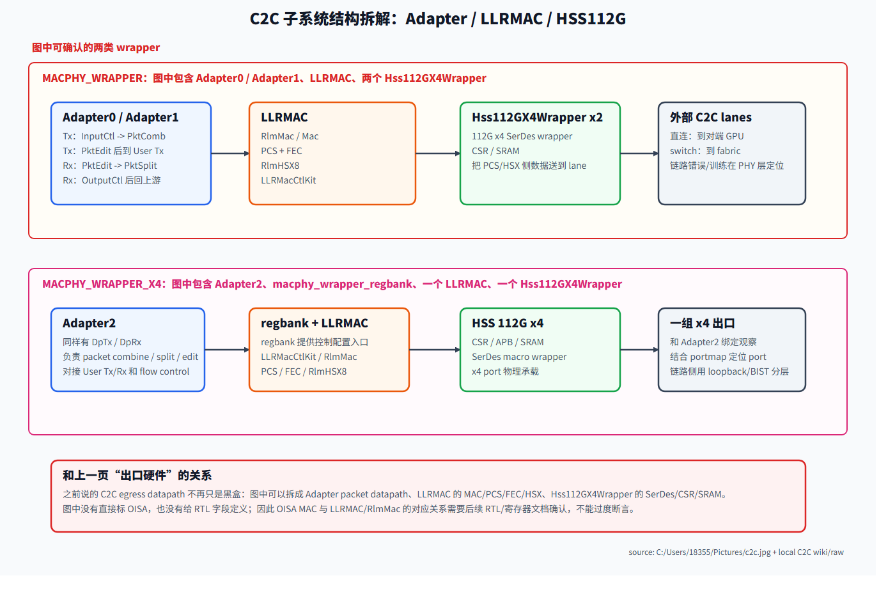
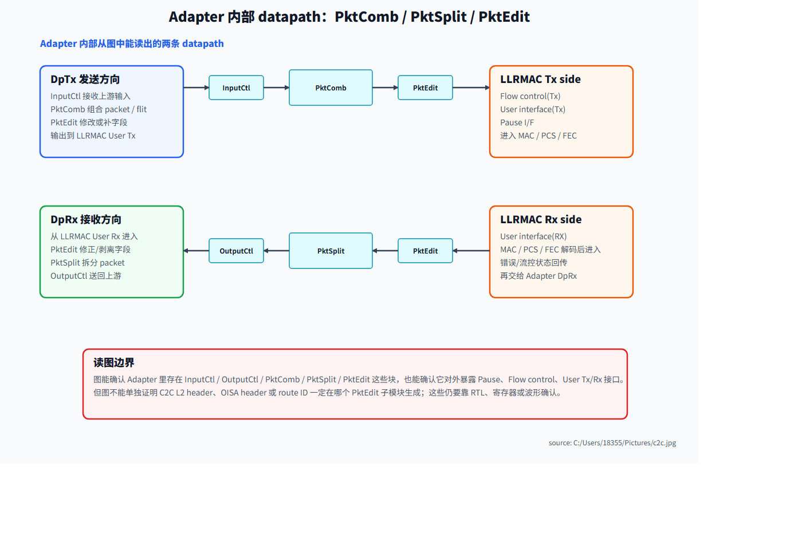

---
type: learning-guide
title: C2C 子系统结构图拆解：MACPHY_WRAPPER / Adapter / LLRMAC / HSS112G
created: 2026-06-08
updated: 2026-06-08
tags: [fw, interconnect, c2c, adapter, llrmac, serdes, macphy]
status: active
source:
  - C:\Users\18355\Pictures\c2c.jpg
  - C:\home\for_ai\.raw\dingtalk\c2c\raw\10.5-topo-discovery-port-mapping-configuration.md
  - C:\home\for_ai\.raw\dingtalk\c2c\raw\10.6-c2c-ras和testable.md
  - C:\home\for_ai\.raw\dingtalk\c2c\raw\10.9-C2C-loopback功能.md
related:
  - "[[wiki/fw/interconnect/c2c-dingtalk-study|C2C 互联学习文档]]"
  - "[[wiki/fw/interconnect/c2c-transaction-routing-and-encapsulation|C2C transaction routing 与 OISA/L2 封装]]"
  - "[[wiki/fw/interconnect/c2c-loopback-near-far|C2C PHY 近端环回与远端环回详解]]"
---

# C2C 子系统结构图拆解：MACPHY_WRAPPER / Adapter / LLRMAC / HSS112G

> Source boundary：本页以用户提供的高分辨率结构图 `C:\Users\18355\Pictures\c2c.jpg` 为主证据，并结合现有 10.5/10.6/10.9 C2C 原始资料。图中能读清的模块名按 source-confirmed 处理；图中没有标出的 OISA 字段、L2 header 生成位置、RTL 子模块归属，只能作为推断边界，不能写成确定实现。

## 1. 术语解释：先读懂图中每个词

> 读图原则：下面把“图中能直接看到的词”和“根据常见硬件命名推断的含义”分开写。`source-confirmed` 表示图中或现有 C2C 资料能确认；`inferred` 表示按位置和命名理解，后续还要靠 RTL、寄存器表或波形确认。

### 1.1 外层 wrapper 和方向术语

| 术语 | 全称 / 直观含义 | 图中位置 | 作用 | 证据边界 |
|---|---|---|---|---|
| `MACPHY_WRAPPER` | MAC + PHY wrapper，大的 MAC/PHY 封装块 | 上半部分红色边框 | 把左侧 Adapter、中央 LLRMAC、右侧 HSS112G SerDes wrapper 放在同一个 C2C 子系统边界里。 | source-confirmed：图中红框标题。 |
| `MACPHY_WRAPPER_X4` | x4 形态的 MAC/PHY wrapper | 下半部分红色边框 | 展示一个 x4 port 形态：一个 `Adapter2`、一个 `LLRMAC`、一个 `Hss112GX4Wrapper`，并带 `macphy_wrapper_regbank`。 | source-confirmed：图中标题；和 10.5/10.6 的 x4 port 资料相互印证。 |
| `Wrapper` | 封装层 / 集成壳 | 多处模块名后缀 | 通常表示把若干 RTL 子模块、配置接口、时钟复位和外部引脚包成一个可集成单元。 | inferred：通用硬件命名习惯。 |
| `MAC` | Media Access Control / 链路访问控制层 | `LLRMAC` 内部的 `Mac`、`RlmMac`、`McMac` | 处理链路层 packet/frame 的收发、边界、状态、错误、流控语义。 | source-confirmed：图中有 Mac 字样；具体协议字段需 RTL 确认。 |
| `PHY` | Physical layer / 物理层 | 右侧 HSS/SerDes wrapper | 把 PCS/HSX 侧的数字数据送到高速 SerDes lane，并处理训练、环回、误码等物理相关问题。 | inferred + 10.5/10.9 资料支持。 |
| `Tx` | transmit / 发送方向 | `DpTx`、`Flow control(Tx)`、`User interface(TX)` | 从本端 Adapter 往 LLRMAC/HSS/外部 lane 发数据。 | source-confirmed：图中标注。 |
| `Rx` | receive / 接收方向 | `DpRx`、`User interface(RX)` | 从外部 lane/LLRMAC 进入 Adapter，再回到上游。 | source-confirmed：图中标注。 |
| `I/F` | Interface / 接口 | `Pause I/F` | 表示一组信号接口，不是单独数据处理模块。 | inferred：硬件文档常用缩写。 |
| `lane` | 高速串行通道 | 右侧 HSS wrapper 外部连线 | SerDes 的物理传输通道；x4 表示一组 4 lane/4 通道形态。 | inferred + 图中 Hss112GX4Wrapper 支持。 |

### 1.2 Adapter 侧术语

| 术语 | 是什么 | 作用 | 为什么重要 |
|---|---|---|---|
| `Adapter0/1/2` | C2C adapter 的三个实例 | 连接上游 NoC/C2C 事务侧和下游 LLRMAC 链路侧；每个 adapter 有自己的 Tx/Rx datapath。 | 10.6 资料里有 `S0/M0`、`S1/M1`、`S2/M2` monitor，正好对应三个 adapter 的分层调试入口。 |
| `Adapter` | 事务适配器 | 把上游 memory transaction / packet 形态适配成链路侧可处理的 packet，并在接收方向反向拆回上游可消费的形态。 | 它是“发包行为”和“物理链路”之间的第一道边界；很多 C2C 不通问题会停在这里。 |
| `DpTx` | data path transmit / 发送数据通路 | Adapter 内发送方向路径，图中包含 `InputCtl -> PktComb -> PktEdit`。 | Tx monitor 动不动、是否被 flow control 反压，通常先看这一侧。 |
| `DpRx` | data path receive / 接收数据通路 | Adapter 内接收方向路径，图中包含 `PktEdit -> PktSplit -> OutputCtl`。 | 远端包到了但上游收不到时，要看这一侧是否拆包、输出、回注正常。 |
| `InputCtl` | input control / 输入控制 | 接住发送方向上游输入，做进入 `PktComb` 前的控制。 | 如果上游发了但 `PktComb` 没动，可能卡在输入控制、valid/ready、credit 或 enable。 |
| `OutputCtl` | output control / 输出控制 | 接收方向最后一级，把拆好的 packet/事务送回上游。 | 如果链路侧已经收到但上游无响应，可能卡在输出控制或上游 backpressure。 |
| `PktComb` | packet combine / 包组合 | 把发送方向输入的数据片段组合成链路侧 packet 粒度。 | 解释了 adapter 不是简单转线；packet 形态可能在这里发生合并。 |
| `PktSplit` | packet split / 包拆分 | 把接收方向链路侧 packet 拆成上游能消费的事务或片段。 | 和 `PktComb` 对称；接收方向吞吐、乱序、拆包错误可先关注这里。 |
| `PktEdit` | packet edit / 包字段编辑 | Tx/Rx 两边都出现，表示发送和接收都可能需要字段补充、修改、剥离或校验相关处理。 | 注意：它“可能”参与 OISA/C2C L2 字段处理，但图不能证明具体 header 一定由哪个 `PktEdit` 生成。 |
| `Pause I/F` | pause interface / 暂停接口 | 给 Adapter/LLRMAC 之间提供暂停或反压类信号。 | 链路拥塞、对端暂停、buffer 满时，可能通过它影响 Tx 是否继续。 |
| `Flow control(Tx)` | 发送方向流控 | 管理 Tx 是否有 credit/空间/条件继续发。 | 性能抖动、hang、只有发不出包时，需要检查 flow control。 |
| `User interface(TX)` | Adapter 到 LLRMAC 的发送用户接口 | Adapter 处理后的 Tx 数据通过这个接口进 LLRMAC。 | 这是 Adapter 和 LLRMAC 的边界点，适合抓波形定位“包有没有离开 Adapter”。 |
| `User interface(RX)` | LLRMAC 到 Adapter 的接收用户接口 | LLRMAC 解出的 Rx 数据通过这个接口交给 Adapter。 | 适合定位“链路包已经到 MAC，但有没有进入 Adapter Rx”。 |

### 1.3 LLRMAC / MAC / PCS 侧术语

| 术语 | 是什么 | 作用 | 证据边界 |
|---|---|---|---|
| `LLRMAC` | 图中的 MAC/PCS/FEC/HSX 汇聚大模块 | 位于 Adapter 和 HSS112G wrapper 之间，承接 User Tx/Rx，向右连接高速 SerDes wrapper。 | source-confirmed：图中大框。`LLR` 精确展开未见，不能强行扩写。 |
| `RlmMac` | LLRMAC 内部的 MAC 子块名 | 图中包住 `Mac`、`PCS`、`FEC` 等块，可理解为一组 MAC/PCS 实现子系统。 | source-confirmed：图中标签；`Rlm` 精确含义需 RTL 文档。 |
| `Mac` / `McMac` | MAC 数据处理块 | 处理链路层收发、packet/frame 边界、状态和错误。 | source-confirmed：图中有 `Mac`，下半图可见 `McMac`；两者具体差异需 RTL 确认。 |
| `PCS` | Physical Coding Sublayer / 物理编码子层 | 在 MAC 和 SerDes 之间做编码、对齐、lane 相关适配。 | source-confirmed：图中 `PCS`。10.9 loopback 也提到 PCS 内环。 |
| `FEC` | Forward Error Correction / 前向纠错 | 发送侧加纠错冗余，接收侧做纠错/错误统计。 | source-confirmed：图中 `FEC`。调试误码时要看 FEC，不只看 SerDes。 |
| `RlmHSX8` | LLRMAC 右侧连接 HSS 的竖向接口块 | 从位置看，它是 LLRMAC 到 HSS112G wrapper 之间的高速接口/聚合块。 | source-confirmed：图中标签；`HSX8` 精确定义需 RTL 文档。 |
| `LLRMacCtlKit` | LLRMAC control kit | 控制、配置、状态或 debug 相关入口。 | source-confirmed：图中标签；具体寄存器需寄存器表。 |

### 1.4 HSS / SerDes / 配置接口术语

| 术语 | 是什么 | 作用 | 调试价值 |
|---|---|---|---|
| `Hss112GX4Wrapper` | 112G x4 高速 SerDes wrapper | 最靠 PHY 的大 wrapper，连接 LLRMAC/RlmHSX8 和外部高速 lane。 | link training、lane 状态、近端/远端环回、BIST、误码定位通常都要看这一层。 |
| `HSS` | high-speed SerDes 相关 wrapper 的命名 | 图中 `Hss112GX4Wrapper` 的前缀，直观指高速串行接口。 | exact expansion 需内部文档确认，但作用位置已经明确在 PHY/SerDes 侧。 |
| `112G` | 单 lane 或单通道速率等级标记 | 表示 112G 级高速 SerDes 能力。 | 和 10.5 的 `PCS + 112G serdes` 对应。 |
| `X4` / `x4` | 四通道/四 lane 形态 | 表示一组 x4 wrapper 或 x4 port。 | 10.5/10.6 提到 x2/x4 port 配置；x4 下每个 adapter 只有一个 x4 port0。 |
| `CSR` | Control/Status Register / 控制状态寄存器 | HSS wrapper 内的寄存器访问点，用于配置和读状态。 | bring-up、训练、错误计数、loopback/BIST enable 等通常从 CSR 入手。 |
| `SRAM` | Static RAM / 静态 RAM | HSS wrapper 内部小存储块。 | 可能保存表项、状态、训练参数或内部 buffer；图不能确认具体内容。 |
| `APB` | Advanced Peripheral Bus / 低速外设配置总线 | 下半图 HSS wrapper 顶部可见 `Apb` 标注 | 常用于软件/固件访问 CSR 或配置寄存器。 |
| `macphy_wrapper_regbank` | MACPHY wrapper 的寄存器 bank | 下半图单独画在 wrapper 内部上方 | 表示 x4 wrapper 形态下存在集中寄存器配置入口。 |

### 1.5 不要混淆的几个词

| 容易混淆 | 正确理解 |
|---|---|
| `Adapter` 不是 `SerDes` | Adapter 靠事务/packet 侧；SerDes/HSS 靠物理 lane 侧。 |
| `PCS` 不是 `PHY` 的全部 | PCS 是物理编码子层；HSS/SerDes wrapper 还包含 lane、模拟/数字 PHY、CSR/SRAM 等更靠物理的内容。 |
| `PktEdit` 不等于一定生成 L2 header | 它表示 packet edit 点，但具体 OISA header / C2C L2 header 生成位置还需要 RTL 或波形证明。 |
| `LLRMAC` 不一定等于 OISA MAC | 图中没有直接写 OISA。当前只能说它位于 MAC/PCS 侧，与之前抽象的 OISA/MAC/PCS 层相邻或重叠，不能直接画等号。 |
| `MACPHY_WRAPPER_X4` 不是第四个 adapter | 图中仍是 `Adapter2`，`X4` 描述的是 wrapper/port/lane 形态，不是 adapter 编号。 |


## 2. 一句话理解

这张图把之前被我们概括成“C2C 出口硬件”的部分展开了：它不是一个单独模块，而是从左到右的 `Adapter packet datapath -> LLRMAC/MAC/PCS/FEC/HSX -> Hss112GX4Wrapper/SerDes`。

也就是说：

- `Adapter` 更靠 NoC/OISA 事务侧，负责 packet 的输入输出控制、组合、拆分和字段编辑。
- `LLRMAC` 更靠 MAC/PCS 链路层，负责 MAC、PCS、FEC、HSX 和控制 kit。
- `Hss112GX4Wrapper` 更靠 PHY/SerDes 侧，带 CSR/SRAM/APB 这类配置和状态访问入口。

## 3. 原始结构图



## 4. 重绘后的学习图



> 图解源文件：[`c2c-macphy-wrapper-overview.svg`](../../../_attachments/fw/interconnect/c2c/macphy-wrapper/c2c-macphy-wrapper-overview.svg)。



> 图解源文件：[`c2c-adapter-internal-datapath.svg`](../../../_attachments/fw/interconnect/c2c/macphy-wrapper/c2c-adapter-internal-datapath.svg)。

## 5. 图中能直接确认的模块

| 图中模块 | 位置 | 能确认什么 | 学习时怎么理解 |
|---|---|---|---|
| `MACPHY_WRAPPER` | 上半部分红框 | 包含 `Adapter0`、`Adapter1`、`LLRMAC`、两个 `Hss112GX4Wrapper` | 一组较大的 C2C MAC+PHY wrapper，内部承载两个 adapter 方向和两组 HSS wrapper。 |
| `MACPHY_WRAPPER_X4` | 下半部分红框 | 包含 `Adapter2`、`macphy_wrapper_regbank`、`LLRMAC`、一个 `Hss112GX4Wrapper` | x4 形态的 wrapper 视图，和 10.5/10.6 里 “x4 port / Adapter2” 的知识可以连起来看。 |
| `Adapter0/1/2` | 左侧浅蓝大框 | 每个 adapter 内有 `DpTx`、`DpRx` 两条 datapath | C2C adapter 不是黑盒；里面至少有发送/接收方向的 packet 控制与编辑逻辑。 |
| `InputCtl` | Adapter 的 `DpTx` | 发送方向输入控制 | 接住上游事务/packet，进入发送组合链路。 |
| `PktComb` | Adapter 的 `DpTx` | packet combine | 可能负责把上游片段组合成链路侧 packet；是否生成 OISA/L2 字段仍需 RTL 证明。 |
| `PktEdit` | `DpTx` 和 `DpRx` 都出现 | packet edit | 说明发送和接收方向都有字段修正/补充/剥离类处理点。 |
| `OutputCtl` | Adapter 的 `DpRx` | 接收方向输出控制 | 接收链路侧 packet 处理后，送回上游接口。 |
| `PktSplit` | Adapter 的 `DpRx` | packet split | 和 `PktComb` 对应，用于把链路侧 packet 拆回上游能消费的粒度。 |
| `Pause I/F` | Adapter 右侧 | 暂停/反压相关接口 | 和链路流控、拥塞或暂停帧/暂停信号有关。 |
| `Flow control(Tx)` | Adapter 右侧 | 发送方向流控 | 告诉上游或 MAC 侧当前是否可以继续发。 |
| `User interface(TX/RX)` | Adapter 右侧 | 用户数据收发接口 | Adapter 和 LLRMAC/MAC 之间的数据/控制接口边界。 |
| `LLRMAC` | 中间浅蓝大框 | 内部有 `RlmMac`、`Mac`、`PCS`、`FEC`、`RlmHSX8`、`LLRMacCtlKit` | MAC/PCS/FEC/HSX 汇聚层，连接 Adapter 和 SerDes wrapper。 |
| `RlmMac` / `Mac` / `McMac` | LLRMAC 内部 | MAC 数据处理块 | 处理链路 MAC 层的收发、帧/packet 边界、错误/状态。`McMac` 字样在下半图可见，具体命名需 RTL 确认。 |
| `PCS` | LLRMAC 内部 | PCS 层 | 负责物理编码相关的适配，是 MAC 和 SerDes 之间的关键层。 |
| `FEC` | PCS 旁边 | 前向纠错 | 说明链路侧有纠错能力，调试误码时不能只看 SerDes，也要看 FEC/PCS 统计。 |
| `RlmHSX8` | LLRMAC 右侧竖条 | HSX/lane 聚合接口 | 连接 LLRMAC 内部 PCS/MAC 和右侧 HSS112G wrapper。 |
| `LLRMacCtlKit` | LLRMAC 内部蓝色小块 | MAC 控制/寄存器/调试 kit | 可能承载配置、状态、debug control；具体寄存器要查后续文档。 |
| `Hss112GX4Wrapper` | 右侧金色大框 | 112G x4 SerDes wrapper | 最靠近物理 lane 的 wrapper，图中有 CSR/SRAM/APB/外部 lane 连接。 |
| `CSR` / `SRAM` / `APB` | HSS wrapper 内 | 配置、状态、内部存储/访问入口 | Bring-up、loopback、BIST、误码定位通常需要读写这些控制/状态接口。 |

## 6. 和之前“C2C 出口硬件”的对应关系

之前我们说：

```text
C2C egress datapath
  -> C2C adapter
  -> OISA MAC
  -> C2C L2 encapsulation logic（switch 模式）
  -> PCS
  -> MSS / 112G SerDes
```

这张结构图把其中几层变得更具体：

| 之前的抽象说法 | 这张图里能对应到的结构 | 注意事项 |
|---|---|---|
| `C2C adapter` | `Adapter0/1/2` 及其 `DpTx/DpRx`、`PktComb/PktSplit/PktEdit` | 可以确认 adapter 里有 packet 组合、拆分、编辑点。 |
| `OISA MAC` | 图中没有直接写 OISA；可先把 `LLRMAC/RlmMac/Mac/PCS/FEC/RlmHSX8` 当作 MAC/PCS 侧实现层理解 | 不能直接断言 OISA header 一定由某个图中子块生成。 |
| `C2C L2 encapsulation logic` | 可能落在 `PktComb/PktEdit` 或 MAC 侧某个实现点 | 这是推断，不是图确认事实；需要 RTL/波形/寄存器文档确认。 |
| `PCS` | `LLRMAC` 内的 `PCS` 和 `FEC` | 图中明确可见。 |
| `MSS / 112G SerDes` | `Hss112GX4Wrapper`，内部带 `CSR`、`SRAM`、`APB` | 和 10.5 的 `PCS + 112G serdes` 证据相互印证。 |

因此，以后回答“出口硬件是谁”时可以更精确地说：源侧出口硬件是一段从 `Adapter` 到 `LLRMAC` 再到 `Hss112GX4Wrapper` 的 datapath；如果走 switch，L2 外壳的生成点应在这段 egress datapath 内，但当前图不能证明具体 RTL 子模块名。

## 7. 发送方向怎么走

按图理解，一笔从上游来的发送路径可以拆成：

```text
上游 NoC / C2C 事务
  -> Adapter DpTx
  -> InputCtl
  -> PktComb
  -> PktEdit
  -> User interface(TX) / Flow control(Tx)
  -> LLRMAC: Mac / PCS / FEC / RlmHSX8
  -> Hss112GX4Wrapper
  -> 112G SerDes lanes
```

关键点：

- `PktComb` 和 `PktEdit` 解释了为什么 adapter 不只是“转接线”：它可能会改变 packet 形态。
- `Flow control(Tx)` 解释了为什么链路侧堵住时，上游可能被反压。
- `PCS/FEC/RlmHSX8/Hss112GX4Wrapper` 解释了为什么 C2C debug 不能只看 routing，还要看 MAC/PCS/FEC/SerDes 统计。

## 8. 接收方向怎么走

接收方向是发送方向的反向理解：

```text
112G SerDes lanes
  -> Hss112GX4Wrapper
  -> LLRMAC: RlmHSX8 / PCS / FEC / Mac
  -> User interface(RX)
  -> Adapter DpRx
  -> PktEdit
  -> PktSplit
  -> OutputCtl
  -> 上游 NoC / C2C 事务消费者
```

这也能解释 10.6 里为什么每个 adapter 都有 Slave/Master monitor：源端从 NoC 进入 C2C 时看起来是 C2C slave；目标端从 C2C 回注 NoC 时看起来是 C2C master。Adapter 是 NoC 事务和 C2C 链路 packet 的收发边界。

## 9. x2 / x4 port 和 Adapter0/1/2 的关系

10.5 原始资料给过一个关键事实：C2C 支持 `x2` 和 `x4` 两种配置，可以形成 `6 x 200G` 或 `3 x 400G`；10.6 还说 `bit2/3/4` 可用于选择 C2C 的 3 个 port 之一发送数据，在 x2 port 场景下每个 adapter 包含 2 个 x2 port，x4 port 场景下每个 adapter 只有一个 x4 port0。

把这些和本图合起来看：

| 视角 | 解释 |
|---|---|
| 三个 adapter | 图中有 `Adapter0`、`Adapter1`、`Adapter2`，和 10.6 的 `S0/M0`、`S1/M1`、`S2/M2` monitor 对得上。 |
| x2 形态 | 每个 adapter 可拆成两个 x2 port，所以 portmap 的 8bit 中会出现每 adapter 2bit 的选择问题。 |
| x4 形态 | 每个 adapter 只有一个 x4 port0，图中 `MACPHY_WRAPPER_X4` 可以作为 x4 wrapper 学习入口。 |
| 调试含义 | 如果只某个 adapter/port 失败，要结合 `S/M monitor`、portmap bit、LLRMAC 统计和 HSS/SerDes 状态分层定位。 |

## 10. 调试时怎么按这张图分层

| 现象 | 先看哪一层 | 原因 |
|---|---|---|
| NoC 请求发出但 adapter 计数不动 | AMT/top/mesh_router/portmap 到 Adapter 的路径 | 可能没有选到这个 C2C 出口，或目标判断没命中。 |
| Adapter Tx monitor 动了，但链路侧无包 | Adapter -> LLRMAC User Tx / Flow control | 可能被 pause/flow control 反压，或 packet 没进入 MAC。 |
| MAC 有包但 PCS/FEC 报错 | LLRMAC 的 PCS/FEC | 可能是编码、纠错、lane 对齐或误码问题。 |
| PCS/FEC 正常但远端收不到 | Hss112GX4Wrapper / SerDes / 外部连线 | 看 CSR、SRAM 状态、link training、近端/远端 loopback、BIST。 |
| 只有 x2 port1 异常 | portmap bit 和 adapter 内部 port 选择 | 10.6 提到 x2 port1 需要特殊 bit 和 portmap 配合。 |
| switch 模式异常但直连正常 | C2C L2 外壳、HSS 出口、switch MAC/VLAN/私有 ID | routing 正确不代表 switch 能按预期转发。 |

## 11. 这次补足了哪些之前缺的知识

- 之前 `C2C adapter` 被讲成一个边界块；现在知道 adapter 里至少有 `DpTx/DpRx`、`InputCtl/OutputCtl`、`PktComb/PktSplit/PktEdit`。
- 之前 `OISA MAC / PCS / SerDes` 比较抽象；现在可以把中间层拆成 `LLRMAC`、`RlmMac/Mac/McMac`、`PCS`、`FEC`、`RlmHSX8`、`LLRMacCtlKit`。
- 之前 `MSS/112G SerDes` 只知道是物理实现；现在图中能看到 `Hss112GX4Wrapper`，并且它有 `CSR`、`SRAM`、`APB` 这类 bring-up/debug 入口。
- 之前 “出口硬件” 只能保守写成一段 egress path；现在可以写成更具体的 `Adapter -> LLRMAC -> Hss112GX4Wrapper`。
- 仍未补齐的是 OISA header / C2C L2 header 的具体生成子模块、字段表和波形证据；这些不能从这张图直接推出来。
