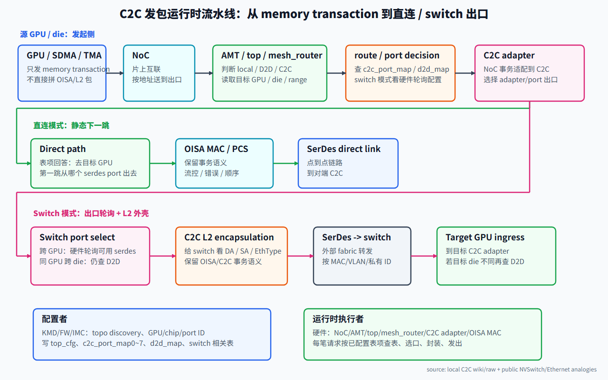
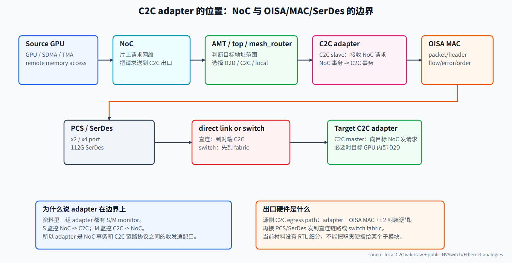
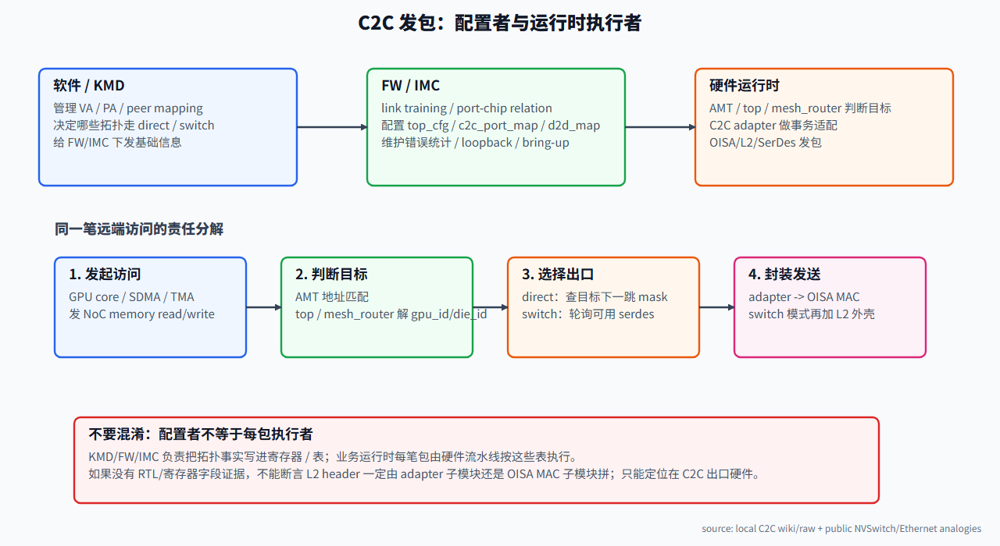

---
type: learning-guide
title: "C2C transaction routing 与 OISA/L2 封装"
created: 2026-06-08
updated: 2026-06-08
tags:
  - fw
  - interconnect
  - c2c
  - oisa
  - portmap
  - switch
status: active
source:
  - "C:\\home\\for_ai\\wiki\\fw\\interconnect\\c2c-dingtalk-study.md"
  - "C:\\home\\for_ai\\wiki\\fw\\interconnect\\portmap-routing-table.md"
  - "C:\\home\\for_ai\\.raw\\dingtalk\\c2c\\raw\\10.5-topo-discovery-port-mapping-configuration.md"
  - "C:\\home\\for_ai\\.raw\\dingtalk\\c2c\\raw\\10.6-c2c-ras和testable.md"
  - "C:\\home\\for_ai\\.raw\\dingtalk\\c2c\\raw\\10.8-C2C-自定义L2报文调研分析.md"
  - "NVIDIA IMEX / NVLink Networks overview: https://docs.nvidia.com/multi-node-nvlink-systems/imex-guide/overview.html"
  - "NVIDIA NVSwitch technical blog: https://developer.nvidia.com/blog/nvswitch-accelerates-nvidia-dgx2/"
  - "IBM Ethernet frame format: https://www.ibm.com/docs/en/i/7.5.0?topic=support-ethernet-frame-format"
related:
  - "[[wiki/fw/interconnect/c2c-dingtalk-study|C2C 互联学习文档]]"
  - "[[wiki/fw/interconnect/portmap-routing-table|C2C portmap 路由表数字推导]]"
---

# C2C transaction routing 与 OISA/L2 封装

> Source boundary：本页把已有 C2C wiki、portmap draw.io 整理页、10.5/10.6/10.8 原始迁移稿作为项目内证据。NVIDIA NVSwitch 与 Ethernet frame 资料只作为公开产品类比，用来解释“控制面配置路由、硬件运行时转发”和“L2 frame 外壳”的通用思想，不代表本项目 RTL 细节。

## 1. 一句话理解

GPU 上层永远发起的是 **memory transaction**；C2C 出口硬件把它变成跨 die / 跨 chip 可传输的 C2C/OISA 事务；如果走 switch/fabric，还要在出口侧套一层 switch 能识别和转发的 C2C L2 外壳。

这句话里最容易混的是“谁做”：KMD/FW/IMC 负责发现拓扑和写表，运行时每一笔请求由硬件按表查目标、选出口、封装并发出。



> 图解源文件：[`c2c-runtime-pipeline.svg`](../../../_attachments/fw/interconnect/c2c/transaction-routing/c2c-runtime-pipeline.svg)。

## 2. 这条流水线每一层做什么

```text
发起 memory transaction
  -> NoC
  -> AMT / top / mesh_router 判断目标
  -> 查 c2c_port_map / d2d_map / switch 模式配置
  -> 选择 C2C adapter / serdes port
  -> C2C adapter + OISA MAC 封装并发出
```

### 2.1 GPU / SDMA / TMA：只发起内存事务

这里的“GPU 上层”可以是 shader/load-store 单元，也可以是 SDMA/TMA 这类 copy engine。它们看到的是地址和访问语义：read、write、copy、atomic 或类似事务。

它们不应该关心：

- 当前是 direct-connect 还是 switch；
- 第一跳从哪个 SerDes port 出去；
- OISA header 如何编码；
- C2C L2 的 DA/SA/EthType 怎么填。

它们只需要发起一笔目标地址上的 memory transaction。这个目标地址如果是 peer mapping 出来的远端地址，后级地址/路由逻辑会把它导向 C2C 出口。

### 2.2 NoC：片上请求网络

NoC 是片上互联。它负责把本地 GPU/SDMA/TMA 发出来的请求送到片上目标：本地 memory、cache、MMU/AMT、C2C adapter、D2D adapter 或其他 top-level block。

从 C2C 视角看，NoC 还不知道“外面的 switch 如何转发”。它只是把一笔本地片上请求送到能处理该地址范围的出口逻辑。

### 2.3 AMT：地址到远端目标/出口的判断点

AMT 可以按“Address Mapping / Address Match / Address Translation”理解。已有 wiki 中已经把 AMT 定义为 C2C 地址路由关键单元：根据 global memory address 判断目标 GPU 或 memory range，再查 route table 选择 C2C 出口。

AMT 的职责不是发包，而是回答：

- 这个地址是不是本地 memory？
- 如果不是本地，是同 GPU 跨 die 的 D2D，还是跨 GPU 的 C2C？
- 目标 GPU/die/range 是谁？
- 对应 route / portmap 应该走哪类出口？

当前材料没有给 AMT 表项的完整寄存器格式，所以这里不能把字段位宽讲死。可以确定的是：它必须把地址判断结果交给 top / mesh_router / C2C routing 逻辑，最后落到 D2D/C2C/switch 的出口选择。

### 2.4 top / mesh_router：把系统级拓扑配置变成硬件可查的路由规则

`top` 可以理解为 SoC 或 CP 顶层控制/寄存器区域；`mesh_router` 是 CP 中负责 mesh/routing 控制的一块硬件逻辑或寄存器控制域。

MAS 摘录里有一条直接证据：IMC 启动流程后，需要按需求初始化 `top_cfg` 寄存器、`c2c_port_map0~7`、`d2d_map`；其中 `top_cfg` 是 CP 中 `mesh_router` 的控制寄存器，`c2c_port_map0~7` 和 `d2d_map` 在 CP top 寄存器中。

所以 top / mesh_router 的定位是：

- 接收 FW/IMC 写入的拓扑/模式/路由配置；
- 在运行时根据 AMT/目标 ID 判断该查 C2C 表还是 D2D 表；
- 对 direct 模式输出静态下一跳 port mask；
- 对 switch 模式启用跨 GPU 硬件轮询可用 SerDes port 的路径；
- 对同 GPU 跨 die 继续使用 `d2d_map`。

### 2.5 c2c_port_map / d2d_map / switch 模式配置

这三者不是同一层语义。

| 配置 | 用途 | 典型问题 |
|---|---|---|
| `c2c_port_map0~7` | 跨 GPU C2C 出口选择 | 去目标 GPU，第一跳从哪个 C2C/SerDes port 出去 |
| `d2d_map` | 同 GPU 内跨 die 出口选择 | 目标 die 在同卡/同 GPU 内，走哪个 UCIe/D2D port |
| switch 模式配置 | 跨 GPU 进入 switch/fabric | 源端硬件轮询哪个可用 SerDes port，L2 字段如何让 switch 转发 |

在 direct 模式里，C2C 表项更像静态下一跳。已有 portmap wiki 明确说：C2C 表项回答“去目标 GPU，第一跳从哪个出口出去”。

在 switch 模式里，已有 portmap wiki 写得很直接：跨 GPU 访问由硬件轮询选择 SerDes port 进行传输；同 GPU 跨 die 仍查 `d2d port map`。当前材料没有给出轮询算法是 round-robin、固定优先级还是 credit-based，因此不能展开成寄存器级结论。

### 2.6 选择 C2C adapter / SerDes port

`adapter` 是 NoC 与 C2C 链路之间的边界口。10.6 RAS/testable 资料里说，三组 adapter 都有 S/M monitor：S0/M0、S1/M1、S2/M2。并且从 NoC 来的请求，C2C 是 slave；到 NoC 去的请求，C2C 是 master。

因此在源 GPU 上：

```text
NoC request -> C2C slave side of adapter -> OISA/MAC/SerDes
```

在目标 GPU 上：

```text
SerDes/OISA/MAC -> C2C master side of adapter -> target NoC
```

port 选择和 adapter 选择有关。10.6 原始资料还提到：bit2/3/4 可用于选择 C2C 的 3 个 port 之一发送数据；x2 port 场景下每个 adapter 包含 2 个 x2 port，配置 portmap 后可以限制数据从哪个 port 发出。

### 2.7 C2C adapter：NoC 事务到 C2C 事务的适配口

C2C adapter 做的事情可以这样理解：

- 接收 NoC/AXI 风格的 request；

这里说的 `NoC/AXI 风格` 不是把 AXI 当成 SerDes 线缆协议，而是指片上 memory transaction 的地址、数据、ID、burst、响应和 atomic 语义；AXI5 背景见 [AXI5 协议详解与 C2C 中 AXI 的作用](<./axi5-protocol-and-c2c-role.md>)。
- 保存或转换 source/target、read/write、response、ordering、error 等事务语义；
- 和 OISA MAC 对接，把片上事务变成跨 chip/die 能传的 packet；
- 在目标侧把 C2C packet 还原成能注入目标 NoC 的 request/response。

当前资料能确认 adapter 位于 `adapter + OISA MAC + PCS + 112G SerDes` 链路的最前面，但没有给到 adapter 内部 RTL 子模块。因此不要把“L2 header 一定在 adapter 的某个子模块拼”讲死。

### 2.8 OISA MAC：C2C 内部互联语义

OISA 可以先理解为协议/链路适配层：把上层 NoC 或自定义事务整理成适合跨 chip/die 传输的报文和流控语义。

已有 C2C wiki 建议读 OISA 时关注：

- packet/header 是否携带 source/target；
- VC、QoS、ordering、error 等是否在 header 或旁带语义中表达；
- 和 NoC 的边界在哪里；
- link fault、retry、CRC/ECC、RAS 统计由哪一层负责；
- 自定义 L2 报文是否经过 switch，以及 switch 会不会修改、学习或丢弃相关字段。

这些是学习方向，不是当前项目已确认字段表。当前材料还缺 OISA 逐字段定义。

### 2.9 switch 模式下的 C2C L2 外壳

OISA 更像内部 C2C 事务语义；C2C L2 更像走 switch/fabric 时的外部承载格式。

10.8 原始资料说明：为了适配不同 vendor 交换机，需要调研 C2C L2 和交换机行为。标准 L2 至少有 DA、SA、EthType、Payload、FCS；C2C 自定义 L2 报文里提到 `EthType=0x8110`，并对 DA/SA 做了改造。

所以 switch 模式不是“GPU 发普通以太网包”。更准确是：

```text
OISA/C2C 事务语义
  -> C2C L2 encapsulation
  -> switch 可识别的 DA / SA / EthType / VLAN / 私有 ID 字段
  -> switch/fabric 转发
```

## 3. “出口硬件”到底是什么

这里的“出口硬件”不是一个已知 RTL 模块名，而是一段 C2C egress datapath：

```text
C2C adapter
  -> OISA MAC
  -> C2C L2 encapsulation logic（switch 模式）
  -> PCS
  -> MSS / 112G SerDes
```

如果是直连，出口硬件重点是按 portmap 选中某个 C2C/SerDes port，并把 OISA/C2C packet 发到对端。

如果是 switch，出口硬件还要保证发出的包能被 switch 接受和转发：DA/SA/EthType、VLAN、私有 ID 字段、FCS/校验、回包路径都要符合设计。



> 图解源文件：[`c2c-adapter-position.svg`](../../../_attachments/fw/interconnect/c2c/transaction-routing/c2c-adapter-position.svg)。

结构图层面的进一步拆解见 [C2C 子系统结构图拆解](<./c2c-macphy-wrapper-subsystem.md>)：它把这里的 `C2C adapter -> OISA/MAC/PCS -> MSS/112G SerDes` 展开成 `Adapter0/1/2 -> LLRMAC/RlmMac/PCS/FEC/RlmHSX8 -> Hss112GX4Wrapper/CSR/SRAM/APB`。

## 4. 配置者和运行时执行者不要混在一起



> 图解源文件：[`c2c-responsibility-split.svg`](../../../_attachments/fw/interconnect/c2c/transaction-routing/c2c-responsibility-split.svg)。

| 层级 | 负责什么 | 是否每包参与 |
|---|---|---|
| KMD / driver | peer mapping、GPU/chip ID、topology 选择、direct/switch 策略 | 不参与每包 |
| FW / IMC | link training、port-chip relation、写 top_cfg/c2c_port_map/d2d_map、错误统计 | 不参与每包 |
| AMT / top / mesh_router | 根据地址和目标 ID 选择 local/D2D/C2C/switch 路由 | 每包硬件执行 |
| C2C adapter | NoC 事务和 C2C 事务之间适配 | 每包硬件执行 |
| OISA MAC | C2C 内部 packet、流控、错误/顺序语义 | 每包硬件执行 |
| C2C L2 封装逻辑 | switch 模式下生成 switch 可转发外壳 | 每包硬件执行 |
| PCS / SerDes | 编码、lane、物理传输 | 每包/每 flit 硬件执行 |
| switch/fabric | 根据 L2/私有 ID/MAC/VLAN 转发 | 每包硬件执行 |

公开产品类比也支持这个分层思路。NVIDIA NVLink Networks 文档里，NVLSM 负责配置 NVSwitch routing tables，FM 处理 GPU-side routing 和 NVLink 配置；运行时由 GPU/NVSwitch fabric 执行转发。这个类比说明：控制面配置路由，数据面硬件转发，是高速互联常见架构。

## 5. 直连模式发包例子

假设 GPU0D0 访问 GPU5D0 的 peer memory：

```text
1. GPU/SDMA/TMA 发出 dst peer VA 的 memory write/read
2. NoC 把请求送到 AMT/top/mesh_router
3. AMT 识别目标不是本地 memory，而是跨 GPU C2C
4. direct 模式下查 c2c_port_map：目标 GPU5 -> 第一跳 serdes port mask
5. 选择对应 C2C adapter / port
6. adapter + OISA MAC 封装成 C2C/OISA packet
7. PCS/SerDes 通过直连链路送到对端 GPU
8. 对端 C2C adapter 作为 master 把请求注入目标 NoC
```

关键：直连模式下，源端 route 表项要回答“去 GPU5 第一跳从哪里出去”。

## 6. switch 模式发包例子

假设 GPU0D0 访问 GPU5D1：

```text
1. GPU/SDMA/TMA 发出 dst peer VA 的 memory write/read
2. NoC -> AMT/top/mesh_router
3. AMT 识别为跨 GPU C2C
4. switch 模式下，源端硬件轮询选择可用 serdes port
5. C2C adapter/OISA 保留 GPU memory transaction 语义
6. C2C L2 封装逻辑添加 switch 可转发外壳
7. SerDes 发往 switch/fabric
8. switch 按 DA/SA/EthType/VLAN/私有 ID 转发到目标 GPU
9. 目标 GPU 入口 C2C adapter 接收
10. 如果入口 die 不是目标 die，目标 GPU 内部再查 d2d_map 转到 D1
```

关键：switch 模式不是“不查任何表”，而是不再像直连那样为每个跨 GPU 目标配置复杂静态下一跳；跨 GPU 出口由硬件轮询可用 SerDes，GPU 内部跨 die 仍要查 D2D 表。

## 7. 如何判断目标：AMT / top / mesh_router 的协作模型

当前没有完整寄存器表，所以这里用工程模型解释。

```text
输入：NoC request address + requester/source 信息

AMT:
  判断地址是否命中远端 peer memory window
  解析或匹配出 target GPU / die / memory range

top / mesh_router:
  读取 top_cfg 中的当前 topo/mode
  根据 target GPU / die 判断 local / D2D / C2C
  direct 模式：查 c2c_port_map 得到第一跳 bitmask
  switch 模式：启用跨 GPU serdes port 轮询规则
  同 GPU 跨 die：查 d2d_map 得到 UCIe/D2D 出口
```

这里的 `GPU/SDMA/TMA` 只是发起请求的 requester；它不是 AMT/top/mesh_router 的一部分。更准确的展开是：

```text
GPU/SDMA/TMA 发出请求
  -> NoC 携带地址和 requester 信息
  -> AMT / top / mesh_router 用地址和配置判断目标
```

## 8. 回答你的三个关键问题

### 8.1 这一步是谁做：根据拓扑模式、portmap、目标 ID 做封装和出口选择？

配置阶段：

- KMD/FW/IMC 做 topology discovery；
- KMD/FW/IMC 写 `top_cfg`、`c2c_port_map0~7`、`d2d_map` 等寄存器或表；
- switch 场景还要保证 switch 侧 MAC/VLAN/转发规则匹配。

运行时：

- AMT/top/mesh_router 判断目标并选择路径；
- C2C adapter/OISA MAC 执行事务适配和封装；
- PCS/SerDes 执行链路发送。

### 8.2 OISA 语义要不要套 L2 外壳，这一步是谁做？

是否需要 L2 外壳由拓扑模式决定：直连通常不需要给外部 switch 看 DA/SA/EthType；switch 模式需要。

每包执行者是 C2C 出口硬件。更保守地说，是 `C2C adapter + OISA MAC + C2C L2 encapsulation logic` 这段 egress path。当前材料没有 RTL 子模块名，不能断言一定由 adapter 还是 OISA MAC 内某个 block 完成。

### 8.3 C2C adapter 在哪？

在 `NoC/AMT/top/mesh_router` 和 `OISA MAC/PCS/SerDes` 之间。源端是 C2C slave 方向，接收 NoC 请求；目标端是 C2C master 方向，向目标 NoC 发请求。

## 9. 调试检查清单

| 问题 | 先查什么 |
|---|---|
| 远端访问完全不通 | peer mapping、AMT 地址窗口、target GPU/die ID |
| 走错端口 | `c2c_port_map`、`d2d_map`、x2/x4 port 编码 |
| direct 正常但 switch 不通 | C2C L2 DA/SA/EthType、VLAN、MAC 表、switch 是否丢包/误学习 |
| switch 模式目标 GPU 到了但目标 die 不对 | 目标 GPU 内部 `d2d_map` |
| 只有某个 adapter 失败 | S0/M0、S1/M1、S2/M2 monitor，adapter loopback，端口错误计数 |
| 回包丢失或 hang | OISA/C2C ordering、flow control、error/retry、回包路径 |

## 10. 速记

```text
GPU 上层：发 memory transaction
NoC：把请求送到地址对应的片上出口
AMT：判断地址命中哪个目标 GPU/die/range
top/mesh_router：按 top_cfg + portmap 选择 local / D2D / C2C / switch
C2C adapter：NoC 事务和 C2C 事务的边界适配
OISA MAC：保留 C2C 内部事务语义、流控、错误和顺序
C2C L2：switch 模式下的外部转发外壳
PCS/SerDes：真正把 bit/lane 发出去
```
`;
