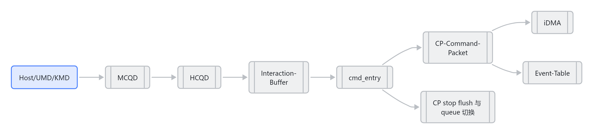

---
type: synthesis
title: "GraceC CP MAS v1.4 code knowledge map"
created: 2026-05-09
updated: 2026-05-09
tags: [synthesis, cp, mas, code-map]
status: active
source:
  - "[[GraceC CP MAS v1.4]]"
  - "[[fw CP user firmware code summary]]"
---

# GraceC CP MAS v1.4 code knowledge map

> 这是 [[GraceC CP MAS v1.4]] 与 fw CP user firmware 的综合知识图谱入口。

## 总览

MAS 描述的是 CP 的硬件/固件协同协议：[[HCQD]] 负责 fetch command packet，[[CP-Firmware-CPE]] 中的 [[cmd_entry]] 是 hot-loop，负责判断 packet 应该进入 [[iDMA]] fast path，还是走 event/wait_host/stop/flush 等 firmware path。

## 结构图

> 图解源文件：[`01-结构图-graph.mmd`](../../../_attachments/fw/source-maps/GraceC CP MAS v1.4 code knowledge map/whiteboard-mermaid/01-结构图-graph.mmd)。由 lark-whiteboard `whiteboard-cli` 从原 Mermaid 渲染。

## MAS 与代码映射

| MAS 概念 | 代码入口 | 说明 |
|---|---|---|
| HCQD candidate ready | `ib_get_candidate_bitmask()` | 从 MMIO 读取 8 个 HCQD ready bit |
| firmware 读 rb_fifo | `ib_peek_packet()` / `ib_read_packet()` | peek 只观察，read 会切换 use_idma |
| job/sdma 分发 | `cmd_dispatch_handle_job_sdma_packet()` + `idma_dispatch_packet()` | 主要走 direct iDMA |
| event 处理 | `cmd_handle_event_packet()` + `event_entry.c` | dependency 不满足会 pending |
| atomic retry/OSD | `cmd_handle_atomic_packet()` | cmp_swap consume 时机特殊 |
| wait_host | `cmd_handle_wait_host_trig()` / `cmd_handle_wait_host_poll()` | trigger CPU 后继续 polling |
| queue stop | `sf_stop_isr()` + `sf_handle_stop()` | drop IB resident packets 并返回 stopped ack |
| process flush | `sf_flush_isr()` + `sf_handle_flush()` | context bitmap + per-context HCQD bitmap |
| block_mask | `cmd_check_block_mask_osd()` | 等待 cls/sdma/ato OSD 资源空闲 |

## 性能观察

- [[cmd_entry]] 使用 active mask + CTZ 选择 HCQD，避免固定扫描 8 个 HCQD 的 miss iteration。
- candidate cache 能减少反复 MMIO 读取，对 hot loop 有价值。
- 手写 goto 布局可以把 pending/stop 的少数执行路径放到 taken branch，减少 if body 被默认预取后又丢弃的情况。
- event/wait_host/atomic pending 会通过 `pending_mask` 阻止后续 candidate 继续处理，属于 firmware 热路径中的重点延迟来源。

## 风险清单

- `sf.c` 中 atomic stopped_on_loop / ato_osd_dec 的处理需要重点复核；如果和 MAS queue stop 的 atomic cmpswap 失败语义不一致，可能造成 OSD 或 packet 状态错误。
- `cmd_check_block_mask_osd()` 中 video bit 仍有 TODO；如果 MAS 中 VPU job 已经启用，需要补齐对应 OSD 检查。
- 当前 Understand 图谱偏函数/文件级，硬件寄存器位域关系仍需要结合 MAS 和 ctags/clang 继续扩展。

## 延伸

- [[GraceC-CP]]
- [[CP command processing flow]]
- [[CP stop flush 与 queue 切换]]
- [[CP event atomic wait host handling]]
- [[cmd_entry]]
