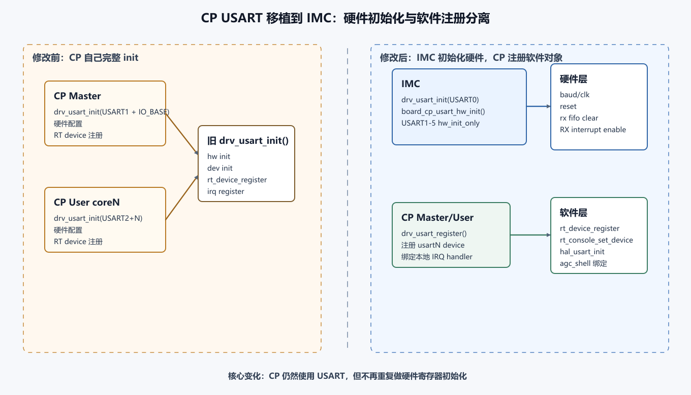
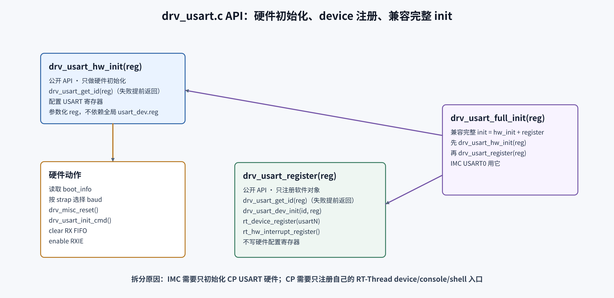
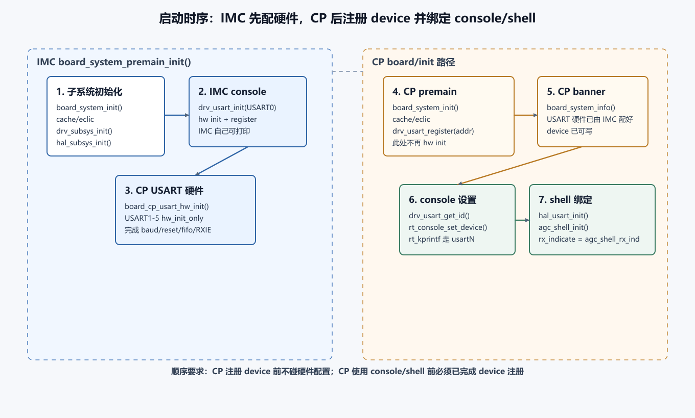

# CP USART 与 Core Clock 解耦 IMC 统一初始化 — 设计评审 + 实现详解

> 面向评审人。本页描述 `zss/MoveUsart` 分支当前未提交 diff（基于 HEAD `944c37c`）的设计意图、改动清单、设计权衡、兼容性、风险，以及逐函数实现详解，供 code review 使用。
> 本页由原 "USART 移植讲解" 与 "设计评审" 两篇合并而成：**Part A（§1–§8）是设计评审**，聚焦"为什么这样设计 + 评审要点"；**Part B（§9–§14）是实现详解**，逐函数讲解 USART 拆分、地址映射、启动串联与调试顺序。
> 分工（CLI 三页）: 本页只讲 **MoveUsart 分支的 IMC 统一初始化实现 + 设计评审 + 风险**。USART 三层拆分（HAL/drv/device）、console、shell 输入的完整链路基础见 [Grace USART、RT-Thread console 与 agc_shell 完整链路](<./grace-usart-console-cli.md>)（canonical 总图）；shell 输入路径与卡顿见 [agc_shell CLI 输入输出路径](<./agc_shell-cli-path.md>)。

---

# Part A — 设计评审

## 1. 变更概述（TL;DR）

本次改动做了两件相互独立、但都源于"CP core 不应重复触碰平台级资源"这一原则的事情：

1. **USART 硬件初始化集中到 IMC。** CP Master / CP User 不再做 USART 寄存器初始化，只注册各自的 RT-Thread `usartN` device；USART1..5 的硬件配置由 IMC 在启动阶段统一完成。
2. **Core clock 获取改为按 core 类型分流。** 新增 `drv_clk_get_core_clock()`：IMC 仍从 loader `boot_info->system_core_clock` 取权威值；CP core 无法访问 loader boot_info，改为从 IMC clock-select 寄存器推导频率。

> 注：工作树里 `test/SConscript` 注释掉 `test_case` 编译的改动**仅为本地调试，不随本次提交合入**，因此不属于本评审范围，下文不再讨论。

本次评审涉及 8 个源文件。无新增对外 API 行为变化，`drv_usart_init()` 旧语义保留。

## 2. 改动动机

| 问题 | 现状（改前） | 后果 |
|---|---|---|
| USART 硬件被多核重复初始化 | CP Master、CP User 各自调用 `drv_usart_init()` 做 reset/baud/FIFO/IE 配置 | 同一组 USART 硬件被多个 core 重复 reset/配置，硬件 owner 不清晰，时序上可能互相踩 |
| CP core 读取 core clock 的路径不可达 | `board_system_info()` / `systimer_systick_init()` 直接读 `drv_misc_get_boot_info(0)->system_core_clock` | CP core 访问不到 loader 写的 boot_info，频率值不可靠，影响 banner 显示与 systick tick cycle |

核心设计原则：**硬件配置 owner（IMC）与软件使用 owner（各 CP core 的 RT-Thread）分离**。平台级资源（USART 寄存器、core clock 真值）归 IMC；各 core 只持有自己 RT-Thread 命名空间内的软件对象（device / console / shell / systick）。

## 3. 改动清单

### 3.1 USART 初始化拆分（drivers/usart/drv_usart.c, hal_drv_usart.h）

把原 `drv_usart_init()` 拆成三层，职责单一：

| 函数 | 职责 | 调用者 |
|---|---|---|
| `drv_usart_hw_config(id, reg)`（private，由 `drv_usart_hw_init` 改名而来） | 只写硬件寄存器：reset、baud、FIFO、RX IE；**参数化 `reg`，不再依赖全局 `usart_dev.reg`** | 内部 |
| `drv_usart_hw_init_only(reg)`（新增 public） | `get_id` → `hw_config`，只碰硬件，不注册 device | IMC |
| `drv_usart_register(reg)`（新增 public） | 只注册 RT-Thread device / mutex / IRQ，不碰硬件寄存器 | CP Master / User |
| `drv_usart_init(reg)`（语义保留） | `hw_init_only` + `register` 的组合，等价旧行为 | IMC 自己的 USART0 |

> 评审要点：`drv_usart_hw_config` 现在接收显式 `reg` 指针，消除了对全局 `usart_dev.reg` 的隐式依赖——这是支持 IMC 一次初始化 5 个不同 base 的前提。`drv_usart_hw_init_only` 与 `drv_usart_register` 都新增了 `drv_usart_get_id()` 返回值检查并提前返回。

### 3.2 IMC 统一初始化 USART1..5（board/imc/src/board.c）

新增 helper 并在 premain 调用：

```c
static void board_cp_usart_hw_init(void)
{
    drv_usart_hw_init_only((void *)USART1_BASE);
    drv_usart_hw_init_only((void *)USART2_BASE);
    drv_usart_hw_init_only((void *)USART3_BASE);
    drv_usart_hw_init_only((void *)USART4_BASE);
    drv_usart_hw_init_only((void *)USART5_BASE);
}
```

`board_system_premain_init()` 中在 IMC 自己的 `drv_usart_init(USART_DEVICE_ADDR)`（USART0）之后追加 `board_cp_usart_hw_init()`。语义：IMC 先有自己的 console，再统一初始化 CP 用的 USART 硬件。

### 3.3 CP Master / CP User 改为只注册（board/cp_*/src/board.c）

```c
-    /* configure USART */
-    drv_usart_init((void*) USART_DEVICE_ADDR);
+    /* register USART device; hardware is initialized by IMC */
+    drv_usart_register((void*) USART_DEVICE_ADDR);
```

同时 `board_system_info()` 删除了不再使用的 `boot_info` / `reg` 局部变量，CPU 频率打印改走 `drv_clk_get_core_clock()`（见 3.4）。

### 3.4 Core clock 按 core 类型分流（drivers/clk/drv_clk.c/.h, board/lib/sys_timer.c）

新增 `drv_clk_get_core_clock()`：

```c
rt_uint32_t drv_clk_get_core_clock(void)
{
#ifdef FW_IMC
    /* IMC 可达 loader boot_info，使用权威 core clock */
    return drv_misc_get_boot_info(0)->system_core_clock;
#else
    /* CP core 不可达 loader boot_info，从 IMC clock-select 寄存器推导 */
    return drv_clk_get_core_is_600m_clk() ? IMC_CORE_CLK : (REF_CLK / 2);
#endif
}
```

- `IMC_CORE_CLK = 600MHz`，`REF_CLK = 50MHz`（`board_cfg.h`），故 CP 非 600M 档推导为 25MHz。
- `FW_IMC` 由 IMC 构建脚本定义（`board/imc/build_script/rtconfig.py: -DFW_IMC`），保证分流在编译期完成、无运行时开销。
- `drv_clk_get_core_is_600m_clk()` 原来被 `#ifdef FW_BACKDOOR` 包裹，现去掉该 guard，使非 backdoor 构建也能编译此函数（CP 推导路径依赖它）。
- 调用点替换：`board_system_info()`（master/user）与 `systimer_systick_init()` 由直接读 boot_info 改为调 `drv_clk_get_core_clock()`。头文件导出 `drv_clk_get_core_is_600m_clk()` 与 `drv_clk_get_core_clock()`。

## 4. 设计权衡与备选方案

| 决策点 | 选择 | 备选 | 取舍理由 |
|---|---|---|---|
| USART 硬件初始化 owner | IMC 集中初始化 | 各 CP core 自行初始化（现状） | 硬件 owner 唯一化，避免多核重复 reset/配置；代价是 IMC 与 CP 的启动时序产生隐式依赖（IMC 必须先于 CP 用到 USART） |
| driver API 形态 | 拆 `hw_init_only` / `register`，保留 `drv_usart_init` | 给 `drv_usart_init` 加 flag 参数 | 拆分后职责单一、调用点意图自解释；旧调用方零改动 |
| CP core clock 来源 | 编译期 `FW_IMC` 分流 + 寄存器推导 | 运行时判断 core 类型 | 编译期分流无运行时开销，且 CP 路径根本不链接 boot_info；缺点是推导只覆盖 600M / REF/2 两档（见风险 R3） |

## 5. 兼容性

- **`drv_usart_init()` 行为不变**：仍是"硬件初始化 + device 注册"，IMC USART0 与任何旧调用方继续可用。
- **`drv_usart_get_id()` 地址 mask 不变**：IMC 物理 base 与 CP IO-window 地址（`+ MEMORY_MAP_IO_BASE`）经 `USART_ADDR_MASK` 归一到同一 id，兼容两种地址视角。
- **console / agc_shell 链路不变**：CP 仍调 `drv_usart_register()` 创建本地 `usartN` device，`rt_console_set_device()` / `agc_shell_set_device()` 依旧能找到 device 并挂 RX callback。

## 6. 风险与评审重点

| # | 风险 | 说明 | 建议 |
|---|---|---|---|
| R1 | 启动时序耦合 | IMC 必须在任何 CP 使用 USART 前完成 `board_cp_usart_hw_init()`。若 boot 流程变更导致 CP 先跑，CP 会拿到未初始化的 USART | 评审确认 IMC premain 早于 CP premain 的全局 boot 顺序保证 |
| R2 | 返回值被忽略 | `board_cp_usart_hw_init()` 忽略 `drv_usart_hw_init_only()` 返回值；CP 侧 `drv_usart_register()` 返回值也未检查 | 建议至少在失败时打印 USART id，避免问题延迟到 CLI 才暴露 |
| R3 | clock 推导仅两档 | CP 推导只区分 `IMC_CORE_CLK`(600M) 与 `REF_CLK/2`(25M)；若实际存在其它频点，banner 与 systick tick cycle 会偏差 | 评审确认硬件上 CP core clock 确实只有这两档；否则需补充推导表 |
| R4 | `FW_BACKDOOR` guard 移除 | `drv_clk_get_core_is_600m_clk()` 现无条件编译，会在所有构建读 `IMC_SYS_BASE + DRV_CLK_IMC_CLK_OFFSET` | 确认非 backdoor 构建下该寄存器可读且语义一致 |
| R5 | 全局 `usart_dev.reg` 残留 | `drv_usart_register()` 仍写 legacy 全局 `usart_dev.reg`，多 USART 注册时该全局只保留最后一次的值 | 新代码应走 `usart_device[id].reg` / RT device `user_data`，避免误用全局指针 |

## 7. 测试建议

1. **三类 firmware 构建**：分别构建 IMC / cp_master / cp_user，确认 `FW_IMC` 分流与 `drv_clk_get_core_clock()` 在两条路径都能编译链接。
2. **banner 频率核对**：上电后比对 IMC 与 CP banner 打印的 `CPU Frequency`，确认 CP 推导值与 IMC 权威值一致（同档位下）。
3. **CLI 冒烟**：IMC / CP Master / 4 个 CP User console 均可输入输出，验证 USART 由 IMC 初始化后 CP 的 RX 中断与 agc_shell 仍正常。
4. **systick**：确认 `systimer_set_tick_cycle()` 拿到的频率使 tick 周期正确（可用已知 delay 校时）。
5. **回归**：确认未走本次新路径的 IMC USART0（仍用 `drv_usart_init()`）行为无变化。

## 8. 评审 checklist

- [ ] IMC premain 早于所有 CP 使用 USART 的全局 boot 时序已确认（R1）
- [ ] CP core clock 实际频点确认仅 600M / REF/2 两档（R3）
- [ ] 非 backdoor 构建下 `drv_clk_get_core_is_600m_clk()` 读寄存器合法（R4）
- [ ] 是否接受 `board_cp_usart_hw_init()` / CP `drv_usart_register()` 忽略返回值（R2）
- [ ] 是否接受保留 legacy 全局 `usart_dev.reg`（R5）

---

# Part B — 实现详解

> Part B 逐函数解释 USART 拆分如何工作、地址如何映射、启动如何串联、console/agc_shell 为何继续可用、以及调试顺序。不证明板上实际波形或硬件 bring-up 结果。

## 9. 一句话理解

这次修改不是让 CP 不再使用 USART，而是把 **USART 硬件寄存器初始化** 统一放到 IMC，由 IMC 配好 `USART1..USART5`；CP Master/User 只在自己的 RT-Thread 里注册 `usartN` device、设置 console、绑定 agc_shell。

要把两个概念分开：

| 层级 | 现在由谁负责 | 作用 | 典型函数 |
|---|---|---|---|
| 硬件寄存器初始化 | IMC | baud、clock、reset、FIFO、RX interrupt enable | `drv_usart_hw_init_only()` / `drv_usart_hw_config()` |
| RT-Thread device 注册 | CP 自己 | 创建 `usartN` device，绑定 read/write/control 和 IRQ | `drv_usart_register()` |
| 兼容完整初始化 | 仍保留 | 用于 IMC 自己的 `USART0` 或旧调用路径 | `drv_usart_init()` |



> 图解源文件：[`cp-usart-old-new-overview.svg`](../../../../_attachments/fw/cli/cp-usart-imc-unified-init/cp-usart-old-new-overview.svg)。图中左侧是原来的 CP 完整初始化，右侧是现在的 IMC 硬件初始化 + CP 软件注册。

## 10. 地址映射：为什么 IMC 用 `USART1_BASE`，CP 用 `USART_DEVICE_ADDR`

核心原因是 **硬件配置 owner 和软件使用 owner 不一样**。从当前代码看，IMC 的 `USART_DEVICE_ADDR` 是 `USART0_BASE`，CP Master 的是 `USART1_BASE + MEMORY_MAP_IO_BASE`，CP User 是 `USART2_BASE + MEMORY_MAP_IO_BASE + USART_STRIDE * get_core_id()`。

硬件 base 来自 `board_cfg.h`：

| USART | base | 当前用途 |
|---|---:|---|
| USART0 | `0x02002000` | IMC console |
| USART1 | `0x02003000` | CP Master console |
| USART2 | `0x02026000` | CP User core0 console |
| USART3 | `0x02027000` | CP User core1 console |
| USART4 | `0x02028000` | CP User core2 console |
| USART5 | `0x02029000` | CP User core3 console |

各 firmware 的 `per_map.h` 选择不同地址：

| firmware | `USART_DEVICE_ADDR` | 解释 |
|---|---|---|
| IMC | `USART0_BASE` | IMC 直接访问物理地址。 |
| CP Master | `USART1_BASE + MEMORY_MAP_IO_BASE` | CP 通过 IO window 访问 USART1。 |
| CP User | `USART2_BASE + MEMORY_MAP_IO_BASE + USART_STRIDE * get_core_id()` | 4 个 CP User core 分别映射到 USART2..5。 |


> 图解源文件：[`cp-usart-address-map.svg`](../../../../_attachments/fw/cli/cp-usart-imc-unified-init/cp-usart-address-map.svg)。IMC 初始化硬件用物理 base；CP 注册 device 用 CP IO window 地址；`drv_usart_get_id()` 通过 mask 兼容两种地址。

关键函数 `drv_usart_get_id()` 把地址转换成 USART ID：

```c
rt_ubase_t base = ((rt_ubase_t) reg) & USART_ADDR_MASK;

switch (base)
{
case USART0_BASE: *id = USART_ID_0; break;
case USART1_BASE: *id = USART_ID_1; break;
case USART2_BASE: *id = USART_ID_2; break;
case USART3_BASE: *id = USART_ID_3; break;
case USART4_BASE: *id = USART_ID_4; break;
case USART5_BASE: *id = USART_ID_5; break;
default: return RT_ENOTSUPPORT;
}
```

mask 很关键。没有它，CP 传入 `USART1_BASE + 0x50000000` 后，switch 匹配不到 `USART1_BASE`，`usart1` device name、IRQ id、device 数组下标都会失败。

## 11. driver 函数拆分后，每个函数做什么



> 图解源文件：[`cp-usart-driver-split.svg`](../../../../_attachments/fw/cli/cp-usart-imc-unified-init/cp-usart-driver-split.svg)。`drv_usart_init()` 保留旧的完整语义；新代码分别调用 `drv_usart_hw_init_only()` 或 `drv_usart_register()`。

### `drv_usart_hw_config(id, reg)`

新拆出来的私有底层硬件配置函数，只操作 USART 寄存器，不注册 RT-Thread device：

- 从 `drv_misc_get_boot_info(0)` 读取 boot 信息。
- 根据 strap pin 选择 baud rate：`uart_baud ? 921600 : 115200`。
- 使用 `boot_info->system_core_clock` 设置 USART clock 参数。
- 通过 `drv_misc_reset(IMC_SYS_BASE + DRV_MISC_SUBM_RST_CTRL0, BIT(DRV_MISC_USART0_BIT_RST + id), DRV_MISC_RESET)` 做对应 USART reset。
- `drv_usart_init_cmd(reg, &usart_init_cfg)` 写 TX/RX enable、bit length、parity、baud div 等寄存器。
- `drv_usart_clr_rxfifo(reg)` 清 RX FIFO。
- 设置 RX watermark，并打开 `USART_INT_EN_RXIE`。

它需要真实的寄存器地址，所以 IMC 调 CP USART 硬件初始化时传 `USART1_BASE..USART5_BASE`。改名后参数化的 `reg` 让它不再依赖全局 `usart_dev.reg`，从而能被一次性套用到 5 个不同 base。

### `drv_usart_hw_init_only(reg)`

公开给 board 层的新接口，职责很窄：

1. `drv_usart_get_id(reg, &id)`，把 reg 转换成 USART ID（失败提前返回）。
2. `drv_usart_hw_config(id, (drv_usart_reg_t *)reg)`。
3. 不调用 `rt_device_register()`，不创建 mutex，不注册 IRQ handler。

IMC 的 `board_cp_usart_hw_init()` 正是用这个函数初始化 `USART1..5`，只碰硬件，不在 IMC 的 RT-Thread 里注册 CP 的 `usart1..5` device。

### `drv_usart_register(reg)`

CP Master/User 现在调用的新接口，只做软件注册，不写 USART 硬件配置寄存器：

- `usart_dev.reg = reg`：设置 legacy `usart_put_char()` / `usart_get_char()` 使用的寄存器指针。
- `drv_usart_get_id(reg, &id)`：解析出 `USART_ID_x`（失败提前返回）。
- `drv_usart_dev_init(id, reg)`：填充 `usart_device[id].dev` 的 `read/write/control/user_data/reg`。
- 拼出 mutex name `usart_lock{id}` 与 device name `usart{id}`。
- `rt_mutex_init()` 初始化 device lock。
- `rt_device_register()` 把 `usart{id}` 注册进 RT-Thread device system。
- `rt_hw_interrupt_register(USART0_IRQn + id, ..., usart_irq_entry[id])` 绑定本地 IRQ 入口。

这个函数仍必须由 CP 自己调用。IMC 不能替 CP 注册 CP RT-Thread 内部的 device 对象，因为每个 CPU/firmware 有自己的 RT-Thread object namespace、console 指针和 shell 线程。

### `drv_usart_init(reg)`

现在是兼容旧语义的组合函数：

```c
rt_int32_t drv_usart_init(void *reg)
{
    rt_err_t ret = drv_usart_hw_init_only(reg);
    if (ret != RT_EOK)
    {
        return ret;
    }

    return drv_usart_register(reg);
}
```

IMC 自己的 `USART0` 仍使用 `drv_usart_init(USART_DEVICE_ADDR)`，因为 IMC 对自己的 console 需要"硬件初始化 + RT-Thread device 注册"都在本 firmware 内完成。

### `drv_usart_dev_init(id, reg)`

本次 diff 未改，但它是 `drv_usart_register()` 能工作的基础。它填充 `usart_device[id]`：`dev.type = RT_Device_Class_Char`、`dev.read/write/control` 指向 driver 函数、`reg = reg`、`dev.user_data = &usart_device[id]`。上层看到的是字符设备；真正读写时通过 `user_data` 回到 USART register。

## 12. board 层启动流程如何串起来



> 图解源文件：[`cp-usart-boot-sequence.svg`](../../../../_attachments/fw/cli/cp-usart-imc-unified-init/cp-usart-boot-sequence.svg)。把 IMC premain、CP premain、console 设置和 shell 绑定分开。

### IMC 侧

`board/imc/src/board.c` 中 `board_system_premain_init()` 当前顺序：

1. `board_system_init()`：设置 IMC top cfg、backdoor/OISA/D2D 相关配置。
2. `cache_fence()`。
3. `eclic_init()`。
4. `drv_subsys_init()`。
5. `hal_subsys_init()`。
6. `drv_usart_init((void*)USART_DEVICE_ADDR)`：完整初始化 IMC 自己的 USART0。
7. `board_cp_usart_hw_init()`：初始化 CP Master/User 使用的 USART1..5 硬件。
8. `board_system_info()`：打印 IMC banner（频率走 `drv_clk_get_core_clock()`，IMC 分支读 boot_info）。

把 `board_cp_usart_hw_init()` 放在 IMC 自己 USART0 初始化之后，语义直接：IMC 自己先有 console，然后再初始化 CP 的 USART 硬件资源。

### CP Master/User 侧

CP Master/User 的 `board_system_premain_init()` 当前顺序：

1. `board_system_init()`。
2. `cache_fence()`。
3. `eclic_init()`。
4. `drv_usart_register((void*)USART_DEVICE_ADDR)`。
5. `board_system_info()`（频率走 `drv_clk_get_core_clock()`，CP 分支从寄存器推导）。
6. `trap_init()`。

CP 侧此时只创建 `usartN` device 和 IRQ handler，不再 reset/config USART，也不再直接读 boot_info 取频率。

### console 和 agc_shell 为什么还能工作

在 `rt_hw_board_init()` 中，CP/IMC 都会根据 `USART_DEVICE_ADDR` 算出 id，然后：

```c
drv_usart_get_id((void*)USART_DEVICE_ADDR, &id);
rt_sprintf(dev_name, "%s%u", USART_DEVICE_NAME, id);
rt_console_set_device(dev_name);
```

`rt_console_set_device()` 会 `rt_device_find(dev_name)` → `rt_device_open()`，把 `_console_device` 指向 `usartN` device，之后 `rt_kprintf()` 走该 device 的 write 路径。

agc_shell 输入绑定也依赖同一个 console device：

```c
console = rt_console_get_device();
dev = rt_device_find(console->parent.name);
rt_device_open(dev, RT_DEVICE_OFLAG_RDWR | RT_DEVICE_FLAG_INT_RX | RT_DEVICE_FLAG_STREAM);
rt_device_set_rx_indicate(dev, agc_shell_rx_ind);
```

所以这次修改不能把 CP 的 `drv_usart_register()` 删掉。硬件由 IMC 初始化，并不等于 CP 的 RT-Thread 已经存在 `usartN` device。

## 13. 函数职责速查表

| 函数 | 所在文件 | 当前职责 | 为什么需要 |
|---|---|---|---|
| `board_cp_usart_hw_init()` | `board/imc/src/board.c` | IMC 统一调用 `drv_usart_hw_init_only(USART1..5)`。 | 把 CP USART 的硬件配置集中到 IMC。 |
| `board_system_premain_init()` IMC | `board/imc/src/board.c` | 初始化 IMC 平台、IMC USART0、CP USART1..5。 | IMC 是硬件初始化 owner。 |
| `board_system_premain_init()` CP | `board/cp_*/src/board.c` | CP 只调用 `drv_usart_register(USART_DEVICE_ADDR)`。 | 保留本地 device/IRQ/console 对象，避免重复硬件 init。 |
| `drv_usart_hw_config()` | `drivers/usart/drv_usart.c` | 私有硬件寄存器配置函数（参数化 reg）。 | 让 hw init 可复用，并避免依赖全局 `usart_dev.reg`。 |
| `drv_usart_hw_init_only()` | `drivers/usart/drv_usart.c` | 公开的"只初始化硬件"接口。 | IMC 初始化 CP USART 硬件时需要这个粒度。 |
| `drv_usart_register()` | `drivers/usart/drv_usart.c` | 公开的"只注册 RT device/IRQ"接口。 | CP 使用 USART 仍需要本地 `usartN` device。 |
| `drv_usart_init()` | `drivers/usart/drv_usart.c` | 兼容完整 init：先硬件、再注册。 | IMC 自己 USART0 仍适合用旧语义。 |
| `drv_usart_get_id()` | `drivers/usart/drv_usart.c` | 地址转 USART ID，mask 掉 CP IO window 高位。 | 同时兼容 IMC 物理地址和 CP window 地址。 |
| `drv_clk_get_core_clock()` | `drivers/clk/drv_clk.c` | 按 `FW_IMC` 分流取 core clock。 | IMC 读 boot_info，CP 从寄存器推导。 |
| `drv_clk_get_core_is_600m_clk()` | `drivers/clk/drv_clk.c` | 读 IMC clock-select bit。 | CP 推导频率的依据。 |
| `hal_usart_init()` | `hal/usart/hal_usart.c` | 根据 `usartN` 名字查找 RT device。 | HAL 层后续 control/read/write 要依赖 device。 |
| `rt_console_set_device()` | `rtthread/src/kservice.c` | 把 `_console_device` 指向 `usartN`。 | `rt_kprintf()` 输出路径需要 console device。 |
| `agc_shell_set_device()` | `test/framework/shell/agc_shell.c` | 从 console 获取 device，打开 INT_RX 并设置 RX callback。 | CLI 输入中断要进入 shell ringbuffer。 |

## 14. 检查和调试顺序

如果移植后 CP CLI 不能用，按这个顺序查：

1. IMC 是否跑到 `board_cp_usart_hw_init()`，且 USART1..5 都返回 `RT_EOK`（当前代码未检查返回值，见 R2）。
2. CP `drv_usart_register(USART_DEVICE_ADDR)` 是否成功注册 `usart1` 或 `usart2..5`。
3. `drv_usart_get_id(USART_DEVICE_ADDR, &id)` 是否返回期望 id（CP 地址必须能被 `USART_ADDR_MASK` 正确屏蔽）。
4. `rt_console_set_device("usartN")` 是否能找到 device。
5. `hal_usart_init()` 是否能 `rt_device_find(dev_name)`。
6. `agc_shell_set_device()` 是否能通过 `rt_console_get_device()` 找到同一个 device，并成功设置 `rx_indicate`。
7. RX interrupt 到来时，`drv_usart_irq_handler()` 是否调用 `pdev->dev.rx_indicate(&pdev->dev, 1)`。
8. 若 banner 频率不对，检查 `drv_clk_get_core_clock()`：IMC 看 boot_info，CP 看 `drv_clk_get_core_is_600m_clk()` 读到的 clock-select bit。
