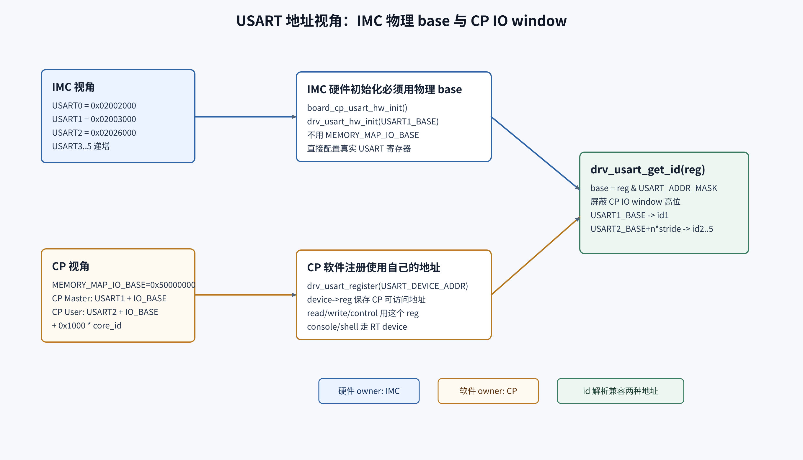
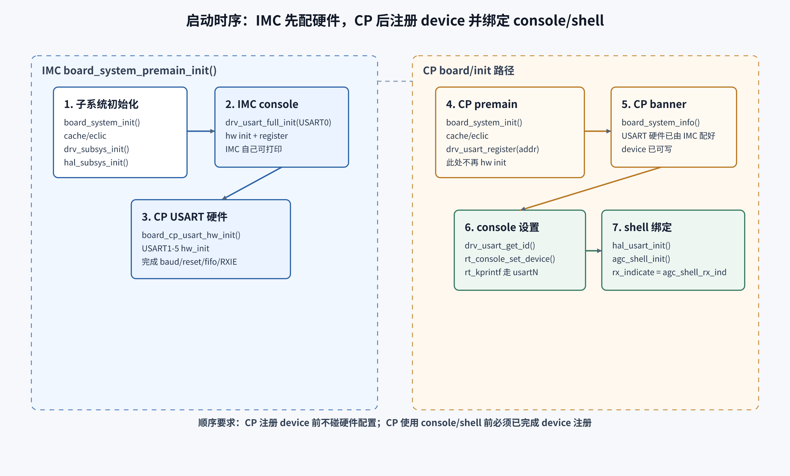
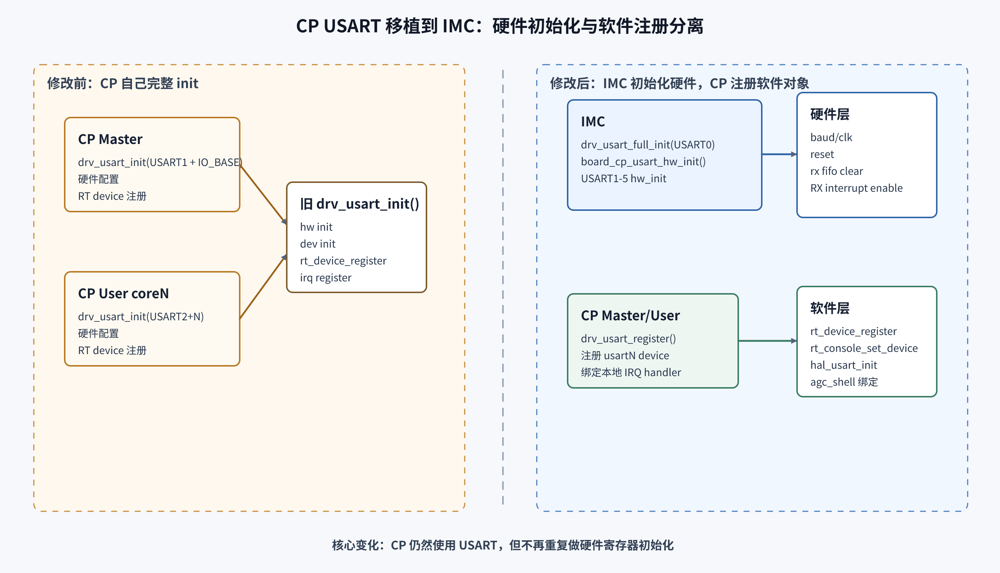

# CP USART 与 Core Clock 解耦 IMC 统一初始化 — 设计文档

> 面向评审人的设计文档。描述 `zss/MoveUsart` 分支这次改动的设计意图、职责分层、地址/启动时序、设计权衡、兼容性与风险。
> 本次改动已合入为 commit **`d18bc36`**（早期版本基于未提交 diff，HEAD `944c37c`；现已提交，函数命名亦在提交时定稿）。本页聚焦"为什么这样设计"，不再做逐函数代码讲解。

---

## 1. 变更概述（TL;DR）

**这次改动的根本目的：让 CP firmware 能以 `normal` 模式构建并正常运行。** 改前 CP（cp_master / cp_user）实际上只有用 `-l backdoor` 构建才能出正确的 console 与频率——而 backdoor 是"后门加载"专用变体，本不该是 CP 的生产形态。**CP 的实际用途（normal 生产）与它唯一可用的编译选项（backdoor）相互冲突**，正是本次改动要消除的（根因详见 §2）。

冲突的根因是：CP 启动阶段依赖的两类信息都来自 loader `boot_info`，而 CP 在 normal 模式下读不到它（core-private ILM 全零，§4）。本次从两条路径斩断这个依赖：

1. **USART 硬件初始化集中到 IMC。** CP 不再自己配 USART 寄存器——其 baud/clk 取自 `boot_info`，normal 下 CP 读到全零会配错。改由持有权威 `boot_info` 的 IMC 在启动阶段统一配好 USART1..5 硬件；CP 只注册各自的 RT-Thread `usartN` device。
2. **Core clock 获取改为按 core 类型分流。** 新增 `drv_clk_get_core_clock()`：IMC normal 仍取 loader `boot_info->system_core_clock` 权威值；**IMC backdoor 与所有 CP core** 改为从 IMC clock-select 寄存器推导频率（不依赖拿不到的 loader boot_info）。

消除依赖后的设计原则：**硬件配置 owner（持有权威 `boot_info` 的 IMC）与软件使用 owner（各 CP core 的 RT-Thread）分离**。平台级资源（USART 寄存器、core clock 真值）归 IMC；各 core 只持有自己 RT-Thread 命名空间内的软件对象（device / console / shell / systick）。副带收益是 USART 硬件 owner 唯一化、不再被多核重复 reset/配置。

> 注：工作树里 `test/SConscript` 注释掉 `test_case` 的本地调试改动不随本提交合入，不属于本设计范围。

## 2. 改动动机

**核心矛盾：CP firmware 此前只能用 `-l backdoor` 构建才能正常工作，而 backdoor 是"后门加载"专用变体——CP 的实际生产用途与它唯一可用的编译选项相互冲突。**

根因在 `drv_misc_get_boot_info()` 的两种实现（`drivers/misc/drv_misc.c`）：

- **normal**（`#ifndef FW_BACKDOOR`）：返回固定指针 `ILM_BASE + BOOT_INFO_FROM_LOADER`（`0x010B3000`），内容由 loader 写入**该 core 私有的 ILM**。loader 只填 IMC 的 ILM，CP 的 ILM 不填 → CP 读到**全零**（不是总线错误，§4）。
- **backdoor**（`FW_BACKDOOR`）：返回全局 `g_sec_info`，由读取 clock/strap/efuse 寄存器填充 → CP 也能拿到有效值。

而 CP 在启动阶段依赖 `boot_info` 的两处，在 normal 下都因此失效：

| 依赖点 | 改前 normal 下 CP 的后果 |
|---|---|
| `drv_usart_hw_init()` 用 `boot_info->system_core_clock` 当 UART 时钟、用 `strap_pin->uart_baud` 选波特率 | clk 为 0、波特率按全零 strap 选取 → CP 自己配出的 USART 参数错误 |
| `board_system_info()` / `systimer_systick_init()` 直接读 `boot_info->system_core_clock` | 频率为 0 → banner 显示错误、systick tick cycle 错误 |

于是 CP 只有在 backdoor 构建下（`boot_info` 走寄存器填充）才能出正确的 console 和频率。但 backdoor 语义是后门加载（`cp_compile.sh` 即硬编码 `-l backdoor`），并不应充当 CP 的生产形态——**"要让 CP 正常工作就得用 backdoor 编译"这件事本身，就是实际用途与编译选项的冲突**。

**本次改动的目标就是消除 CP 对 loader `boot_info` 的依赖，让 CP 能以 normal 模式构建并正常运行**，把 backdoor 还原为只服务后门加载场景。对应上表两处依赖，分别由"USART 硬件初始化集中到 IMC"（§3.2 / §3.3）与"core clock 改寄存器推导"（§3.4）解决。

> 次要收益：USART 硬件 owner 唯一化后，同一组 USART 不再被多个 core 重复 reset/配置，硬件 owner 更清晰、启动时序上不再互相踩。这是改动的附带好处，而非主因。

## 3. 设计概览：职责分层

### 3.1 USART driver API：对称、自解释的三函数

把原先"一个 `drv_usart_init()` 既配硬件又注册 device"拆成职责单一的三个 public 函数：

| 函数 | 职责 | 调用者 |
|---|---|---|
| `drv_usart_hw_init(reg)` | 只配置 USART 硬件：`get_id` → reset / baud / FIFO / RX IE；**参数化 `reg`，不依赖全局 `usart_dev.reg`** | IMC（为 CP 的 USART 配硬件） |
| `drv_usart_register(reg)` | 只注册 RT-Thread device / mutex / 本地 IRQ，不碰硬件寄存器 | CP Master / CP User |
| `drv_usart_full_init(reg)` | `hw_init` + `register` 的组合 | IMC 自己的 USART0 |

> 设计要点：旧的 `drv_usart_init` 与内部私有的 hw-init 一并取消，统一为这套命名对称的接口（`hw_init` / `register` / `full_init`），调用点意图自解释。`drv_usart_hw_init` 接收显式 `reg` 指针，消除对全局 `usart_dev.reg` 的隐式依赖——这是 IMC 能用同一函数初始化 5 个不同 base 的前提。`hw_init` 与 `register` 都先做 `drv_usart_get_id()` 校验并在失败时提前返回。


> 图：`drv_usart_full_init()` 组合调用两个 public 函数；新代码按需单独调用 `drv_usart_hw_init()`（只配硬件）或 `drv_usart_register()`（只注册 device）。源文件 [`cp-usart-driver-split-v2.svg`](../../../../_attachments/fw/cli/cp-usart-imc-unified-init/cp-usart-driver-split-v2.svg)。

### 3.2 IMC 统一初始化 USART1..5

IMC 在 premain 阶段新增 helper，集中为 CP 用的 5 个 USART 配硬件：

```c
static void board_cp_usart_hw_init(void)
{
    drv_usart_hw_init((void *)USART1_BASE);  /* USART1..5：CP Master + 4×CP User */
    ...
}
```

调用位置在 IMC 自己的 `drv_usart_full_init(USART0)` 之后：IMC 先有自己的 console，再统一配 CP 的 USART 硬件。

### 3.3 CP Master / CP User 改为只注册

CP 侧把 `drv_usart_init(...)` 换成 `drv_usart_register(...)`：只创建本地 `usartN` device 与 IRQ handler，不再 reset/config USART。同时 `board_system_info()` 删除不再使用的 `boot_info` / `reg` 局部变量，CPU 频率改走 `drv_clk_get_core_clock()`。

### 3.4 Core clock 按 core 类型分流

新增 `drv_clk_get_core_clock()`，在**编译期**按 core 类型选择频率来源：

```c
#if defined(FW_IMC) && !defined(FW_BACKDOOR)
    return drv_misc_get_boot_info(0)->system_core_clock;   /* IMC normal：权威值 */
#else
    return drv_clk_get_core_is_600m_clk() ? IMC_CORE_CLK : (REF_CLK / 2);  /* IMC backdoor + CP：寄存器推导 */
#endif
```

- `IMC_CORE_CLK = 600MHz`、`REF_CLK = 50MHz`（`board_cfg.h`），故推导路径只产出 600MHz 或 25MHz 两档。
- 分流在编译期完成、无运行时开销：CP 构建根本不链接 boot_info 路径。
- 为让推导路径在非 backdoor 构建也能编译，`drv_clk_get_core_is_600m_clk()` 去掉了原来的 `#ifdef FW_BACKDOOR` guard，改为无条件编译。
- 调用点替换：`board_system_info()`（master/user）与 `systimer_systick_init()` 由直接读 boot_info 改为调 `drv_clk_get_core_clock()`。

### 3.5 改动文件清单（8 个文件）

| 文件 | 改动 |
|---|---|
| `drivers/usart/drv_usart.c` | 删私有 hw-init，新增 `drv_usart_hw_init` / `drv_usart_register` / `drv_usart_full_init` |
| `include/hal/hal_drv_usart.h` | 移除 `drv_usart_init` 原型，导出新三函数 |
| `board/imc/src/board.c` | 新增 `board_cp_usart_hw_init()`；USART0 用 `full_init`，USART1..5 用 `hw_init` |
| `board/cp_master/src/board.c` | `drv_usart_register()`；banner 走 `drv_clk_get_core_clock()` |
| `board/cp_user/src/board.c` | 同 cp_master |
| `drivers/clk/drv_clk.c` | 新增 `drv_clk_get_core_clock()`；解开 `is_600m_clk` 的 backdoor guard |
| `drivers/clk/drv_clk.h` | 导出 `drv_clk_get_core_is_600m_clk()` / `drv_clk_get_core_clock()` |
| `board/lib/sys_timer.c` | systick 用 `drv_clk_get_core_clock()` 取频率 |

## 4. 地址映射设计

设计上 **硬件配置 owner 与软件使用 owner 用不同地址视角**：IMC 用 USART 物理 base 配硬件；CP 用经过 IO window 的地址注册 device。



| firmware | `USART_DEVICE_ADDR` | 含义 |
|---|---|---|
| IMC | `USART0_BASE`（`0x02002000`） | 直接访问物理地址 |
| CP Master | `USART1_BASE + MEMORY_MAP_IO_BASE` | 经 IO window 访问 USART1 |
| CP User | `USART2_BASE + MEMORY_MAP_IO_BASE + USART_STRIDE * get_core_id()` | 4 个 core 分别映射 USART2..5 |

两种地址视角靠 `drv_usart_get_id()` 里的 `base = reg & USART_ADDR_MASK` 归一：mask 掉 CP IO window 的高位后，物理 base 与 window 地址落到同一 USART id，因此 `usartN` device name、IRQ id、device 数组下标在两侧一致。**此 mask 行为本次未改，是兼容两种地址的关键。**

> 源文件 [`cp-usart-address-map-v2.svg`](../../../../_attachments/fw/cli/cp-usart-imc-unified-init/cp-usart-address-map-v2.svg)。

## 5. 启动时序设计



- **IMC premain**：子系统初始化 → `drv_usart_full_init(USART0)`（IMC 自己 console）→ `board_cp_usart_hw_init()`（配 CP 的 USART1..5 硬件）→ `board_system_info()`（banner，频率读 boot_info）。
- **CP premain**：子系统初始化 → `drv_usart_register(USART_DEVICE_ADDR)`（仅注册本地 device，不碰硬件）→ `board_system_info()`（频率从寄存器推导）→ `trap_init()`。
- **console / shell**：CP/IMC 都按 `USART_DEVICE_ADDR` 算出 id，`rt_console_set_device("usartN")` 把 `_console_device` 指向该 device，`agc_shell` 再从 console device 取出并挂 `rx_indicate`。硬件由 IMC 配好 ≠ CP 的 RT-Thread 已有 `usartN` device，所以 CP 的 `drv_usart_register()` 不能省。

> 源文件 [`cp-usart-boot-sequence-v2.svg`](../../../../_attachments/fw/cli/cp-usart-imc-unified-init/cp-usart-boot-sequence-v2.svg)。整体设计对比见 [`cp-usart-old-new-overview-v2.svg`](../../../../_attachments/fw/cli/cp-usart-imc-unified-init/cp-usart-old-new-overview-v2.svg)。



## 6. 设计权衡与备选方案

| 决策点 | 选择 | 备选 | 取舍理由 |
|---|---|---|---|
| USART 硬件初始化 owner | IMC 集中初始化 | 各 CP core 自行初始化（现状） | CP 自行初始化要读 `boot_info`（baud/clk），normal 下读到全零 → 只能改由持有权威 `boot_info` 的 IMC 配；附带令硬件 owner 唯一化、避免多核重复 reset/配置。代价是 IMC 必须先于任何 CP 用到 USART（隐式启动时序依赖） |
| driver API 形态 | 拆 `hw_init` / `register` / `full_init` 三函数 | 给单个 init 加 flag 参数 | 命名对称、调用点意图自解释；缺点是源级改名（见 §7） |
| CP core clock 来源 | 编译期 `FW_IMC && !FW_BACKDOOR` 分流 + 寄存器推导 | 运行时判断 core 类型 | 编译期分流无运行时开销，CP 路径根本不链接 boot_info；缺点是推导只覆盖 600M / REF/2 两档（见 R3） |
| 频率来源粒度 | 仅 IMC normal 用 boot_info | IMC（含 backdoor）都用 boot_info | backdoor 下 boot_info 非权威，统一让 backdoor 走寄存器推导更可靠 |

## 7. 兼容性

- **API 为源级改名，非"零改动"**：`drv_usart_init` 已被移除，等价语义由 `drv_usart_full_init` 承接。全树仅 3 个调用点（IMC / CP Master / CP User 的 `board.c`），本提交已全部更新；无外部消费者，故无遗留编译失败。
- **`drv_usart_get_id()` 地址 mask 行为不变**：IMC 物理 base 与 CP IO-window 地址经 `USART_ADDR_MASK` 归一到同一 id，继续兼容两种地址视角。
- **console / agc_shell 链路不变**：CP 仍调 `drv_usart_register()` 创建本地 `usartN` device，`rt_console_set_device()` / `agc_shell_set_device()` 依旧能找到 device 并挂 RX callback。

## 8. 风险与评审重点

| # | 风险 | 说明 | 建议 |
|---|---|---|---|
| R1 | 启动时序耦合 | IMC 必须在任何 CP 使用 USART 前完成 `board_cp_usart_hw_init()`；若 boot 流程变更导致 CP 先跑，CP 会拿到未初始化的 USART | 确认 IMC premain 早于 CP premain 的全局 boot 顺序保证 |
| R2 | 返回值被忽略 | `board_cp_usart_hw_init()` 忽略 `drv_usart_hw_init()` 返回值；CP `drv_usart_register()` 返回值也未检查 | 建议至少在失败时打印 USART id，避免问题延迟到 CLI 才暴露 |
| R3 | clock 推导仅两档 | 推导只区分 `IMC_CORE_CLK`(600M) 与 `REF_CLK/2`(25M)；若实际存在其它频点，banner 与 systick tick cycle 会偏差 | 确认硬件上推导路径的 core clock 确实只有这两档 |
| R4 | `FW_BACKDOOR` guard 移除 | `drv_clk_get_core_is_600m_clk()` 现无条件编译；CP normal 构建与 IMC backdoor 构建都会真正读 `IMC_SYS_BASE + DRV_CLK_IMC_CLK_OFFSET` | 确认这些构建下该寄存器可读且 bit 语义一致 |
| R5 | 全局 `usart_dev.reg` 残留 | `drv_usart_register()` 仍写 legacy 全局 `usart_dev.reg`，多 USART 注册时该全局只保留最后一次的值 | 新代码应走 `usart_device[id].reg` / RT device `user_data`，避免误用全局指针 |

## 9. 测试建议

1. **三类 firmware 构建**：IMC / cp_master / cp_user 分别构建，确认两条 clock 分流路径都能编译链接（含 IMC backdoor 路径）。
2. **banner 频率核对**：上电后比对 IMC 与 CP banner 的 `CPU Frequency`，确认 CP 推导值与 IMC 权威值在同档位下一致。
3. **CLI 冒烟**：IMC / CP Master / 4 个 CP User console 均可输入输出，验证 USART 由 IMC 初始化后 CP 的 RX 中断与 agc_shell 仍正常。
4. **systick**：确认 `systimer_set_tick_cycle()` 拿到的频率使 tick 周期正确（用已知 delay 校时）。
5. **回归**：确认 IMC 自己的 USART0（`drv_usart_full_init()`）行为与改前一致。

## 10. 评审 checklist

- [ ] IMC premain 早于所有 CP 使用 USART 的全局 boot 时序已确认（R1）
- [ ] CP / backdoor 推导路径的 core clock 实际频点确认仅 600M / REF/2 两档（R3）
- [ ] CP normal 与 IMC backdoor 构建下 `drv_clk_get_core_is_600m_clk()` 读寄存器合法（R4）
- [ ] 是否接受 `board_cp_usart_hw_init()` / CP `drv_usart_register()` 忽略返回值（R2）
- [ ] 是否接受保留 legacy 全局 `usart_dev.reg`（R5）

---

## 附录 A：函数职责速查表

| 函数 | 所在文件 | 职责 |
|---|---|---|
| `board_cp_usart_hw_init()` | `board/imc/src/board.c` | IMC 统一对 USART1..5 调 `drv_usart_hw_init()` |
| `drv_usart_hw_init(reg)` | `drivers/usart/drv_usart.c` | 只配硬件（参数化 reg）：reset/baud/FIFO/RXIE |
| `drv_usart_register(reg)` | `drivers/usart/drv_usart.c` | 只注册本地 `usartN` device / mutex / IRQ |
| `drv_usart_full_init(reg)` | `drivers/usart/drv_usart.c` | `hw_init` + `register`，供 IMC USART0 |
| `drv_usart_get_id(reg)` | `drivers/usart/drv_usart.c` | 地址转 USART id，mask 掉 CP IO window 高位 |
| `drv_clk_get_core_clock()` | `drivers/clk/drv_clk.c` | 按 `FW_IMC && !FW_BACKDOOR` 分流取 core clock |
| `drv_clk_get_core_is_600m_clk()` | `drivers/clk/drv_clk.c` | 读 IMC clock-select bit，作推导依据 |

## 附录 B：CLI 不通时排查顺序（精简）

1. IMC 是否跑到 `board_cp_usart_hw_init()`，USART1..5 是否都返回 `RT_EOK`（当前未检查，见 R2）。
2. CP `drv_usart_register(USART_DEVICE_ADDR)` 是否成功注册 `usartN`。
3. `drv_usart_get_id()` 是否返回期望 id（CP 地址须被 `USART_ADDR_MASK` 正确屏蔽）。
4. `rt_console_set_device("usartN")` / `hal_usart_init()` 能否 `rt_device_find` 到 device。
5. `agc_shell_set_device()` 是否经 `rt_console_get_device()` 找到同一 device 并设上 `rx_indicate`。
6. banner 频率不对：检查 `drv_clk_get_core_clock()`——IMC normal 看 boot_info，其余看 clock-select bit。
