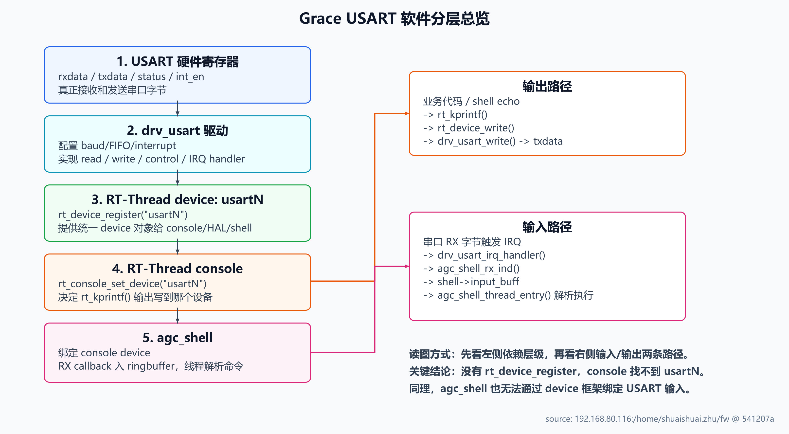
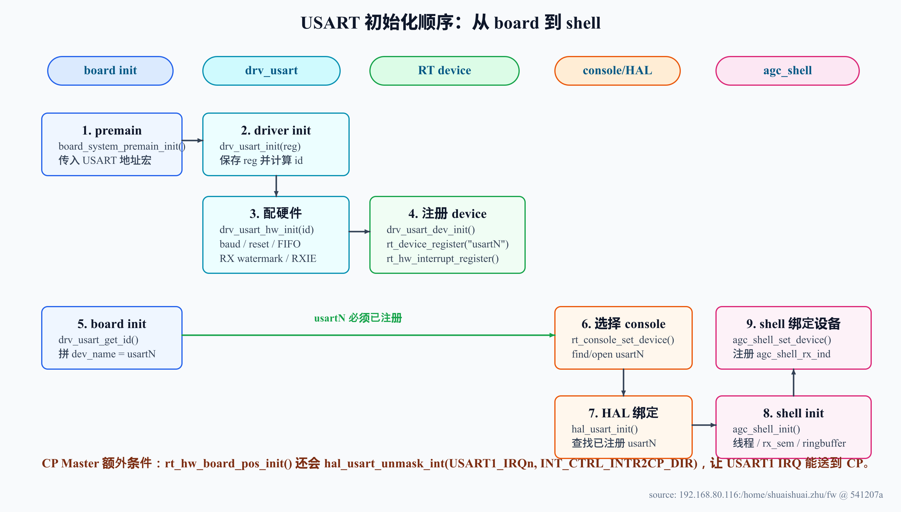
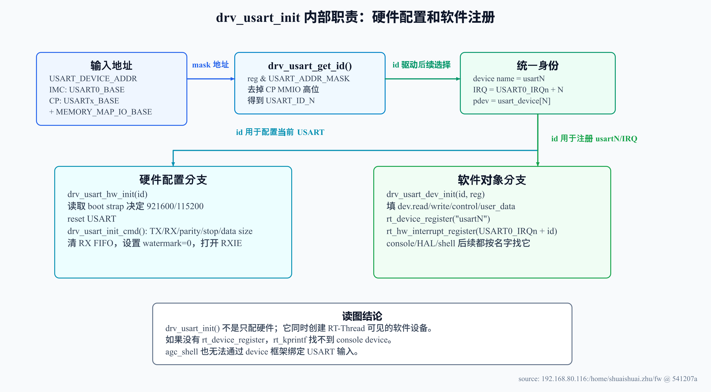
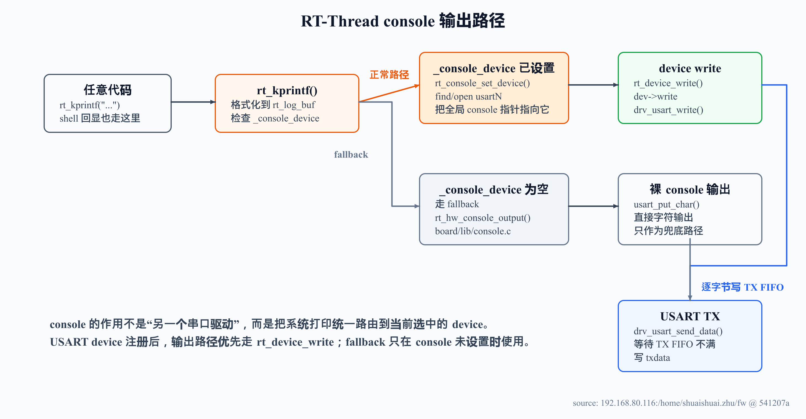
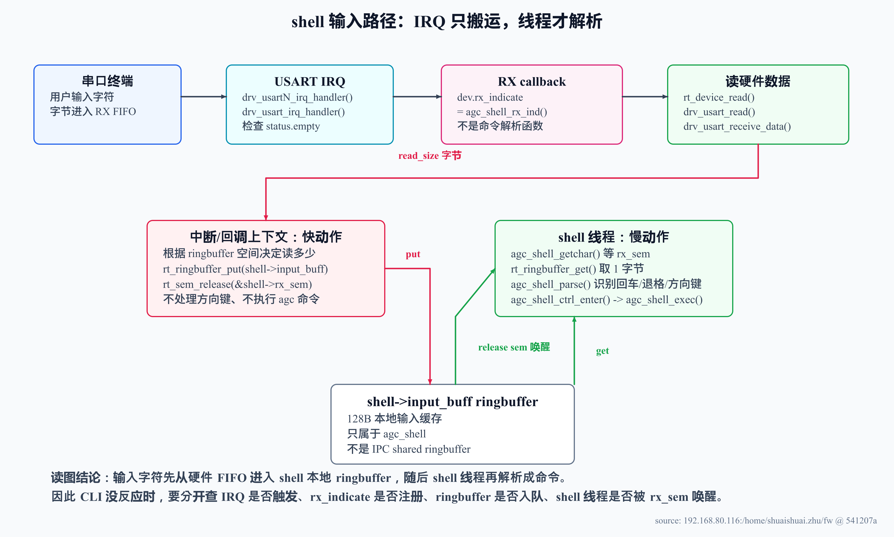
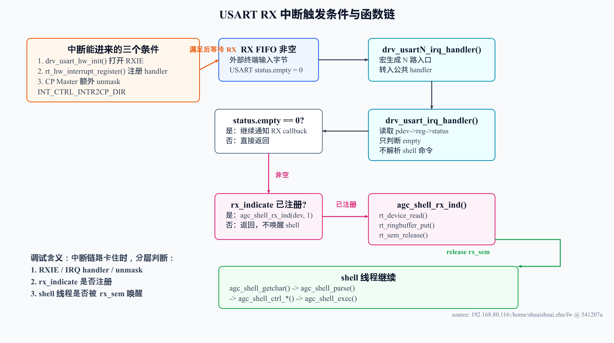

---
type: learning-guide
title: "Grace USART、RT-Thread console 与 agc_shell 完整链路"
created: 2026-06-01
updated: 2026-06-04
tags:
  - fw
  - cli
  - usart
  - console
  - rt_thread
  - ringbuffer
  - interrupt
status: active
source:
  - "shuaishuai.zhu@192.168.80.116:/home/shuaishuai.zhu/fw/aigc_sdk/grace/include/board_cfg.h"
  - "shuaishuai.zhu@192.168.80.116:/home/shuaishuai.zhu/fw/aigc_sdk/grace/board/*/src/per_map.h"
  - "shuaishuai.zhu@192.168.80.116:/home/shuaishuai.zhu/fw/aigc_sdk/grace/board/*/src/board.c"
  - "shuaishuai.zhu@192.168.80.116:/home/shuaishuai.zhu/fw/aigc_sdk/grace/drivers/usart/drv_usart.c"
  - "shuaishuai.zhu@192.168.80.116:/home/shuaishuai.zhu/fw/aigc_sdk/grace/drivers/usart/drv_usart.h"
  - "shuaishuai.zhu@192.168.80.116:/home/shuaishuai.zhu/fw/aigc_sdk/grace/include/hal/hal_drv_usart.h"
  - "shuaishuai.zhu@192.168.80.116:/home/shuaishuai.zhu/fw/aigc_sdk/grace/hal/usart/hal_usart.c"
  - "shuaishuai.zhu@192.168.80.116:/home/shuaishuai.zhu/fw/aigc_sdk/grace/board/lib/console.c"
  - "shuaishuai.zhu@192.168.80.116:/home/shuaishuai.zhu/fw/rtthread/src/kservice.c"
  - "shuaishuai.zhu@192.168.80.116:/home/shuaishuai.zhu/fw/rtthread/components/drivers/core/device.c"
  - "shuaishuai.zhu@192.168.80.116:/home/shuaishuai.zhu/fw/test/framework/shell/agc_shell.c"
related:
  - "./agc_shell-cli-path.md"
  - "./cp-usart-clock-imc-init-design-review.md"
  - "../debug/CP ringbuffer IPC 与 queue create 调试.md"
  - "../imc/startup-to-main.md"
  - "../rt-thread/rt_thread_yield.md"
---

# Grace USART、RT-Thread console 与 agc_shell 完整链路

> Source snapshot: 2026-06-03 从 `192.168.80.116:/home/shuaishuai.zhu/fw` 当前源码读取，当前 HEAD `541207a`。  
> Scope: 本页解释 USART 在 Grace FW 里的完整软件链路：地址选择、硬件初始化、RT-Thread device 注册、console 输出、agc_shell 输入、中断触发、ringbuffer 缓冲和调试顺序。不证明板上实际波形、外部 host 终端配置或硬件时序。
> Diagram note: 本页图解按 `technical-diagram-generator` workflow 重新生成，每张图均保留 SVG 源文件和 PNG 渲染图。
> Current MoveUsart note: 当前 `zss/MoveUsart` 分支已把 CP USART 的硬件初始化迁到 IMC，CP 侧只保留 RT-Thread device/console/shell 软件注册。core clock 也由 `drv_clk_get_core_clock()` 按 `FW_IMC && !FW_BACKDOOR` 分流。详细见 [CP USART 与 Core Clock 解耦 IMC 统一初始化 — 设计文档](<./cp-usart-clock-imc-init-design-review.md>)。

## 1. 一句话理解

USART 在这套 FW 里不是单纯的 `printf` 外设。它先作为硬件寄存器被 `drv_usart_init()` 配好，再注册成 RT-Thread 字符设备 `usartN`，随后被 `rt_console_set_device()` 选为系统 console，最后被 `agc_shell` 绑定为 CLI 的输入输出通道。

可以把它理解成 5 层：

```text
USART 硬件寄存器
  -> drv_usart 驱动
  -> RT-Thread device: usart0/usart1/usart2...
  -> RT-Thread console: rt_kprintf 输出到哪个 device
  -> agc_shell: 从 console device 收字符、解析命令
```

这也是为什么必须注册 `usart device`：如果只有硬件寄存器配置，`rt_kprintf()`、`rt_console_set_device()`、`rt_device_find()`、`agc_shell_set_device()` 都找不到一个统一的软件对象来读写 USART。

## 2. 总览图：从硬件到 CLI



> 图解源文件：[`usart-layered-overview-v3.svg`](../../../../_attachments/fw/cli/usart-console/usart-layered-overview-v3.svg)。

这张图按“依赖关系”读：下层先存在，上层才能绑定。`agc_shell` 并不是直接操作 USART 寄存器，它依赖 console device；console 也不是直接知道 USART 寄存器，它依赖 RT-Thread device；RT-Thread device 的 read/write/control 才回到 `drv_usart.c`。

## 3. 地址和设备名如何确定

硬件 base address 来自 `board_cfg.h`：

| USART | base address | 典型使用者 |
|---|---:|---|
| USART0 | `0x02002000` | IMC |
| USART1 | `0x02003000` | CP Master |
| USART2 | `0x02026000` | CP User core0 |
| USART3 | `0x02027000` | CP User core1 |
| USART4 | `0x02028000` | CP User core2 |
| USART5 | `0x02029000` | CP User core3 |

每个 firmware 通过自己的 `per_map.h` 选择当前 CPU 使用的 `USART_DEVICE_ADDR`：

| firmware | `USART_DEVICE_ADDR` | 注册出的 device |
|---|---|---|
| IMC | `USART0_BASE` | `usart0` |
| CP Master | `USART1_BASE + MEMORY_MAP_IO_BASE` | `usart1` |
| CP User | `USART2_BASE + MEMORY_MAP_IO_BASE + 0x1000 * get_core_id()` | `usart2`..`usart5` |

CP 侧访问外设要带 `MEMORY_MAP_IO_BASE = 0x50000000`，但 `USARTx_BASE` 本身不带这个高位。所以 `drv_usart_get_id()` 会先做：

```text
base = reg & USART_ADDR_MASK
```

`USART_ADDR_MASK = 0x0fffffff`，作用是把 CP MMIO 高位剥掉，再把地址映射到 `USART_ID_0..5`。如果不做这个 mask，CP Master 的 `0x52003000` 就无法和 `USART1_BASE = 0x02003000` 匹配。

## 4. 初始化链路：谁先做什么



> 图解源文件：[`usart-init-sequence-v3.svg`](../../../../_attachments/fw/cli/usart-console/usart-init-sequence-v3.svg)。

这个顺序很重要：

1. `drv_usart_init()` 必须先注册 `usartN`，否则 `rt_console_set_device("usartN")` 找不到设备。
2. `rt_console_set_device()` 必须先选中 console device，`agc_shell_set_device()` 才能通过 `rt_console_get_device()` 找到 shell 使用的设备。
3. `agc_shell_init()` 先创建 shell 线程、信号量和本地 ringbuffer；线程启动后再把 `agc_shell_rx_ind()` 注册成 USART RX 回调。

CP Master 还有一个额外动作：`rt_hw_board_pos_init()` 里调用 `hal_usart_unmask_int(USART1_IRQn, INT_CTRL_INTR2CP_DIR)`。这说明 CP Master 的 USART RX 中断除了注册 ECLIC handler，还要经过 interrupt controller 方向上的 unmask 才能送到 CP。

## 5. `drv_usart_init()` 详细拆解

`drv_usart_init()` 是当前设计里最核心的函数。它同时承担两类职责：

- 硬件职责：配置 USART 寄存器、清 FIFO、打开 RX interrupt。
- 软件职责：构造 RT-Thread device、注册 device 名字、注册中断入口。



> 图解源文件：[`usart-driver-device-map-v3.svg`](../../../../_attachments/fw/cli/usart-console/usart-driver-device-map-v3.svg)。

### `drv_usart_init()` 相关函数职责表

| 函数 | 做什么 | 为什么需要 |
|---|---|---|
| `drv_usart_get_id(reg, &id)` | 把 `USART_DEVICE_ADDR` 映射成 `USART_ID_N` | 后续要得到 device 名 `usartN`，也要确定 IRQ 是 `USART0_IRQn + id` |
| `drv_usart_hw_init(id)` | 读取 boot strap，决定 baud rate，执行 reset，配置 USART，清 FIFO，打开 RX interrupt | 让硬件真正能收发字符 |
| `drv_usart_set_baud_rate()` | 用 `clk / baud_rate - 1` 算整数 divider，高版本 IP 还会设置 fractional divider | 让串口波特率匹配 host 终端 |
| `drv_usart_init_cmd()` | 写 TX/RX enable、stop bit、parity、data size、DMA enable 等寄存器 | 设置 USART 数据格式和收发模式 |
| `drv_usart_clr_rxfifo()` | 置位再清 `rxctrl.clr` | 避免旧 RX FIFO 数据影响后续 shell 输入 |
| `drv_usart_set_int_en(RXIE)` | 设置 RX interrupt enable | RX FIFO 有数据时能触发中断路径 |
| `drv_usart_dev_init()` | 填 `usart_device[id].dev.read/write/control/user_data` | 把硬件驱动函数接入 RT-Thread device 框架 |
| `rt_device_register()` | 把 `usartN` 挂到 RT-Thread object 系统 | 让 `rt_device_find("usartN")`、console、HAL、shell 都能找到它 |
| `rt_hw_interrupt_register()` | 注册 `drv_usartN_irq_handler()` | USART RX IRQ 来时能调用 driver handler |

### driver 的 read/write/control 做什么

| RT-Thread device API | 进入 USART driver 后 | 实际效果 |
|---|---|---|
| `rt_device_write(dev, ..., buf, size)` | `drv_usart_write()` | 逐字节调用 `drv_usart_send_data()`，等待 TX FIFO 不满，再写 `txdata` |
| `rt_device_read(dev, ..., buf, size)` | `drv_usart_read()` | 逐字节调用 `drv_usart_receive_data()`，等待 RX FIFO 非空，再读 `rxdata` |
| `rt_device_control(dev, cmd, args)` | `drv_usart_ctrl()` | 根据 `USART_*_CMD` 分发到 baud、int、FIFO、size、ABR 等控制函数 |
| `rt_device_set_rx_indicate(dev, cb)` | RT-Thread device core | 把 `dev->rx_indicate` 设置成 shell 的 RX 回调 |

`drv_usart_write()` 和 `drv_usart_read()` 都是同步逐字节路径，不是 DMA。大量 log 输出会在 `drv_usart_send_data()` 的 FIFO 等待上消耗 CPU 时间，这也是 CLI 体感卡顿时必须考虑的点。

## 6. RT-Thread console 是什么

RT-Thread console 是一个“全局输出设备指针”，源码里是 `kservice.c` 的 `_console_device`。它解决的问题是：系统里很多地方只会调用 `rt_kprintf()`，它们不应该知道当前到底用 `usart0`、`usart1` 还是别的输出设备。

`rt_console_set_device("usartN")` 做三件事：

1. `rt_device_find("usartN")` 找到前面注册的 USART device。
2. `rt_device_open(new_device, RT_DEVICE_OFLAG_RDWR | RT_DEVICE_FLAG_STREAM)` 打开它。
3. 把 `_console_device` 指向这个 device。

之后 `rt_kprintf()` 的输出路径就是：



> 图解源文件：[`usart-console-output-path-v3.svg`](../../../../_attachments/fw/cli/usart-console/usart-console-output-path-v3.svg)。

这里要区分两个概念：

- `rt_hw_console_output()` 是弱函数 fallback；本工程的 `board/lib/console.c` 里实现为 `usart_put_char()`。
- `_console_device` 设置成功后，`rt_kprintf()` 优先走 RT-Thread device 的 `write` 路径，不再直接依赖 fallback。

所以注册 `usart device` 的意义很直接：它让 console 输出从“裸写硬件函数”升级为“统一 device 对象”。同一个对象也会被 agc_shell 用作输入设备。

## 7. shell 输入路径：从按键到命令执行

用户在串口终端敲一个字符后，不是中断里直接解析命令。当前源码的设计是：中断只负责把字节搬到 shell 本地 ringbuffer 并唤醒 shell 线程，真正的编辑、回显和命令执行都在线程上下文里做。



> 图解源文件：[`usart-shell-input-path-v3.svg`](../../../../_attachments/fw/cli/usart-console/usart-shell-input-path-v3.svg)。

这张图有两个关键点：

- `drv_usart_irq_handler()` 只看 RX FIFO 是否非空，然后调用 `dev.rx_indicate`。它不解析 `agc` 命令，也不维护命令历史。
- `agc_shell_rx_ind()` 也不解析命令。它做搬运：`rt_device_read()` 从 USART 取字节，`rt_ringbuffer_put()` 放进 `shell->input_buff`，最后 `rt_sem_release()` 唤醒 shell 线程。

### agc_shell 关键函数职责

| 函数 | 做什么 | 所在线程/上下文 |
|---|---|---|
| `agc_shell_init()` | 分配 `agc_shell_t`，初始化 shell 线程、`rx_sem`、`input_buff`，启动 shell 线程 | board pre-init |
| `agc_shell_thread_entry()` | 绑定 console device，显示提示符，循环解析输入字符 | shell 线程 |
| `agc_shell_set_device()` | `rt_console_get_device()` 取 console，再 `rt_device_find/open`，最后注册 `agc_shell_rx_ind` | shell 线程启动初期 |
| `agc_shell_rx_ind()` | RX 回调：从 device 读字节，放入 shell ringbuffer，释放 `rx_sem` | USART IRQ 触发后的回调路径 |
| `agc_shell_getchar()` | 若 ringbuffer 空则等待 `rx_sem`，然后取 1 个字节 | shell 线程 |
| `agc_shell_parse()` | 把字符转换成普通字符、回车、退格、方向键等 shell 控制值 | shell 线程 |
| `agc_shell_ctrl_default()` | 普通字符插入当前命令行，并用 `rt_kprintf` 回显 | shell 线程 |
| `agc_shell_ctrl_enter()` | 回车后整理当前行，调用 `agc_shell_exec()`，再显示新提示符 | shell 线程 |
| `agc_shell_exec()` | 解析 argv，执行 `clear`、`agc ...`、`list...` 或报 cmd not found | shell 线程 |
| `agc_shell_press_keys()` | 测试/软件注入路径：直接把 key 放进 shell ringbuffer 并 release sem | 调用者上下文 |

### shell ringbuffer 的作用

`shell->input_buff` 是 agc_shell 本地输入缓存，大小 `128B`。它不是 IPC ringbuffer，也不在共享内存里。它的作用是把“中断里来的字节”和“线程里慢慢解析命令”解耦。

如果没有这个 ringbuffer，中断回调要么直接解析命令，要么每次输入都必须立即被 shell 线程消费。当前设计用 `ringbuffer + semaphore` 把这两件事分开：

```text
IRQ/RX callback: 尽快搬字节，唤醒线程
shell thread: 解析、编辑、回显、执行命令
```

当 shell 输入太快或 shell 线程处理太慢时，`agc_shell_rx_ind()` 会检查 `rt_ringbuffer_space_len()`。空间不足时会打印：

```text
console buffer full get <size> space <space>
```

这说明 CLI 本地输入缓冲满了，不代表 IPC shared ringbuffer 满。两者只是共用 `rt_ringbuffer` 实现，内存和语义完全不同。

## 8. 中断触发逻辑：触发后执行哪些函数

USART RX 中断能工作，需要三个条件同时成立：

1. `drv_usart_hw_init()` 打开硬件 RX interrupt：`USART_INT_EN_RXIE`。
2. `drv_usart_init()` 注册 ECLIC handler：`rt_hw_interrupt_register(USART0_IRQn + id, ..., usart_irq_entry[id])`。
3. 对 CP Master 这类经 interrupt controller 转发的路径，还要 unmask 对应方向，例如 `hal_usart_unmask_int(USART1_IRQn, INT_CTRL_INTR2CP_DIR)`。

触发后的函数链是：



> 图解源文件：[`usart-irq-trigger-chain-v3.svg`](../../../../_attachments/fw/cli/usart-console/usart-irq-trigger-chain-v3.svg)。

注意：中断 handler 没有显式清 USART status。当前 `drv_usart_irq_handler()` 只在 FIFO 非空时触发 RX callback。是否通过读 `rxdata` 让硬件状态更新，取决于 USART IP 的 FIFO/status 行为；这属于硬件时序，本页只说明源码路径。

## 9. HAL 层在这里做什么

`hal_usart.c` 当前不是“重新初始化硬件”的入口，它更多是一个基于 RT-Thread device 的包装层：

| 函数 | 做什么 |
|---|---|
| `hal_usart_init(reg)` | 调 `drv_usart_get_id()` 得到 id，拼出 `usartN`，再 `rt_device_find(dev_name)` 缓存到 `hal_usart_dev` |
| `hal_usart_ctrl(args)` | 根据 `cmd->dev_name` 找设备，再 `rt_device_control(dev, cmd->operation, &cmd->cmd)` |

换句话说，`hal_usart_init()` 依赖 `drv_usart_init()` 已经完成 `rt_device_register()`。如果前面没有注册 `usartN`，HAL 这里只能报 `Device usartN found failed`。

这也是后续如果要做“IMC 统一初始化 CP USART”时要小心的原因：当前 `drv_usart_init()` 把硬件配置和本地 device 注册揉在一起。若 IMC 去配置 USART1-5 的硬件，CP 侧仍然需要能注册本地 `usartN` device，否则 `rt_console_set_device()`、`hal_usart_init()`、`agc_shell_set_device()` 都没有对象可用。

## 10. 输出路径和输入路径放在一起看

### 输出：代码打印到串口

```text
业务代码 / shell echo
  -> rt_kprintf()
  -> _console_device
  -> rt_device_write()
  -> drv_usart_write()
  -> drv_usart_send_data()
  -> 等 TX FIFO 不满
  -> 写 txdata
```

输出路径的瓶颈在 `drv_usart_send_data()`：它逐字节等待 `USART_STATUS_FULL` 清掉。日志多、回显多或 shell 大量输出时，CPU 会花时间等 TX FIFO。

### 输入：串口按键到 shell 命令

```text
串口 RX 字节
  -> USART IRQ
  -> drv_usart_irq_handler()
  -> dev.rx_indicate = agc_shell_rx_ind()
  -> rt_device_read()
  -> drv_usart_receive_data()
  -> shell->input_buff ringbuffer
  -> rt_sem_release(rx_sem)
  -> agc_shell_getchar()
  -> agc_shell_parse()
  -> agc_shell_ctrl_*()
  -> agc_shell_exec()
```

输入路径的核心是“中断搬运 + 线程解析”。如果 CLI 没反应，不能只看 USART 寄存器，也要看 `rx_indicate` 是否注册、ringbuffer 是否有数据、`rx_sem` 是否唤醒了 shell 线程。

## 11. 常见问题和调试顺序

### 11.1 `rt_kprintf()` 为什么没有输出

按这个顺序查：

1. `drv_usart_init()` 是否执行到 `rt_device_register("usartN")`。
2. `rt_console_set_device("usartN")` 的 `N` 是否和当前 CPU 对应。
3. `_console_device` 是否非空。
4. `rt_device_write()` 是否进入 `drv_usart_write()`。
5. `drv_usart_send_data()` 是否卡在 TX FIFO full。

### 11.2 shell 为什么没有输入

按这个顺序查：

1. `agc_shell_init()` 是否执行。
2. `agc_shell_set_device()` 是否能从 `rt_console_get_device()` 拿到 console。
3. `rt_device_open()` 是否成功打开 `usartN`。
4. `rt_device_set_rx_indicate()` 是否把 `agc_shell_rx_ind` 注册进去。
5. RX interrupt 是否触发 `drv_usartN_irq_handler()`。
6. `drv_usart_irq_handler()` 看到的 `status.empty` 是否为 0。
7. `agc_shell_rx_ind()` 是否 `rt_ringbuffer_put()` 成功，并 `rt_sem_release()`。
8. shell 线程是否从 `agc_shell_getchar()` 醒来。

### 11.3 shell 输入路径为什么需要 ringbuffer

因为中断回调不适合做复杂命令解析。ringbuffer 让中断路径只做快动作：读字节、入队、唤醒线程；shell 线程再慢慢处理方向键、退格、回显、命令解析和 `agc_cli_cmd()`。

### 11.4 CP 地址为什么容易错

CP Master/User 的 `USART_DEVICE_ADDR` 带 `MEMORY_MAP_IO_BASE`，而 `USARTx_BASE` 是物理低地址。任何通过地址判断 USART id 的代码都必须像 `drv_usart_get_id()` 一样 mask 高位。

## 12. 速记

- `drv_usart_init()`：硬件初始化 + RT-Thread device 注册 + USART IRQ handler 注册。
- `rt_device_register("usartN")`：让 RT-Thread 能按名字找到 USART。
- `rt_console_set_device("usartN")`：决定 `rt_kprintf()` 输出走哪个 device。
- `hal_usart_init()`：查找已经注册好的 `usartN`，不是重新配硬件。
- `agc_shell_init()`：创建 shell 线程、信号量和本地输入 ringbuffer。
- `agc_shell_set_device()`：把 shell 绑定到当前 console device，并注册 RX callback。
- `drv_usart_irq_handler()`：RX FIFO 非空时调用 `rx_indicate`，不解析命令。
- `agc_shell_rx_ind()`：从 USART 读字节，放进 shell ringbuffer，释放 `rx_sem`。
- `agc_shell_thread_entry()`：在线程里解析字符、回显、执行命令。
