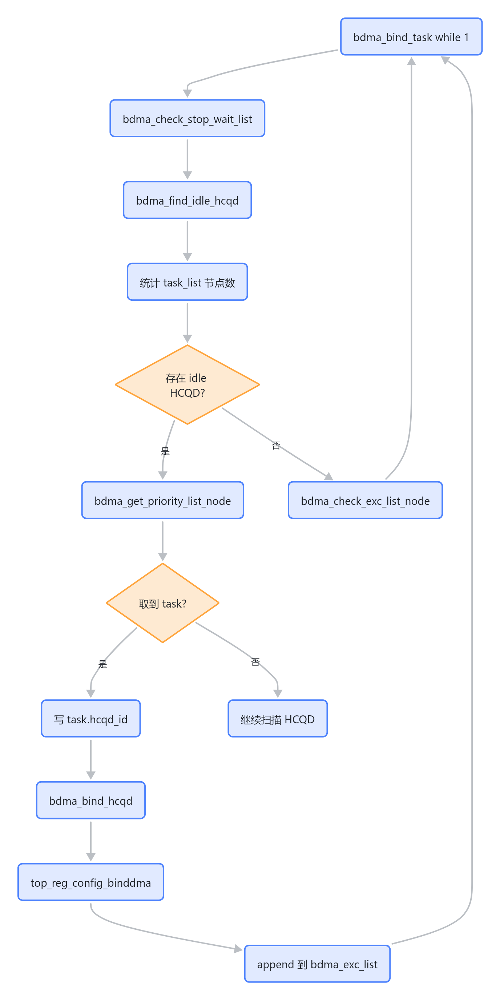
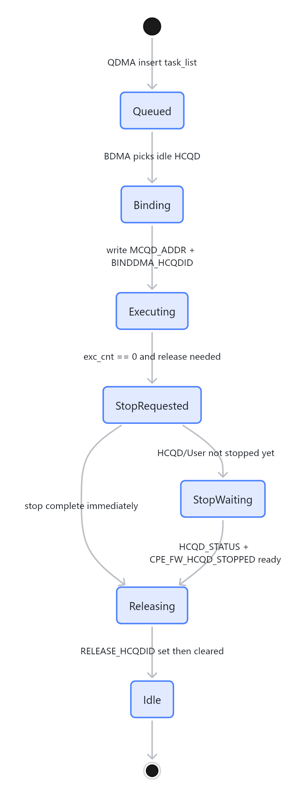
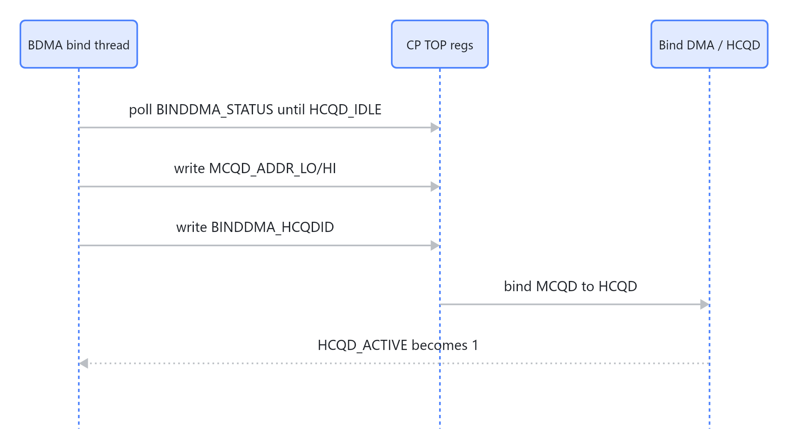
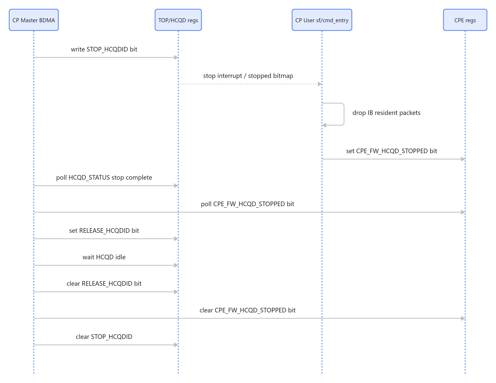

# BDMA 绑定与 HCQD 生命周期

BDMA 是 CP Master 把 MCQD stream 映射到 HCQD 的执行器。QDMA 只负责把 stream 放进 `task_list`，BDMA 负责找空闲 HCQD、写 bind DMA 寄存器、跟踪执行中任务，并在条件满足后 stop/release HCQD。

## 主流程

> 图解源文件：[`01-主流程-flowchart.mmd`](../../../../_attachments/fw/cp-master/bdma/whiteboard-mermaid/01-主流程-flowchart.mmd)。由 lark-whiteboard `whiteboard-cli` 从原 Mermaid 渲染。

## HCQD 选择条件

`bdma_find_idle_hcqd()` 会扫描 0..31 的 HCQD，只有同时满足以下条件才认为可绑定：

| 条件 | 源码判断 | 含义 |
|---|---|---|
| 硬件未 active | `top_reg_get_hcqd_active(hcqd_id) == RT_EOK` | `TOP_REG_HCQD_ACTIVE == 0` |
| 不在 stop wait list | `bdma_get_hcqd_stop_status(hcqd_id) == RT_EOK` | 没有正在等待 stop 完成 |
| 不在执行列表 | `bdma_get_hcqd_exc_status(hcqd_id) == RT_EOK` | 没有已绑定任务占用 |

## 绑定状态机

> 图解源文件：[`02-绑定状态机-stateDiagram-v2.mmd`](../../../../_attachments/fw/cp-master/bdma/whiteboard-mermaid/02-绑定状态机-stateDiagram-v2.mmd)。由 lark-whiteboard `whiteboard-cli` 从原 Mermaid 渲染。

## bind DMA 寄存器流程

`bdma_bind_hcqd()` 的关键动作：

1. `top_reg_wait_binddma_idle()` 等 `TOP_REG_BINDDMA_STATUS & 0x3F == HCQD_IDLE`。
2. 修改 `mcqd_addr` 高 32 位 bit[20:16] 为 `proc_id`。
3. 关中断。
4. 写：
   - `TOP_REG_MCQD_ADDR_LO = mcqd_addr low32`
   - `TOP_REG_MCQD_ADDR_HI = mcqd_addr high32`
   - `TOP_REG_BINDDMA_HCQDID = hcqd_id`
5. 把 task 加入 `bdma_exc_list`。
6. 开中断。

> 图解源文件：[`03-bind-DMA-寄存器流程-sequenceDiagram.mmd`](../../../../_attachments/fw/cp-master/bdma/whiteboard-mermaid/03-bind-DMA-寄存器流程-sequenceDiagram.mmd)。由 lark-whiteboard `whiteboard-cli` 从原 Mermaid 渲染。

## stop/release 机制

BDMA 释放 HCQD 不是直接清软件状态，而是走硬件 stop + CP User ack：

> 图解源文件：[`04-stop-release-机制-sequenceDiagram.mmd`](../../../../_attachments/fw/cp-master/bdma/whiteboard-mermaid/04-stop-release-机制-sequenceDiagram.mmd)。由 lark-whiteboard `whiteboard-cli` 从原 Mermaid 渲染。

## `bdma_exc_list` 和 `bdma_stop_wait_list`

| 列表 | 进入条件 | 退出条件 |
|---|---|---|
| `bdma_exc_list` | task 成功 bind 到 HCQD | `exc_cnt == 0` 后发起 stop，或 destroy stream 强制移除 |
| `bdma_stop_wait_list` | stop 请求后 HCQD/User 还没完成 | `HCQD_STATUS` 完成且 `CPE_FW_HCQD_STOPPED` 置位 |

## 与 CP User 的关系

BDMA 依赖 CP User 侧完成两个动作：

1. 停止后清掉 IB 中已经 resident 的 packet：`sf_drop_hcqd_packets()` 调 `ib_read_packet()` + `ib_drop_packet()`。
2. 写 `CPE_FW_HCQD_STOPPED`，让 Master 的 `top_reg_get_fw_hcqd_stop()` 返回 `RT_EOK`。

没有 CP User 的 ack，Master 不应该 release HCQD，因为 HCQD 可能还有 firmware resident packet 或 OSD 计数没有归零。

## 当前实现风险点

- `bdma_bind_task()` 是无限循环，当前没有显式 `delay/yield`。如果优先级配置不合适，可能持续占 CPU，需要结合 RT-Thread 调度和波形确认。
- `bdma_stop_hcqd()` 声明返回 `rt_uint32_t`，但函数没有返回值；这是源码层面的缺陷，应单独 review。
- `bdma_check_stream_ringbuffer_status()` 读取了 `mcqd_addr` 但实际只用 `top_reg_check_stream_ringbuffer(hcqd_id)`，目前没有用 MCQD 侧状态判断。
- stop 只允许一个 `TOP_REG_STOP_HCQDID` 在途：`bdma_check_exc_list_node()` 要求 `top_reg_get_stop_hcqd_state() == RT_EOK` 且 stop wait list 为空。