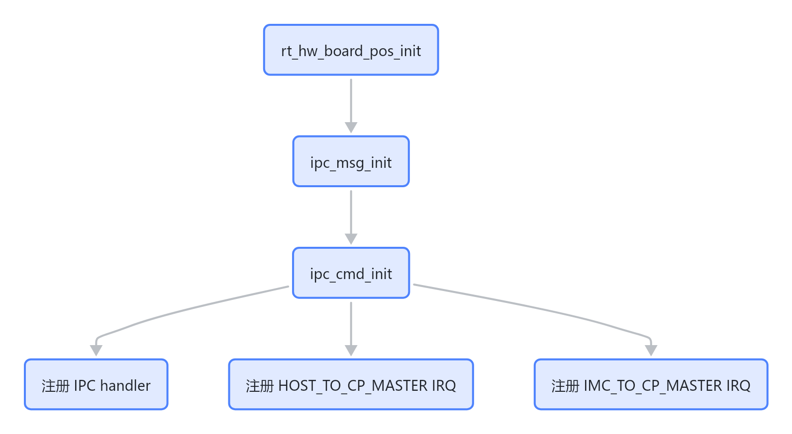
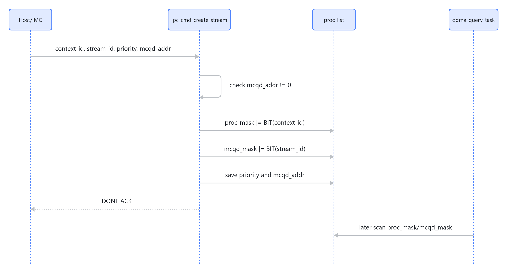
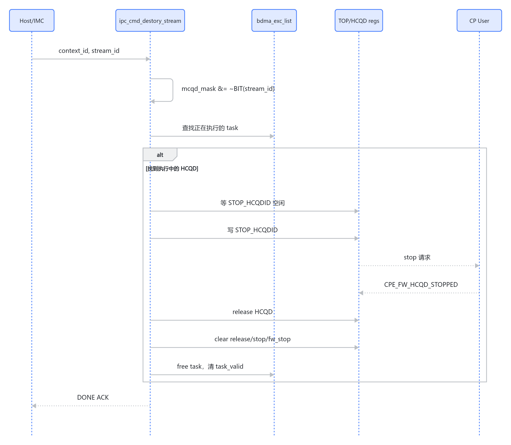
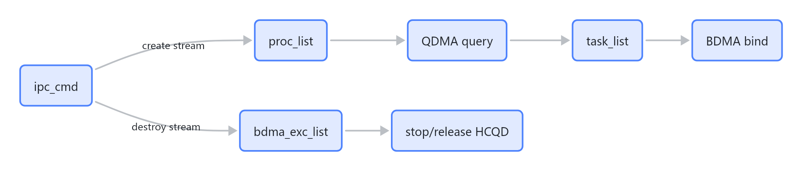

# IPC CMD 控制面

`ipc_cmd` 是 CP Master 的控制面入口。它响应 host/IMC 发来的 IPC command，把 context/stream/event 信息写入 CP Master 软件表，并在销毁 stream 时协调 HCQD stop/release。

## 初始化



> 图解源文件：[`01-初始化-flowchart.mmd`](../../../../_attachments/fw/cp-master/ipc_cmd/whiteboard-mermaid/01-初始化-flowchart.mmd)。由 lark-whiteboard `whiteboard-cli` 从原 Mermaid 渲染。

`ipc_cmd_init()` 注册的 handler：

| command | id | handler |
|---|---:|---|
| `IPC_CMD_DESTORY_CONTEXT` | 161 | `ipc_cmd_destory_context` |
| `IPC_CMD_CREATE_STREAM` | 163 | `ipc_cmd_create_stream` |
| `IPC_CMD_DESTORY_STREAM` | 164 | `ipc_cmd_destory_stream` |
| `IPC_CMD_CREATE_EVENT` | 166 | `ipc_cmd_create_event` |
| `IPC_CMD_DESTORY_EVENT` | 167 | `ipc_cmd_destory_event` |

## create stream



> 图解源文件：[`02-create-stream-sequenceDiagram.mmd`](../../../../_attachments/fw/cp-master/ipc_cmd/whiteboard-mermaid/02-create-stream-sequenceDiagram.mmd)。由 lark-whiteboard `whiteboard-cli` 从原 Mermaid 渲染。

create stream 不直接触发 bind。它只把 stream 注册进 `proc_list`，后续由 QDMA 线程发现 MCQD ready，再由 BDMA 绑定 HCQD。

## destroy stream



> 图解源文件：[`03-destroy-stream-sequenceDiagram.mmd`](../../../../_attachments/fw/cp-master/ipc_cmd/whiteboard-mermaid/03-destroy-stream-sequenceDiagram.mmd)。由 lark-whiteboard `whiteboard-cli` 从原 Mermaid 渲染。

`destory_stop_process` 在 destroy stream 期间置 `RT_TRUE`，用于阻止 BDMA 普通轮询路径同时 stop 同一个执行任务。

## destroy context

当前 `ipc_cmd_destory_context()` 做的是轻量清表：

- `proc_mask &= ~BIT(context_id)`
- `proc_valid = 0`
- `task_valid = 0`
- `mcqd_mask = 0`
- 清 `mcqd_priority[]` 和 `mcqd_addr[]`

但是下面两行当前是注释状态：

```c
// top_reg_context_flush(context_info->context_id);
// ipc_cmd_context_task_remove(context_info->context_id);
```

这意味着 destroy context 当前不会主动 flush context，也不会统一清理该 context 已在 task/exc list 中的任务。这个行为与 destroy stream 的强 stop/release 路径不同，后续需要确认硬件/上层协议是否保证 destroy context 前所有 stream 已经 destroy。

## create/destroy event

- `create_event`：如果 message 没有 payload，则分配 `ipc_cmd_event_msg_t`，然后从 `TOP_REG_EVENT_TABLE_VALID_INDEX` 读取 event id。
- `destroy_event`：写 `TOP_REG_EVENT_DESTROY_ENTRY` 释放 event id。

## ACK 机制

`ipc_cmd_fill_ack_cmd_header()` 会交换 source/target，并把 message 标记成 ack：

```text
msg_type = 1
sync = 1
ack = 1
reply = 0
error = 0
```

它还会根据 `ipc_manager` 找回对应 event_type，保证 ACK 走回原 IPC 通道。

## 与 QDMA/BDMA 的关系



> 图解源文件：[`04-与-QDMA-BDMA-的关系-flowchart.mmd`](../../../../_attachments/fw/cp-master/ipc_cmd/whiteboard-mermaid/04-与-QDMA-BDMA-的关系-flowchart.mmd)。由 lark-whiteboard `whiteboard-cli` 从原 Mermaid 渲染。

## 需要重点验证

- destroy context 是否必须补回 `top_reg_context_flush()` 和 `ipc_cmd_context_task_remove()`，取决于上层是否保证先 destroy stream。
- destroy stream 只遍历 `bdma_exc_list`，如果目标 stream 还在 `task_list` 但没绑定 HCQD，当前路径只清 `mcqd_mask`，需要确认 `task_valid` 是否会残留。
- `HCQD_STOP_TIMEOUT` 是 busy wait 微秒级轮询，destroy stream 同步等待期间会占用 CP Master 执行上下文。