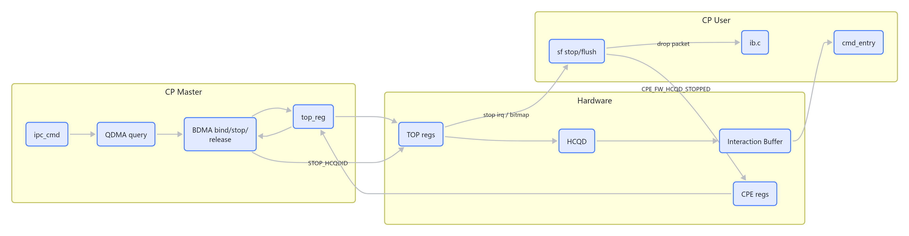
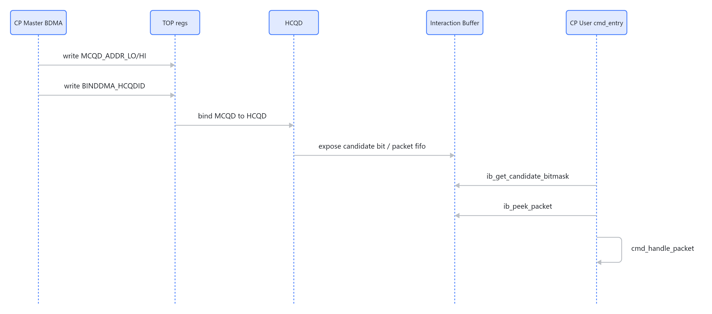
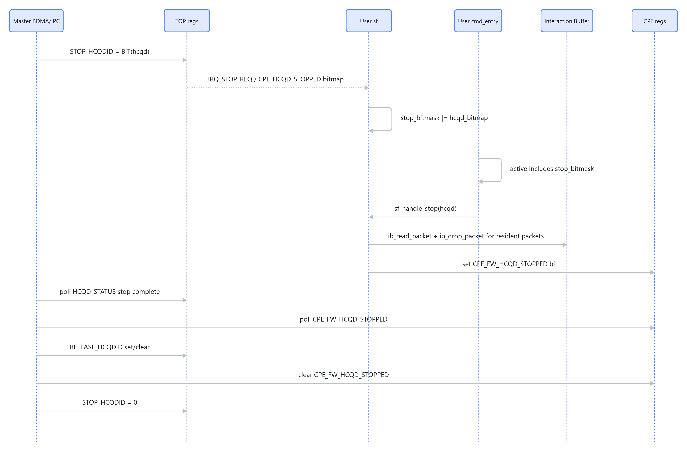
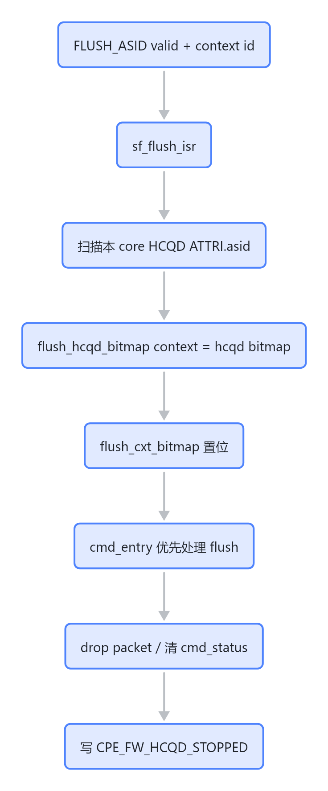

# CP Master 与 CP User 交互

CP Master 和 CP User 的边界可以按“绑定、执行、停止、释放”四段理解。本页讲 **Master 侧视角**的交互契约与读波形顺序；User 侧 stop/flush 的完整设计（`stop_bitmask`、`flush_cxt_bitmap`、调度优先级、drop/finish 语义）见 [[CP stop flush 与 queue 切换]]，cmd_entry 每轮调度见 [[cmd_entry]]。

## 总览

> 图解源文件：[`01-总览-flowchart.mmd`](../../../../_attachments/fw/cp-master/master-user-interaction/whiteboard-mermaid/01-总览-flowchart.mmd)。由 lark-whiteboard `whiteboard-cli` 从原 Mermaid 渲染。

## 绑定路径

> 图解源文件：[`02-绑定路径-sequenceDiagram.mmd`](../../../../_attachments/fw/cp-master/master-user-interaction/whiteboard-mermaid/02-绑定路径-sequenceDiagram.mmd)。由 lark-whiteboard `whiteboard-cli` 从原 Mermaid 渲染。

## 执行路径（Master 为何要等 User ack）

CP User 的 `cmd_entry()` 每轮按 candidate / pending / stop / flush 的优先级选 HCQD 处理（细节见 [[cmd_entry]]）。关键点：User 可能已经 peek 或 pending 了某个 HCQD 的 packet，因此 **Master 侧 stop/release 不能只看 HCQD active 就执行**，必须等 User 通过 `CPE_FW_HCQD_STOPPED` 显式 ack。

## stop / release / flush 路径

stop、release、flush 三段的 Master↔User 时序与 User 侧 drop/finish 语义完整设计见 [[CP stop flush 与 queue 切换]]。图解如下：

> 图解源文件：[`03-stop-release-路径-sequenceDiagram.mmd`](../../../../_attachments/fw/cp-master/master-user-interaction/whiteboard-mermaid/03-stop-release-路径-sequenceDiagram.mmd)。

> 图解源文件：[`04-flush-路径-flowchart.mmd`](../../../../_attachments/fw/cp-master/master-user-interaction/whiteboard-mermaid/04-flush-路径-flowchart.mmd)。

## Master 与 User 的关键寄存器契约

| 方向 | 寄存器/接口 | 含义 |
|---|---|---|
| Master -> HCQD/User | `TOP_REG_STOP_HCQDID` | 请求 HCQD 停止 fetch/execute |
| User 读 | `CPE_HCQD_STOPPED` | stop bitmap，User ISR 用来生成 `stop_bitmask` |
| User -> Master | `CPE_FW_HCQD_STOPPED` | User 已 drop resident packet，并完成 stop/flush 侧处理 |
| Master -> HCQD | `TOP_REG_RELEASE_HCQDID` | release HCQD 绑定 |
| Master/User 共享 | `HCQD_STATUS` | stop complete、idle、OSD count、bus idle 判断 |

## 读波形时的顺序

1. 看 Master 是否写 `STOP_HCQDID`。
2. 看 User 是否进入 `sf_stop_isr()` 或 `sf_flush_isr()`。
3. 看 `cmd_entry()` 是否优先选择 stop/flush 对应 HCQD/context。
4. 看 User 是否写 `CPE_FW_HCQD_STOPPED`。
5. 看 Master 是否随后写 `RELEASE_HCQDID` 并清 `STOP_HCQDID`。

如果第 4 步没有发生，Master 侧 release 等待是合理的；如果第 4 步发生但 Master 没 release，应检查 `top_reg_get_hcqd_stop_complete()` 里的 OSD/bus idle 条件。
