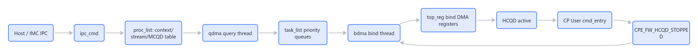
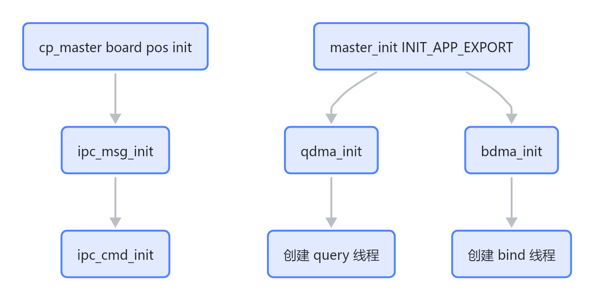
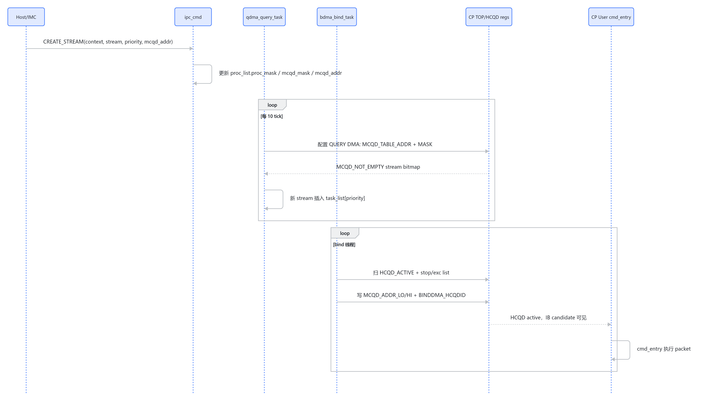

# CP Master 架构总览

CP Master 的核心职责不是直接执行 command packet，而是把 host/IMC 侧创建出来的 context/stream/MCQD 映射到硬件 HCQD 上，让 CP User 侧 `cmd_entry` 能从 HCQD 对应的 Interaction Buffer 继续取包执行。

源码位置：`/home/shuaishuai.zhu/fw/aigc_sdk/grace/applications/cp/master/`

## 一句话模型

> 图解源文件：[`01-一句话模型-flowchart.mmd`](../../../../_attachments/fw/cp-master/overview/whiteboard-mermaid/01-一句话模型-flowchart.mmd)。由 lark-whiteboard `whiteboard-cli` 从原 Mermaid 渲染。

## 模块分工

| 模块 | 源码 | 主要职责 |
|---|---|---|
| IPC CMD | `ipc_cmd.c/h` | 接收 create/destroy context/stream/event，维护 `proc_list`，处理销毁时的 HCQD stop/release |
| QDMA | `qdma.c/h` | 轮询有效 context，触发 query DMA，发现非空 MCQD stream，插入 `task_list[priority]` |
| BDMA | `bdma.c/h` | 从优先级 task list 取任务，寻找空闲 HCQD，配置 bind DMA，把 MCQD 绑定到 HCQD |
| top_reg | `top_reg.c/h` | 封装 CP TOP、HCQD、CPE、doorbell、event、memory remap 等寄存器访问 |
| dma_header | `dma_header.h` | 定义 `proc_list`、`task_info`、stop wait list 等公共数据结构 |

## 启动关系

> 图解源文件：[`02-启动关系-flowchart.mmd`](../../../../_attachments/fw/cp-master/overview/whiteboard-mermaid/02-启动关系-flowchart.mmd)。由 lark-whiteboard `whiteboard-cli` 从原 Mermaid 渲染。

关键证据：

- `board/cp_master/src/board.c::rt_hw_board_pos_init()` 调用 `ipc_msg_init()` 和 `ipc_cmd_init()`。
- `master/init.c::master_init()` 调用 `qdma_init()` 和 `bdma_init()`。
- `top_reg_sync_boot_ready()` 当前在 `master_init()` 中是注释状态，说明 boot ready 同步还没有在这条路径强制启用。

## 主流程

> 图解源文件：[`03-主流程-sequenceDiagram.mmd`](../../../../_attachments/fw/cp-master/overview/whiteboard-mermaid/03-主流程-sequenceDiagram.mmd)。由 lark-whiteboard `whiteboard-cli` 从原 Mermaid 渲染。

## 数据结构主线

| 数据结构 | 定义 | 含义 |
|---|---|---|
| `proc_list.proc_mask` | `dma_header.h` | 32-bit context bitmap，bit=1 表示 context 有有效 stream |
| `proc_table[context].mcqd_mask` | `dma_header.h` | 32-bit stream bitmap，bit=1 表示该 context 下 stream 有 MCQD |
| `proc_table[context].task_valid` | `dma_header.h` | 32-bit stream bitmap，防止同一 stream 被重复插入 task list |
| `task_list[8]` | `qdma.c` | 8 档优先级队列，QDMA 插入，BDMA 消费 |
| `bdma_exc_list` | `bdma.c` | 已绑定到 HCQD、正在执行的 stream 任务 |
| `bdma_stop_wait_list` | `bdma.c` | 已请求 stop，但还在等 HCQD 和 CP User 侧完成的任务 |

## 与 CP User 的边界

CP Master 只负责让 MCQD 绑定到 HCQD，以及在释放/销毁时让 HCQD 停下来。真正的 packet 执行在 CP User：

- Master 写 bind DMA 寄存器后，HCQD 变 active。
- User 侧 `ib_get_candidate_bitmask()` 看到 HCQD ready。
- User 侧 `cmd_entry()` 通过 `ib_peek_packet()` / `cmd_handle_packet()` 执行包。
- Master 要 stop/release HCQD 时，写 `TOP_REG_STOP_HCQDID`。
- User 的 `sf_stop_isr()` / `cmd_entry()` / `sf_handle_stop()` drop IB-resident packet，并写 `CPE_FW_HCQD_STOPPED` 通知 Master。
- Master 看到 `HCQD_STATUS` stop complete 且 `CPE_FW_HCQD_STOPPED` 置位后，写 release 并清状态。

详细图见 [[wiki/grace/fw/cp-master/master-user-interaction]]。

## 当前需要重点关注的源码事实

- QDMA 里 `qdma_get_mcqd_ready_status()` 存在，但在 `qdma_find_stream_insert_list()` 中被注释掉；当前只依赖 `MCQD_NOT_EMPTY` bitmap 入队。
- BDMA 的 `bdma_bind_task()` 是 `while (1)` 且没有显式 delay/yield；这可能是性能/抢占层面的风险点，需要结合 RT-Thread 优先级和实际波形验证。
- destroy context 中 `top_reg_context_flush()` 和 `ipc_cmd_context_task_remove()` 被注释；当前 destroy context 只是清 `proc_list`，不会主动 flush 正在执行的 HCQD。
- destroy stream 会同步 stop/release 对应 HCQD，属于比 destroy context 更完整的释放路径。

## 推荐阅读顺序

1. [[wiki/grace/fw/cp-master/ipc_cmd]]：先看 context/stream 如何进入 `proc_list`。
2. [[wiki/grace/fw/cp-master/qdma]]：再看 MCQD 如何被发现并进入优先级队列。
3. [[wiki/grace/fw/cp-master/bdma]]：再看 task 如何绑定/停止/释放 HCQD。
4. [[wiki/grace/fw/cp-master/top_reg]]：最后查寄存器和状态位。
5. [[wiki/grace/fw/cp-master/master-user-interaction]]：把 Master 和 User 合在一起看。