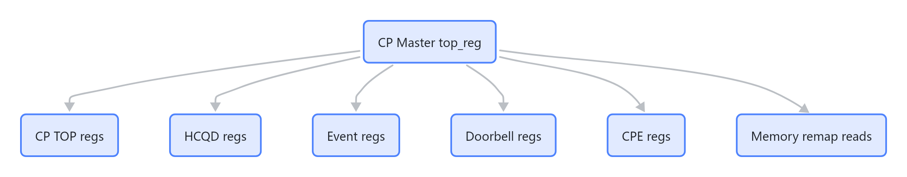
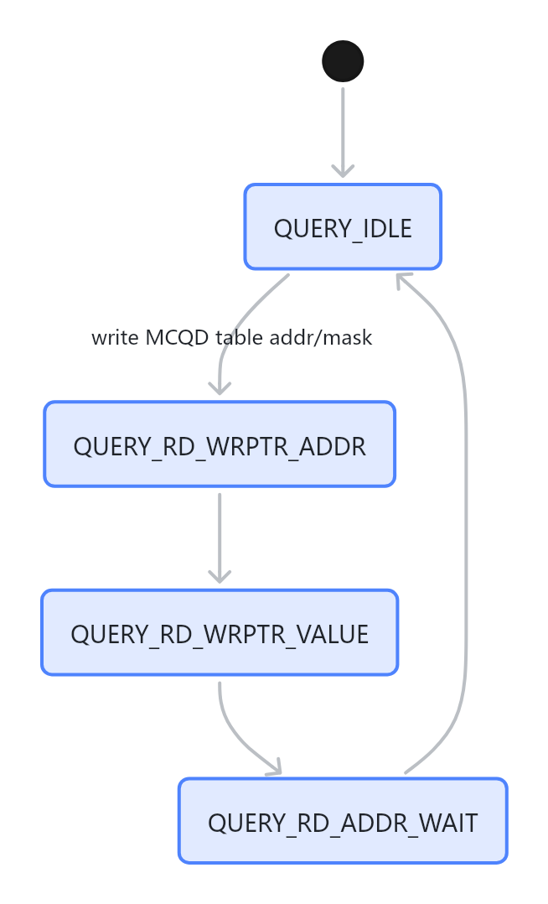
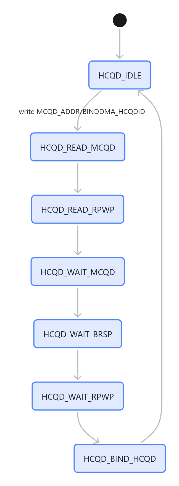

# CP Master top_reg 寄存器封装

`top_reg.c/h` 是 CP Master 访问硬件的集中封装。QDMA、BDMA、IPC CMD 都不直接拼寄存器地址，而是通过这里访问 TOP、HCQD、Event、Doorbell、CPE 和 remap 后的 memory。

## 寄存器分区



> 图解源文件：[`01-寄存器分区-flowchart.mmd`](../../../../_attachments/fw/cp-master/top_reg/whiteboard-mermaid/01-寄存器分区-flowchart.mmd)。由 lark-whiteboard `whiteboard-cli` 从原 Mermaid 渲染。

## TOP 寄存器表

| 名称 | offset | 读写者 | 作用 |
|---|---:|---|---|
| `TOP_REG_MCQD_TABLE_ADDR_LO` | `0x144` | QDMA | query DMA 输入：MCQD table 地址低位 |
| `TOP_REG_MCQD_TABLE_ADDR_HI` | `0x148` | QDMA | query DMA 输入：MCQD table 地址高位 |
| `TOP_REG_MCQD_TABLE_MASK` | `0x14C` | QDMA | query DMA 输入：stream mask |
| `TOP_REG_QUERY_STATUS` | `0x150` | QDMA | query DMA 状态，等待 `QUERY_IDLE` |
| `TOP_REG_MCQD_NOT_EMPTY` | `0x154` | QDMA | query DMA 输出：非空 stream bitmap |
| `TOP_REG_MCQD_ADDR_LO` | `0x164` | BDMA | bind DMA 输入：MCQD 地址低位 |
| `TOP_REG_MCQD_ADDR_HI` | `0x168` | BDMA | bind DMA 输入：MCQD 地址高位 |
| `TOP_REG_BINDDMA_HCQDID` | `0x16C` | BDMA | bind DMA 输入：目标 HCQD |
| `TOP_REG_BINDDMA_STATUS` | `0x170` | BDMA | bind DMA 状态，等待 `HCQD_IDLE` |
| `TOP_REG_STOP_HCQDID` | `0x304` | BDMA/IPC | 请求停止 HCQD fetch/exe |
| `TOP_REG_RELEASE_HCQDID` | `0x308` | BDMA/IPC | release HCQD 绑定 |
| `TOP_REG_FLUSH_ASID` | `0xC28` | IPC/User SF | context flush ASID，bit[5] valid，bit[4:0] context id |
| `TOP_REG_MCU_FW_INDEX` | `0xC34` | boot | 写 CP master index 表示 boot ready |

## HCQD 寄存器表

HCQD offset 计算：

```text
hcqd_offset = (hcqd_id / 8) * 0x1000 + (hcqd_id % 8) * 0x80
```

| 名称 | offset | 用途 |
|---|---:|---|
| `TOP_REG_HCQD_WPTR` | `0x18` | ringbuffer write pointer |
| `TOP_REG_HCQD_EXE_RPTR` | `0x20` | execute read pointer |
| `TOP_REG_HCQD_STATUS` | `0x30` | idle、bus idle、OSD count 等状态 |
| `TOP_REG_HCQD_ACTIVE` | `0x7C` | HCQD 是否已绑定/active |

`TOP_REG_HCQD_STATUS` 里 stop complete 的判断条件：

```text
finish_osd_cnt == 0
cost_osd_cnt == 0
bus_rd_idle == 1
bus_wr_idle == 1
```

## CPE 交互寄存器

| 名称 | offset | Master 视角 | User 视角 |
|---|---:|---|---|
| `CPE_FW_HCQD_STOPPED` | `0x300` | 读取 CP User 是否完成 stop/drop；完成后清 bit | `sf_handle_stop/flush` 置 bit 通知 Master |
| `CPE_HCQD_STOPPED` | `0x304` | 硬件/stop 请求侧状态 | User `sf_stop_isr` 读取 stop bitmap |

Master 侧 `top_reg_get_fw_hcqd_stop()` 会按 `hcqd_id / 8` 定位 core，再读对应 CPE 的 `CPE_FW_HCQD_STOPPED`。

## Query DMA 状态机



> 图解源文件：[`02-Query-DMA-状态机-stateDiagram-v2.mmd`](../../../../_attachments/fw/cp-master/top_reg/whiteboard-mermaid/02-Query-DMA-状态机-stateDiagram-v2.mmd)。由 lark-whiteboard `whiteboard-cli` 从原 Mermaid 渲染。

源码中只轮询 `TOP_REG_QUERY_STATUS & QUERY_STATUS_MASK == QUERY_IDLE`，没有展开处理中间状态。中间状态用于解释波形或寄存器 dump。

## Bind DMA 状态机



> 图解源文件：[`03-Bind-DMA-状态机-stateDiagram-v2.mmd`](../../../../_attachments/fw/cp-master/top_reg/whiteboard-mermaid/03-Bind-DMA-状态机-stateDiagram-v2.mmd)。由 lark-whiteboard `whiteboard-cli` 从原 Mermaid 渲染。

BDMA 当前只等待 `TOP_REG_BINDDMA_STATUS & BDMA_STATUS_MASK == HCQD_IDLE`，超时后没有错误返回，只是跳出等待函数继续执行。这是一个需要 review 的风险点。

## Memory remap 读取

`top_reg_memory_read32(addr)` 会配置 IB remap：

- `IB_AWDATA_REMAP0_LO/HI`
- `IB_ARDATA_REMAP0_LO/HI`

然后读：

```text
MEMORY_MAP_BASE + (addr & 0x0FFFFFFF)
```

它被用于读取 MCQD 内部字段，例如：

- `TOP_REG_MCQD_DOORBELL_ID = 0x0`
- `TOP_REG_MCQD_WRPTR_ADDR_LO = 0x24`
- `TOP_REG_MCQD_WRPTR_ADDR_HI = 0x28`
- `TOP_REG_WRPTR_WRITE_POINTER = 0x0`

## 读代码时的判断规则

- QDMA 主要看 `QUERY_STATUS / MCQD_NOT_EMPTY`。
- BDMA 主要看 `BINDDMA_STATUS / HCQD_ACTIVE / HCQD_STATUS`。
- stop/release 主要看 `STOP_HCQDID / RELEASE_HCQDID / CPE_FW_HCQD_STOPPED`。
- CP User 交互主要看 `CPE_HCQD_STOPPED` 和 `CPE_FW_HCQD_STOPPED`。