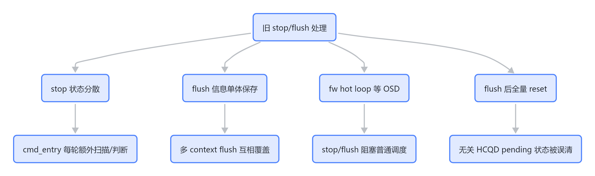
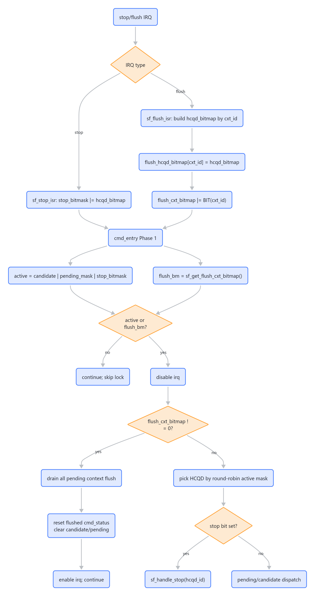
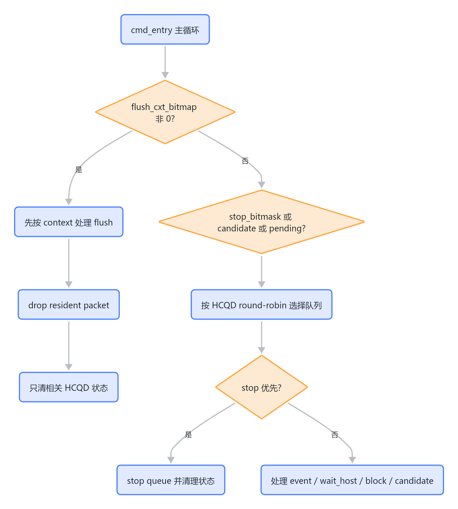
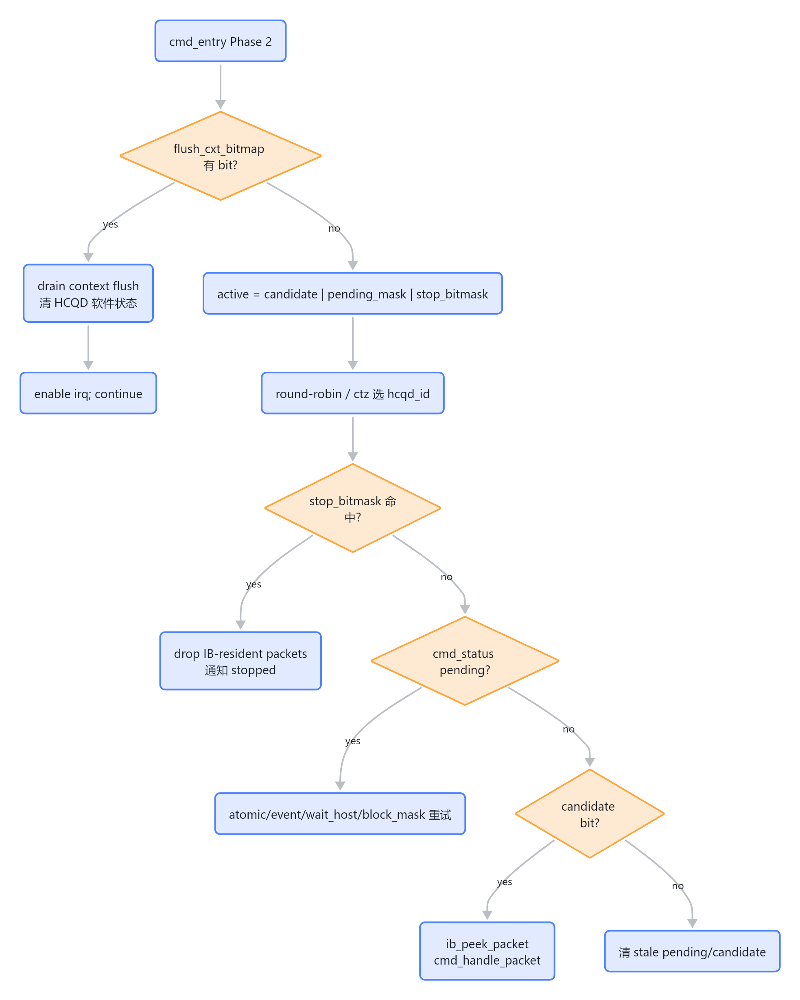
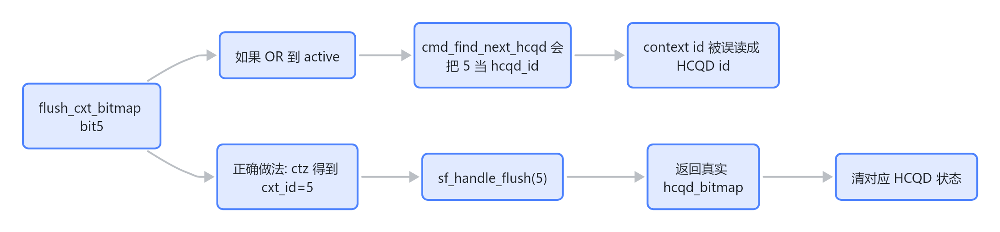

# CP stop flush 与 queue 切换

## 结论

stop/flush 是 `cmd_entry()` 调度中优先级最高的控制类事件。当前实现把 HCQD 维度和 context 维度拆开：

- `stop_bitmask`：HCQD-id space，参与 `active = candidate | pending_mask | stop_bitmask`。
- `flush_cxt_bitmap`：context-id space，只用于判断是否有 pending flush。
- `flush_hcqd_bitmap[cxt_id]`：context 对应的 HCQD bitmap，由 `sf_handle_flush(cxt_id)` 返回给 `cmd_entry()` 做精确清理。

## MAS 视角：queue scheduling 全链路

MAS 文档定义的 queue 切换流程：

1. Master MCU 查询哪个 [[MCQD]] ready。
2. 如果需要切换 queue，则触发 `stop_hcqd`。
3. [[HCQD]] 停止 fetch，并等待 read 返回后进入 queue stopped。
4. User MCU disable [[iDMA]]，读取 `RD_RB` 状态并 drop rb_fifo 中的 packet。
5. firmware 写回 `fw_hcqd_stopped`。
6. Master MCU 确认 stop 完成后 release HCQD，再 bind 新的 MCQD，并清 stop bit。

`process flush` 来自 MAS 的 `flush_asid`：按 context/asid 停止相关 HCQD fetch，由 `sf_flush_isr()` 扫描当前 core 的 HCQD attr/asid 和 active queue，生成 hcqd_bitmap，再交给 firmware 处理。

## 背景：为什么要改

stop/flush 的难点不在于"多处理两个中断"，而在于它们会打断 `cmd_entry()` 的普通调度路径：

- `cmd_entry()` 平时围绕 candidate cache、pending_mask、round-robin 选择 HCQD。
- stop 是 HCQD 级控制事件，必须能在没有新 candidate 时仍被调度到。
- flush 是 context 级控制事件，但最终要清的是该 context 下的一组 HCQD。
- stop/flush 发生时，如果还继续普通 dispatch，旧 packet 可能在 flush 后继续执行。

旧设计的问题可以概括为四类：

> 图解源文件：[`01-背景-为什么要改-flowchart.mmd`](../../../../_attachments/fw/cp-user/CP stop flush 与 queue 切换/whiteboard-mermaid/01-背景-为什么要改-flowchart.mmd)。由 lark-whiteboard `whiteboard-cli` 从原 Mermaid 渲染。

## 为什么这样修改

| 改动 | 原因 | 收益 |
|---|---|---|
| stop 改成 `stop_bitmask` | stop 是 HCQD 级事件，天然适合进入 HCQD active mask | O(1) 合入调度；无 candidate 时也不会漏 stop |
| flush 拆成 `flush_cxt_bitmap` + `flush_hcqd_bitmap[cxt_id]` | flush 是 context 触发，但清理对象是 HCQD 集合 | 多 context flush 不覆盖；context space 和 HCQD space 边界清楚 |
| flush 在 Phase 2 最高优先级处理 | context 已经要求清理，不能继续普通 dispatch | 避免旧 packet 在 flush 后继续执行 |
| flush 返回 processed HCQD bitmap | `cmd_entry()` 需要知道清了哪些 HCQD | 精确 reset `cmd_status/candidate/pending_mask` |
| stopped 寄存器 read-modify-write | `CPE_FW_HCQD_STOPPED` 是 bitfield | 不覆盖其他 HCQD stopped bit |

## 当前主流程

> 图解源文件：[`02-当前主流程-flowchart.mmd`](../../../../_attachments/fw/cp-user/CP stop flush 与 queue 切换/whiteboard-mermaid/02-当前主流程-flowchart.mmd)。由 lark-whiteboard `whiteboard-cli` 从原 Mermaid 渲染。

## 代码对应

- `sf_stop_isr()` 读取 `CPE_HCQD_STOPPED` 并累计 `stop_bitmask`。
- [[cmd_entry]] 看到 stop bit 后调用 `sf_handle_stop()`。
- `sf_handle_stop()` / `sf_handle_flush()` 共用 `sf_drop_hcqd_packets()`，根据 `cost_osd_cnt` 多次 `ib_drop_packet()`。
- 完成后写 `CPE_FW_HCQD_STOPPED` 通知 master MCU。

## 关键语义

- flush 优先于普通 dispatch。持锁后 `cmd_entry()` 会重新读 `flush_cxt_bitmap`，并一次 drain 所有 pending context。
- stop 加入 HCQD active mask，所以即使没有新的 candidate，也能被调度到。
- flush 完成后只 reset 被 flush 的 HCQD，不再全量清空 `cmd_status`。
- stop/flush 都使用 `readl + OR + writel` 更新 `CPE_FW_HCQD_STOPPED`，避免覆盖其他 HCQD stopped bit。

## 改动收益

- 正确性：修复单体 flush 信息被后续 context 覆盖的风险。
- 性能：hot loop 不再扫描 stop flag 或所有 context；常态路径只做 bitmap 判断。
- 隔离性：flush 只清理被 flush 的 HCQD，不破坏无关 HCQD 的 pending 状态。
- 可验证性：波形/trace 可以按 `flush_cxt_bitmap → cxt_id → hcqd_bitmap → clean` 或 `stop_bitmask → hcqd_id → drop` 两条链路检查。
- 可维护性：stop/flush drop 逻辑统一收敛到 `sf_drop_hcqd_packets()`，减少两套逻辑漂移。

## 风险点

- stop/flush 必须区分 consume/drop/finish：drop 会改变 HCQD `exe/rptr` 语义，错误处理可能影响后续 bind 的 ringbuffer packet。
- atomic `cmp_swap` 相关的 `stopped_on_loop` / `ato_osd_dec` 行为在 `sf.c` 中是重点风险，需要和 MAS 的 queue stop 语义保持一致。
- `stop_bitmask` 的 set/clear 仍是直接 RMW（`stop_bitmask |= hcqd_bitmap; stop_bitmask &= ~BIT(hcqd_id);`）。如果 stop ISR 和 `sf_handle_stop/flush()` 的 clear 窗口重叠，理论上有 stale write 覆盖新 bit 的风险。后续修代码时应优先封装 stop bit set/clear，并用同一类临界区保护。

## 调度优先级视角（queue scheduling）

> 本节由原 `CP queue scheduling stop flush` 专题页合并而来：从调度器角度解释 stop/flush 为何这样排序，以及它们如何影响 `active` bitmap、`pending_mask`、candidate cache。

核心问题不是"有没有 stop/flush 处理函数"，而是 stop/flush 能否在多 HCQD、多 context、candidate 缓存、pending 状态同时存在时，仍保持正确的优先级和隔离性。

stop/flush 是"改变 queue 有效性"的控制事件，不是普通 packet。旧逻辑若把它们与普通 dispatch 混在一起，会有三个问题：stop 可能要依赖 candidate 才被看见（但 stop 应能主动唤醒对应 HCQD）；flush 是 context 事件，单一全局 flush 信息会被连续 flush 互相覆盖；flush 后全量清 `cmd_status` 会误伤其他未被 flush 的 HCQD。

### 四类维度的调度含义

| 场景 | 维度 | 对 queue 的含义 | `cmd_entry()` 动作 |
|---|---|---|---|
| 普通 candidate | HCQD | 该 HCQD 有新 packet | peek 后按 packet 类型处理 |
| pending | HCQD | packet 已 peek，但依赖未满足 | 不重复 peek，继续推进状态机 |
| stop | HCQD | 单个 HCQD 需打断/drop | 进入 `active`，优先于 pending/candidate |
| flush | context | 一个 context 下相关 HCQD 都要失效 | 先按 context drain，再精确清 HCQD bit |

### 为什么 flush 不放进 active

`active` 只包含 HCQD bit。flush 是 context space 的控制面事件，必须先转成 `flush_hcqd_bitmap[cxt_id]`，才能清 HCQD 状态；stop 是 HCQD space 事件，可直接进入 `active`；pending 代表"同一 HCQD 的当前 packet 还没完成"，不代表 queue 里有新 packet。

### 复习检查点

- 能解释 `active` 为什么只包含 HCQD bit。
- 能解释 stop 为什么即使没有 candidate 也要被调度。
- 能解释 flush 为什么在 Phase 2 内优先，并一次 drain 多个 context。
- 能解释 `pending_mask` 如何避免 event/wait_host 重复 peek。

> 图解源文件均在 `_attachments/fw/cp-user/CP queue scheduling stop flush/whiteboard-mermaid/`（lark-whiteboard 从 Mermaid 渲染）。

## 关联

- [[cmd_entry]]（含 Candidate V7 调度设计与分支布局）
- [[CP cmd_entry 热路径与分支布局优化]]
- [[CP command processing flow]]
- [[Interaction-Buffer]]
- [[HCQD]]
- [[MCQD]]
- [[GraceC CP MAS v1.4 code knowledge map]]
