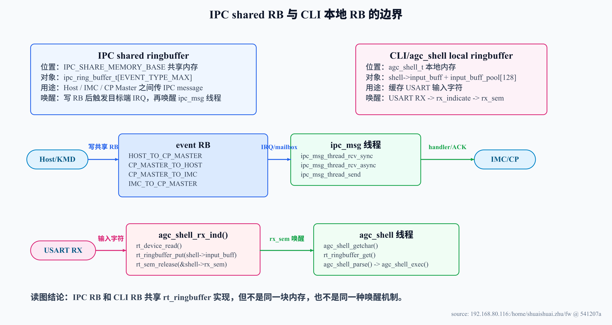
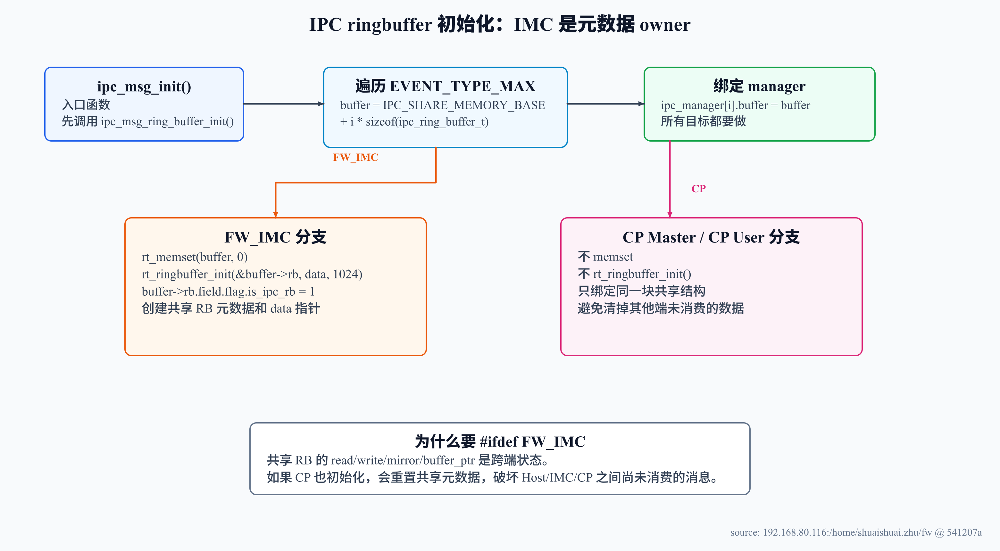
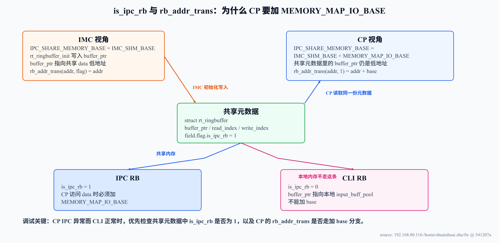
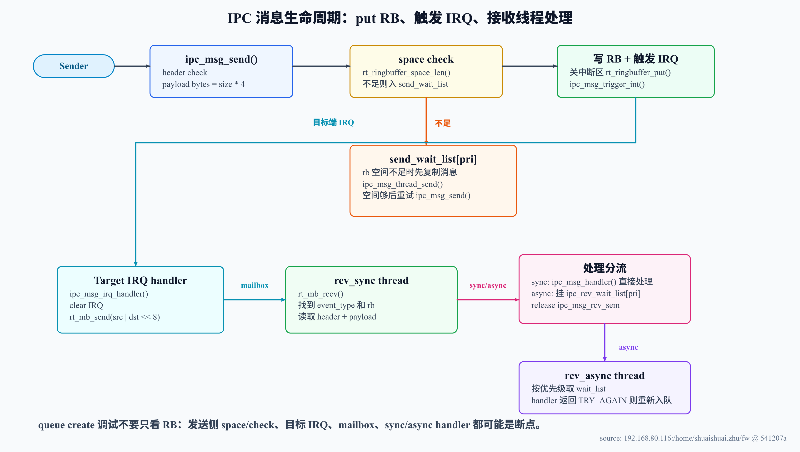
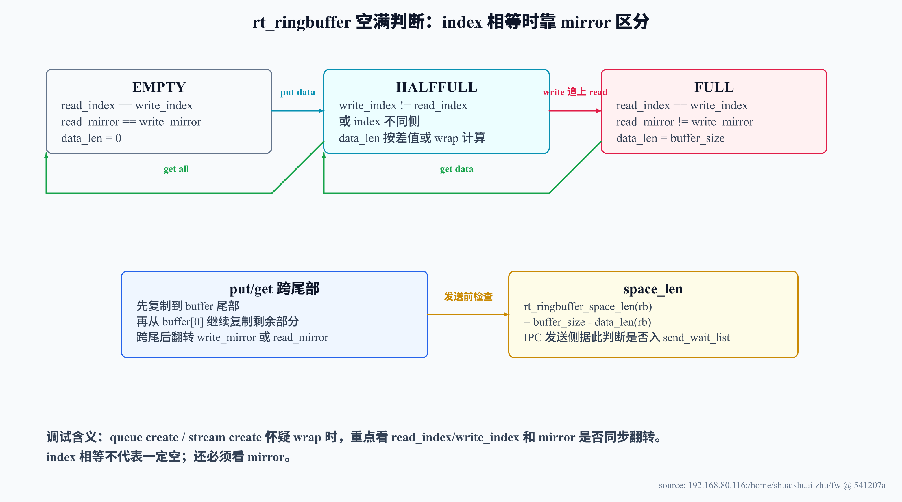

---
type: learning-guide
title: "CP ringbuffer IPC 与 queue create 调试"
created: 2026-05-09
updated: 2026-06-03
tags:
  - fw
  - cp
  - ringbuffer
  - ipc
  - cli
  - queue_create
  - debug
status: active
source:
  - "192.168.80.116:/home/shuaishuai.zhu/fw/aigc_sdk/grace/applications/ipc/ipc_msg.c"
  - "192.168.80.116:/home/shuaishuai.zhu/fw/aigc_sdk/grace/applications/ipc/ipc_msg.h"
  - "192.168.80.116:/home/shuaishuai.zhu/fw/rtthread/components/drivers/ipc/ringbuffer.c"
  - "192.168.80.116:/home/shuaishuai.zhu/fw/rtthread/components/drivers/include/ipc/ringbuffer.h"
  - "192.168.80.116:/home/shuaishuai.zhu/fw/aigc_sdk/grace/board/*/src/per_map.h"
  - "192.168.80.116:/home/shuaishuai.zhu/fw/test/framework/shell/agc_shell.c"
related:
  - "[[wiki/grace/fw/cli/grace-usart-console-cli|Grace USART、console 与 agc_shell 路径图解]]"
  - "[[wiki/grace/fw/flows/CP command processing flow|CP command processing flow]]"
  - "[[wiki/grace/fw/flows/CP command processing flow|CP 多队列多上下文与 HCQD MCQD]]"
---

# CP ringbuffer IPC 与 queue create 调试

> Source snapshot: 2026-06-03 从 `192.168.80.116:/home/shuaishuai.zhu/fw` 当前源码读取，当前 HEAD `541207a`。  
> Scope: 解释 CP IPC ringbuffer、AGC shell/CLI ringbuffer 的初始化、读写流程、地址转换差异和 queue create 调试关注点；不证明 Host/KMD/UMD 的运行时波形行为。
> Diagram note: 本页图解按 `technical-diagram-generator` workflow 重新生成，每张图均保留 SVG 源文件和 PNG 渲染图。

## 1. 一句话理解

`rt_ringbuffer` 是一个通用环形缓冲实现。当前 FW 里最容易混淆的是：IPC ringbuffer 和 CLI ringbuffer 共用同一套 API，但它们不是同一块内存，也不是同一个语义。

- IPC ringbuffer 是共享内存消息队列，放在 `IPC_SHARE_MEMORY_BASE`，由 IMC 初始化，CP 访问 data 时依赖 `is_ipc_rb` 触发地址转换。
- CLI ringbuffer 是 `agc_shell_t` 里的本地输入缓存，只缓存 USART 输入字符，不应该加 `MEMORY_MAP_IO_BASE`。

## 2. 系统边界：两个 ringbuffer 到底差在哪



> 图解源文件：[`ringbuffer-system-boundary-v3.svg`](../../../../_attachments/fw/debug/cp-ringbuffer/ringbuffer-system-boundary-v3.svg)。

读这张图时先看边界：IPC RB 连接 Host/IMC/CP，承载的是 `ipc_msg_t`；CLI RB 只在 USART RX 和 shell 线程之间传字符。它们都调用 `rt_ringbuffer_put/get/data_len/space_len`，但 IPC RB 多了跨地址空间和中断通知问题。

| 对比项 | IPC shared ringbuffer | CLI/agc_shell ringbuffer |
|---|---|---|
| 初始化入口 | `ipc_msg_ring_buffer_init()` | `agc_shell_init()` |
| ringbuffer 对象 | `ipc_ring_buffer_t.rb` | `shell->input_buff` |
| 数据区 | `ipc_ring_buffer_t.data[IPC_RING_BUFFER_SIZE]`，当前 IPC RB size 为 1024 | `shell->input_buff_pool[AGCSH_INPUT_BUFFER_SIZE]`，当前是 128B |
| 内存位置 | `IPC_SHARE_MEMORY_BASE` 指向的共享内存 | `agc_shell_t` 本地内存 |
| `is_ipc_rb` | IMC 初始化时置 1 | `rt_ringbuffer_init()` 清零，保持 0 |
| 唤醒路径 | IRQ -> mailbox -> `ipc_msg_thread_rcv_sync` | USART RX -> `agc_shell_rx_ind` -> `rx_sem` |
| 数据语义 | `ipc_msg_hdr_t + payload` | 串口输入字符 |

## 3. IPC ringbuffer 初始化：为什么只有 IMC 真正 init



> 图解源文件：[`ringbuffer-ipc-init-owner-v3.svg`](../../../../_attachments/fw/debug/cp-ringbuffer/ringbuffer-ipc-init-owner-v3.svg)。

`ipc_msg_ring_buffer_init()` 会遍历 `EVENT_TYPE_MAX`，按 event type 在共享内存里切出多个 `ipc_ring_buffer_t`。每个 `ipc_ring_buffer_t` 都包含一个 `struct rt_ringbuffer rb` 和后面的 `data[IPC_RING_BUFFER_SIZE]`。

源码事实：

- IMC 的 `IPC_SHARE_MEMORY_BASE = IMC_SHM_BASE`。
- CP Master/User 的 `IPC_SHARE_MEMORY_BASE = IMC_SHM_BASE + MEMORY_MAP_IO_BASE`。
- `ipc_msg_ring_buffer_init()` 里只有 `#ifdef FW_IMC` 分支会 `memset`、`rt_ringbuffer_init()`、设置 `buffer->rb.field.flag.is_ipc_rb = 1`。
- 所有端都会执行 `ipc_manager[i].buffer = buffer`，也就是绑定到对应 event type 的共享结构。

这样做的原因是共享 RB 的 `read_index/write_index/mirror/buffer_ptr` 是跨端共享状态。IMC 作为 owner 初始化一次即可；如果 CP 也清零或重置这些元数据，就可能把 Host/IMC/CP 已写入但未消费的消息破坏掉。

## 4. 地址转换：`is_ipc_rb` 到底保护了什么



> 图解源文件：[`ringbuffer-address-translation-v3.svg`](../../../../_attachments/fw/debug/cp-ringbuffer/ringbuffer-address-translation-v3.svg)。

`ringbuffer.c` 的 `rt_ringbuffer_put()` 和 `rt_ringbuffer_get()` 都会先做：

```text
buffer_ptr = rb_addr_trans(rb->buffer_ptr, rb->field.flag.is_ipc_rb)
```

这里的关键不是 ringbuffer 算法本身，而是 `buffer_ptr` 的地址语义：

- IMC 初始化 IPC RB 时，`rb.buffer_ptr` 写入的是 IMC 视角的共享内存低地址。
- CP 读取这份共享元数据时，看到的 `buffer_ptr` 仍然是低地址。
- CP 的 `rb_addr_trans(addr, 1)` 会返回 `addr + MEMORY_MAP_IO_BASE`，这样才能访问到 CP 视角的共享内存。
- IMC 的 `rb_addr_trans(addr, flag)` 直接返回 `addr`。

这就是为什么 `is_ipc_rb = 1` 必须保存在共享元数据里。它不是为了 CLI RB，而是为了告诉 CP：这个 `buffer_ptr` 来自共享 IPC RB，需要做 MMIO base 转换。

CLI RB 正好相反：`shell->input_buff_pool` 是本地内存，`rt_ringbuffer_init()` 会把 `field.value = 0`，因此 `is_ipc_rb = 0`。如果给 CLI RB 加 base，反而会访问错误地址。

## 5. IPC 发送流程：写 RB 只是其中一步



> 图解源文件：[`ringbuffer-ipc-message-flow-v3.svg`](../../../../_attachments/fw/debug/cp-ringbuffer/ringbuffer-ipc-message-flow-v3.svg)。

`ipc_msg_send()` 的流程可以按 5 步读：

1. `ipc_msg_send_header_check()` 检查 `event_type/source/target/size`。
2. `data_size = message->head.size * sizeof(rt_uint32_t)`，注意 header 里的 `size` 单位是 `uint32`，不是 byte。
3. 如果 `rt_ringbuffer_space_len(rb)` 不够容纳 `sizeof(ipc_msg_hdr_t) + data_size`，消息会被复制到 `ipc_send_wait_list[pri]`，再 release `ipc_msg_send_sem`。
4. 如果空间足够，代码把 header 和 payload 拼成临时连续 buffer，在关中断区调用一次 `rt_ringbuffer_put()`。
5. 写完 RB 后调用 `ipc_msg_trigger_int()`，通过 `hal_int_ctrl_cmd(INT_CTRL_SET)` 触发目标端 IRQ。

所以 queue create / stream create 调试时，不能只盯着 RB 是否写入。即使 `rt_ringbuffer_put()` 成功，目标端还要收到 IRQ，`ipc_msg_irq_handler()` 还要把 `src | dst << 8` 发到 `ipc_mb`，接收线程才会继续处理。

## 6. IPC 接收流程：mailbox、sync、async 和 TRY_AGAIN

目标端 IRQ 到来后，`ipc_msg_irq_handler()` 会：

1. 根据 irqno 反推出 `src/dst`。
2. 清 interrupt controller，对 CP Master 还会清 IB IRQ。
3. 通过 `rt_mb_send(ipc_mb, src | (dst << IPC_MAILBOX_DST_OFFSET))` 唤醒接收线程。

`ipc_msg_thread_rcv_sync()` 被唤醒后：

1. 根据 `src/dst` 找到匹配的 `ipc_manager[i]` 和 `event_type`。
2. 只在 `rt_ringbuffer_data_len(rb) > sizeof(ipc_msg_hdr_t)` 时读取 header。
3. 用 `ipc_msg_rcv_header_check()` 验证 `event_type/source/target/size`。
4. 读取 payload 后，如果 `msg->head.sync` 为 1，直接调用 `ipc_msg_handler()`。
5. 如果是 async，则挂到 `ipc_rcv_wait_list[pri]`，release `ipc_msg_rcv_sem`。

`ipc_msg_thread_rcv_async()` 会按优先级取 wait list。如果 handler 返回 `IPC_EVENT_TRY_AGAIN`，当前 node 会重新挂回原优先级链表；否则释放 payload 和 node。

需要注意一个危险点：header 已经从 RB 读出后，如果 payload 不足或 header 不合法，当前实现会读掉 RB 当前剩余数据并丢弃，用来重新同步队列边界。这能避免一直卡在坏 header 上，但也意味着一次坏包可能吞掉后续残留数据。

## 7. ringbuffer 算法：index 相等不一定是空



> 图解源文件：[`ringbuffer-mirror-wrap-debug-v3.svg`](../../../../_attachments/fw/debug/cp-ringbuffer/ringbuffer-mirror-wrap-debug-v3.svg)。

`rt_ringbuffer_status()` 的核心规则：

| 状态 | 条件 | `rt_ringbuffer_data_len()` |
|---|---|---|
| EMPTY | `read_index == write_index` 且 `read_mirror == write_mirror` | 0 |
| FULL | `read_index == write_index` 且 `read_mirror != write_mirror` | `buffer_size` |
| HALFFULL | `write_index > read_index` | `write_index - read_index` |
| HALFFULL wrap | `write_index <= read_index` | `buffer_size - (read_index - write_index)` |

`rt_ringbuffer_put()` 和 `rt_ringbuffer_get()` 在跨过 buffer 尾部时会拆成两段 memcpy：先处理尾部，再从 `buffer[0]` 继续处理，并翻转对应 mirror。调试 wrap 问题时，不要只看 index 数值；index 相等时必须同时看 mirror。

## 8. queue create 调试时怎么用这页

如果 queue create / stream create 卡在 IPC 或 RB，按这个顺序查：

1. **event type 是否正确。** Host->CP Master、CP Master->Host、CP Master->IMC、IMC->CP Master 不要混。
2. **header 是否匹配 manager。** `source/target/event_type/size` 必须通过 `ipc_msg_send_header_check()` 或 `ipc_msg_rcv_header_check()`。
3. **payload size 单位是否弄错。** `ipc_msg_hdr_t.size` 的单位是 `uint32`，真实 bytes 是 `size * 4`。
4. **RB 是否真的有空间。** `space_len < header + payload` 会进入 `ipc_send_wait_list[pri]`，不是立即发送。
5. **IMC 是否初始化了 IPC RB。** 重点看 `rt_ringbuffer_init()` 和 `is_ipc_rb = 1` 是否执行过。
6. **CP 侧地址转换是否正确。** CP 的 `rb_addr_trans(addr, 1)` 应该加 `MEMORY_MAP_IO_BASE`。
7. **IRQ/mailbox 是否推动接收线程。** 写 RB 后还要 `ipc_msg_trigger_int()`，目标端还要 `rt_mb_send()`。
8. **async 是否反复 TRY_AGAIN。** 如果 handler 永久返回 `IPC_EVENT_TRY_AGAIN`，消息会常驻 wait list。

## 9. IPC RB 与 CLI RB 调试检查清单

### IPC RB

- `ipc_manager[event_type]` 的 `src_id/dst_id` 是否和 message header 一致。
- IMC 是否执行 `rt_ringbuffer_init()` 并设置 `is_ipc_rb = 1`。
- CP 侧 `rb_addr_trans()` 是否根据 `is_ipc_rb=1` 加 `MEMORY_MAP_IO_BASE`。
- `rt_ringbuffer_space_len()` 是否足够写入 header + payload。
- `rt_ringbuffer_data_len()` 是否大于 header size，接收线程才会读取。
- 目标端 IRQ 是否到达，并映射到正确 `src/dst/event_type`。

### CLI RB

- `agc_shell_init()` 是否执行，`shell->input_buff_pool[128]` 是否初始化。
- `agc_shell_rx_ind()` 是否从 device 读到字符并 `rt_ringbuffer_put()`。
- `rx_sem` 是否 release，shell 线程是否从 `agc_shell_getchar()` 醒来。
- 如果看到 `console buffer full get ... space ...`，这是 CLI 本地输入 RB 满，不代表 IPC shared RB 满。

## 10. 常见误区

1. **把 IPC RB 和 CLI RB 当成同一块内存。** 它们只是共用 `rt_ringbuffer` API。
2. **认为 CP 也应该初始化 IPC RB。** CP 只应该绑定共享结构，不应该清零共享元数据。
3. **忘记 `is_ipc_rb` 的地址语义。** 它决定 CP 是否给共享 RB data 指针加 `MEMORY_MAP_IO_BASE`。
4. **只看 ringbuffer，不看 IRQ。** IPC message 需要 RB + interrupt + mailbox + thread 一起推进。
5. **把 payload size 当 byte。** `size` 是 `uint32` 个数。

## 11. 速记

- IPC RB：共享内存，IMC 初始化，CP 只绑定，`is_ipc_rb=1`，CP 访问 data 要加 `MEMORY_MAP_IO_BASE`。
- CLI RB：shell 本地输入缓冲，`agc_shell_init()` 初始化，`is_ipc_rb=0`，不做地址转换。
- 发送链路：header check -> space check -> put header+payload -> trigger IRQ。
- 接收链路：IRQ -> mailbox -> rcv_sync -> header/payload -> sync handler 或 async wait list。
- wrap 判断：index 相等时靠 mirror 区分空/满。
