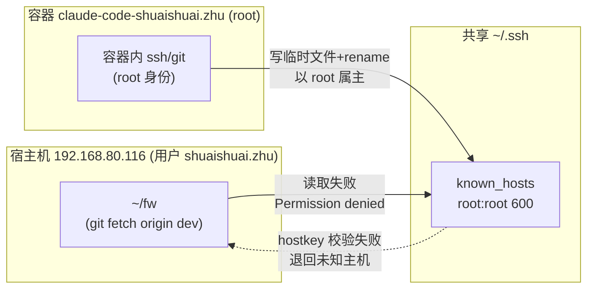

# Git fetch known_hosts 与 Docker 共享 SSH 排查

**关联**: [[wiki/grace/fw/env|服务器环境 & 构建]] · [[wiki/grace/fw/debug/index|FW 调试索引]]

> 一次 `git fetch` 报 `known_hosts: Permission denied` 的排查。根因不是 known_hosts 内容，而是 **Docker 容器以 root 身份共享 `~/.ssh`，把 `known_hosts` 属主污染成 root**。

---

## 症状

`192.168.80.116` 上 `~/fw` 仓 `git fetch origin dev`（remote = `git@192.168.90.119:fw/fw.git`）：

```
hostkeys_find_by_key_hostfile: hostkeys_foreach failed for /home/shuaishuai.zhu/.ssh/known_hosts: Permission denied
The authenticity of host '192.168.90.119 (192.168.90.119)' can't be established.
ED25519 key fingerprint is SHA256:qdMHkNZN12vootrBUIxUo5XbcUwCIpnSudJQPJmtFnc.
This key is not known by any other names
Are you sure you want to continue connecting (yes/no/[fingerprint])?
```

表面看像"首次连接、主机未信任"，但 `90.119` 早就连过无数遍——**真正信号是第一行 `Permission denied`**：ssh 连 `known_hosts` 都打不开。

---

## 根因

### 1. known_hosts 属主是 root

```bash
$ ls -la ~/.ssh/known_hosts
-rw------- 1 root root 2098  /home/shuaishuai.zhu/.ssh/known_hosts
-rw------- 1 root root      known_hosts.old
-rw------- 1 root root      known_hosts.root.bak
```

宿主用户 `shuaishuai.zhu`（uid 1056，home 实为 `/data3/shuaishuai.zhu`）读不了 `600 root:root` 的文件 → ssh `hostkeys_foreach` 失败 → 退回"未知主机"交互提示。三个 `known_hosts*` 全是 root 属主、时间戳一致（6月13日），明显是某个 root 进程批量写过。

### 2. 污染源是 Docker 容器

容器 `claude-code-shuaishuai.zhu`（image `192.168.90.119:5000/claude-code:shuaishuai.zhu`）**以 root 运行**，挂载：

| 宿主路径 | 容器内 | 说明 |
|---|---|---|
| `/home/shuaishuai.zhu/.gitconfig` | `/root/.gitconfig` | ro |
| `/home/shuaishuai.zhu/.ssh` | `/root/.ssh` | **读写共享** |
| `/home/shuaishuai.zhu/work` | `/root/workspace` | 容器工作区 |
| `/home/shuaishuai.zhu/.claude-config` | `/root/.claude` | |

容器内任何 ssh/git 操作以 root 身份执行。ssh 更新 `known_hosts` 用"写临时文件 + `rename`"原子替换，执行者是 root，于是宿主上 `~/.ssh/known_hosts` 属主被改写成 `root:root`。

**关键**：容器只挂 `~/work`，**不挂 `~/fw`**。宿主 `~/fw` 与容器 `~/work/fw` 是两套 repo。

### 数据流



宿主和容器共享同一 `~/.ssh`，是天然冲突：容器 root 写、宿主普通用户读，属主一旦被 root 抢走，宿主就再也读不了。

---

## 解法

**目标**：① 宿主 git 能读 known_hosts；② 容器内 root 的 git 不受影响；③ 免 sudo（`sudo` 需密码）；④ 持久。

思路：让宿主 git 和容器 git 用**各自独立的 known_hosts 文件**，互不污染。

### 1. 宿主专用 known_hosts.local

```bash
KH=~/.ssh/known_hosts.local
ssh-keyscan -t ed25519,rsa 192.168.90.119 2>/dev/null > "$KH"   # 预填 host key
chmod 600 "$KH"                                                  # 属主=自己
```

### 2. 仓库级 core.sshCommand（只在 ~/fw 生效）

```bash
cd ~/fw
git config core.sshCommand \
  "ssh -o UserKnownHostsFile=/home/shuaishuai.zhu/.ssh/known_hosts.local -o StrictHostKeyChecking=yes -o ServerAliveInterval=30"
```

容器**不挂载 `~/fw`**，所以这个仓库级配置对容器零影响。默认 `known_hosts`（root 属主）保持不动，继续供容器使用。

### 3. 不要用全局 config

> **踩过的坑**：曾试过写 `~/.ssh/config` 全局 `UserKnownHostsFile` + `Match exec "test ! -f /.dockerenv"` 区分容器/宿主。但 `~/.ssh/config` 也被容器共享，属主是 `shuaishuai.zhu`，容器内 ssh 以 root 运行，ssh 安全检查拒绝读"属主不是 root/当前用户"的 config：

```
Bad owner or permissions on /root/.ssh/config
fatal: Could not read from remote repository.
```

直接**破坏了容器 ssh**，违反"不影响容器"目标。已删除该 config 回退。

同理 **`~/.gitconfig` 也别用 `--global`** 设 sshCommand——它被容器 ro 挂载共享，会影响容器所有 git。

---

## 验证

| 场景 | 命令 | 结果 |
|---|---|---|
| 宿主 `~/fw` fetch | `git fetch origin dev` | ✅ exit 0，走 `known_hosts.local` |
| 确认宿主用的文件 | `ssh -v ... \| grep "Found key in"` | `Found key in .../known_hosts.local:2` |
| 容器 git over ssh | `docker exec ... git ls-remote git@192.168.90.119:fw/fw.git HEAD` | ✅ exit 0，docker git 不受影响 |
| 容器走默认文件 | 容器内 ssh 仍用默认 `known_hosts`（root 可读） | ✅ |

`ssh -v` 确认宿主读取的是 `known_hosts.local`，容器读取默认 `known_hosts`——隔离生效。

---

## 遗留 / 注意

- 宿主机**直接** `ssh git@192.168.90.119`（非经 git）仍读 root 属主的默认 `known_hosts` 会失败；需手动加 `-o UserKnownHostsFile=~/.ssh/known_hosts.local`。`git` 因设了 `core.sshCommand` 不受影响。
- `~/fw` 之外若还有 git 仓要连 `90.119`，对该仓同样设一行仓库级 `core.sshCommand`（勿用 `--global`）。
- 这是 `claude-code:*` 容器以 root + 共享 `~/.ssh` 的结构性问题，只要容器还在跑，默认 `known_hosts` 就会反复被写成 root——所以"宿主用独立文件 + 仓库级指向"是长期正确解，而非临时绕过。
- 若有 sudo 权限，另一个可选解是定期 `sudo chown $USER ~/.ssh/known_hosts*`，但治标不治本（容器一跑又变 root）。

---

## 复盘要点

- 报错第一行 `Permission denied` 才是根因信号，不要被后面的"未知主机"提示带偏去 `ssh-keyscan`/手动 yes。
- "宿主普通用户 + 容器 root 共享同一 `~/.ssh`" 是冲突源；凡是会被 root 进程原子重写的文件（`known_hosts`、`config`），属主都可能被抢。
- 共享 `~/.ssh/config`、`~/.gitconfig` 在"容器 root + 宿主普通用户"下属主检查会冲突，全局方案不可行 → 用**仓库级**配置把影响面收窄到不被容器挂载的 `~/fw`。
