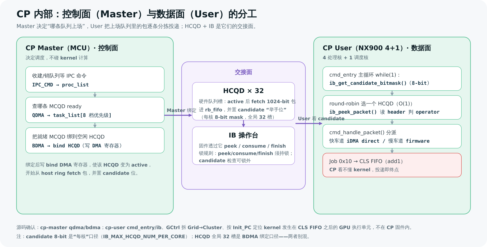

# CP 固件面试向深入（Command Processor 问答）

> 这是一篇**面试准备 / 深挖追问**向的问答长文，聚焦芯片上的 **CP（Command Processor）固件**——doorbell 响过之后、GPU 计算阵列真正开算之前的那一段。
>
> 读它之前，建议先读端到端长文 [[saxpy-kernel-end-to-end|一个 Kernel 从 .cu 到硬件执行的全流程]]（尤其第 4 节 CP + 那几个面试盒子），本文是它「阶段三 · CP」的放大镜。命令下发的队列侧（stream / MCQD / HCQD 的来龙去脉）见 [[stream-mcqd-hcqd-and-command-submission|stream / MCQD / HCQD 与命令下发]]，dispatch packet 的逐字段映射见 [[kernel-cmd-to-cp-job-cmd|kernel cmd → CP job cmd 字段映射]]。
>
> 全文每个术语首次出现给定义；**「源码确认」与「推断」分开标注**。源码均在 `192.168.80.116` 的 `fw/aigc_sdk/grace/applications/cp/`。

---

## 0. 一句话先把 CP 放进全局

一段 GPU kernel 从 `.cu` 到硬件执行要过 6 个阶段（见端到端长文）。CP 只负责其中一段：

> **doorbell 响 → CP 从 host ring buffer 取命令包 → 判类型 → 投递给下游硬件 / 固件处理 → 投递成功即终点。** 真正解码 kernel 指令、跑 SIMT 计算的是 GPU 计算阵列，不在 CP 固件里。

CP 内部分两半，分工是本文第一道必答题：

| 角色 | 实际是什么 | 职责 |
|---|---|---|
| **CP Master** | 一个 MCU | 决定「**哪条队列上场**」——发现就绪队列、按优先级排队、把它绑到硬件槽位 |
| **CP User** | RISC-V NX900（**4 个处理核 + 1 个调度核**） | 把上场队列里的命令包**逐条 peek、分拣、投递、收尾** |

---

## 1. CP Master vs CP User：谁做调度，谁做执行

### Q：CP Master（MCU）和 CP User（NX900）到底怎么分工？为什么要分两块？

**严谨作答（源码确认 `cp/master/overview.md` + `cp/user/cmd_entry`）**：

- **CP Master（MCU）= 控制面（control plane）**。它**不碰命令包内容**，只解决「资源调度」：哪条逻辑队列（MCQD）有活、按什么优先级、绑到哪个硬件队列槽（HCQD）、何时停下来释放。核心三模块：
  - `IPC CMD`（`ipc_cmd.c`）：接收 host/IMC 的 create/destroy context/stream/event，维护 `proc_list`。
  - `QDMA`（`qdma.c`）：**发现工作**——查哪些 MCQD 有待处理包，排进 8 档优先级的 `task_list`。
  - `BDMA`（`bdma.c`）：**分配资源**——从 `task_list` 取任务，找空闲 HCQD，写 bind DMA 寄存器把 MCQD 绑上去；执行完后 stop/release。

- **CP User（NX900，4 处理核 + 1 调度核）= 数据面（data plane）**。HCQD 一旦 active，User 侧的主循环 `cmd_entry`（一个 RT-Thread 线程，`while(1)`）就从该 HCQD 对应的 Interaction Buffer（IB）里 peek 命令包、按 operator 类型分拣、投递、收尾。

**为什么分两块**：调度（要扫 32 个 context、维护优先级队列、管 HCQD 生命周期）和执行（高频地 peek/dispatch 命令包）是两类负载。把控制面放 Master MCU、数据面放多核 NX900，**让高频的取包/分拣能多核并行**，而调度逻辑集中在一处不被打散。

> 🎯 **面试官会追问**
> - **「4 处理核 + 1 调度核」具体怎么分？** 任务给定的拓扑是 NX900 共 5 核：4 个跑 `cmd_entry` 处理命令包，1 个做核间调度/协调。**核内具体分工的源码级证据本文未逐行核实，按已知拓扑陈述**——面试中应说明这是架构层事实，细节以最新 MAS / 源码为准。
> - **Master 会不会执行命令包？** 不会。Master 的边界明确（`overview.md`「与 CP User 的边界」）：它只让 MCQD 绑到 HCQD、在释放时让 HCQD 停下；packet 的 peek/dispatch/finish 全在 User 侧。

> 图解源文件：[`fw1-cp-control-vs-data-plane.svg`](../../../_attachments/grace/saxpy-e2e/src/fw1-cp-control-vs-data-plane.svg)

---

## 2. QDMA / BDMA：Master 怎么把队列「调度上场」

### Q：QDMA 和 BDMA 各做什么？`qdma_get_mcqd_ready_status` 和 `bindDMA` 是什么关系？

**QDMA = 发现工作并排队（源码确认 `qdma.c`）**：

- 它轮询 `proc_list.proc_mask`（32 个 context 的有效 bitmap），对每个有效 context 触发 query DMA，读 `TOP_REG_MCQD_NOT_EMPTY` 得到「哪些 stream 的 MCQD 非空」。
- 发现非空且未入队（`task_valid` 未置位）的 stream，就插进 `task_list[priority]`——**8 档优先级**（`DMA_MAX_TASK_PRIORITY`）的链表。
- `qdma_get_mcqd_ready_status()` 本是更严格的 ready 判定：读 MCQD 里的 `doorbell_id` / `wrptr_addr`，再比较 **doorbell 值 ≥ write pointer**。**但当前这段比较在 `qdma_find_stream_insert_list()` 中被注释掉了**（源码确认）；当前入队依据简化为「`MCQD_NOT_EMPTY` 有 bit 且 `task_valid` 无 bit」。这是面试时值得点出的「现状 vs 设计意图」差异。

**BDMA = 分配硬件槽位（源码确认 `bdma.c`）**：

- `bindDMA`（`bdma_bind_hcqd()`）从优先级 `task_list` 取任务，调 `bdma_find_idle_hcqd()` 扫描 **0..31** 的 HCQD，找一个同时满足「硬件未 active + 不在 stop wait list + 不在执行列表」的**空闲 HCQD**。
- 找到后写 bind DMA 寄存器组：`TOP_REG_MCQD_ADDR_LO/HI` + `TOP_REG_BINDDMA_HCQDID`，并把任务加入 `bdma_exc_list`。写完，HCQD 变 active，doorbell 到来时它就开始从 ring buffer fetch 命令包。

**关系一句话**：QDMA 只「**发现 + 排队**」，不绑也不执行；BDMA 才「**绑定**」。两者通过 `task_list` 解耦——QDMA 是生产者，BDMA 是消费者。

> 🎯 **面试官会追问**
> - **为什么要 8 档优先级？** 多 stream 并存时，让高优先级的命令流先拿到稀缺的 HCQD 槽位。`task_list` 按 priority 分桶，BDMA 从高到低消费。
> - **`task_valid` 是干嘛的？** 防重复入队——同一 stream 已经在 `task_list` 里就别再插一次。源码里列了一个**风险点**：`task_valid` 若在某条释放路径上没被清掉，该 stream 后续就再也不会重新入队（`qdma.md`「需要验证的点」）。
> - **被注释的 doorbell ≥ wptr 检查要不要恢复？** 取决于硬件 `MCQD_NOT_EMPTY` 是否足够可靠。可靠就是死代码可删，不可靠就该恢复并文档化——这是个开放的 review 项，不是定论。

---

## 3. HCQD vs MCQD：为什么要两级队列

### Q：MCQD 和 HCQD 是什么关系？为什么不直接用一种？

**定义（源码确认 `concepts/MCQD.md` + `concepts/HCQD.md`）**：

| | MCQD | HCQD |
|---|---|---|
| 全称 | Memory Command Queue Descriptor | Hardware Command Queue Descriptor |
| 本质 | **软件逻辑队列描述符**，在 device memory 里，由 KMD/UMD 为每条 stream 创建 | **硬件队列槽位**，物理资源 |
| 数量 | 多（每条 stream 一个，可远多于硬件槽） | **有限，共 32 个**（BDMA 扫 0..31） |
| 谁碰它 | Master 用 QDMA 查询、BDMA 绑定 | HCQD 负责从 ring buffer fetch 1024-bit 命令包、维护 read pointer、把包暴露给 IB |

**为什么两级**：软件侧可以有**很多条** stream（很多 MCQD），但能同时被硬件 fetch/执行的队列槽是**物理有限的（32 个）**。两级 = 用「动态绑定」把「多对少」对上：

- **动态绑定**：BDMA 把当前就绪的 MCQD 绑到一个空闲 HCQD（写 bind DMA 寄存器）。
- **stop**：某 HCQD 执行完（`exc_cnt == 0`）或需要切队列时，Master 发起 stop——HCQD 停止 fetch、等在途 read 返回、进入 queue stopped；CP User 侧 drop 掉 IB 里残留的包并写 `CPE_FW_HCQD_STOPPED` 给 Master ack。
- **release**：Master 看到 HCQD stop 完成 **且** `CPE_FW_HCQD_STOPPED` 置位后，才 release 这个 HCQD，把它还回空闲池给下一个 MCQD 用。

**关键不变量（源码确认 `bdma.md`「与 CP User 的关系」）**：**没有 CP User 的 ack，Master 不能 release HCQD**——因为 HCQD 上可能还有固件 resident 的包或 OSD（Outstanding Descriptor）计数没归零，强行 release 会丢包/错乱。

> 🎯 **面试官会追问**
> - **32 个 HCQD 和「8-bit candidate mask」矛盾吗？** 不矛盾，是两个口径。**全局 32 个 HCQD 槽**（BDMA 视角，0..31）被分摊到 NX900 的多个处理核；**每个处理核**的 IB candidate mask 是 **8-bit**（`IB_MAX_HCQD_NUM_PER_CORE`，本核 id 0..7）。面试时要分清「global HCQD id」和「core 内 local id」——这正是 2025-12 那个真实 bug 的根因（见 [[CP command processing flow]]：「HCQD id 使用内部 id 而非 global HCQD id，改成 global 后解决」）。
> - **stop 和 destroy 的区别？** stop 是「让这个 HCQD 停下好换队列/收尾」；destroy stream 会同步走完整的 stop/release。而 **destroy context** 当前是「轻量」的：`top_reg_context_flush()` 和 `ipc_cmd_context_task_remove()` 被注释，只清 `proc_list`，**不主动 flush 正在执行的 HCQD**（源码确认 `overview.md`）——这是个值得注意的现状。

---

## 4. candidate mask + cmd_entry：CP User 怎么 O(1) 选队列

### Q：CP User 主循环 `cmd_entry` 怎么知道哪个 HCQD 有包？怎么选？

**candidate mask = 8-bit「举手牌」（源码确认 `concepts/Interaction-Buffer.md` + `cmd_entry.md`）**：

- IB 里有个状态寄存器 `rd_rb_candidate`：**8-bit bitmask**，每 bit 表示对应 HCQD（本核 0..7）是否有待处理包。HCQD fetch 到包、放进 `rb_fifo` 后，就在这张牌上置位——相当于「我这队有包，举手」。
- `cmd_entry` 的 Phase 1（无锁预检）只读这张牌（`ib_get_candidate_bitmask()`），合成 `active = candidate | pending_mask | stop_bitmask`；全 0 就 `continue`，**连锁都不拿**，避免空转。
- Phase 2（锁内）用 `cmd_find_next_hcqd(active, rr_start)` 选 HCQD：从 `rr_start` 起，**查表 CTZ（count trailing zeros）旋转 bitmask 找第一个 set bit**——**O(1)，零空转**，再 round-robin 推进 `rr_start` 保证公平。

**rb_fifo / peek 的语义**：

- `rb_fifo` 是 HCQD 从 ring buffer fetch 进来的命令包暂存区；`ib_peek_packet()` 只「看不取」地读 header/body（判 operator 和 block_mask），真正消费要靠 `ib_consume_packet()`，event 类要 `ib_finish_packet()`。

### Q：IB 操作台的锁规则是什么？为什么 candidate 可以锁外读，peek 必须锁内？

**锁规则（源码确认 `cp-user/ib.md`）**——这是面试高频陷阱题：

| 操作 | 是否需中断锁 | 原因 |
|---|---|---|
| `ib_get_candidate_bitmask()`（读 `rd_rb_candidate`） | **不需要** | 状态寄存器，**idempotent**——多读返回同值，并发安全 |
| `ib_peek_packet()`（读 `rd_rb_peek`） | **必须锁内** | peek 是 **FIFO（消费型）**——每读一个 word 就推进，并发读会破坏顺序/硬件状态 |
| `ib_consume_packet()` / `ib_finish_packet()` | **必须锁内** | 消费/完成动作不可并发 |

一句话记法：**「看牌（candidate）可以随便看，动包（peek/consume/finish）必须独占。」** 区别的本质是「状态寄存器 idempotent vs FIFO 有副作用」。

> 🎯 **面试官会追问**
> - **为什么 candidate 要缓存、只在 empty 时读 MMIO？** `ib_get_candidate_bitmask()` 是 MMIO 读，有总线开销。`cmd_entry` 把它缓存进 `candidate` 变量，只在 `candidate==0` 时才重新读硬件（V6 引入），省 MMIO。
> - **`pending_mask` 干嘛？** 标记「已 peek 但当前包依赖未满足」的 HCQD（典型是 event/wait_host）。它进 `active` 让该 HCQD 仍被调度到**继续推进状态机**，但**避免重复 peek**同一个包。
> - **为什么 stop 要混进 active 而 flush 不混？** `active` 只含 HCQD-id 空间（0..7）。stop 是 HCQD 级事件，天然进 active（这样没新 candidate 时也能被调度到）；flush 是 **context 级**事件（ctx-id 空间 0..31），必须先经 `sf_handle_flush(cxt_id)` 转成 `flush_hcqd_bitmap` 才能清 HCQD 状态——空间不同不能混（源码确认 `CP stop flush 与 queue 切换`）。

---

## 5. 快车道 vs 慢车道：CP 按 operator 类型分流

### Q：CP 拿到一个命令包后怎么决定「交给硬件搬 / 还是固件处理」？

CP User 的 `cmd_handle_packet()` 按 **operator id**（命令包 header 的 `type[7:0]`）分流。两条道（源码确认 `concepts/CP-Command-Packet.md` + `concepts/iDMA.md` + `flows/CP command processing flow`）：

**快车道（iDMA direct）**——「包搬到下游硬件 FIFO 即可，固件不用逐字解释」的高频命令，让 **iDMA**（CP 内部搬运 DMA）硬件直接搬：

| operator | id | 目标 FIFO |
|---|---|---|
| Job（kernel dispatch） | `0x10` | **CLS FIFO**（GPU 计算阵列入口） |
| SDMA | `0x11` | SDMA FIFO |
| VPU | `0x12` | VPU FIFO |
| Atomic add / swap / cmp_swap | `0x20 / 0x21 / 0x22` | ATO FIFO（cmp_swap 有 retry/consume 差异） |

`idma_dispatch_packet()` 等 iDMA idle，设 src = HCQD id、dst = 目标 FIFO、length = `body_size + 1`，触发 `wr_idma`，硬件把包搬走。

**慢车道（firmware 处理）**——需要固件读依赖、改状态表、等条件、抬中断的命令：

| operator | id | 固件做什么 |
|---|---|---|
| Event signal / wait | `0x30 / 0x31` | 由 [[CP-Firmware-CPE]] 处理，访问 [[Event-Table]]；wait 依赖未满足时进 pending，由 `cmd_entry` 后续重试 |
| Wait_Host | `0x40` | 两阶段：① 把 `trig_value` 写 `trig_addr` 通知 CPU；② 轮询 `polling_addr` 匹配 `expect_value` 后 fence/finish |
| NOP | `0xEE` | firmware read + finish |

**三种分派模式**（源码确认，枚举名）：`CMD_DISPATCH_BY_IDMA_DIRECT`、`CMD_DISPATCH_BY_IB_BUFFER`、`CMD_DISPATCH_BY_IDMA_THREAD`，对应不同的 fast path。

> 🎯 **面试官会追问**
> - **为什么要分快慢车道？** 高频的「搬运型」命令（job/sdma/atomic）走 iDMA 硬件直发，**省掉固件逐字搬包**；只有需要语义处理（读依赖、等条件、改状态表）的才让固件介入。这是 hot path 优化的核心思路。
> - **event 为什么不能也走 iDMA 直发？** MAS 明确：event signal/wait 需要固件参与（记 event entry、读 shadow dependency、抬中断），不能只靠 `idma_dispatch_packet()`，必须进 `cmd_handle_event_packet()`（源码确认 `iDMA.md`「MAS 约束」）。
> - **consume 和 finish 有什么区别？** job 类是 consume-only（dispatch 后消费）；event 类完成时要 `ib_finish_packet()`（减 finish OSD）——语义不同，对应 IB 的 `wr_fw_consume_rb` vs `wr_fw_finish_rb`。

---

## 6. CP 看不懂 kernel：它的职责边界

### Q：CP 固件会执行 kernel 里的计算吗？它「懂」kernel 在算什么吗？

**不会，也不懂（这是本文最该记牢的一点）。**

- CP 处理的只是一个**命令包**。对 `add1` 这种 kernel launch，它拿到的是一个 Job 包（operator id `0x10`），包头告诉它「这是个 job、kernel 入口在哪（`icache_base + init_pc`）」。CP 做的全部就是：peek → 判出是 `0x10` → 走快车道 `idma_dispatch_packet()` 把包**投递到 CLS FIFO**。**投递成功那一刻，CP 的活就干完了。**
- 真正取出 kernel 二进制、按 `Init_PC` 定位到第一条指令、解码并跑 SIMT 计算的，是 **GPU 计算阵列**：**GCtrl** 把 Grid 拆成 Cluster（按 grid_dim / cluster_dim），分发到计算单元执行。这部分**不在 CP 固件代码里**。

一句话边界：**CP 是「命令分拣 + 投递」的物流终点站，不是「计算」的执行者。** kernel 二进制里到底算 `*dst = 6 + 4` 还是别的，CP 既看不懂也不关心。

> 🎯 **面试官会追问**
> - **那 CP 投到 CLS FIFO 之后发生了什么？** 完整链：CP 投 job 包进 CLS FIFO → GPU 计算阵列（GCtrl 拆 Grid→Cluster）从 FIFO 取出 → 按包里的 `Init_PC` 找到 kernel 二进制第一条指令 → 执行 → 把结果写进 `deviceA` 指向的显存 → 通过 fence + MSI-X 通知 host（见端到端长文第 5 节）。
> - **CP 需要做地址翻译吗？** CP 拿的是 GPU 虚拟地址；翻译靠 KMD 在建 context 时写好的页表（每 context 一套，用 VMID 区分）。CP/计算阵列只管按虚拟地址访问，翻译是 MMU 的事。

---

## 7. 「只有一个 0x10」：别被两个名字骗了

### Q：UMD 的包类型 `0x10` 和 CP 的 operator id `0x10` 是两个东西吗？

**不是。全栈只有一个 `0x10`，指的是同一件事（源码确认）。**

- UMD 侧：`aica_packet_def.h` 里 `AICA_PACKET_TYPE_KERNEL_DISPATCH = 0x10`，结构体 `aica_kernel_dispatch_packet_t`。这是 UMD `dispatchCommandPacket` 填的 kernel 启动包。
- CP 侧：`cmd_pkt_hdr_t.type[7:0]` 读出来也是 `0x10`，对应 Job operator → iDMA → CLS FIFO。
- **同一个包、同一个 `0x10`**：UMD 把它写进 ring buffer，CP 把它 fetch 出来。「UMD 包类型」和「CP operator id」是**同一个枚举值在两层的两个名字**，不是两个独立的 `0x10`。

> ⚠️ **纠正旧笔记**：旧文档曾有「两个 0x10」的说法，是误判（端到端长文已纠正）。面试时直接说：**UMD dispatch 包类型 `0x10` == CP Submit_JD job operator id `0x10`，全栈唯一。**

字段如何从 UMD 包映射到 CP job cmd，见专文 [[kernel-cmd-to-cp-job-cmd|kernel cmd → CP job cmd 字段映射]]。

---

## 8. stop / flush 语义：控制类事件怎么不被普通调度淹没

### Q：stop 和 flush 是什么？为什么它们在 `cmd_entry` 里优先级最高？

**定义（源码确认 `CP stop flush 与 queue 切换`）**：两者都是**改变「队列有效性」的控制类事件**，不是普通命令包。

- **stop**：**HCQD 级**事件——单个 HCQD 要打断 / drop（典型：执行完要换队列）。维护在 `stop_bitmask`（HCQD-id 空间），参与 `active`，所以**即使没有新 candidate 也能被调度到**。`sf_stop_isr()` 累计 bit，`cmd_entry` 看到后调 `sf_handle_stop()`。
- **flush**：**context 级**事件——某 context/asid 下相关的一组 HCQD 都要失效。来自 MAS 的 `flush_asid`，`sf_flush_isr()` 扫本核 HCQD 的 attr/asid 生成 `flush_hcqd_bitmap[cxt_id]`，维护在 `flush_cxt_bitmap`（context-id 空间，**单独检查，不混进 active**）。

**为什么优先级最高**：stop/flush 发生时如果还继续普通 dispatch，**旧 packet 可能在 flush 之后还被执行**，破坏正确性。所以 Phase 2 里 **flush 最高优先**，持锁后重读 `flush_cxt_bitmap`、一次 drain 所有 pending context，再 `continue`；其次才是 stop，再次才是普通 candidate dispatch（分发优先级见 `cmd_entry.md` 表：stop > atomic > event > wait_host > block_mask > candidate）。

**drop 的统一收敛**：stop 和 flush 都通过 `sf_drop_hcqd_packets()` drop 掉 IB 里 resident 的包（根据 `cost_osd_cnt` 多次 `ib_drop_packet()`），完成后用 **read-modify-write** 写 `CPE_FW_HCQD_STOPPED`（bitfield，不能直接 writel 覆盖其他 HCQD 的 stopped bit）通知 Master。

> 🎯 **面试官会追问**
> - **flush 为什么不直接放进 active？** 因为 `active` 只含 HCQD bit（0..7），flush 是 context space（0..31）的事件，必须先转成 `flush_hcqd_bitmap` 才能清 HCQD 状态。空间不同。
> - **stop_bitmask 有没有并发风险？** 有，源码里点了名（`CP stop flush 与 queue 切换`「风险点」）：stop ISR set bit 与 `sf_handle_stop/flush()` clear bit 的窗口若重叠，**理论上有 stale write 覆盖新 bit 的风险**。当前 set/clear 仍是裸 RMW（`stop_bitmask |= ...; stop_bitmask &= ~BIT(...)`），后续应封装并用同一临界区保护。这是**已知待改项，不是已解决**——面试如实说。
> - **drop / consume / finish 错用会怎样？** drop 会改 HCQD 的 `exe/rptr` 语义；用错会影响后续 bind 的 ring buffer packet。所以 stop/flush 必须严格区分这三种动作。

---

## 9. 命令包能多大：packet body 上限

### Q：一个 CP command packet 最多多大？

**先给代码侧的确定值（源码确认 `concepts/CP-Command-Packet.md`）**：

- `cmd_pkt_hdr_t` 的 `body_size[12:8]` 是 **5-bit** 字段，header + body **最多 32 words**（含 header）。
- HCQD 从 ring buffer fetch 的是 **1024-bit（= 32 words × 32-bit）命令包**——和「最多 32 words」一致。

**⚠️ 存疑标注**：任务里提到 **MAS 文档内部对 body 上限有「16-word」和「31-word」两处不同说法**。本文未逐行核对 MAS 表，因此：

> **以 MAS 表的权威数值为准**；代码侧目前可确认的是「header+body ≤ 32 words / 1024-bit」。「16 vs 31 word」的具体语境（是否区分「含/不含 header」「body-only」「某类 operator 的专属上限」）**存疑，待核对 MAS 原表后修订**。面试中应说明：**整包 1024-bit / 32 word 是硬上限，body 的具体上限以 MAS 表为准**，不要把记忆中的某个数当定论硬背。

> 🎯 **面试官会追问**
> - **为什么是 1024-bit 这个数？** 它是 HCQD 一次 fetch 的粒度，对齐到 32 个 32-bit word。body_size 用 5-bit 表达「除 header 外还有几 word」，刚好覆盖到 32 word 整包。
> - **header 里还有什么？** `type[7:0]`（operator id）、`body_size[12:8]`、`hcqd_id[17:13]`、`asic_id[22:18]`、`block_mask[27:24]`（等待下游 OSD 资源时用）。

---

## 10. 把 CP 这一段串起来（回顾）

按命令包在 CP 内的旅程顺序：

1. **Master·QDMA** 查 `MCQD_NOT_EMPTY`，把就绪 stream 按 8 档优先级排进 `task_list`。
2. **Master·BDMA** 取任务，扫 0..31 找空闲 HCQD，写 bind DMA 寄存器 → HCQD active。
3. **HCQD** doorbell 后从 host ring buffer fetch 1024-bit 命令包进 `rb_fifo`，在 8-bit candidate mask 上举手。
4. **User·cmd_entry** Phase 1 读 candidate（锁外，idempotent），Phase 2 用 CTZ 在 `active` 上 O(1) 选 HCQD。
5. **peek**（锁内，FIFO）读 header 判 operator / block_mask。
6. **分拣**：快车道（`0x10`/`0x11`/`0x12`/`0x20-22` → iDMA → 对应 FIFO）vs 慢车道（`0x30/0x31`/`0x40`/`0xEE` → firmware）。
7. `add1` 是 Job `0x10` → iDMA 投进 **CLS FIFO** → **CP 终点**；后续由 GPU 计算阵列（GCtrl 拆 Grid→Cluster，按 Init_PC 跑 kernel）接管。
8. 期间 **stop/flush** 作为最高优先级控制事件随时可打断普通调度，drop 残留包并 ack Master 以 release HCQD。

---

## 11. 术语表 + 延伸阅读

### 快速术语表

| 术语 | 一句话解释 |
|---|---|
| **CP Master** | 控制面 MCU：QDMA 发现工作、BDMA 绑 HCQD、管 stop/release |
| **CP User** | 数据面 NX900（4 处理核 + 1 调度核）：`cmd_entry` 取包、分拣、投递 |
| **MCQD** | 软件逻辑队列描述符（device memory，每 stream 一个，数量多） |
| **HCQD** | 硬件队列槽（物理 32 个，fetch 1024-bit 命令包，维护 read pointer） |
| **QDMA** | Master 模块：查 `MCQD_NOT_EMPTY`，按 8 档优先级排 `task_list` |
| **BDMA** | Master 模块：`bindDMA` 把就绪 MCQD 绑到空闲 HCQD |
| **candidate mask** | 8-bit/核「举手牌」（`rd_rb_candidate`），标记哪个 HCQD 有包；idempotent，可锁外读 |
| **rb_fifo** | HCQD fetch 进来的命令包暂存区 |
| **IB / Interaction Buffer** | 固件访问 HCQD rb_fifo / 下游 FIFO / MMIO 的硬件接口；peek/consume/finish 须持锁 |
| **cmd_entry** | CP User 主调度循环（RT-Thread，`while(1)`，CTZ + round-robin 选 HCQD） |
| **iDMA** | CP 内搬运 DMA，把命令包直发下游 FIFO（快车道） |
| **operator id** | 命令包 header `type[7:0]`，决定快/慢车道 |
| **stop / flush** | HCQD 级 / context 级控制事件；`cmd_entry` 中优先级最高 |
| **OSD** | Outstanding Descriptor，下游在途资源计数；block_mask / consume/finish 据此判定 |

### 同系列 / 相关页

- **同系列长文**：[[saxpy-kernel-end-to-end|一个 Kernel 从 .cu 到硬件执行的全流程]]、[[stream-mcqd-hcqd-and-command-submission|stream / MCQD / HCQD 与命令下发]]、[[kernel-cmd-to-cp-job-cmd|kernel cmd → CP job cmd 字段映射]]。
- **CP 概念页**：[[wiki/grace/fw/concepts/HCQD|HCQD]]、[[wiki/grace/fw/concepts/MCQD|MCQD]]、[[wiki/grace/fw/concepts/Interaction-Buffer|Interaction Buffer]]、[[wiki/grace/fw/concepts/CP-Command-Packet|CP-Command-Packet]]、[[wiki/grace/fw/concepts/iDMA|iDMA]]、[[wiki/grace/fw/concepts/Event-Table|Event-Table]]。
- **CP Master**：[[wiki/grace/fw/cp-master/overview|CP Master 架构总览]]、[[wiki/grace/fw/cp-master/qdma|QDMA 查询与入队]]、[[wiki/grace/fw/cp-master/bdma|BDMA 绑定与 HCQD 生命周期]]、[[wiki/grace/fw/cp-master/master-user-interaction|Master/User 交互]]。
- **CP User**：[[wiki/grace/fw/cp-user/cmd_entry|cmd_entry 调度器]]、[[wiki/grace/fw/cp-user/ib|IB API 与锁规则]]、[[wiki/grace/fw/cp-user/CP stop flush 与 queue 切换|CP stop/flush 与 queue 切换]]。
- **主链路 / 总入口**：[[wiki/grace/fw/flows/CP command processing flow|CP 命令处理流程]]、[[wiki/grace/fw/index|FW 技术知识库]]、[[wiki/grace/index|GraceC 芯片软硬件栈]]。

---

> 📝 **本文状态**：CP 调度/分流/锁规则等关键事实经 116 源码与现有 FW 知识库交叉确认（2026-06-26），「源码确认 / 推断 / 存疑」已分开标注。其中「NX900 核内分工」为架构层陈述未逐行核实、「packet body 16/31-word」以 MAS 表为准且存疑、`task_valid`/`stop_bitmask` 并发等为源码里已点名的待改项。如与最新源码不符，欢迎在对应深入页修订。
