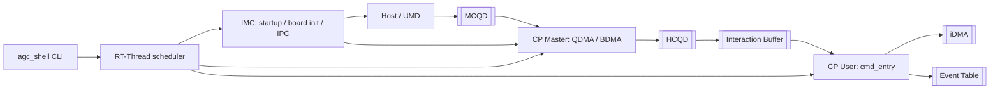

---
type: index
title: "FW 技术知识库"
created: 2026-05-14
updated: 2026-06-08
tags:
  - fw
  - index
status: active
---

# FW 技术知识库

这是 FW 相关内容的统一入口。FW 技术页不再散放到 `topics/` 或 `entities/`，统一从这里进入。

## 推荐阅读顺序

1. [GraceC CP MAS v1.4 code knowledge map](<./GraceC CP MAS v1.4 code knowledge map.md>)：先建立 MAS 与代码主线。
2. [CP command processing flow](<./flows/CP command processing flow.md>)：理解 Host/UMD 到 HCQD/IB/cmd_entry/iDMA 的主链路。
3. [FW 概念索引](<./concepts/index.md>)：补齐 HCQD、MCQD、IB、iDMA、Event Table。
4. [IMC 启动到 main 流程](<./imc/startup-to-main.md>)：理解 IMC 从 `_start` 到 RT-Thread `main()` 的启动链路。
5. [CP Master 索引](<./cp-master/index.md>)：看 MCQD 如何进入 task list 并绑定 HCQD。
6. [CP User 索引](<./cp-user/index.md>)：看 cmd_entry 如何执行命令、处理 stop/flush/pending。
7. [CLI 索引](<./cli/index.md>)：看 agc_shell、USART、UART、RT-Thread 调度、输入 ringbuffer、Backspace 行编辑和 CP USART 移到 IMC 统一初始化。
8. [RT-Thread 索引](<./rt-thread/index.md>)：看 yield/delay/ready queue 语义。
9. [GPGPU FW DVFS 学习文档](<./performance/dvfs-gpgpu-fw.md>)：理解 OPP/VF 频点、DVFS 状态机、timing 和面试问法。
10. [C2C 互联学习文档](<./interconnect/c2c-dingtalk-study.md>)：理解 LD/ST 互联、topo discovery、AMT route、OISA/L2 封装、loopback 和 RAS。
11. [C2C PHY 近端环回与远端环回详解](<./interconnect/c2c-loopback-near-far.md>)：理解 NEP/NES/NES-ext/FEP/FES/FEP-err、Top/Adapter/LLRMAC 环回和调试选择顺序。
12. [Portmap 路由表数字图解](<./interconnect/portmap-routing-table.md>)：理解 C2C/D2D portmap 表项如何由拓扑、下一跳策略和 serdes/ucie 编码得到。
13. [C2C transaction routing 与 OISA/L2 封装](<./interconnect/c2c-transaction-routing-and-encapsulation.md>)：逐层解释 GPU/SDMA/TMA memory transaction 经过 NoC、AMT/top/mesh_router、portmap、C2C adapter、OISA MAC、switch L2 外壳和 SerDes 的运行时路径。
14. [C2C 子系统结构图拆解](<./interconnect/c2c-macphy-wrapper-subsystem.md>)：按高分辨率 MACPHY_WRAPPER 图拆解 Adapter、LLRMAC、Hss112GX4Wrapper、x2/x4 port 和调试分层。
15. [AXI5 协议详解与 C2C 中 AXI 的作用](<./interconnect/axi5-protocol-and-c2c-role.md>)：理解 AXI5 五通道、VALID/READY、burst、ID、atomic，以及 AXI 在 C2C adapter、AXI monitor、NoC 边界中的作用。

## 总图

## 分区入口

| 分区 | 入口 | 内容 |
|---|---|---|
| IMC | [IMC 索引](<./imc/index.md>) | 启动流程、board init、main、IPC command、AGC shell 入口。 |
| CP Master | [CP Master 索引](<./cp-master/index.md>) | IPC、QDMA、BDMA、top_reg、Master/User 交互。 |
| CP User | [CP User 索引](<./cp-user/index.md>) | cmd_entry、IB、stop/flush、candidate V7、branch layout。 |
| CLI | [CLI 索引](<./cli/index.md>) | agc_shell 输入输出路径、USART 地址映射、console、CP USART/IMC 统一初始化、输入 ringbuffer、Backspace 行编辑和 CLI 卡顿分析。 |
| RT-Thread | [RT-Thread 索引](<./rt-thread/index.md>) | yield、delay、ready queue、线程调度语义。 |
| Concepts | [FW 概念索引](<./concepts/index.md>) | HCQD、MCQD、IB、iDMA、Command Packet、Event Table。 |
| Flows | [FW 流程索引](<./flows/index.md>) | 命令处理、多队列多 context、event/atomic/wait host。 |
| Performance | [FW 性能索引](<./performance/index.md>) | candidate peek、分支预取、hot path、GPGPU DVFS、OPP/VF、timing。 |
| Interconnect | [FW Interconnect 索引](<./interconnect/index.md>) | C2C、AXI5、OISA、PCIe/HWJ 对比、topo discovery、AMT route、portmap 路由表、loopback/RAS、近端/远端环回。 |
| Debug | [FW 调试索引](<./debug/index.md>) | ringbuffer IPC/CLI 地址转换图解、SDMA、PCIe bring-up、aigc_sdk bug scan。 |
| Source Maps | [GraceC CP MAS v1.4 code knowledge map](<./GraceC CP MAS v1.4 code knowledge map.md>) | MAS 文档与代码主线映射、源材料对应关系。 |
| Learnings | [FW Learnings 索引](<./learnings/index.md>) | HCQD 调度版本演进、review 规则。 |
| Env | [服务器环境与构建命令](<./env.md>) | 远端源码路径和构建命令。 |

## 新增 FW 页面放哪里

| 新页面类型 | 放置目录 | 同步更新 |
|---|---|---|
| IMC 启动、board init、IPC command 分析 | `wiki/grace/fw/imc/` | 本页 + IMC 索引 |
| CP Master 代码分析 | `wiki/grace/fw/cp-master/` | 本页 + CP Master 索引 |
| CP User/cmd_entry 分析 | `wiki/grace/fw/cp-user/` | 本页 + CP User 索引 |
| CLI/shell/UART 分析 | `wiki/grace/fw/cli/` | 本页 + CLI 索引 |
| RT-Thread 调度分析 | `wiki/grace/fw/rt-thread/` | 本页 + RT-Thread 索引 |
| 概念词条 | `wiki/grace/fw/concepts/` | 本页 + Concepts 索引 |
| 端到端流程 | `wiki/grace/fw/flows/` | 本页 + Flows 索引 |
| 性能优化 | `wiki/grace/fw/performance/` | 本页 + Performance 索引 |
| 互联/C2C/OISA/topo discovery | `wiki/grace/fw/interconnect/` | 本页 + Interconnect 索引 |
| 调试复盘 | `wiki/grace/fw/debug/` | 本页 + Debug 索引 |
