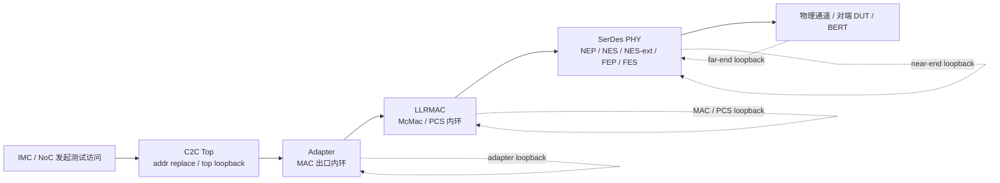
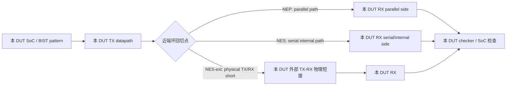
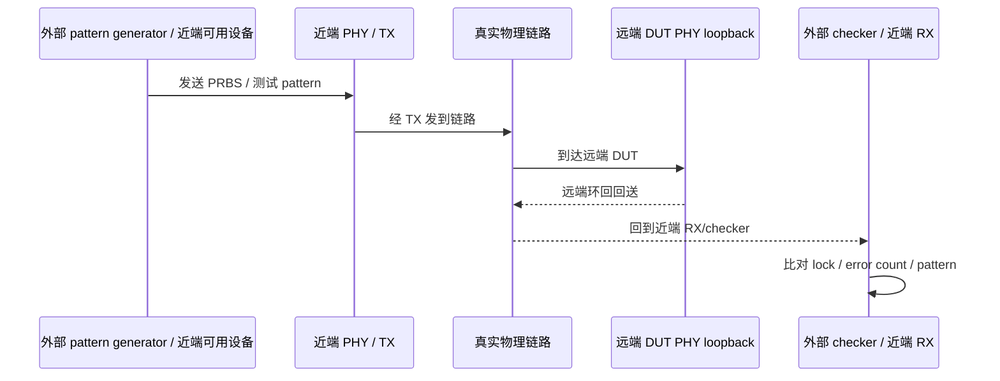
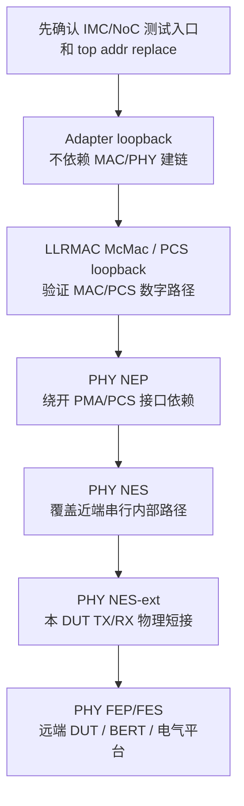

---
type: learning-guide
title: "C2C PHY 近端环回与远端环回详解"
created: 2026-05-29
updated: 2026-06-01
tags:
  - fw
  - interconnect
  - c2c
  - serdes
  - loopback
status: active
source:
  - "C:/Users/18355/Documents/learning/dingtalk-feishu-migration/firmware-tree/markdown/Firmware-IMC-10.C2C-10.9 C2C loopback功能.md"
  - "https://alidocs.dingtalk.com/i/nodes/y20BglGWO2XloQEQF0x6zp6l8A7depqY?utm_scene=person_space"
related:
  - "[C2C 互联学习文档](./c2c-dingtalk-study.md)"
  - "[Portmap 路由表数字图解](./portmap-routing-table.md)"
---

# C2C PHY 近端环回与远端环回详解

> Source boundary: 本页基于 DingTalk `10.9 C2C loopback功能` 的本地迁移稿整理。源文档明确说明了 C2C 子系统的 loopback 层级、PHY 近端/远端模式、部分寄存器配置和测试用途；对“为什么这样分层排查”的解释属于工程推导，会单独标注。

## 1. 一句话理解

近端环回是“本 DUT 自己把 TX 绕回 RX”，主要用来定位本端 SerDes PHY 内部问题；远端环回是“外部/近端流量打到远端 DUT，再由远端 DUT 绕回来”，主要用来验证跨物理链路、远端 PHY 响应和电气平台质量。

这里的“近端/远端”不是距离远近，而是相对测试流量源来说：测试流量源所在的一侧叫近端，被打过去并负责回送的一侧叫远端。

## 2. C2C loopback 在系统里的位置

源文档把 C2C 子系统分成三大块：`Adapter`、`LLRMAC`、`SerDes PHY`。loopback 不是一个模式，而是一组分层测试切点：




## 3. 先分清：Top / Adapter / LLRMAC / PHY 不是同一种环回

| 类别 | 环回点 | 是否进入 SerDes PHY | 是否需要外部链路/远端 | 主要解决什么问题 |
|---|---|---:|---:|---|
| Top 环回 | C2C top 入口地址替换 | 不一定 | 不一定 | 让 IMC 发起的“跨 GPU 地址”绕回后能被本 GPU NoC 当成本地目标接收。 |
| Adapter 环回 | Adapter TX 到 Adapter RX | 否 | 否 | 先测 adapter 和上游路径，不依赖 MAC/PHY 建链。 |
| LLRMAC McMac 环回 | McMac encode 后绕到 decode | 否 | 否 | 测 MAC 数字路径。 |
| LLRMAC PCS 内环 | PCS Tx lane buffer output 到 Rx lane demux input | 否/接近 PHY 前 | 否 | 测 PCS lane 映射和 PCS 侧数字路径。 |
| PHY 近端环回 | 本 DUT SerDes PHY 内部或本 DUT TX/RX 外接 | 是 | NES/NEP 不需要，NES-ext 需要本 DUT TX/RX 物理短接 | 定位本端 PHY、DFT、BIST、PMA/PCS 边界问题。 |
| PHY 远端环回 | 远端 DUT 收到近端流量后回送 | 是 | 需要外部流量源/校验器和远端响应 | 验证跨链路、电气平台、远端 PHY loopback 能力。 |

## 4. 近端环回是什么

近端环回是 PHY 层本端 DUT 的回送。测试数据从本端 TX 方向出去，在本端某个 PHY 切点绕回 RX 方向，再由本端 checker、BIST 或 SoC 路径检查。

源文档确认：PHY 近端环回有三种形式，范围依次变大：`NEP -> NES -> NES-ext`。只需要一个 DUT 即可测试。



### 4.1 NEP：Near-End Parallel

`NEP` 是近端并行内部环回。源文档说它允许 SoC 测试不依赖 SerDes PMA 到 PCS 的接口，且只有 SoC 数据可以使用这条通路。

工程上可以把它理解成：想先绕开更底层的模拟/串行路径，只看偏 PCS/parallel 侧和 SoC 侧能不能闭环。它覆盖范围最小，但定位更干净。

### 4.2 NES：Near-End Serial

`NES` 是近端串行内部环回。源文档给出的用途是：在晶圆探针测试、测试板级回环不可行时，最大限度提高 DFT 覆盖率；SoC 数据和 BIST 数据都可以使用该通路。

工程上可以把它理解成：不依赖外部线缆/板级短接，但已经更靠近 SerDes 串行侧，能覆盖比 NEP 更底层的 PHY 数据路径。

源文档列出的 NES 配置要点包括：

| 操作 | 配置 |
|---|---|
| 使能 RX NES | `loopback_cntrl[rx_nes_loopback_ena_nt] = 1` |
| 使能 TX NES | `loopback_cntrl[tx_nes_loopback_ena_nt] = 1` |
| 使能 loopback | `loopback_cntrl[ena_nt] = 1` |
| 控制引脚方式 | `ictl_loopback_req_ln = 1`，`ictl_loopback_type_ln = 2'b01`，等待 `octl_loopback_ack_ln = 1` |

### 4.3 NES-ext：Near-End Serial External

`NES-ext` 是近端串行外部环回。源文档说它用于测试仪加载板上能够实现外部环回路径的场景，扩大 DFT 覆盖范围；做法是把本 DUT 的物理链路 TX 和 RX 直接相连。

它和 NES 的关键区别是：NES 是 PHY 内部绕回；NES-ext 出了芯片/封装/连接路径的一部分，再回到同一个 DUT。因此它比 NES 更接近真实板级路径，但仍然不需要另一个远端 DUT 正常参与协议通信。

### 4.4 SoC 数据和 BIST 数据有什么区别

源文档只明确给出三个事实：`NES` 支持 SoC 数据和 BIST 数据；`NEP` 只支持 SoC 数据；`FEP-err` 不是普通环回，而是 BIST 数据路径配置。下面是基于这些事实整理出的工程理解。

| 维度 | SoC 数据 | BIST 数据 |
|---|---|---|
| 数据来源 | SoC/adapter/上层逻辑真实发出的业务式测试数据 | PHY/MSS 内置 BIST 逻辑生成的测试 pattern |
| 更像什么 | “系统真实数据路径”测试 | “PHY 自检 pattern”测试 |
| 检查方式 | 由 SoC、adapter、checker 或软件侧比对返回数据是否正确 | 由 BIST checker 看 lock、data valid、error count、注错统计 |
| 覆盖重点 | SoC 到 PHY 边界、adapter/PCS/parallel path、真实协议侧数据能否闭环 | PHY 内部收发、pattern 生成/检测、lane 误码、DFT 覆盖 |
| 对软件/上层依赖 | 较高，需要上层路径能发起和接收测试访问 | 较低，可以让 PHY 自己产生和检查 pattern |
| 在 10.9 中的例子 | `NEP` 只允许 SoC 数据，用来绕开 SerDes PMA 到 PCS 的接口依赖 | `NES` 允许 BIST 数据；`FEP-err` 属于 BIST 数据路径配置 |

直观理解：

```text
SoC 数据：
  SoC / adapter 发出数据 -> PHY loopback -> 回到 SoC/adapter 检查

BIST 数据：
  PHY BIST 生成 pattern -> PHY loopback/path -> PHY BIST checker 检查
```

所以，如果目标是验证“真实系统路径能不能把上层数据送进 PHY 再回来”，优先看 SoC 数据路径；如果目标是验证“PHY 自身收发和误码检测能力是否正常”，优先看 BIST 数据路径。

## 5. 远端环回是什么

远端环回是外部或近端设备发流量，经过真实物理链路到远端 DUT，远端 DUT 再把数据绕回来。源文档明确说：相比近端环回，远端测试需要外部流量模式生成器和校验器，且近端被测器件处于可用状态，主要用于电气验证平台。



### 5.1 FES：Far-End Serial

源文档在模式列表里列出 `FES`，即远端串行外部环回，并备注 aw 文档写只支持 1G 低速测试，但 DV 验证可以跑通高速模式。当前可用迁移稿没有展开 FES 的详细配置流程，因此这里不推导具体寄存器序列。

### 5.2 FEP：Far-End Parallel

`FEP` 是外部并行环回。源文档说它允许与 BERT 或远端系统进行全环回通信，只有外部数据可以使用这个通路。

源文档列出的 FEP 配置要点包括：

| 操作 | 配置 |
|---|---|
| 基础使能 | `tx_loopback_cntrl[ena_nt] = 1`，`loopback_cntrl[ena_nt] = 1` |
| bitclk loopback | `loopback_cntrl[tx_bitclk_loopback_ena_nt] = 1`，`loopback_cntrl[rx_bitclk_loopback_ena_nt] = 1` |
| TX datapath | `tx_datapath_reg1[fep_loopback_enable_a] = 1` |
| FEP FIFO | `tx_fep_loopback_fifo_top[fifo_enable_a] = 1` |
| 控制引脚方式 | `ictl_loopback_req_ln = 1`，`ictl_loopback_type_ln = 2'b10`，等待 `octl_loopback_ack_ln = 1` |

### 5.3 FEP-err：Far-End Error External

源文档特别说明：`FEP-err` 并非真正的环回模式，而是一种用于 BIST 的数据路径配置。它的含义是：RX BIST 检测到错误后，每检测到一个错误，就向 TX pattern 注入一个错误。

所以不要把 FEP-err 当成“把外部数据完整绕回”的模式。它更像误码注入/错误传播路径验证，用来确认错误检测和注错统计链路是否工作。

## 6. 近端和远端的核心区别

| 维度 | 近端环回 | 远端环回 |
|---|---|---|
| 回环位置 | 本 DUT 内部，或本 DUT TX/RX 外部短接 | 远端 DUT / 远端系统 |
| 流量来源 | 本 DUT SoC、PHY BIST，或本端测试配置 | 外部 pattern generator、BERT、近端可用设备 |
| 是否需要对端 | NEP/NES 不需要；NES-ext 只需要本 DUT 物理短接 | 需要远端 DUT 或远端系统参与回送 |
| 覆盖范围 | 更适合本端 PHY/DFT/内部路径定位 | 更适合真实链路、电气平台、远端响应验证 |
| 常见检查 | data valid、BIST lock、error count、SoC 数据比对 | BERT/checker lock、误码、链路质量、远端回送路径 |
| 典型阶段 | bring-up 早期、晶圆/板级前期、单芯片定位 | 电气验证、板级联调、跨设备链路验证 |

## 7. 为什么还需要 Top 环回

IMC 测 C2C loopback 时，源文档说必须使能 top 环回功能。原因是 IMC 往往发起一笔“跨 GPU 地址访问”，例如访问远端 GPU 的地址；后级 adapter、LLRMAC 或 PHY 把请求绕回来后，如果地址里的 `gpu_id/die_id` 仍然指向远端，本地 top/NoC 不会把它当成本地 memory 访问。

Top 环回的 `addr replace` 会在 C2C 入口把地址里的 `gpu_id/die_id` 替换成本 GPU、本 die。这样请求绕回来后，top 检查到目标就是本 GPU，就能把请求交给本地 NoC，再由 NoC 根据低位地址路由到对应 memory。

> Source fact: 源文档明确写到步骤 3-5 由硬件实现，软件不感知。软件侧主要负责 top 环回使能、后级 loopback 模式配置、发起测试访问和检查数据。

## 8. 调试时怎么选环回模式

推荐从靠近发起端、依赖最少的模式开始，逐步扩大覆盖范围：



| 现象 | 优先尝试 | 解释 |
|---|---|---|
| C2C 子系统还没接对端，想确认上游路径 | Adapter loopback | 源文档说 adapter 环回测试不会连接对端 device，也无法建链，不应等待 LLRMAC 建链结果。 |
| 怀疑 MAC/PCS 数字路径 | McMac / PCS loopback | 不进入完整 PHY 外部链路，定位更窄。 |
| 怀疑本端 PHY，但没有外部仪器或对端 | NEP / NES | 单 DUT 可测，适合本端 PHY 内部定位。 |
| 想覆盖本 DUT 物理 TX/RX 路径 | NES-ext | 需要把本 DUT 的 TX 和 RX 物理链路直接连起来。 |
| 想验证真实链路、电气质量或远端响应 | FEP / FES | 需要外部 pattern/checker 或 BERT，适合电气验证平台。 |
| 想验证 BIST 错误注入/错误传播 | FEP-err | 它不是普通回环，而是 BIST 数据路径配置。 |

## 9. 常见误区

1. 不要把 `near-end` 理解成本地软件环回。它是 SerDes PHY 近端路径的硬件环回，不是网络协议栈里的 `localhost`。
2. 不要把 `far-end` 理解成“远端机器跑一个软件 echo”。这里的远端环回发生在远端 DUT/PHY/测试路径，通常服务于 SerDes 电气和 BIST 验证。
3. 不要用 FEP-err 代表普通 FEP。源文档明确说它并非真正环回模式。
4. 不要跳过 top loopback 直接用 IMC 测后级环回。没有 `gpu_id/die_id` 替换时，请求绕回来也可能仍被视作远端访问。
5. 不要把 Adapter/LLRMAC 环回和 PHY 近端/远端混成一个层级。Adapter/LLRMAC 是 C2C 数字链路切点；近端/远端是 SerDes PHY 测试视角。

## 10. 速记版

- `NEP`：近端 parallel 内环，范围最小，偏 SoC/parallel 侧。
- `NES`：近端 serial 内环，单 DUT，SoC/BIST 都可用，DFT 覆盖更强。
- `NES-ext`：近端 serial 外环，本 DUT TX/RX 物理短接，覆盖范围更大。
- `FES`：远端 serial 外环，源文档列出但当前迁移稿未展开配置。
- `FEP`：远端 parallel 环回，外部数据/BERT/远端系统用。
- `FEP-err`：不是普通环回，是 BIST 错误检测到 TX 注错的数据路径。
- `Top loopback`：不是 PHY 环回，而是地址替换，让绕回请求能被本地 NoC 接收。
