# Portmap 路由表数字图解

> Source fact: 本页基于 `C:\home\for_ai\portmap方案.drawio` 的 3 个页面：`直连-16卡4die`、`直连16卡双die`、`switch`。
> Scope: 解释图中 C2C/D2D portmap 表项里的 `00000011`、`00110000`、`0/1` 等数字是怎么从拓扑和路由策略得到的。bit 到具体 port 的正式字段名仍需对照 MAS/register 定义；本文只使用图中已经给出的 port 组关系和表项反推。

## 1. 一句话理解

Portmap 路由表里的数字不是 GPU 编号，也不是距离，而是“从当前源点去某个目标时，下一跳该从哪个出口出去”的编码。

```text
表项数字 = 路由策略选出的下一跳出口 -> 按 port/ucie bit 位编码后的结果
```

C2C 表解决跨 GPU 访问：目标是 `g0 ~ g15`，表项是 8bit mask。D2D 表解决同一 GPU 内跨 die 访问：目标是 `d0 ~ d3`，表项是选择哪条 `ucie`。

## 2. 表项生成总流程

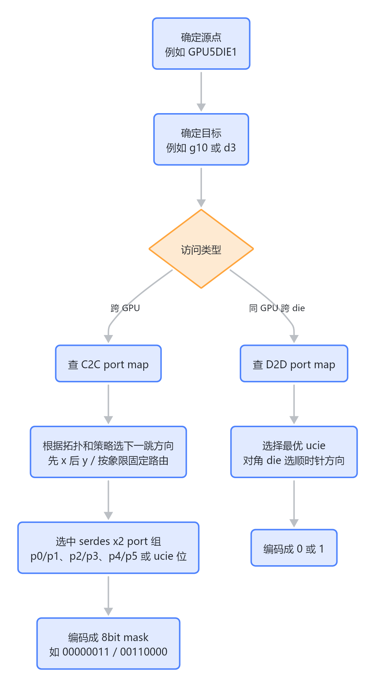

> 图解源文件：[`01-2.-表项生成总流程-flowchart.mmd`](../../../../_attachments/fw/interconnect/portmap-routing-table/whiteboard-mermaid/01-2.-表项生成总流程-flowchart.mmd)。由 lark-whiteboard `whiteboard-cli` 从原 Mermaid 渲染。

图中明确写了：

| 项目 | 图中规则 |
|---|---|
| C2C port map | 用于跨 GPU 访问；每个 GPU 的每个 die 有独立表；格式 `32*8`；最多 32 张卡；8bit 对应 2 个 ucie 和 6 个 serdes x2 port。 |
| D2D port map | 用于 GPU 内跨 die 访问；每个 die 的表不同；规格 `4*1`；最多 4 个 die；1bit 对应最优 ucie。 |
| SerDes 分组 | `serdes0: p0,p1`；`serdes1: p2,p3`；`serdes3: p4,p5`。如果是 x4 port，只用 `p0/p2/p4`。 |
| D2D ucie | `ucie0-d0`，`ucie1-d1`。 |
| 表下发方式 | portmap 表由软件下发，静态配置为最优路径。多条路径距离相同时，软件选一个方向的 port/ucie。 |

## 3. C2C 的 8bit 数字怎么来

C2C 的每一行可以读成：

```text
从当前 GPU/DIE 出发，要访问目标 gX，下一跳出口 mask 是 YYYYYYYY
```

以图中的 16 卡 4x4 拓扑理解：

```text
G0   G1   G2   G3
G4   G5   G6   G7
G8   G9   G10  G11
G12  G13  G14  G15
```

如果当前表是 `GPU5DIE1 c2c port map`，源点就在中间偏左的 `G5`。去不同目标时，下一跳方向不同：

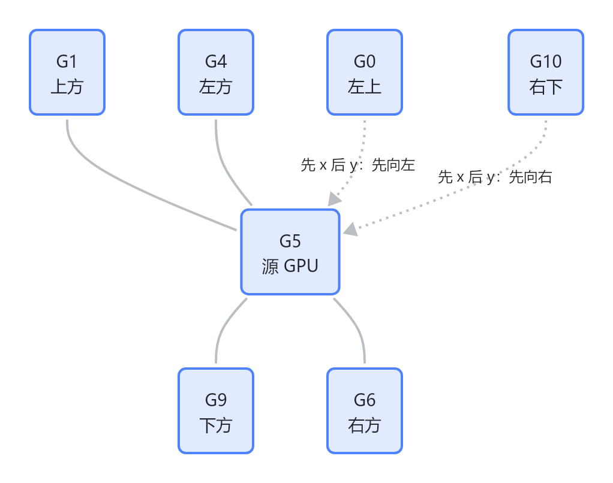

> 图解源文件：[`02-3.-C2C-的-8bit-数字怎么来-flowchart.mmd`](../../../../_attachments/fw/interconnect/portmap-routing-table/whiteboard-mermaid/02-3.-C2C-的-8bit-数字怎么来-flowchart.mmd)。由 lark-whiteboard `whiteboard-cli` 从原 Mermaid 渲染。

所以表项不是看目标最终在哪，而是看“第一跳”走哪里：

| 目标关系 | 下一跳方向 | 表项例子 | 含义 |
|---|---|---|---|
| `g4` 在左边 | 左侧 serdes port 组 | `00000011` | 选择左侧的一组 x2 ports。 |
| `g6/g7` 在右边 | 右侧 serdes port 组 | `00110000` | 选择右侧的一组 x2 ports。 |
| `g1` 在上方 | 上方 serdes port 组 | `11000000` | 选择上方的一组 x2 ports。 |
| `g9/g13` 在下方 | 下方 serdes port 组 | `00001100` | 选择下方的一组 x2 ports。 |
| `g10/g11` 右下 | 如果策略是先 x 后 y，第一跳仍向右 | `00110000` | 先沿 x 轴走到目标列。 |
| `g0/g12` 左上/左下 | 如果策略是先 x 后 y，第一跳先向左 | `00000011` | 先沿 x 轴走到目标列。 |

> 推断：上表中的“左/右/上/下”和 bitmask 的对应关系，是从图里 `GPU5DIE1` 附近的 port 标注和表项反推出来的；正式 bit 位含义仍要回到 MAS/register 字段定义确认。


### 3.1 白板图解：G5 第一跳和 8bit mask


> 图解源文件：[`c2c-gpu5-first-hop.svg`](../../../../_attachments/fw/interconnect/c2c/portmap/c2c-gpu5-first-hop.svg)。该图按 lark-whiteboard SVG 路径生成，并通过 `whiteboard-cli --check` 检查。

### 3.2 同主题工具对比图

本节用同一个问题比较不同图解生成方式：`G5` 作为源点时，目标方向如何映射成 8bit mask。这里不包含 Excalidraw / tldraw。

#### 3.2.1 总览建议

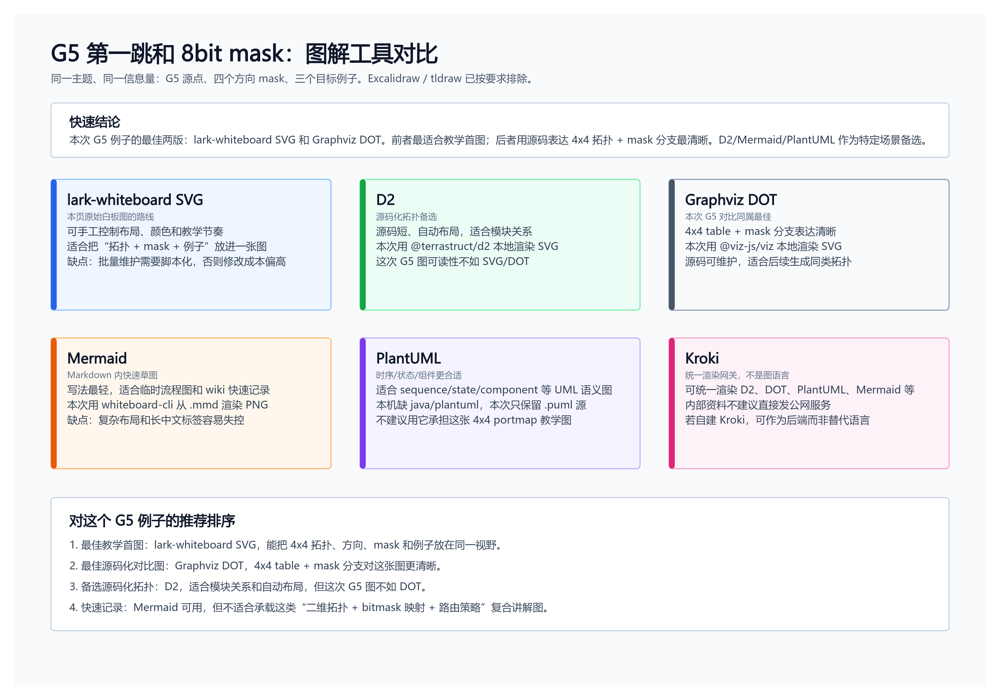

> 图解源文件：[`g5-mask-tool-comparison-summary.svg`](../../../../_attachments/fw/interconnect/c2c/portmap/tool-comparison/g5-mask-tool-comparison-summary.svg)。结论：这次 G5 第一跳例子里，lark-whiteboard SVG 和 Graphviz DOT 两版最好；前者适合教学首图，后者适合用源码表达 4x4 拓扑和 mask 映射。D2 可作为后续源码化拓扑备选；Mermaid 适合快速草图；PlantUML 更适合时序/状态/组件图。

#### 3.2.2 lark-whiteboard SVG

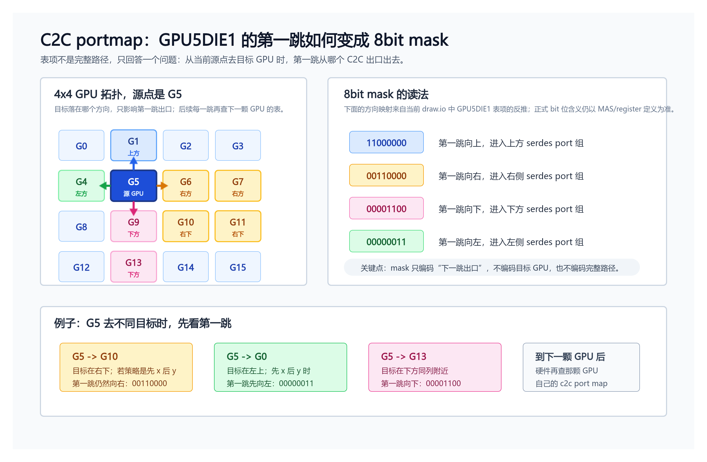

> 图解源文件：[`g5-mask-lark-whiteboard.svg`](../../../../_attachments/fw/interconnect/c2c/portmap/tool-comparison/g5-mask-lark-whiteboard.svg)。这是当前页面原图的同目录副本，最适合做教学型首图。

#### 3.2.3 Mermaid

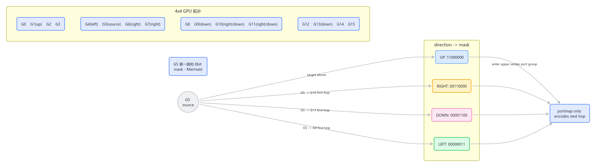

> 图解源文件：[`g5-mask-mermaid.mmd`](../../../../_attachments/fw/interconnect/c2c/portmap/tool-comparison/g5-mask-mermaid.mmd)。Mermaid 写起来最快，但对 4x4 拓扑、mask 映射和例子同时排版时，视觉控制明显弱于手工 SVG/D2。

#### 3.2.4 D2

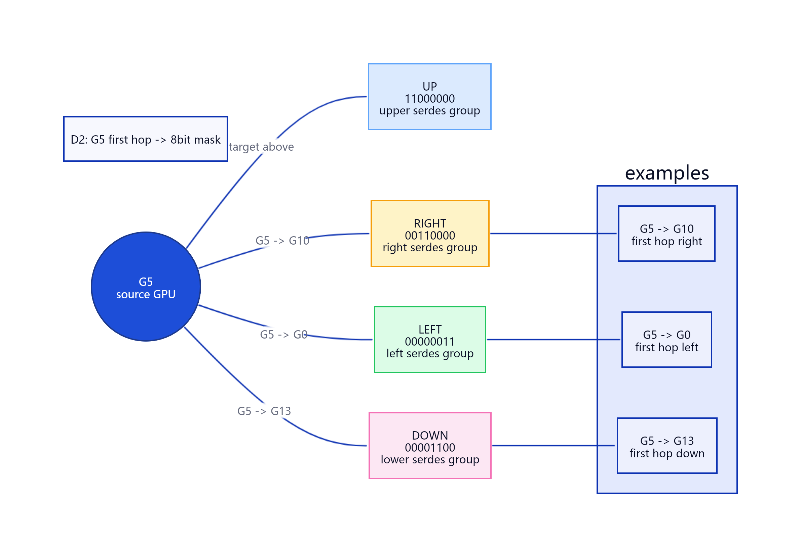

> 图解源文件：[`g5-mask-d2.d2`](../../../../_attachments/fw/interconnect/c2c/portmap/tool-comparison/g5-mask-d2.d2)，渲染 SVG：[`g5-mask-d2.svg`](../../../../_attachments/fw/interconnect/c2c/portmap/tool-comparison/g5-mask-d2.svg)。D2 保留为后续架构/拓扑图的源码化备选；这次 G5 例子的可读性不如 lark-whiteboard SVG 和 Graphviz DOT。

#### 3.2.5 Graphviz DOT

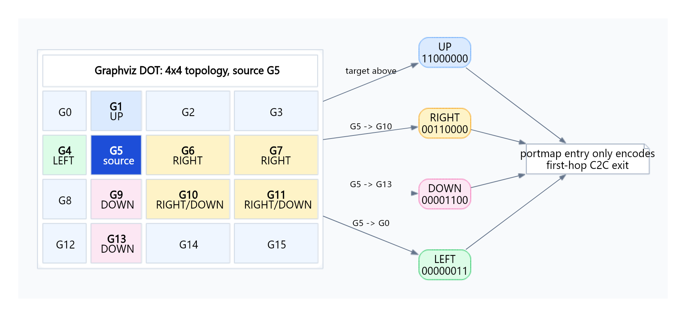

> 图解源文件：[`g5-mask-graphviz.dot`](../../../../_attachments/fw/interconnect/c2c/portmap/tool-comparison/g5-mask-graphviz.dot)，渲染 SVG：[`g5-mask-graphviz.svg`](../../../../_attachments/fw/interconnect/c2c/portmap/tool-comparison/g5-mask-graphviz.svg)。这次 G5 对比里，Graphviz DOT 版本的 4x4 table + mask 分支表达最清晰，和 lark-whiteboard SVG 一起作为优先保留版本；它也适合后续大规模有向图和依赖关系。

#### 3.2.6 PlantUML

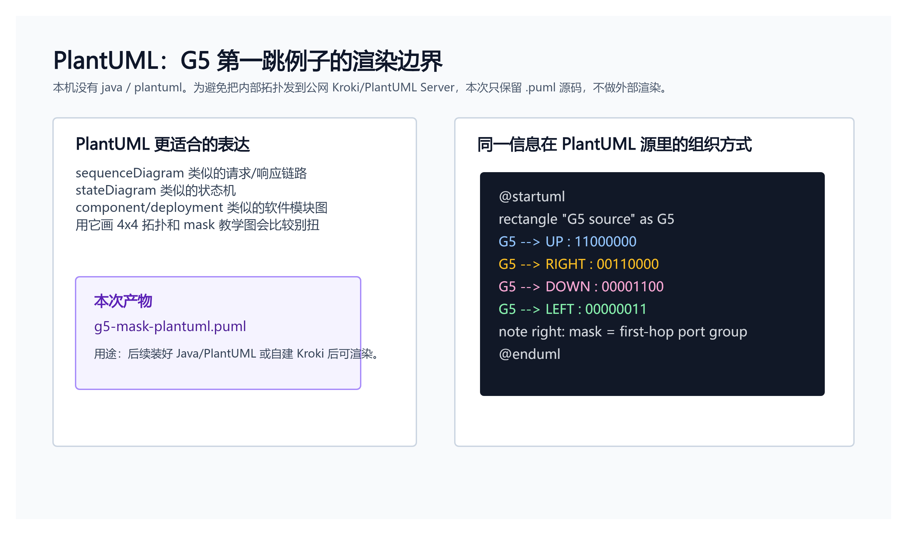

> 图解源文件：[`g5-mask-plantuml.puml`](../../../../_attachments/fw/interconnect/c2c/portmap/tool-comparison/g5-mask-plantuml.puml)。本机当前没有 `java` / `plantuml`，因此没有调用外部 PlantUML Server 或公网 Kroki 渲染内部拓扑；这张图是渲染边界说明卡，不是 PlantUML 官方渲染输出。
## 4. 为什么斜向目标也只填一个数字

因为 C2C portmap 表项只表示下一跳，不表示完整路径。

以 `G5 -> G10` 为例，如果采用“先 x 轴后 y 轴”：

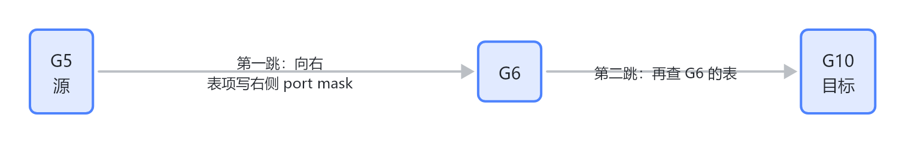

> 图解源文件：[`03-4.-为什么斜向目标也只填一个数字-flowchart.mmd`](../../../../_attachments/fw/interconnect/portmap-routing-table/whiteboard-mermaid/03-4.-为什么斜向目标也只填一个数字-flowchart.mmd)。由 lark-whiteboard `whiteboard-cli` 从原 Mermaid 渲染。

所以 `GPU5DIE1` 的 `g10` 行不会把完整路径编码进去，只会写“从 G5 出发的第一跳出口”。到了 `G6` 以后，硬件/路由逻辑再查 `G6` 自己的 portmap 表。

## 5. 两种直连路由策略为什么数字不同

图中比较了两种软件静态配置策略。


### 5.0 白板图解：两种 C2C 直连路由策略对比

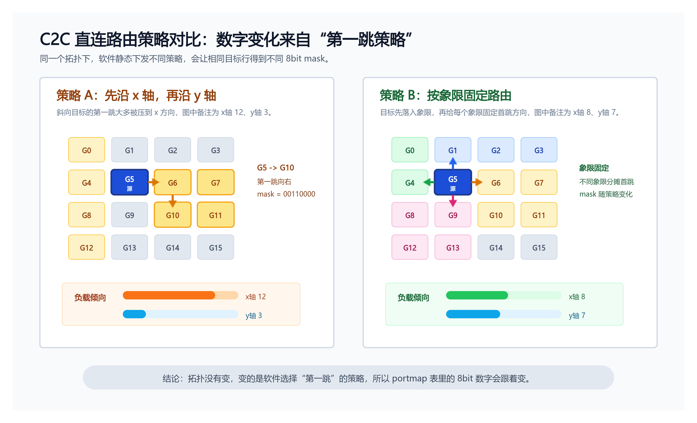

> 图解源文件：[`c2c-routing-strategy-compare.svg`](../../../../_attachments/fw/interconnect/c2c/portmap/c2c-routing-strategy-compare.svg)。它强调：拓扑不变时，表项数字变化来自“第一跳策略”变化。

### 5.1 先 x 轴后 y 轴

图中规则：

1. 如果目标和源在同一 x/y 轴方向，直接走上/下/左/右 C2C port。
2. 其他方向先沿 x 轴，到达目标 GPU 的目标列。
3. 再沿 y 轴，到达目标 GPU 的目标行。
4. 到达目标 GPU 后，再查 D2D port map 到目的 die。

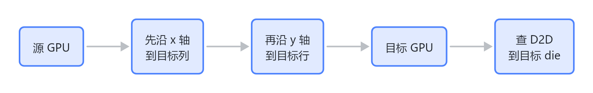

> 图解源文件：[`04-5.1-先-x-轴后-y-轴-flowchart.mmd`](../../../../_attachments/fw/interconnect/portmap-routing-table/whiteboard-mermaid/04-5.1-先-x-轴后-y-轴-flowchart.mmd)。由 lark-whiteboard `whiteboard-cli` 从原 Mermaid 渲染。

图中备注：

```text
x轴：12，y轴：3
x轴y轴负载不均
```

也就是说，大量斜向流量第一跳都压到 x 方向，x/y port 负载不均。

### 5.2 按象限固定路由

图中规则：

```text
将目的 GPU 按照 x,y 轴划分为 4 个象限，每个象限内的 GPU 均有独立的路由方式
x轴：8，y轴：7
```

这个策略不再机械地所有斜向都先走 x，而是根据目标所在象限固定分配不同方向，使 x/y 负载更接近。

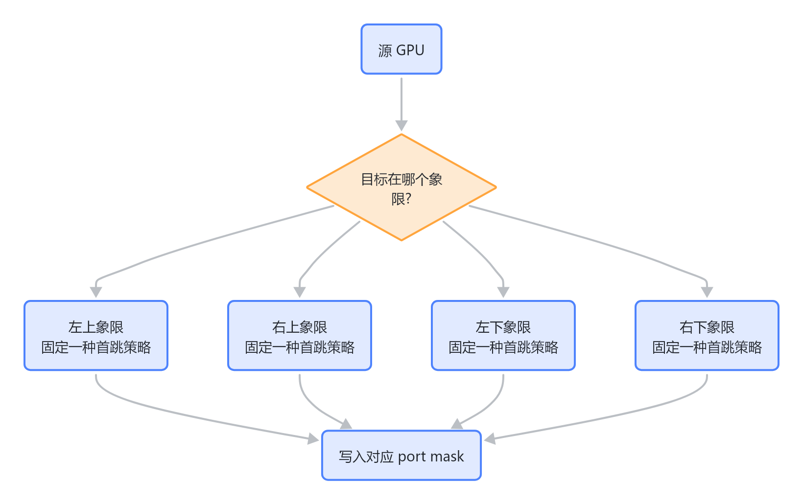

> 图解源文件：[`05-5.2-按象限固定路由-flowchart.mmd`](../../../../_attachments/fw/interconnect/portmap-routing-table/whiteboard-mermaid/05-5.2-按象限固定路由-flowchart.mmd)。由 lark-whiteboard `whiteboard-cli` 从原 Mermaid 渲染。

因此，同一个源 GPU、同一个目标 GPU，在不同策略下得到的 8bit 数字可能不同。数字变化的根因不是拓扑变了，而是“第一跳选择策略”变了。

## 6. D2D 的 0/1 数字怎么来

D2D 表只处理同一 GPU 内部 die 到 die 的访问。图中写明：

```text
d2d port map: 用于GPU内跨DIE访问
规格4*1
1bit对应最优的ucie
斜对角的die选顺时针方向的ucie
```

所以 D2D 表项可以读成：

```text
从当前 die 出发，要到目标 dX，选择 ucie0 还是 ucie1
```

以 4DIE 为例，图中 die0 的 D2D 表可理解为：

| 当前表 | 目标 die | 数字 | 含义 |
|---|---|---:|---|
| die0 d2d port map | d0 | 空 | 目标是自己，不需要跨 die。 |
| die0 d2d port map | d1 | `1` | 选择一条 ucie 方向。 |
| die0 d2d port map | d2 | `0` | 选择另一条 ucie 方向。 |
| die0 d2d port map | d3 | `1` | 对角/非直达场景按图中固定规则选方向。 |

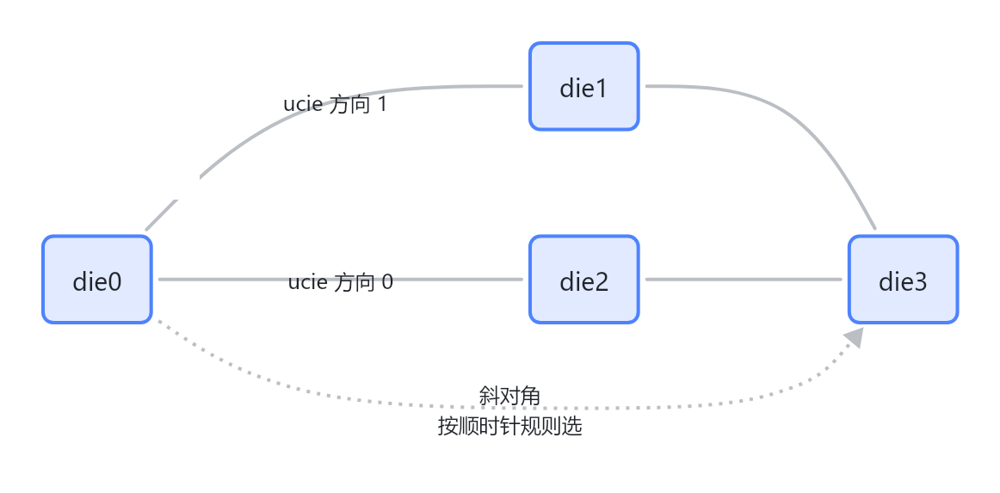

> 图解源文件：[`06-6.-D2D-的-0-1-数字怎么来-flowchart.mmd`](../../../../_attachments/fw/interconnect/portmap-routing-table/whiteboard-mermaid/06-6.-D2D-的-0-1-数字怎么来-flowchart.mmd)。由 lark-whiteboard `whiteboard-cli` 从原 Mermaid 渲染。

> Source fact: 图里给出了 `ucie0-d0`、`ucie1-d1` 和“斜对角的 die 选顺时针方向的 ucie”。
> 推断: 具体 `0/1` 对应哪条物理 ucie 线，需要结合 die 布局图和寄存器字段进一步确认；本文先按图中 D2D 表项解释它的路由含义。

## 7. Switch 场景为什么不需要复杂 C2C 表

图的 `switch` 页写得很直接：

```text
1. 跨GPU访问：硬件轮询选择serdes port进行传输
2. GPU内跨die访问：查询如下d2d port map路由表
```

也就是说，在 switch 场景下，跨 GPU 的 serdes port 选择更多交给硬件轮询；软件不再像直连拓扑那样为每个目标 GPU 静态指定复杂 C2C 下一跳 mask。但 GPU 内部跨 die 仍然需要 D2D 表。

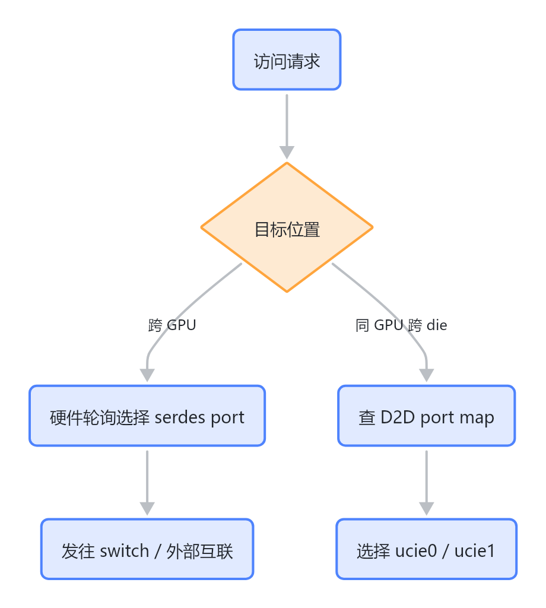

> 图解源文件：[`07-7.-Switch-场景为什么不需要复杂-C2C-表-flowchart.mmd`](../../../../_attachments/fw/interconnect/portmap-routing-table/whiteboard-mermaid/07-7.-Switch-场景为什么不需要复杂-C2C-表-flowchart.mmd)。由 lark-whiteboard `whiteboard-cli` 从原 Mermaid 渲染。

### 7.1 Switch 模式转发规则详细图解

先分清两个 `switch`：

| 名称 | 来自哪里 | 它解决什么问题 |
|---|---|---|
| PCIe switch | 10.5 topo discovery 文档里的 PCIe topo，例如 8 卡 2 die 都挂到一个 144-lane Broadcom PEX89104 | Host 侧枚举、bus/device/function、PCIe 拓扑管理 |
| C2C switch 模式 | portmap 方案 draw.io 的 `switch` 页 | C2C 数据转发时，跨 GPU 如何选 SerDes 出口，GPU 内跨 die 是否查 D2D 表 |

所以这里的“转发规则”按 C2C switch 模式理解，不是 PCIe 枚举路径。

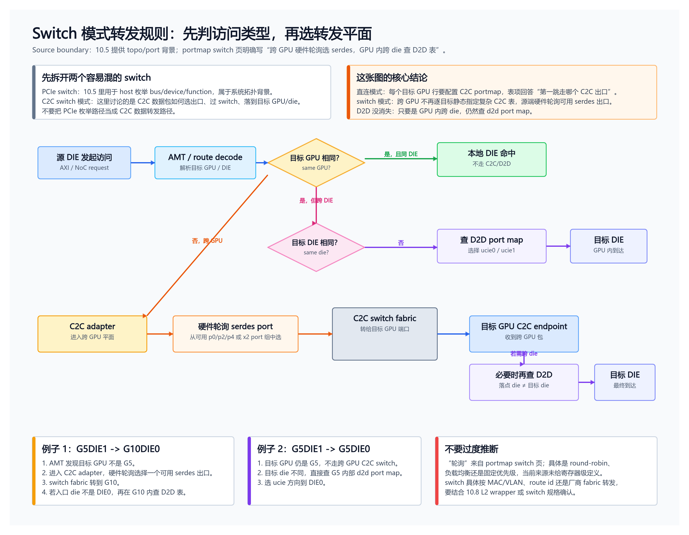

> 图解源文件：[`switch-mode-forwarding-lark.svg`](../../../../_attachments/fw/interconnect/c2c/switch-forwarding/switch-mode-forwarding-lark.svg)。该图按 lark-whiteboard SVG 路径生成。

核心规则可以背成三句话：

1. **同 GPU 同 die**：本地命中，不需要 C2C，也不需要 D2D。
2. **同 GPU 跨 die**：不走跨 GPU switch，直接查该 GPU 内部的 `d2d port map`，选择 `ucie0/ucie1` 方向。
3. **跨 GPU**：进入 C2C switch 模式，源端硬件轮询选择可用 `serdes port` 出口发往 switch；到目标 GPU 后，如果入口 die 不是目标 die，再查目标 GPU 内部 D2D 表。

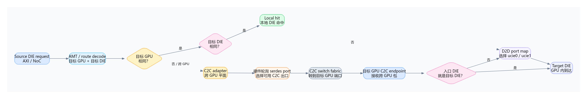

> Graphviz 源文件：[`switch-mode-forwarding-rules.dot`](../../../../_attachments/fw/interconnect/c2c/switch-forwarding/switch-mode-forwarding-rules.dot)，渲染 SVG：[`switch-mode-forwarding-rules.svg`](../../../../_attachments/fw/interconnect/c2c/switch-forwarding/switch-mode-forwarding-rules.svg)。

#### 7.1.1 和直连模式的关键差异

| 维度 | 直连模式 | switch 模式 |
|---|---|---|
| 跨 GPU C2C 表 | 每个源 die 都要按目标 GPU 计算下一跳 mask | 图中明确写“硬件轮询选择 serdes port”，不再逐目标静态指定复杂下一跳 |
| 表项含义 | C2C 表项回答“去目标 GPU，第一跳从哪个出口出去” | 跨 GPU 出口选择交给硬件轮询；具体轮询算法未在当前来源给出 |
| D2D 表 | 到达目标 GPU 后，跨 die 仍要查 D2D | 同 GPU 跨 die、或跨 GPU 到目标 GPU 后需要换 die，仍查 D2D |
| 软件职责 | 下发最优路径、处理等距路径选择 | 配好 topo/port/link/ID，保证可用 serdes 和 D2D 表正确；具体寄存器级职责需看 FW/MAS 实现 |

> 推断边界：`硬件轮询` 是来源确认的行为；但它到底是 round-robin、固定优先级、基于 credit/负载，当前材料没有给寄存器级证据，不能直接下结论。

## 8. 读表 checklist

1. 先确认表属于哪个源点：`GPUxDIEy c2c port map` 或 `dieN d2d port map`。
2. 再确认目标行：`gX` 是跨 GPU 目标，`dX` 是跨 die 目标。
3. 判断访问类型：跨 GPU 查 C2C；同 GPU 跨 die 查 D2D。
4. 对 C2C：根据拓扑和策略只算“第一跳出口”，不要试图把完整路径塞进一个表项。
5. 对 D2D：根据目标 die 选择最优 ucie；对角 die 使用图中的顺时针固定规则。
6. 如果多条路径等价，软件静态选择一个方向，目的是固定路由和负载分配。
7. 如果要确认 bit 的正式含义，必须回 MAS/register 字段定义，不要只靠图中推断。

## 9. 常见误区

| 误区 | 正确理解 |
|---|---|
| 把 `00000011` 当成 GPU 编号 | 它是出口 bitmask，不是目标编号。 |
| 以为一行表项表示完整路径 | 它只表示当前源点的下一跳。 |
| 看到斜向目标就期待两个方向同时置位 | 静态路由通常只选一个第一跳方向；等价路径也由软件固定选一个。 |
| 把 C2C 和 D2D 混在一起 | C2C 是跨 GPU，D2D 是 GPU 内跨 die。 |
| switch 场景还按直连 C2C 表逐项配置 | 图中 switch 场景跨 GPU 由硬件轮询选择 serdes port，D2D 仍查表。 |

## 10. 后续要补的证据

这张 draw.io 图已经足够解释路由表数字的生成思路，但如果要做寄存器级实现或代码下发表，还需要补：

- MAS/register 中 8bit 每一位到 `ucie/serdes p0~p5` 的正式字段定义。
- 软件下发 portmap 的结构体、寄存器地址或 firmware 配置入口。
- x4 port 模式下 `p0/p2/p4` 与 x2 port mask 的兼容编码规则。
- 多路径等价时软件选路策略是否固定、是否可配置、是否和负载统计有关。