# GPGPU FW DVFS 学习文档：从封装接口到真实状态机

> Scope：这篇记录的是 **GPGPU 场景下 FW 层面通常怎样理解和实现 DVFS**，重点服务面试表达。  
> Source fact：当前本地 MAS 摘录能确认 CP/IMC 侧存在 clock / CRG / PLL / `pll_lock` / 50MHz reference timer / 1GHz 工作时钟等 clock bring-up 信息。  
> Knowledge expansion：完整闭环 DVFS、OPP 表、thermal/power policy、timing 解释属于通用 GPGPU/FW 架构知识，不代表当前项目已经完整实现运行期闭环 DVFS。

## 0. 术语速查表

这张表适合先看一遍，再读后面的状态机、OPP、PLL、memory DVFS 细节。面试时也可以按“术语 -> 作用 -> 风险点”来回答。

| 术语 | 简单理解 | 在 DVFS 中的作用 / 面试重点 |
|---|---|---|
| `DVFS` | Dynamic Voltage and Frequency Scaling，动态调电压和频率。 | 目标是在性能、功耗、温度之间平衡；FW 的核心是安全选择 OPP，并按正确顺序切换 voltage / clock。 |
| `DVFS governor` | DVFS 策略决策器。 | 根据 workload、温度、功耗、QoS、debug/fixed policy 选择 target OPP；重点是 hysteresis、debounce、min residency，避免频繁抖动。 |
| `DVFS transition FSM` | 真正执行切换的状态机。 | 负责查表、等 idle/drain、升压/降频、等 stable/lock/ack、更新状态、失败 rollback；面试要强调它保证“安全切换”。 |
| `OPP` | Operating Performance Point，合法运行档位。 | 不只是 voltage + frequency，还可能包含 PLL 参数、divider、domain、cap、latency、thermal/power limit；FW 只能在 signoff 过的 OPP 中切换。 |
| `VF point` | Voltage + Frequency 的一个组合。 | VF 是电压/频率点；OPP 是系统允许使用的运行档位。复杂 GPGPU 里 OPP 往往比 VF 信息更多。 |
| `domain` | 一组共享 clock / voltage / reset / power 控制的硬件区域。 | GPGPU 常见 core、NoC/fabric、L2、memory、AON、peripheral 等 domain；跨 domain 时要注意 CDC、level shifter、timing。 |
| `PMIC` | Power Management IC，电源管理芯片/系统。 | 管多个 rail、上电时序、fault、power-good；FW 通常通过 PMIC/regulator driver 设置电压并等待 stable。 |
| `PVR / VR` | Programmable Voltage Regulator / Voltage Regulator，一路具体电压调节器。 | 更像执行器，负责把某个 rail 调到目标电压；PMIC 是管家，VR 是具体供电通道。 |
| `voltage stable` | 电压已经到达目标并稳定。 | 升频前必须确认；如果电压没到就升 clock，容易 setup timing violation。 |
| `PLL` | Phase Locked Loop，用参考时钟生成高频 clock。 | 配置 refdiv/fbdiv/postdiv 等参数后要等待 `pll_lock`；未 lock 的 clock 不能给业务 domain 正常跑。 |
| `pll_lock` | PLL 输出已经锁定、稳定的状态信号。 | 没有 lock 不能切 mux 到新 PLL，也不能释放依赖该 clock 的 reset。 |
| `divider` | 分频器，`f_out = f_in / div`。 | 改 divider 可能比重配 PLL 快，但仍要看是否支持 glitchless update 和 update ack。 |
| `clock mux` | clock 选择器，在不同 clock source 之间切换。 | 普通 mux 直接切可能有毛刺；DVFS 要用 glitchless mux 或按 clock controller 协议切换。 |
| `glitch` | 短暂非法脉冲或异常边沿。 | 可能导致 flop 误采样、状态机乱跳、协议错误、GPU hang；常见于 mux/divider/gate/PLL 切换不当。 |
| `glitchless` | 切换 clock path 时不产生非法短脉冲、双边沿或不完整周期。 | 通常由 clock controller、glitchless mux、clock gate cell、divider handshake 保证；FW 要按协议写寄存器并等待 ack。 |
| `clock ack` | clock controller 确认切换完成。 | 比 `pll_lock` 更靠近最终 domain；lock 只是 PLL 稳，ack 表示 clock path / mux / divider 切换也完成。 |
| `safe clock / bypass` | 重配 PLL 时临时使用的安全时钟路径。 | 避免业务 domain 直接吃到不稳定 PLL 输出；失败时也可回到 safe clock。 |
| `safe OPP` | 可靠保守的频点/电压档位。 | rollback、throttle、异常恢复时使用，要求 timing 和电源余量都安全。 |
| `rollback` | 切换失败后回到旧 OPP 或 safe OPP。 | PLL lock timeout、voltage stable timeout、clock ack error 时必须可恢复，不能卡在半切换状态。 |
| `throttle` | 因过温/过功耗等保护原因强制降档。 | safety 优先级高于 performance；throttle 通常不等 governor 慢慢决策。 |
| `hysteresis` | 迟滞，升频和降频使用不同阈值。 | 例如 `load > 80%` 才升频，`load < 40%` 才降频，避免在阈值附近来回跳。 |
| `debounce` | 去抖，条件连续满足多次才动作。 | 过滤单次采样尖峰；例如高负载连续 N 次才升频，低负载连续 M 次才降频。 |
| `min residency` | 一个 OPP 最少停留时间。 | 刚切完不能马上反向切，避免频繁切换带来的性能损耗和稳定性风险。 |
| `idle / drain` | 等 domain 空闲，或把已进入硬件的请求处理完。 | 切 clock/memory OPP 前要阻止新请求，并等待 outstanding 清零。 |
| `NoC backpressure` | NoC/bridge 反压，让请求暂时不能继续下发。 | memory DVFS 期间可挡住新 VRAM 请求；但已经进入 MC/PHY 的 outstanding 还要 drain。 |
| `outstanding` | 已发出但还没完成的 read/write 请求。 | 切 memory OPP 前要关注 outstanding counter；旧请求不能切到一半。 |
| `self-refresh` | DRAM 自己刷新并保持数据，控制器暂停普通访问。 | 常作为 memory DVFS 的 safe state；进入后普通 VRAM 访问要 stall/queue。 |
| `power-down` | memory 的低功耗状态。 | 数据通常保持，但不能直接响应访问；退出后要满足协议时序再恢复命令。 |
| `PHY training` | memory PHY 校准读写时序、Vref、deskew 等。 | memory 频率/电压切换后可能需要 retraining；未 ready 前不能恢复普通访问。 |
| `PCIe completion` | PCIe read 的返回包。 | PCIe read 是 split transaction，可以延迟 completion，但不能无限延迟；不能靠“切换够快”赌安全。 |
| `timing violation` | 数据没有在 clock 采样前稳定，违反 setup/hold 等时序约束。 | 低压高频最容易触发；后果可能是错误数据、状态机异常、协议错误、ECC/parity、hang 或 reset。 |

## 1. 一句话理解

**DVFS 是 FW 根据性能需求、温度、功耗和硬件资源状态，在一组合法的电压/频率档位之间安全切换。**

你之前“调用封装好的接口，跳转到一些电源状态”，通常处在最上层：

```text
你调用的接口:
  set_power_state(P0/P1/P2)
  set_perf_level(HIGH/MEDIUM/LOW)
  set_opp(opp_id)

接口背后真正做的事:
  查 OPP 表
  判断是否允许切换
  按升频/降频时序调 voltage 和 clock
  等 PLL lock / voltage stable / hardware ack
  更新 FW 状态
  失败时回滚或进入 throttle/safe state
```

面试里不能只说“调用接口调频”。更好的说法是：

> 我之前接触过 DVFS 的封装接口，主要做 power state / performance state 切换。现在我理解到，接口背后一般是 OPP 表 + policy/governor + transition state machine + PMIC/PLL/clock driver + safety/rollback 这一整套机制。

## 2. GPGPU 场景下 DVFS 在哪里

GPGPU 的 DVFS 不只是 CPU 那种“调一个 core clock”。它通常面对多个 domain：

- shader / core domain：执行 kernel、warp/wave、CTA/block 的计算单元。
- memory domain：HBM/GDDR/DDR controller 或 memory PHY。
- fabric / NoC domain：cluster、L2、memory、CP、DMA 之间的数据通路。
- always-on / firmware domain：IMC、PMU、CP 管理核，通常要保持可运行。
- peripheral domain：timer、UART、JTAG、debug、IPC 等。

一个典型 GPGPU FW DVFS 结构：

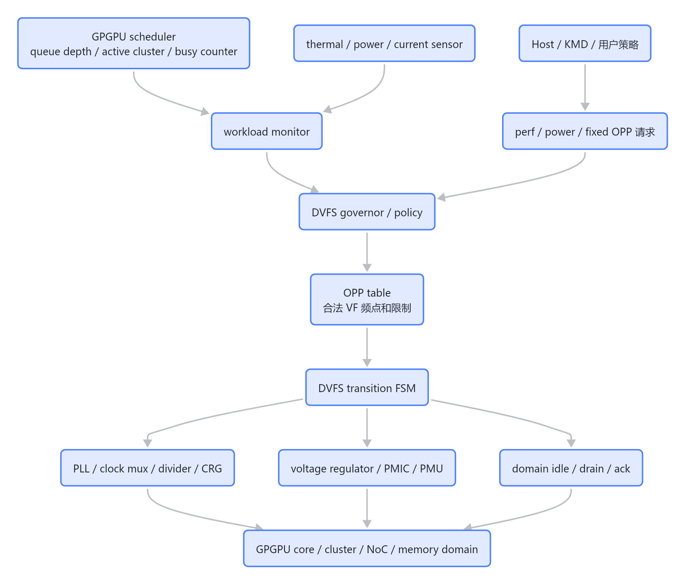

> 图解源文件：[`01-2.-GPGPU-场景下-DVFS-在哪里-flowchart.mmd`](../../../../_attachments/fw/performance/dvfs-gpgpu-fw/whiteboard-mermaid/01-2.-GPGPU-场景下-DVFS-在哪里-flowchart.mmd)。由 lark-whiteboard `whiteboard-cli` 从原 Mermaid 渲染。

FW 的价值在于：**它不是直接产生电压或时钟，而是负责“判断、排序、握手、等待、回滚”。**

## 3. DVFS 状态机图

下面是面试里最值得画出来的一张图。它体现三个核心点：

- 升频：先升电压，再升频率。
- 降频：先降频率，再降电压。
- 失败：任何等待超时都要回滚到 safe OPP 或进入 throttle/fail-safe。

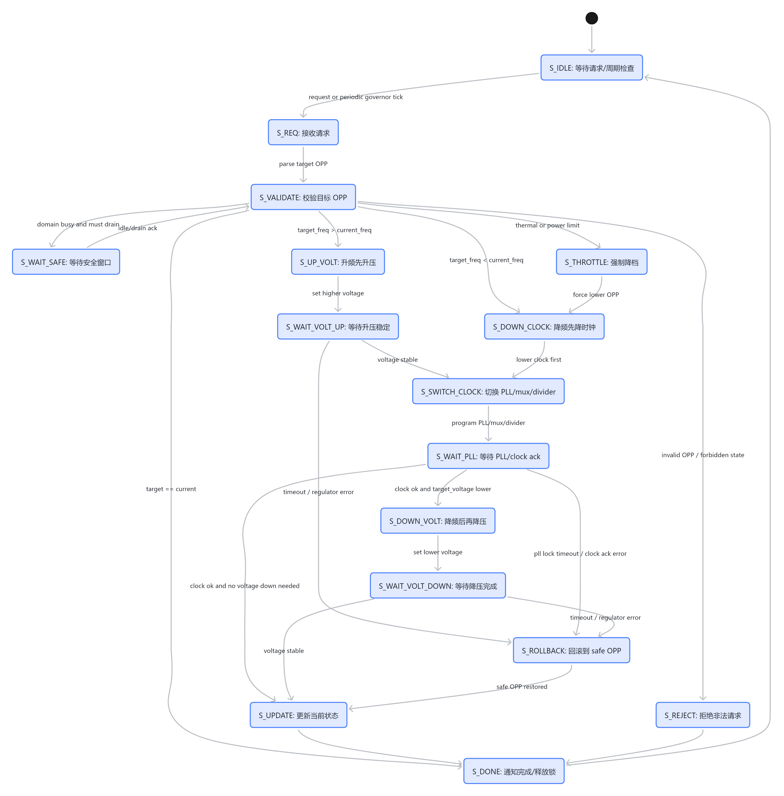

> 图解源文件：[`02-3.-DVFS-状态机图-stateDiagram-v2.mmd`](../../../../_attachments/fw/performance/dvfs-gpgpu-fw/whiteboard-mermaid/02-3.-DVFS-状态机图-stateDiagram-v2.mmd)。由 lark-whiteboard `whiteboard-cli` 从原 Mermaid 渲染。

状态含义：

| 状态 | 作用 |
|---|---|
| `S_IDLE` | 等待 Host 请求，或等待 FW governor 的周期性检查。 |
| `S_REQ` | 接收目标 OPP / 频率 / policy 请求，并准备解析。 |
| `S_VALIDATE` | 查 OPP 表，检查 thermal cap、power cap、perf lock、domain 状态等约束。 |
| `S_WAIT_SAFE` | 等待 GPU domain 进入安全切换窗口，例如 idle、drain 完成或硬件 ack。 |
| `S_UP_VOLT` | 升频路径中先拉高电压，避免低压高频导致 timing violation。 |
| `S_WAIT_VOLT_UP` | 等待 regulator/PMIC 返回 voltage stable。 |
| `S_DOWN_CLOCK` | 降频路径中先降低时钟，让当前电压足够支撑更慢的频率。 |
| `S_SWITCH_CLOCK` | 配置 PLL、clock mux 或 divider，完成 clock path 切换。 |
| `S_WAIT_PLL` | 等待 PLL lock 或 clock controller ack，避免半切换状态继续运行。 |
| `S_DOWN_VOLT` | 频率已经降下来后，再把电压降到目标值。 |
| `S_WAIT_VOLT_DOWN` | 等待降压完成，确认电源状态稳定。 |
| `S_UPDATE` | 更新 FW 记录的 current OPP、freq、voltage 和统计信息。 |
| `S_DONE` | 通知请求方，释放 DVFS lock，回到空闲态。 |
| `S_REJECT` | 对非法 OPP 或不允许的状态直接拒绝，不进入硬件切换。 |
| `S_ROLLBACK` | 失败时回滚到 safe OPP，避免 GPU 留在半切换状态。 |
| `S_THROTTLE` | 过温或过功耗时强制降档，优先保护硬件。 |

一个更短的记忆版：

```text
request
  -> validate OPP
  -> wait safe window
  -> if up:   voltage up -> clock up
  -> if down: clock down -> voltage down
  -> wait ack / lock
  -> update state
  -> fail: rollback / throttle
```

## 4. OPP 表和 VF 频点有什么关系

**有关系，而且非常核心。**

VF 频点通常指一个最基本的组合：

```text
VF point = Voltage + Frequency
```

例如：

| VF 点 | Frequency | Voltage |
|---|---:|---:|
| VF0 | 300 MHz | 0.70 V |
| VF1 | 600 MHz | 0.80 V |
| VF2 | 900 MHz | 0.90 V |
| VF3 | 1000 MHz | 1.00 V |

OPP 表通常是“合法 VF 点的工程化版本”：

```text
OPP entry =
  voltage
  frequency
  PLL config
  clock divider
  domain id
  thermal/power cap
  transition latency
  min/max residency
  fuse/binning limit
  debug visibility
```

所以可以这样回答：

> VF 频点是电压和频率的组合；OPP 是 FW/driver 可以使用的合法运行档位。简单 SoC 里一个 OPP 可能几乎等于一个 VF 点；复杂 GPGPU 里一个 OPP 往往还包含 PLL 配置、divider、clock domain、voltage rail、功耗限制、切换延迟、thermal cap 等元数据。

GPGPU 里还可能不是单一 VF：

```text
OPP2:
  gfxclk = 900 MHz
  vdd_gfx = 0.90 V
  memclk = 1.2 GHz
  vdd_mem = 1.05 V
  nocclk = 800 MHz
  vdd_soc = 0.85 V
```

这就是为什么复杂 GPU 的 OPP 表不只是两列数字。

## 5. FW 层面通常需要负责哪些方面

面试时可以按 7 层说：

| 层 | FW 需要做什么 | 面试重点 |
|---|---|---|
| OPP / policy 数据 | 保存合法 OPP、VF 点、cap、transition latency | OPP 不是任意频率 |
| 请求入口 | Host/KMD、thermal、power、governor、debug CLI | 谁能发起 DVFS |
| 负载监控 | busy counter、queue depth、active core/cluster、memory stall | GPGPU 要区分 compute-bound 和 memory-bound |
| governor | 根据负载/温度/功耗选 target OPP | 迟滞、去抖、避免抖动 |
| transition FSM | 安全执行升降频时序 | 升频先升压，降频先降频 |
| 底层 driver | PMIC/regulator、PLL、clock mux/divider、CRG | 等 stable / lock / ack |
| 保护和调试 | timeout、rollback、throttle、日志、计数器 | 出错不能卡死或过压过热 |

如果你之前只是调用封装接口，那么面试时要补足的是：**接口背后的状态机、OPP 合法性、硬件时序和失败处理**。

## 6. 为什么升频要先升压，降频要先降频

这个顺序来自 timing 和电路速度。

升频时：

```text
目标: 600MHz / 0.8V -> 1000MHz / 1.0V

正确:
  0.8V -> 1.0V
  wait voltage stable
  600MHz -> 1000MHz

错误:
  600MHz -> 1000MHz
  0.8V -> 1.0V
```

如果先把频率升上去，而电压还没升，逻辑路径可能跑不完，直接 timing fail。

### 6.1 为什么会 timing violation，会导致什么问题

先把频率升高，等价于把每个 clock cycle 的时间缩短。比如：

```text
600 MHz  -> Tclk = 1.67ns
1000 MHz -> Tclk = 1.00ns
```

而电压还没升上来时，晶体管驱动能力仍然偏弱，组合逻辑、SRAM、NoC 路径的 delay 还保持在“低压慢速”的状态。于是会出现：

```text
路径实际需要时间 = 1.20ns
新 clock 周期    = 1.00ns
结果: 1.20ns > 1.00ns，数据赶不上下一个采样边沿
```

这就是 setup timing violation：数据还没稳定，下一级触发器的 clock edge 已经来了。

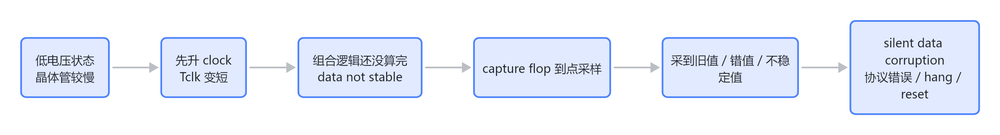

> 图解源文件：[`03-6.1-为什么会-timing-violation-会导致什么问题-flowchart.mmd`](../../../../_attachments/fw/performance/dvfs-gpgpu-fw/whiteboard-mermaid/03-6.1-为什么会-timing-violation-会导致什么问题-flowchart.mmd)。由 lark-whiteboard `whiteboard-cli` 从原 Mermaid 渲染。

可能导致的问题按严重程度看：

| 问题 | 说明 |
|---|---|
| silent data corruption | 最危险，计算结果错了但系统不一定立刻报错。 |
| control FSM 乱跳 | 状态机采到错误状态，可能进入非法状态。 |
| bus / NoC 协议错误 | valid/ready、id、addr、data 某些信号没按时稳定，触发协议异常。 |
| SRAM / register file 读写失败 | 低压高频下 memory macro access time 不够。 |
| ECC / parity error | 数据位翻转或读出不一致，被保护机制捕获。 |
| GPU hang | 某个 handshake 永远等不到，FW 看到 timeout。 |
| watchdog reset / safe reset | 硬件或 FW 保护机制复位相关 domain。 |

面试里可以把这句话说得更完整：

> 先升频会让 clock period 立刻变短，但此时电压还没升上来，逻辑路径 delay 仍然偏大。如果 delay 超过新的 clock period，capture flop 会在数据未稳定时采样，形成 setup timing violation。后果可能是错误数据、状态机异常、总线协议错误、ECC/parity、GPU hang，严重时 watchdog reset。

降频时：

```text
目标: 1000MHz / 1.0V -> 600MHz / 0.8V

正确:
  1000MHz -> 600MHz
  wait clock stable
  1.0V -> 0.8V
```

原因是：低频在高电压下通常安全，只是功耗浪费；高频在低电压下可能不安全。

## 7. timing 是什么，为什么电压组合会导致 timing 过不了

### 7.1 timing 不是软件时间，而是电路时序约束

同步数字电路里，数据通常从一个触发器发出，经过组合逻辑，再被下一个触发器采样。

```text
FF1 --组合逻辑路径--> FF2
 ^                    ^
 clock edge           next clock edge
```

setup timing 的核心公式可以简化成：

```text
t_clkq + t_logic + t_setup + t_skew + margin <= Tclk
```

其中：

- `t_clkq`：FF1 在时钟沿后输出数据需要的时间。
- `t_logic`：组合逻辑传播延迟。
- `t_setup`：FF2 在采样时钟沿到来前，数据必须提前稳定的时间。
- `t_skew`：时钟到不同触发器的偏斜。
- `margin`：工艺、电压、温度、老化、IR drop 等余量。
- `Tclk`：时钟周期，`Tclk = 1 / frequency`。

比如 1GHz 时：

```text
Tclk = 1ns
```

如果某条关键路径需要：

```text
t_clkq + t_logic + t_setup + skew + margin = 1.08ns
```

那它在 1GHz 下就过不了，因为 1.08ns > 1ns。这个就叫 setup timing violation。

### 7.2 电压为什么影响 timing

CMOS 逻辑门的速度和供电电压有关。电压降低后：

- transistor drive strength 变弱。
- gate 切换更慢。
- wire / gate delay 变大。
- SRAM macro、level shifter、clock buffer 也可能变慢。
- IR drop / noise margin 变差。

所以同一条路径：

```text
1.0V 下 t_logic = 0.72ns
0.8V 下 t_logic = 0.95ns
0.7V 下 t_logic = 1.20ns
```

如果频率仍然是 1GHz，0.7V 下就可能 timing fail。

### 7.3 “不同电压组合”为什么也会过不了

GPGPU 里经常不是一个电压 rail，而是多个 rail：

```text
vdd_gfx    shader/core/cluster
vdd_mem    memory controller / PHY
vdd_soc    NoC / fabric / L2
vdd_aon    always-on / PMU / FW domain
```

不同组合会影响跨 domain 的路径：

```text
GPGPU core domain -> L2 / NoC domain -> memory domain
```

如果 core domain 电压高、频率高，但 NoC domain 电压低、频率低，可能出现：

- core 发得很快，NoC 接不住。
- 跨电压域 level shifter 延迟变大。
- 某些同步路径在低压 domain 变慢。
- memory controller 或 SRAM macro 的 access time 不满足目标频率。
- CDC / handshake 的延迟假设被破坏。
- 低电压下 IR drop 更明显，实际电压比 nominal 更低。

所以不是“只要某个模块电压够就行”，而是整条数据路径和控制路径都要满足对应 corner。

面试里可以这样说：

> timing 指硬件同步路径必须在一个 clock cycle 内完成数据传播并满足 setup/hold 要求。频率越高，周期越短；电压越低，晶体管越慢，组合逻辑和 SRAM 访问延迟越大。GPGPU 里多个 voltage/clock domain 组合在一起时，跨 domain 路径、level shifter、NoC、L2、memory controller 都可能成为关键路径，所以某些 VF 组合没有经过 STA signoff，就不能放进 OPP 表。

### 7.4 setup 和 hold 要分清

常见说“低压高频 timing 过不了”，大多是 setup fail：

```text
路径太慢，赶不上下一个 clock edge。
```

hold fail 方向不一样：

```text
路径太快，数据太早变化，破坏接收触发器的 hold window。
```

hold 更容易出现在 fast corner，例如高电压、低温、fast process。DVFS 面试主要问 setup，但能补一句 hold，会显得更完整。

## 8. clock divider 和 PLL 配置流程

### 8.1 divider 是什么

`divider` 是 **分频器**，作用是把输入 clock 降成更低频率的输出 clock。

最简单的关系是：

```text
f_out = f_in / div
```

例子：

| 输入 clock | divider | 输出 clock |
|---:|---:|---:|
| 1.0 GHz | 1 | 1.0 GHz |
| 1.0 GHz | 2 | 500 MHz |
| 1.0 GHz | 4 | 250 MHz |

它不是新的时钟源，也不负责锁相。可以把它理解为：PLL 先产生一个比较高、比较干净的基础 clock，然后 divider 按比例“少放一些 clock edge”给目标 domain。

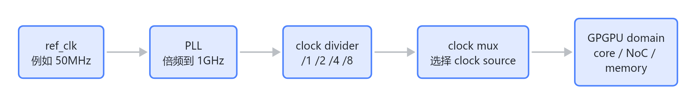

> 图解源文件：[`04-8.1-divider-是什么-flowchart.mmd`](../../../../_attachments/fw/performance/dvfs-gpgpu-fw/whiteboard-mermaid/04-8.1-divider-是什么-flowchart.mmd)。由 lark-whiteboard `whiteboard-cli` 从原 Mermaid 渲染。

为什么说“如果只是改 divider，可能比较简单”？

- 不一定需要重新配置 PLL。
- 不一定需要等待 PLL 重新 lock。
- 通常只是写 divider register，再等 update ack。
- 切换延迟通常比重配 PLL 小。

但“简单”不等于可以随便改。FW 仍然要确认：

- divider 是否支持 glitchless update。
- 写 divider 后是否需要触发 `update` bit。
- 是否要等 `clock_ack` / `divider_update_done`。
- 降频/升频是否仍要配合 voltage 顺序。
- 该 clock domain 正在跑任务时是否允许 active change。

面试里可以这样说：

> divider 是 clock path 里的分频器，把 PLL 或参考时钟按 N 分频输出给目标 domain。改 divider 只是改频率比例，不一定重配 PLL，所以通常比 PLL reprogram 快；但仍要考虑 glitchless、update ack、domain idle、以及 DVFS 的电压/频率顺序。

### 8.2 PLL 是什么

PLL = Phase Locked Loop，锁相环。它的作用是用一个稳定的参考时钟生成目标高频时钟。

常见结构可以简化成：

```text
ref_clk -> reference divider -> phase detector -> loop filter -> VCO -> post divider -> output clock
```

在 FW 视角里，不需要推导模拟环路细节，但要理解几个配置对象：

| 配置项 | 作用 |
|---|---|
| reference divider | 先把参考时钟分频到 PLL 内部需要的比较频率。 |
| feedback multiplier / divider | 决定 VCO 倍频比例，是目标频率的核心来源。 |
| post divider | VCO 输出后再分频，得到 domain 使用的 clock。 |
| enable / bypass | 使能 PLL，或临时绕过 PLL 使用参考时钟。 |
| lock status | PLL 输出是否稳定，FW 必须等待它。 |
| clock mux select | 选择 domain 当前用 ref clock、old PLL、new PLL 还是 divided clock。 |

本地 MAS 摘录里，CP_lcrg bring-up 示例包含：写 `CP_REG_TOP.pll_cfg0.pllen` 使能 PLL，等待 `CP_REG_TOP.pll_status[8]` 为 1，再通过 `pll_cfg3.clk_ref_sel_fun` 切换工作时钟。这是启动阶段的 PLL/clock bring-up；运行期 DVFS 的 PLL 切换会在这个基础上增加 idle/drain、rollback、timeout 等保护。

### 8.3 配置 PLL 的典型流程

完整 PLL 配置流程可以按下面理解：

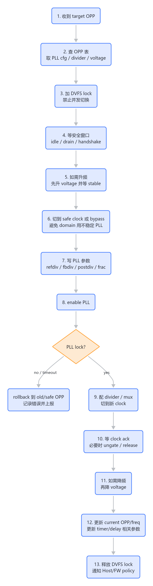

> 图解源文件：[`05-8.3-配置-PLL-的典型流程-flowchart.mmd`](../../../../_attachments/fw/performance/dvfs-gpgpu-fw/whiteboard-mermaid/05-8.3-配置-PLL-的典型流程-flowchart.mmd)。由 lark-whiteboard `whiteboard-cli` 从原 Mermaid 渲染。

用序列图表示更接近 FW 实现：

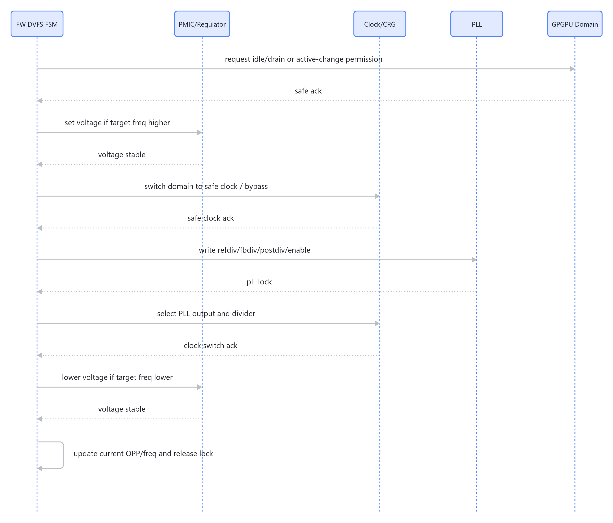

> 图解源文件：[`06-8.3-配置-PLL-的典型流程-sequenceDiagram.mmd`](../../../../_attachments/fw/performance/dvfs-gpgpu-fw/whiteboard-mermaid/06-8.3-配置-PLL-的典型流程-sequenceDiagram.mmd)。由 lark-whiteboard `whiteboard-cli` 从原 Mermaid 渲染。

关键点不是每个平台都必须一模一样，而是这些安全原则基本相同：

1. **先查表**：PLL 参数不能现场随便算完就写，通常来自 OPP/clock table。
2. **先锁状态**：防止另一个线程、Host 请求或 thermal handler 同时切换。
3. **先找安全窗口**：不支持 active switch 的 domain 要等 idle/drain。
4. **升频先升压**：避免低压高频 timing fail。
5. **切 safe clock**：重配 PLL 期间不要让业务 domain 使用不稳定 clock。
6. **写 PLL 参数后等 lock**：没有 `pll_lock` 不能认为新 clock 可用。
7. **再切 mux/divider**：把目标 domain 切到新 clock path。
8. **降频再降压**：避免先降压导致当前高频下 timing fail。
9. **失败要回滚**：PLL lock timeout 时回 old clock 或 safe OPP。
10. **更新软件时间基准**：如果 FW CPU/timer 受影响，要更新 tick、delay、timeout 计算。

### 8.4 配置 PLL 常见错误

| 错误 | 后果 |
|---|---|
| 没等 `pll_lock` 就切 mux | domain 使用不稳定 clock，可能 hang 或数据错误。 |
| 重配 PLL 时没有切 safe clock | PLL 输出抖动/停顿会直接打到业务 domain。 |
| 升频前没有升压 | setup timing violation，可能 silent data corruption 或 GPU hang。 |
| 降频前先降压 | 当前仍在高频运行，也可能 timing fail。 |
| 没有 timeout | PLL/PMIC 异常时 FW 永远卡住。 |
| 没有 readback | FW 以为切成功，硬件实际还在旧频率或 safe clock。 |
| 没更新 timer/delay | FW 的 timeout、delay、profile 计数全部偏掉。 |

面试里如果被问“配置 PLL 怎么做”，可以按这个模板回答：

> 先从 OPP 表拿目标 PLL 参数和 divider，进入 DVFS 临界区，等待 domain idle 或 drain。如果是升频先升压并等 stable。然后把 domain 切到 safe clock 或 bypass，写 PLL 的 ref divider、feedback divider、post divider 等参数，使能 PLL，等待 pll_lock。lock 成功后配置 clock mux/divider，把 domain 切到新 clock，等待 clock ack。如果是降频，再降 voltage。最后更新 current OPP/frequency/timer 基准并释放锁。任何一步 timeout 都要回滚到 old clock 或 safe OPP，不能留在半切换状态。
### 8.5 DVFS 过程中的毛刺与 glitchless 切换

DVFS 切换时最怕的不是“最终频率不对”，而是切换过程中的短暂非法状态。常见问题包括 clock 毛刺、divider 半周期、mux 切换瞬间的 runt pulse、PLL 未 lock 时输出抖动，以及电压 ramp 过程中的 droop/overshoot。

```text
正常 clock:  _|-|_|-|_|-|_
毛刺 clock:  _|-|_|-||_|-|_
                  ^^ 很窄的异常脉冲
```

这种异常短脉冲可能让 flop 多采一次、少采一次，或者在数据还没稳定时采样，结果就是状态机乱跳、总线协议错误、ECC/parity、GPU hang。

常见毛刺来源和解决方式：

| 毛刺来源 | 风险 | FW / HW 处理方式 |
|---|---|---|
| clock mux 直接切 select | 输出短脉冲或双边沿。 | 使用 glitchless mux，通过 clock controller handshake 切换。 |
| divider 动态改值 | 产生半个周期或不完整周期。 | 走 divider update bit，等待 update ack；必要时先 gate clock。 |
| PLL 未 lock 就切过去 | domain 使用不稳定 clock。 | 等 `pll_lock` 和 clock ack，超时 rollback。 |
| clock gate enable 异步变化 | 打开/关闭瞬间出现异常 edge。 | gate enable 同步到目标 clock，使用 clock-gating cell。 |
| 电压 ramp 太快或负载突变 | droop/overshoot，实际电压低于 nominal。 | 设置 regulator slew rate，等 voltage stable，必要时分阶段 enable。 |
| reset release 遇到不稳定 clock | reset 释放后状态机跑飞。 | 等 clock stable 后同步释放 reset。 |

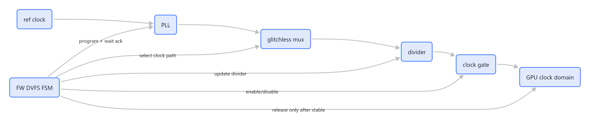

> 图解源文件：[`07-8.5-DVFS-过程中的毛刺与-glitchless-切换-flowchart.mmd`](../../../../_attachments/fw/performance/dvfs-gpgpu-fw/whiteboard-mermaid/07-8.5-DVFS-过程中的毛刺与-glitchless-切换-flowchart.mmd)。由 lark-whiteboard `whiteboard-cli` 从原 Mermaid 渲染。

`glitchless` 的意思是：clock path 在切换 mux、gate、divider 时，不产生非法短脉冲、不产生双边沿、不产生不完整周期。它通常不是靠 FW 延时硬凑出来的，而是由 clock controller、glitchless mux、clock gate cell、divider update handshake 等硬件机制保证。FW 的职责是按协议写寄存器，并等待 ack。

面试里可以这样说：

> glitchless 不是说切换没有延迟，而是说切换过程中输出 clock 不会出现非法 edge。FW 不能直接假设 mux/divider 任意改都安全，必须看硬件是否支持 glitchless switch，并按要求 gate、切 safe clock、等 update ack 或 clock ack。

### 8.6 PLL lock 与 reset 的关系

PLL 没有 lock 期间，目标 domain 的功能 clock 不可信。这里要区分 **assert reset** 和 **deassert reset**。

| 动作 | PLL 未 lock 时是否安全 | 原因 |
|---|---|---|
| assert reset 拉复位 | 通常可以，而且常用于保护。 | 让目标逻辑保持在已知复位态，不让它跑在不稳定 clock 上。 |
| deassert reset 释放复位 | 通常不可以。 | reset 释放后状态机开始工作，如果 clock 不稳定，可能进入非法状态。 |
| 发送依赖目标 clock 的同步 reset pulse | 不安全。 | pulse 宽度和采样都依赖不稳定 clock，可能丢失或变形。 |
| AON/reset controller 域发 reset 控制 | 通常可以。 | 前提是 reset controller 使用 stable always-on clock，并按目标域同步释放。 |

推荐顺序：

```text
assert reset
configure PLL
wait pll_lock
wait clock stable / clock ack
deassert reset with synchronizer
start domain traffic
```

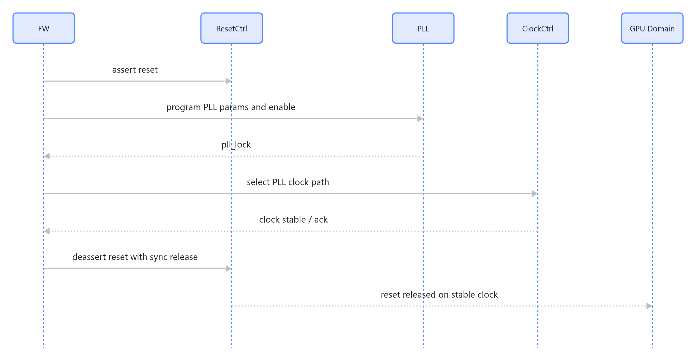

> 图解源文件：[`08-8.6-PLL-lock-与-reset-的关系-sequenceDiagram.mmd`](../../../../_attachments/fw/performance/dvfs-gpgpu-fw/whiteboard-mermaid/08-8.6-PLL-lock-与-reset-的关系-sequenceDiagram.mmd)。由 lark-whiteboard `whiteboard-cli` 从原 Mermaid 渲染。

一句话记忆：

> PLL 没 lock 时，可以把目标 domain 保持在 reset；真正危险的是释放 reset。释放 reset 必须等 PLL lock、clock stable，并且同步到目标 clock domain。

### 8.7 device memory / VRAM DVFS：NoC 反压与访问响应

GPGPU DVFS 不一定只调 core。复杂芯片里还可能调 NoC/fabric、L2、memory controller、memory PHY、device memory rail 和 memory clock。这里最容易误解的是：**切换 memory 频率/电压时，外部或内部请求来了，是否还能访问 VRAM？**

结论：

> NoC 反压可以让新请求暂时不下发，这是常见做法；但它只解决“新请求入口”问题。已经进入 memory controller / PHY / DRAM 的 outstanding 访问，必须先 drain 到安全点。切换期间不能让真实 VRAM array / PHY 在不稳定 clock、voltage、timing、training 状态下继续被访问。

可以把访问分成三段看：

```text
client / PCIe / DMA / core
  -> NoC / fabric / bridge queue
      -> memory controller ingress
          -> PHY / VRAM device
```

切换时通常要做到：

| 阶段 | 处理原则 |
|---|---|
| 新请求还在 client / NoC 入口 | 可以 backpressure、不给 credit、stall valid/ready、或暂存在 bridge queue。 |
| 请求已经进入 memory controller | 要等待 outstanding counter 清零，或等待 MC 把请求处理到可暂停边界。 |
| 请求已经到 PHY / VRAM command 层 | 一般不能硬切频，必须等 data return/write drain/precharge/refresh 边界。 |
| 切换完成后 | 解除 block，按原顺序继续发请求，read 再返回 completion。 |

所以，回答“只靠 NoC 反压够不够”时，要加条件：

1. NoC 反压能挡住 **新进入 memory path 的请求**。
2. FW/HW 还要确认 **老 outstanding 已经 drain**。
3. PCIe / DMA / core 这类 upstream 要能承受 stall，不能形成协议 timeout 或死锁。
4. AON/status register 可以继续响应，但 VRAM BAR / device memory read 不能直接打到不稳定 memory。

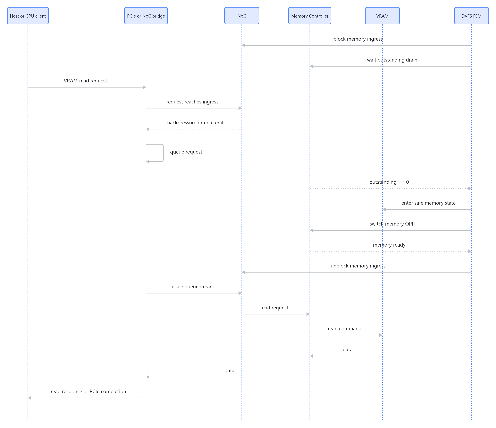

> 图解源文件：[`09-8.7-device-memory-VRAM-DVFS-NoC-反压与访问响应-sequenceDiagram.mmd`](../../../../_attachments/fw/performance/dvfs-gpgpu-fw/whiteboard-mermaid/09-8.7-device-memory-VRAM-DVFS-NoC-反压与访问响应-sequenceDiagram.mmd)。由 lark-whiteboard `whiteboard-cli` 从原 Mermaid 渲染。

如果访问来自 PCIe，要特别注意：PCIe memory read 是 split transaction，不是一个固定长度的同步 read cycle。

```text
Host 发 Memory Read TLP
Endpoint 内部取数
Endpoint 回 Completion TLP
```

Completion 可以延迟，但不能无限延迟。系统里会有 completion timeout 或上层 driver timeout。因此设计上不能说“切换足够快，在 read 周期内回复即可”。正确做法是：

- 对 VRAM read：bridge / NoC / MC queue 住请求，等 memory ready 后再真正读取并 completion。
- 对 AON/status register read：可以直接返回 `dvfs_busy`、`current_opp`、`target_opp` 等 shadow 状态。
- 对 posted write：可以 buffer 或 backpressure，但不能把 write 打到不稳定 VRAM；切换前还要 drain 旧 write。
- 对内部 GPU 访问：通常先 stop new dispatch、drain pipeline、flush 必要 cache/write buffer，再切 memory OPP。

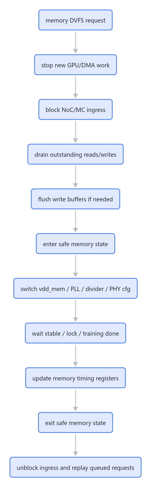

> 图解源文件：[`10-8.7-device-memory-VRAM-DVFS-NoC-反压与访问响应-flowchart.mmd`](../../../../_attachments/fw/performance/dvfs-gpgpu-fw/whiteboard-mermaid/10-8.7-device-memory-VRAM-DVFS-NoC-反压与访问响应-flowchart.mmd)。由 lark-whiteboard `whiteboard-cli` 从原 Mermaid 渲染。

#### VRAM / device memory 常见状态

不同产品会使用 GDDR、HBM、LPDDR 或私有 device memory，状态名字和精确时间要以 JEDEC/device spec、memory controller 手册为准。下面是 FW 面试和调试时常见的抽象状态：

| 状态 | 典型含义 | 是否响应 VRAM 访问 | 数据保持 | 唤醒/恢复时间量级 | FW 关注点 |
|---|---|---|---|---|---|
| Active / Normal | memory clock、PHY、MC 都正常工作。 | 正常响应，latency 最低。 | 保持 | 已经可用 | 正常读写、性能统计、温度/功耗监控。 |
| Active throttled / Low OPP | memory 仍 active，但频率/电压降到较低 OPP。 | 正常响应，但带宽下降、latency 可能上升。 | 保持 | OPP 切换完成后可用 | 更新 timing、QoS、带宽预估，避免 core 发得过快。 |
| Clock gated idle | MC/PHY 某些 clock 被 gate，VRAM 内容仍在。 | 首个访问可能触发 ungate，或被短暂 stall。 | 保持 | ns 到 us，取决于 gate 层级 | gate enable 要同步，不能产生 clock glitch。 |
| Precharge power-down | DRAM bank 预充电后进入低功耗，外部 clock/命令受限。 | 不直接响应，需要先 exit power-down。 | 保持，DRAM 仍需要刷新机制 | ns 到低 us | 退出后满足 tXP/tXPDLL 等时序，再恢复命令。 |
| Active power-down | 某些 bank 仍保持 active row，但进入低功耗。 | 不直接响应，需要 exit 后继续访问。 | 保持 | ns 到低 us | 比 self-refresh 快，但省电较少，时序限制更多。 |
| Self-refresh | DRAM 自己刷新，控制器可以暂停外部访问。 | 不响应普通 VRAM 访问；请求要 stall/queue。 | 保持，由 DRAM 内部 refresh 维持 | us 级到更高，依器件/容量/温度而定 | 常用于 memory DVFS safe window；退出后等 tXS/tRFC 类时序。 |
| Frequency-change / FSP switch | 切 memory PLL/divider/PHY/timing，可能配合 self-refresh 或专用模式。 | 切换中不允许普通 VRAM 访问。 | 正确流程下保持 | us 到 ms，取决于 PLL lock、PHY training | 等 PLL lock、PHY ready、training done，再解除 ingress block。 |
| PHY training / retraining | PHY 做 read/write leveling、deskew、Vref 等训练。 | 不响应普通 VRAM 访问。 | 通常保持，但训练失败不能继续使用 | us 到 ms | 失败要 rollback 或降到 safe OPP。 |
| Retention | controller/PHY/部分逻辑进入保持态，外部 memory 或状态寄存器保持。 | 通常不响应普通访问，只能访问 AON/status。 | 设计支持的状态会保持 | us 到 ms | 恢复上下文、重新 enable clock、检查 ready。 |
| Deep power-down | 更深低功耗状态，部分 DRAM 类型支持，通常牺牲快速恢复。 | 不响应。 | 很多情况下不保证保持，需要重初始化 | us 到 ms 甚至更长 | 不能当普通 DVFS 快速切换状态使用。 |
| Power off / Rail off | memory rail 或 PHY rail 关闭。 | 不响应。 | 不保持，除非另有 retention rail 设计 | ms 级或更长 | 需要完整初始化、training、数据重载或重新分配。 |
| Refresh / ZQ calibration / maintenance | DRAM 正在 refresh、ZQ 校准或内部维护。 | 控制器会调度或暂停普通命令。 | 保持 | ns 到 us，依维护类型 | FW 通常看不到每个细节，但切频要避开或等待 MC safe ack。 |

一句话记忆：

> NoC 反压解决“不要再把新请求送进不稳定 memory path”；self-refresh / power-down / frequency-change 解决“memory device 本身处于可安全暂停或切换的状态”；outstanding drain 解决“旧请求不能切一半”。三者缺一不可。

## 9. GPGPU DVFS 的策略难点

### 9.1 compute-bound 和 memory-bound 不一样

如果 workload 是 compute-bound：

```text
提高 shader/core frequency -> 性能可能提升明显
```

如果 workload 是 memory-bound：

```text
提高 core frequency -> 可能只是更快地等 memory
提高 memory/fabric frequency -> 可能更有效
```

所以 GPGPU DVFS 不能只看 core busy。更好的监控包括：

- active CU/SM/cluster 数。
- warp/wave occupancy。
- queue depth / pending kernel 数。
- ALU busy vs memory stall。
- L2 hit/miss、memory bandwidth。
- NoC congestion。
- power / thermal headroom。

### 9.2 governor 去抖：为什么会抖，如何压住抖动

`governor` 可以理解成 DVFS 的策略控制器。它不直接产生电压或时钟，而是周期性读取负载、温度、功耗、队列深度等信号，然后决定 target OPP。

最容易出问题的是：输入信号本身在阈值附近来回跳，导致 target OPP 也来回跳。

```text
load: 78% -> 82% -> 79% -> 83%
threshold_up = 80%

如果没有保护:
  升频 -> 降频 -> 升频 -> 降频
```

这就是 OPP 抖动。它不仅浪费切换时间，还可能让 PLL/PMIC/clock path 频繁切换，降低性能并增加状态机复杂度。

常见抖动来源：

| 来源 | 为什么会造成抖动 |
|---|---|
| burst workload | kernel 或 command queue 一阵忙一阵闲，瞬时 busy 很尖。 |
| 采样窗口太短 | 统计值只反映很短时间，容易被偶发峰值带偏。 |
| sensor 噪声 | 温度、电流、功耗读数存在量化误差或采样噪声。 |
| 阈值太接近 | 升频阈值和降频阈值离得太近，负载稍微波动就触发反向动作。 |
| 控制回路反应过快 | DVFS 切换本身有延迟，FW 还没看到新 OPP 的稳定效果就又做下一次决策。 |
| thermal/power limit 反复触发 | 到 cap 就降频，稍微恢复又升频，形成来回拉扯。 |

常用去抖手段：

| 方法 | 典型做法 | 作用 |
|---|---|---|
| hysteresis 迟滞 | `load > 80%` 才升频，`load < 40%` 才降频。 | 升降频阈值分开，避免在一个阈值附近来回跳。 |
| debounce 连续确认 | 高负载连续 N 次才升频，低负载连续 M 次才降频。 | 过滤单次采样尖峰。 |
| moving average | 对 busy、temperature、power 做滑动平均或 EMA。 | 让 governor 看趋势，而不是只看瞬时值。 |
| min residency | 每个 OPP 至少停留一段时间，比如 5ms/10ms。 | 避免刚切完马上反向切。 |
| rate limit | 每次最多升/降一档，或单位时间限制切换次数。 | 避免 target OPP 大幅跳变。 |
| cooldown | 切换完成后进入短暂冷却期。 | 等新频点下的负载和功耗稳定后再判断。 |

一个简化的 FW 逻辑可以这样理解：

```c
if (now - last_transition_time < min_residency_us)
    keep_current_opp();

avg_load = ema(avg_load, sample_load);

if (avg_load > up_threshold) {
    up_count++;
    down_count = 0;
    if (up_count >= up_debounce_count)
        request_opp(current_opp + 1);
} else if (avg_load < down_threshold) {
    down_count++;
    up_count = 0;
    if (down_count >= down_debounce_count)
        request_opp(current_opp - 1);
} else {
    up_count = 0;
    down_count = 0;
}
```

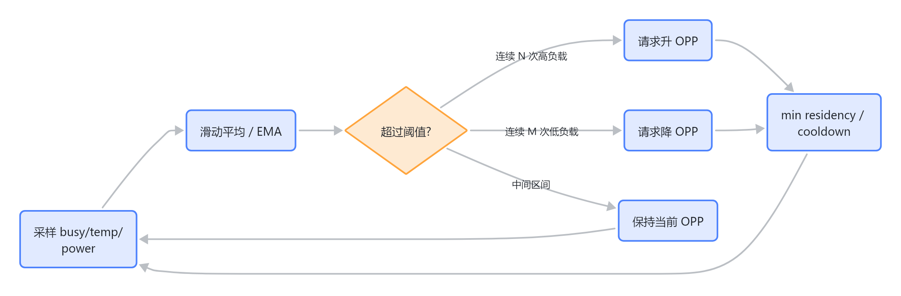

> 图解源文件：[`11-9.2-governor-去抖-为什么会抖-如何压住抖动-flowchart.mmd`](../../../../_attachments/fw/performance/dvfs-gpgpu-fw/whiteboard-mermaid/11-9.2-governor-去抖-为什么会抖-如何压住抖动-flowchart.mmd)。由 lark-whiteboard `whiteboard-cli` 从原 Mermaid 渲染。

### 9.3 FW 要处理多个请求源

可能同时有：

- Host 要求 high performance。
- thermal 要求降频。
- power budget 要求降功耗。
- debug 要求 fixed OPP。
- kernel 正在运行，不方便切换。

优先级通常是：

```text
safety > thermal > power cap > fixed/debug > QoS minimum > performance governor
```

## 10. 面试官通常会问什么

### Q1：OPP 表和 VF 频点是什么关系？

推荐回答：

> VF 频点是 voltage + frequency 的组合，OPP 是系统允许使用的运行档位。简单情况下一个 OPP 就是一组 VF；复杂 GPGPU 里 OPP 还会包含 PLL 配置、divider、clock domain、voltage rail、切换延迟、thermal/power cap、fuse/binning 限制等元数据。FW 不能随便拼电压和频率，只能在经过 signoff 的 OPP 表里选。

### Q2：为什么升频要先升压，降频要先降频？

推荐回答：

> 因为高频会缩短 clock period，而低电压下晶体管驱动弱、路径 delay 大。升频时如果先升 clock，数据可能还没稳定就被下一级触发器采样，形成 setup timing violation，后果可能是错误数据、状态机异常、总线协议错误、ECC/parity、GPU hang 或 reset。所以升频要先升压，等 voltage stable，再升 clock；降频时则先降 clock，再降 voltage。

### Q3：timing 是什么？

推荐回答：

> timing 是同步电路中数据从 launch flop 经过组合逻辑到 capture flop 的时序约束。对 setup 来说，数据必须在下一个采样时钟沿之前提前稳定，公式可以简化成 `t_clkq + t_logic + t_setup + skew + margin <= Tclk`。频率越高，`Tclk` 越短；电压越低，逻辑延迟越大，所以低压高频容易 timing fail。

### Q4：为什么某些电压组合过不了 timing？

推荐回答：

> 因为 GPGPU 有多个 voltage/clock domain。core、NoC、L2、memory controller、SRAM、PLL 等路径会跨 domain 工作。某些组合下，低压 domain 的路径变慢，level shifter 延迟变大，SRAM access time 变长，或者 IR drop 让实际电压低于 nominal，导致关键路径无法在目标 clock period 内完成。所以 OPP 表里的组合必须是 STA、硅后验证和可靠性都认可的组合。

### Q5：FW 具体实现 DVFS 需要哪些模块？

推荐回答：

> 需要 OPP 表、请求入口、负载/温度/功耗监控、governor、transition FSM、PMIC/regulator driver、PLL/clock driver、domain idle/drain handshake、timeout/rollback/throttle、debug log/counter。FW 的核心不是直接产生电压和频率，而是选择合法目标并安全执行切换。

### Q6：如果 PLL lock 失败怎么办？

推荐回答：

> 不能一直等。FW 要有 timeout，失败后回滚到 safe OPP 或保持原频点，记录错误状态，必要时触发 throttle 或上报 Host。关键是状态机必须可恢复，不能把 GPU 留在半切换状态。

### Q7：DVFS 和 clock gating / power gating 有什么区别？

推荐回答：

| 机制 | 做什么 | 粒度 |
|---|---|---|
| clock gating | 空闲时关 clock | 快，省动态功耗 |
| power gating | 关掉 power domain | 慢，省 leakage |
| DVFS | 改 voltage + frequency | 性能/功耗动态平衡 |

### Q8：GPGPU 场景下怎么判断该升频？

推荐回答：

> 不能只看 busy。要结合 queue depth、active cluster、ALU busy、memory stall、bandwidth、thermal headroom。如果是 compute-bound，升 core clock 有意义；如果是 memory-bound，升 core clock 收益小，可能要看 memory/fabric clock 或保持低频省功耗。

### Q9：如何避免 DVFS 频繁抖动？

推荐回答：

> 加 hysteresis、debounce、min residency、升降频不同阈值。例如高负载连续 N 次才升频，低负载连续 M 次才降频，并限制两个 OPP 切换之间的最小间隔。降频通常比升频更保守。

### Q10：运行中能不能直接切频？

推荐回答：

> 要看硬件是否支持 glitchless clock switch，以及该 domain 是否允许 active transition。如果不支持，需要等 idle 或 drain；如果支持，也要等 clock ack、PLL lock，并保证跨 domain handshake 正确。FW 不能假设所有 clock 都可以任意切。


### Q11：divider 是什么？为什么只改 divider 可能比重配 PLL 简单？

推荐回答：

> divider 是 clock path 中的分频器，把 PLL 或 ref clock 按 N 分频输出，例如 1GHz / 2 得到 500MHz。只改 divider 通常不需要重新让 PLL lock，所以切换延迟和风险都比重配 PLL 小。但仍要看硬件是否支持 glitchless divider update，是否要写 update bit、等 divider ack，以及是否需要 domain idle。

### Q12：配置 PLL 的流程是什么？

推荐回答：

> 从 OPP 表取目标 PLL 参数和 divider，进入 DVFS lock，等待 domain 安全窗口。升频先升 voltage 并等 stable；然后切到 safe clock/bypass，写 PLL refdiv/fbdiv/postdiv 等参数，使能 PLL，等待 pll_lock。lock 后配置 mux/divider 切到新 clock，等待 clock ack。降频场景在 clock 降下来后再降 voltage。最后更新 current OPP/frequency/timer，失败则 timeout 回滚到 old clock 或 safe OPP。
### Q13：governor 为什么要做迟滞和去抖？

推荐回答：

> 因为负载、温度、功耗都是采样值，天然会波动。如果升频阈值和降频阈值太近，或者只看单次采样，target OPP 会在相邻档位之间来回跳。FW 通常用 hysteresis、debounce、moving average、min residency、rate limit、cooldown 来避免抖动。比如高负载连续 N 次才升频，低负载连续 M 次才降频，并且每个 OPP 至少停留一段时间。

### Q14：DVFS 切换过程中的毛刺是什么，怎么解决？

推荐回答：

> 毛刺通常指 clock/power/control 在切换瞬间出现短暂非法状态，例如 clock mux 切换时产生 runt pulse、divider 改值时出现半周期、PLL 未 lock 就输出到业务 domain，或者电压 ramp 过程出现 droop。解决方式是使用 glitchless mux/divider update handshake、必要时 gate clock 或切 safe clock、等待 PLL lock/clock ack/voltage stable、reset 同步释放，并且任何等待超时都要 rollback。

### Q15：glitchless 是什么？

推荐回答：

> glitchless 指 clock path 在 mux、gate、divider 切换时不会产生非法短脉冲、双边沿或不完整周期。它一般由 clock controller、glitchless mux、clock gate cell、divider update handshake 等硬件保证，FW 负责按协议写寄存器并等待 ack。不能把普通 mux 当成 glitchless mux 使用。

### Q16：PLL 没有 lock 期间能不能发 reset？

推荐回答：

> 要区分 assert reset 和 deassert reset。PLL 没 lock 时，通常可以 assert reset，把目标 domain 保持在复位态；但不应该 deassert reset，因为释放后状态机要开始跑，而此时 clock 不稳定。推荐顺序是 assert reset，配置 PLL，等待 pll_lock 和 clock stable，再同步释放 reset。

### Q17：memory 切频过程中来了 VRAM 访问，只靠 NoC 反压可以吗？

推荐回答：

> NoC 反压可以挡住新请求，让访问暂时不下发到 memory controller，这是常见手段。但它不是完整方案。切换前还要停止新 GPU/DMA work，等待已经进入 MC/PHY 的 outstanding read/write drain，必要时 flush write buffer，然后让 memory 进入 self-refresh 或 frequency-change safe mode。切换完成、PLL lock、PHY ready、timing 更新后，再解除反压并继续下发 queued request。

### Q18：PCIe read 在 memory DVFS 期间怎么响应？

推荐回答：

> PCIe read 是 split transaction，Host 发 Memory Read TLP，Endpoint 后续返回 Completion TLP。切换中如果 read 访问 VRAM BAR，bridge/NoC/MC 应该 queue 或 stall 请求，等 memory ready 后再读取并返回 completion。不能依赖“切换足够快，在 read 周期内回复”这种假设，因为系统有 completion timeout，且 memory path 不稳定时直接读可能造成数据错误。AON/status register read 可以直接返回 busy/current_opp/target_opp 等 shadow 状态。

### Q19：VRAM 常见低功耗/切换状态有哪些？

推荐回答：

> 常见状态包括 Active、低 OPP active、clock gated idle、precharge power-down、active power-down、self-refresh、frequency-change/FSP switch、PHY training、retention、deep power-down、power off，以及 refresh/ZQ calibration 等维护状态。面试重点不是背名字，而是说清楚三件事：这个状态能不能响应普通 VRAM 访问、数据是否保持、退出需要等哪些 ready/lock/training/timing 条件。

## 11. 调试检查清单

看 DVFS 问题时，按这个顺序查：

| 检查点 | 为什么重要 |
|---|---|
| 当前 OPP / target OPP | 确认是不是请求错档 |
| OPP table | 确认 VF 组合是否合法 |
| voltage stable ack | 升频前电压是否真的到位 |
| PLL lock / clock ack | clock 是否切换成功 |
| divider / mux readback | 是否真的选择了目标 clock path 和分频比例 |
| safe clock / bypass 状态 | 重配 PLL 后是否已经从 safe clock 切回目标 clock |
| current freq readback | 真实频率是否等于 FW 记录 |
| domain busy / idle | 是否在不安全窗口切换 |
| thermal / power cap | 是否被强制降档 |
| timeout / rollback log | 是否出现半切换失败 |
| timer / delay 校准 | CPU/FW clock 变化后软件时间是否正确 |
| workload counter | 是否误判 compute-bound / memory-bound |
| governor debounce counters | up/down 连续计数、min residency、cooldown 是否符合预期 |
| glitchless switch ack | mux/divider/clock gate 是否走了硬件 handshake |
| reset release trace | reset 是否在 PLL lock 和 clock stable 后同步释放 |
| NoC / MC ingress block | memory DVFS 期间是否阻止新请求进入不稳定 memory path |
| outstanding read/write counter | 切 memory OPP 前旧请求是否已经 drain |
| PCIe completion latency | VRAM read 被 stall 时是否接近 completion timeout |
| memory state / self-refresh | 切频时是否进入了协议允许的 safe state |
| PHY ready / training done | memory PHY 是否已经重新 ready，训练是否通过 |

## 12. 速记版

```text
DVFS = Dynamic Voltage and Frequency Scaling

核心对象:
  VF point = voltage + frequency
  OPP = 合法 VF + PLL/divider/domain/cap/latency 等元数据
  divider = 分频器，f_out = f_in / div
  PLL = 用参考时钟生成目标高频 clock，必须等 lock

FW 核心职责:
  选目标 OPP
  governor 做迟滞/去抖/限速
  做合法性检查
  做 domain handshake
  做 voltage/clock 切换状态机
  等 stable / lock / ack
  避免 clock glitch，必要时切 safe clock
  PLL lock 后再同步释放 reset
  失败回滚
  记录状态并上报

切换顺序:
  升频: voltage up -> clock up
  降频: clock down -> voltage down

timing:
  高频让 Tclk 变短
  低压让路径 delay 变长
  delay > Tclk 就 setup timing fail
  结果可能是错值、协议错误、ECC/parity、hang、reset

GPGPU 特点:
  不能只看 core busy
  要区分 compute-bound 和 memory-bound
  memory DVFS 要 block 新请求、drain outstanding、等 PHY ready
  PCIe read 可以延迟 completion，但不能把请求打到不稳定 VRAM
  多 voltage/clock domain 组合必须经过 signoff
```

## 13. 后续阅读路径

- [[wiki/grace/fw/performance/index|FW 性能索引]]：继续看 FW 性能和 hot path。
- [[wiki/grace/fw/imc/startup-to-main|IMC 启动到 main 流程]]：理解 clock/reset/board init 在 FW 启动阶段的位置。
- [[wiki/grace/mas/RguCore/02-rgu-gctrl|RguGCtrl 学习文档]]：理解 GPGPU 任务如何从 kernel 分发到 cluster/core，帮助把 workload 和 DVFS 联系起来。
