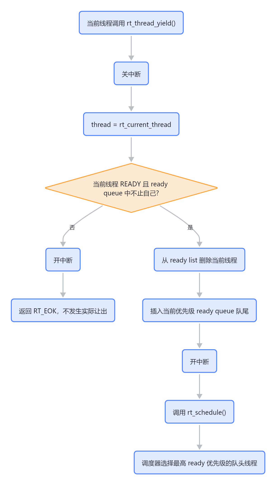
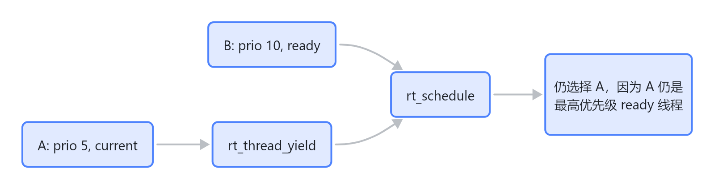
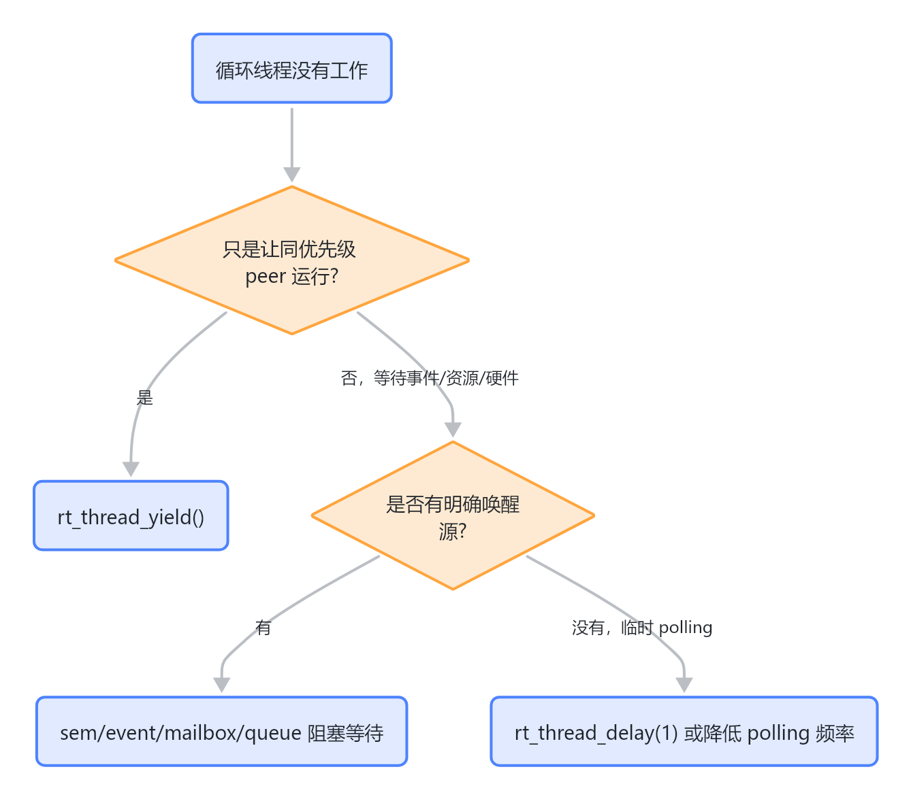

# RT-Thread rt_thread_yield 实现与使用风险

## 结论

当前 fw 仓库使用的是 RT-Thread v3.1.5：

- `RT_VERSION 3L`
- `RT_SUBVERSION 1L`
- `RT_REVISION 5L`

这个版本里的 `rt_thread_yield()` 不是一个通用的“释放 CPU 给其他任意线程”的接口。它的实际语义是：

> 当前线程仍保持 ready 状态，把自己移动到当前优先级 ready queue 的队尾，然后触发一次调度。

因此它主要用于同优先级线程之间的协作式轮转。它不能保证低优先级线程获得执行机会。

## 源码证据

源码位置：

- `/home/shuaishuai.zhu/fw/rtthread/include/rtdef.h:50-56`
- `/home/shuaishuai.zhu/fw/rtthread/include/rtthread.h:141`
- `/home/shuaishuai.zhu/fw/rtthread/src/thread.c:455-489`
- `/home/shuaishuai.zhu/fw/rtthread/src/scheduler.c:194-266`
- `/home/shuaishuai.zhu/fw/rtthread/include/rtservice.h:73-80`
- `/home/shuaishuai.zhu/fw/rtthread/src/clock.c:74-85`

`rt_thread_yield()` 声明在 `rtthread.h`：

```c
rt_err_t rt_thread_yield(void);
```

实现核心在 `thread.c`：

```c
rt_err_t rt_thread_yield(void)
{
    register rt_base_t level;
    struct rt_thread *thread;

    level = rt_hw_interrupt_disable();
    thread = rt_current_thread;

    if ((thread->stat & RT_THREAD_STAT_MASK) == RT_THREAD_READY &&
        thread->tlist.next != thread->tlist.prev)
    {
        rt_list_remove(&(thread->tlist));

        rt_list_insert_before(&(rt_thread_priority_table[thread->current_priority]),
                              &(thread->tlist));

        rt_hw_interrupt_enable(level);

        rt_schedule();

        return RT_EOK;
    }

    rt_hw_interrupt_enable(level);

    return RT_EOK;
}
```

需要注意两个条件：

- 当前线程状态必须是 `RT_THREAD_READY`。
- 当前线程所在 ready queue 中必须不止它自己：`thread->tlist.next != thread->tlist.prev`。

如果这个条件不满足，`yield` 只会开关一次中断，然后返回 `RT_EOK`，不会真正触发调度。

## ready queue 的队尾插入语义

`rt_list_insert_before()` 的实现位于 `rtservice.h`：

```c
rt_inline void rt_list_insert_before(rt_list_t *l, rt_list_t *n)
{
    l->prev->next = n;
    n->prev = l->prev;

    l->prev = n;
    n->next = l;
}
```

调用方式是：

```c
rt_list_insert_before(&(rt_thread_priority_table[thread->current_priority]),
                      &(thread->tlist));
```

`rt_thread_priority_table[prio]` 是当前优先级 ready list 的头节点。把线程插入到头节点之前，等价于插入队尾。

## 调度器如何选择线程

`rt_schedule()` 的关键逻辑：

```c
highest_ready_priority = __rt_ffs(rt_thread_ready_priority_group) - 1;

to_thread = rt_list_entry(rt_thread_priority_table[highest_ready_priority].next,
                          struct rt_thread,
                          tlist);
```

含义：

- RT-Thread 中优先级数值越小，优先级越高。
- 调度器先从 bitmap 中找最高 ready 优先级。
- 然后从该优先级 ready list 的队头取线程。

所以 `rt_thread_yield()` 把当前线程放到同优先级队尾后，如果同优先级还有其他 ready 线程，调度器会切到同优先级队头线程。

如果没有同优先级 peer，当前线程仍然是最高 ready 优先级，调度结果通常还是它自己。

## 执行流程图



> 图解源文件：[`01-执行流程图-flowchart.mmd`](../../../../_attachments/fw/rt-thread/rt_thread_yield/whiteboard-mermaid/01-执行流程图-flowchart.mmd)。由 lark-whiteboard `whiteboard-cli` 从原 Mermaid 渲染。

## 不同优先级之间的行为

### 同优先级线程

假设有三个同优先级线程：

```text
ready queue before:
[A(current), B, C]
```

A 调用 `rt_thread_yield()` 后：

```text
ready queue after:
[B, C, A]
```

调度器取队头，B 运行。

### 当前线程优先级高于其他线程

假设：

- A：优先级 5，当前线程。
- B：优先级 10，ready。

A 调用 `rt_thread_yield()` 后，A 仍然是 ready 状态，仍然是系统里最高优先级 ready 线程。

调度器仍会选 A。B 不会因为 A 调用 yield 就运行。



> 图解源文件：[`02-当前线程优先级高于其他线程-flowchart.mmd`](../../../../_attachments/fw/rt-thread/rt_thread_yield/whiteboard-mermaid/02-当前线程优先级高于其他线程-flowchart.mmd)。由 lark-whiteboard `whiteboard-cli` 从原 Mermaid 渲染。

### 当前线程优先级低于其他 ready 线程

如果系统中已经有更高优先级线程 ready，那么低优先级当前线程本来就不应该继续长期运行。一旦发生调度，高优先级线程会被选中。

但这不是 `yield` 特有能力，而是 RTOS 优先级调度本身的结果。

## 用户如何调用

在普通线程上下文中：

```c
#include <rtthread.h>

void worker_entry(void *parameter)
{
    while (1)
    {
        if (no_more_work_now())
        {
            rt_thread_yield();
            continue;
        }

        handle_work();
    }
}
```

但是这段代码只有在“还有同优先级 ready 线程”时才有明显效果。如果目标是等待新任务，推荐用阻塞式同步对象，而不是空转加 `yield`。

更合适的模式：

```c
while (1)
{
    rt_sem_take(&sem, RT_WAITING_FOREVER);
    handle_work();
}
```

或者短暂让出 CPU：

```c
rt_thread_delay(1);
```

## 当前 fw 中的调用点

### CP User cmd_entry

位置：

`/home/shuaishuai.zhu/fw/aigc_sdk/grace/applications/cp/user/cmd.c:651-655`

逻辑：

```c
if (exception_get_flag() != EXCEPTION_NONE)
{
    LOG_D(MODULE_CP_USER, "cp user exc type:%d \n", exception_get_flag());
    rt_thread_yield();
}
```

风险：

- 如果 `cmd_entry` 是较高优先级线程，`yield` 不能保证低优先级异常处理线程获得执行机会。
- 如果同优先级没有其他 ready 线程，这个 `yield` 基本不会改变执行流。
- 如果这里的真实意图是“异常状态下别继续抢 CPU”，更可靠的机制是阻塞、事件等待或明确降低 busy loop 强度。

### exception 线程

位置：

`/home/shuaishuai.zhu/fw/aigc_sdk/grace/applications/cp/user/exception.c:137-140`

逻辑：

```c
else
{
    rt_thread_yield();
}
```

这里通常表示没有异常需要处理时让出同优先级执行机会。若 exception 线程优先级较高且长期空转，仍可能压制低优先级线程。

### iDMA 线程

位置：

- `/home/shuaishuai.zhu/fw/aigc_sdk/grace/applications/cp/user/idma.c:95-101`
- `/home/shuaishuai.zhu/fw/aigc_sdk/grace/applications/cp/user/idma.c:115-119`

关键点：

```c
node = rt_slist_first(&idma_list);
if (node == RT_NULL)
{
    rt_hw_interrupt_enable(level);
    rt_thread_yield();
    continue;
}
```

这个写法比持锁 yield 更安全，因为它先开中断，再 `yield`。

但如果 iDMA 线程无任务时需要等待，长期 `yield` 仍可能形成高优先级空转。更好的模型通常是：

- producer 投递 idma node 后 release semaphore。
- iDMA thread `rt_sem_take()` 阻塞等待。

### IPC 消息处理

位置：

- `/home/shuaishuai.zhu/fw/aigc_sdk/grace/applications/ipc/ipc_msg.c:212-217`
- `/home/shuaishuai.zhu/fw/aigc_sdk/grace/applications/ipc/ipc_msg.c:226-231`
- `/home/shuaishuai.zhu/fw/aigc_sdk/grace/applications/ipc/ipc_msg.c:240-246`
- `/home/shuaishuai.zhu/fw/aigc_sdk/grace/applications/ipc/ipc_msg.c:476-482`

这些位置多发生在内存分配失败、ringbuffer 空间不足或需要等待发送条件时。

风险：

- 内存不足时只 `yield` 不一定能改善内存状态。
- ringbuffer 空间不足时，如果消费者优先级低于当前线程，当前线程 `yield` 不能保证消费者运行。
- 如果等待条件需要另一个低优先级线程推进，用 `yield` 可能不够，应考虑事件、信号量或明确阻塞。

## 和时间片的关系

系统 tick 中会自动调用 `rt_thread_yield()`：

`/home/shuaishuai.zhu/fw/rtthread/src/clock.c:74-85`

```c
-- thread->remaining_tick;
if (thread->remaining_tick == 0)
{
    thread->remaining_tick = thread->init_tick;
    rt_thread_yield();
}
```

这说明 RT-Thread 的时间片轮转也是通过 `yield` 实现的。

因此时间片的效果同样主要体现在同优先级线程之间。如果没有同优先级 peer，时间片到期不会让低优先级线程运行。

## 常见误解

### 误解 1：yield 会让低优先级线程运行

不会。当前线程仍是 ready 状态，如果它优先级更高，调度器仍会选择它。

### 误解 2：yield 等价于 sleep

不等价。

`yield`：

- 不挂起当前线程。
- 不启动 timer。
- 不改变 ready bitmap 中的优先级选择。
- 只调整同优先级队列顺序。

`rt_thread_delay()` / `rt_thread_sleep()`：

- 会 suspend 当前线程。
- 会启动线程 timer。
- 当前线程在 delay 期间不参与 ready 竞争。
- 低优先级线程才有机会运行。

### 误解 3：只要调用 yield 就一定发生上下文切换

不一定。

如果调度后 `to_thread == rt_current_thread`，`rt_schedule()` 不会切换。相关判断在 `scheduler.c:222-223`。

### 误解 4：新版 RT-Thread 的 yield 讨论可以直接套到这里

不能直接套。当前仓库是 RT-Thread v3.1.5，源码里没有 `RT_THREAD_STAT_YIELD` 这种状态位。分析必须以当前版本源码为准。

## 使用建议

### 适合使用 `rt_thread_yield()` 的场景

- 当前线程只是想让同优先级 peer 先运行。
- 当前线程没有持有关键锁、关中断或占用共享资源。
- 调用点是短暂公平性优化，而不是等待某个条件发生。

### 不适合使用 `rt_thread_yield()` 的场景

- 想让低优先级线程运行。
- 当前线程处于高优先级 busy loop。
- 当前线程正在等待硬件状态、ringbuffer 空间、链表节点、内存释放。
- 当前线程持有锁、关中断、处于 critical section。
- 需要等待 producer/consumer 事件。

### 更推荐的替代方案

| 目标 | 推荐机制 | 原因 |
|---|---|---|
| 等待任务到来 | `rt_sem_take()` / event / mailbox / message queue | 当前线程真正阻塞，不占 ready 优先级 |
| 短暂退让 CPU | `rt_thread_delay(1)` | 当前线程至少离开 ready queue 一个 tick |
| 等待硬件完成 | interrupt + semaphore/event | 避免 polling 抢 CPU |
| 等待 ringbuffer 空间 | producer/consumer 信号量或 event | 让消费者有确定推进机会 |
| 同优先级公平轮转 | `rt_thread_yield()` | 这是 yield 的主要语义 |

## CP User 场景的判断规则

在 CP User 固件里，如果一个循环线程“永远不会退出”，需要区分两类空闲：

### 1. 同优先级公平性

如果只是多个同优先级 worker 之间做轮转，`rt_thread_yield()` 是合理的。

### 2. 没有工作可做

如果当前线程没有工作可做，应该优先考虑阻塞式机制：



> 图解源文件：[`03-2.-没有工作可做-flowchart.mmd`](../../../../_attachments/fw/rt-thread/rt_thread_yield/whiteboard-mermaid/03-2.-没有工作可做-flowchart.mmd)。由 lark-whiteboard `whiteboard-cli` 从原 Mermaid 渲染。

对 `cmd_entry`、`idma`、`exception` 这类线程，最需要警惕的是：

> 用 `yield` 包装高优先级空循环，看起来像“让出了 CPU”，实际可能仍然持续占据最高 ready 优先级。

## 推荐阅读顺序

1. `rtthread/src/thread.c:455-489`：先看 `rt_thread_yield()` 本体。
2. `rtthread/include/rtservice.h:73-80`：确认插入 ready queue 队尾的链表语义。
3. `rtthread/src/scheduler.c:194-266`：看调度器如何选择最高优先级队头线程。
4. `rtthread/src/clock.c:74-85`：理解时间片到期为什么也是 `yield`。
5. `aigc_sdk/grace/applications/cp/user/cmd.c:651-655`：结合 CP User 的实际使用场景判断风险。

## 一句话记忆

`rt_thread_yield()` 只是在当前优先级内把自己排到队尾；它不是 sleep，也不是“让低优先级线程跑”的工具。
