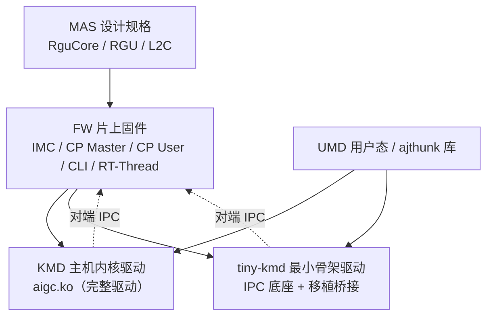

# GraceC 芯片软硬件栈

本页是 **GraceC（AIGCIC Grace GPU）芯片软硬件栈**的统一入口。围绕同一颗芯片，知识库按"从设计规格到片上固件再到主机驱动"的栈式分层组织在四个子域里。人和 AI 想定位芯片相关内容时，从本页进入即可，不必在 `wiki/` 根逐个翻目录。

## 栈式分层

- **MAS**：芯片的设计规格与架构文档（RguCore/RGU 计算、GCtrl 两级调度、L2C remapping）。是 FW/KMD 实现的"为什么这么设计"的来源。
- **FW**：跑在芯片上的固件。IMC 启动、CP Master（QDMA/BDMA/IPC/top_reg）、CP User（cmd_entry/IB/stop-flush）、CLI、RT-Thread 调度、性能、C2C 互联、调试。
- **KMD**：跑在 Host CPU 上的完整 Linux 内核驱动 `aigc.ko`。三层架构、ioctl/ABI、内存与 4 级页表、命令队列与调度、MSI-X 中断与 fence、Grace HAL。
- **tiny-kmd**：最小骨架驱动，只做 PCI 注册 + ringbuffer IPC + DMA + misc ioctl，是后续把 ajthunk 核心移植进来的"底座"。

## 四域快速入口

| 子域 | 入口 | 适合的问题 |
|---|---|---|
| MAS 设计规格 | [MAS 文档知识库](<./mas/index.md>) | RGU/RguCore 设计、GCtrl 两级调度、SHM、UCore、L2C remapping。 |
| FW 片上固件 | [FW 技术知识库](<./fw/index.md>) | 不知道从哪开始看 FW；IMC/CP Master/CP User/CLI/RT-Thread/性能/互联/调试。 |
| KMD 主机驱动 | [KMD 内核驱动知识库](<./kmd/index.md>) | 不知道从哪开始看 `aigc.ko`；架构/ioctl/内存页表/队列调度/中断 fence/HAL。 |
| tiny-kmd 最小驱动 | [tiny-kmd 架构知识库](<./tiny-kmd/index.md>) | 最小骨架驱动怎么跑；与 ajthunk 的缺口与移植顺序。 |

## 新增页面放哪里

芯片栈相关页面按子域放置，**不要散放到 `wiki/` 根**：

| 内容类型 | 放置目录 |
|---|---|
| MAS 设计规格 / RguCore / L2C | `wiki/grace/mas/` |
| FW IMC / CP Master / CP User / CLI / RT-Thread / 概念 / 流程 / 性能 / 互联 / 调试 | `wiki/grace/fw/` 对应子目录（详见 [FW 放置表](<./fw/index.md#新增-fw-页面放哪里>)） |
| KMD 架构 / ioctl / 内存 / 队列 / 中断 / OS / HAL / 流程 / 评审 | `wiki/grace/kmd/` 对应子目录（详见 [KMD 放置表](<./kmd/index.md#新增-kmd-页面放哪里>)） |
| tiny-kmd 架构 / IPC / 设备 / ioctl / 中断 / 缺口 | `wiki/grace/tiny-kmd/` |

新增页面后同步更新：本页、对应子域 `index.md`、[Wiki 总索引](<../index.md>)、[Hot Cache](<../hot.md>)、[Wiki Log](<../log.md>)。

## 延伸

- [Wiki 总索引](<../index.md>)：全库入口（含工具链、综合、反思等非芯片栈内容）。
- 原始证据与源材料镜像在 `wiki/sources/` 与 `.raw/`，查证时再用，不作为首读。
