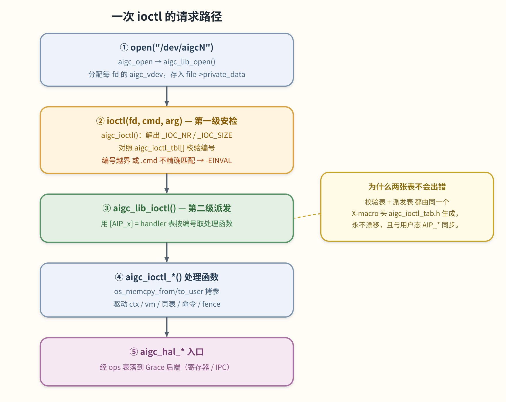
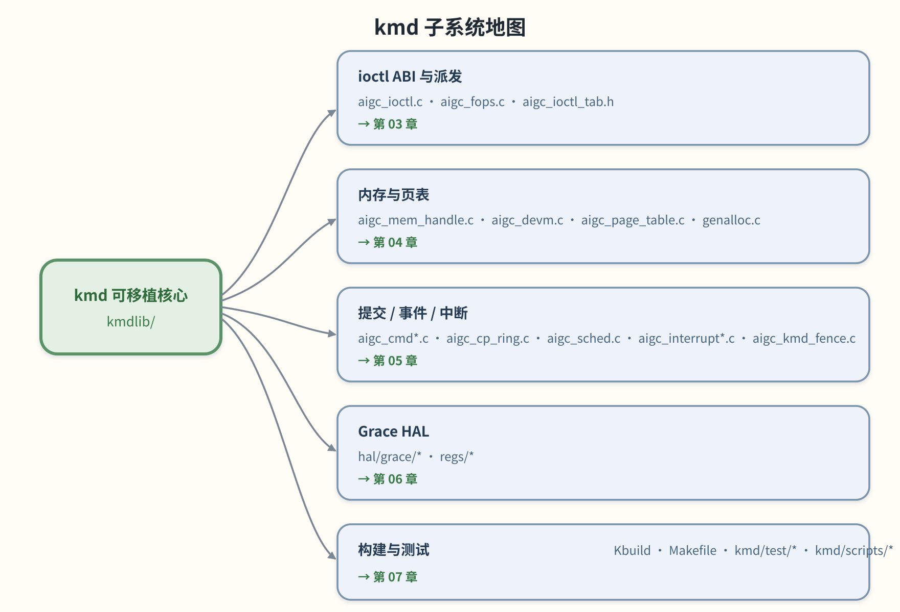

# 01 整体架构

> **这章解决什么问题**：把 kmd 的代码地图建立起来——三层分别是什么、一次 `ioctl` 请求是怎么
> 从用户态一路走到硬件的、各个子系统住在哪些文件里、为什么核心代码不许直接调内核 API。
> 读完这章，你拿到任意一个 `Thunk_*` 调用都能说出「它会落到哪一层、哪个文件、哪个函数」。

`kmd` 是一个 **out-of-tree（树外）** 的 Linux 内核模块——它的源码不在 Linux 内核仓库里，而是
独立编译，产出单个 `aigc.ko`。这个模块绑定到 GPU 的 PCI 功能、创建 `/dev/aigcN` 字符设备、
把用户态 `ioctl` 请求翻译成 Grace 硬件操作。

## 三层分层

kmd 按「离操作系统近 → 离硬件近」分三层：外层是 Linux 专属的，中层是可移植核心，内层是硬件专属的。

> 图解源文件：[`02-layers.svg`](../../../_attachments/grace/kmd/diagrams/02-layers.svg)。

### ① 驱动入口层 — `kmd/aigc/*.c`

**唯一允许直接调用 Linux 内核 API 的一层。** 它管模块的生命周期和「操作系统看得见」的那张脸：

- **`aigc_drv.c` / `aigc_drv.h`** — PCI 驱动注册和每设备的 probe/remove：映射 MEM/REG/CFG 三类
  BAR、设置 DMA 掩码、编程 PCIe 内部地址翻译单元（iATU）、resize 内存 BAR、申请 MSI-X 中断向量、
  初始化内嵌的 kmdlib 句柄、创建 `/dev/aigcN`。它定义了 `struct aigc`（每设备的驱动私有对象）以及
  一组 `lib_device_*` 访问器，让可移植核心能通过 `void *` 句柄读到 OS 侧状态。它还把硬件中断路由到
  kmdlib 的上半部和一个工作队列下半部（`enum aigc_irq_work_bit`）。
- **`aigc_ioctl.c`** — `/dev/aigcN` 的 `file_operations`（open/release/ioctl/mmap/poll）以及
  **第一级 ioctl 校验**，校验通过后转发进可移植核心（见下文「请求路径」）。
- **`aigc_pcie.c` / `aigc_sysfs.c` / `aigc_link*.c` / `aigc_dma.c` / `aigc_p2p.c`** — PCIe 配置助手、
  sysfs 属性、GPU 间互联（link）驱动、DMA、点对点（P2P）支持。
- **`os_interface.c`** — **OS 抽象缝隙**（见本章最后一节）。这是**唯一**代表核心去 `#include <linux/...>`
  的翻译单元。

### ② 可移植核心 kmdlib — `kmd/aigc/kmdlib/*`

OS 无关的逻辑，实现每一个对用户可见的操作。它**从不**直接调用 Linux；所有 OS 原语都走 `os_*` 包装。
这一层是改动最常落地的地方：

- **`aigc_fops.c`** — ioctl 处理中枢。`aigc_lib_ioctl()` 把每个请求**派发**到对应的 `aigc_ioctl_*`
  处理函数；这个文件还托管 VMID 池和 vdev/ctx 的生命周期助手。
- **上下文与设备** — `aigc.c`、`aigc_ctx.c`、`aigc_devm.c`。
- **内存与页表** — `aigc_mem_handle.c`、`aigc_page_table.c`、`genalloc.c`。
- **队列 / 环 / 命令** — `aigc_cmd.c`、`aigc_cp_ring.c`、`aigc_cp_cmd_pkt.c`、`aigc_queue_manager.c`。
- **调度** — `aigc_sched.c`、`aigc_default_scheduler.c`。
- **中断与 fence** — `aigc_interrupt.c`、`aigc_interrupt_ring.c`、`aigc_kmd_fence.c`。
- **固件更新** — `aigc_fw_update.c`。

### ③ Grace HAL — `kmd/aigc/kmdlib/hal/grace/*` + `kmdlib/regs/*`

Grace 芯片专属的硬件后端，只能经 `hal/hal.h` 里的**函数指针表**访问（`struct aigc_lib_hal` 聚合了
每个硬件块各自的 sub-HAL）。主要硬件块：

- **CP**（`grace_cp.c/.h`）— 命令处理器：host→CP 主环、CP→host 响应环、MCQD 硬件队列描述符、固件
  IPC 消息协议。
- **arch / IMC / L2C / TCU**（`grace_arch.c` / `grace_imc.c` / `grace_l2c.c` / `grace_tcu.c`）—
  芯片拓扑、片上微控制器 IPC、L2 缓存、地址翻译/MMU 单元。
- **C2C / D2D / link**（`grace_c2c.c` / `grace_d2d.c` / `grace_link*.c`）— chip-to-chip、die-to-die、
  GPU 间互联。
- **`regs/grace_reg_define.h`、`regs/grace_reg_cluster.h`** — 原始寄存器布局。

> 哪些是真寄存器驱动、哪些还是 bring-up 占位，详见 [06 Grace HAL](<./06-hal-grace.md>)。

## 一次 ioctl 的请求路径

这是贯穿全库的主干。以「创建一块显存」为例，一次请求这样走：

> 图解源文件：[`03-ioctl-path.svg`](../../../_attachments/grace/kmd/diagrams/03-ioctl-path.svg)。

1. **`open("/dev/aigcN")`** → `aigc_open()` 调 `aigc_lib_open()`，分配每-fd 的 `struct aigc_vdev`，
   存进 `file->private_data`。
2. **`ioctl(fd, cmd, arg)`** → `aigc_ioctl()` 解出 `_IOC_NR(cmd)` 和 `_IOC_SIZE(cmd)`，**校验**编号：
   必须落在 `aigc_ioctl_tbl[]`（由 `common/include/aigc_ioctl_tab.h` 生成的名字/命令表）范围内，
   **且**表项的 `.cmd` 要与 `cmd` 精确相等，否则 `-EINVAL`。然后把 `private_data`、命令号、大小、
   用户缓冲区打包进 `struct aigc_ioctrl_params`，调 `aigc_lib_ioctl()`。
3. **派发** → 在 `kmdlib/aigc_fops.c`，`aigc_lib_ioctl()` 查**第二张表**——`[AIP_x] = handler`，同样
   由 `aigc_ioctl_tab.h` 生成——把 `(private_data, buf)` 转给匹配的 `aigc_ioctl_*` 处理函数。
   > **为什么是两张表、为什么不会出错**：两张表来自**同一个** X-macro 头文件，所以「校验表」和
   > 「派发表」永远不会各自漂移，而且它们和用户态 thunk 的 `AIP_*` 枚举始终同步。这是 [03 章](<./03-ioctl-abi.md>)
   > 的重点。
4. **处理函数** → `aigc_ioctl_*` 用 `os_memcpy_from_user` / `os_memcpy_to_user` 拷入/拷出参数，驱动
   ctx / vm / 页表 / 命令 / fence 等子系统。
5. **HAL** → 需要碰硬件的活，处理函数调 `aigc_hal_*` 入口，经 ops 表落到 Grace 后端。

`mmap()` 和 `poll()` 走同样的形状：`aigc_mmap()` 按 `vm_pgoff` 区分「显存映射」还是「调试映射」，
分别调 `aigc_lib_mmap()` / `aigc_lib_debug_mmap()`；`aigc_poll()` 转给 `aigc_lib_poll()`。

## 子系统地图

把上面五大块按「子系统 → 文件 → 章节」摊开，方便你按需跳转：

> 图解源文件：[`04-subsystem-map.svg`](../../../_attachments/grace/kmd/diagrams/04-subsystem-map.svg)。

| 子系统 | 在哪 | 章节 |
|---|---|---|
| ioctl ABI 与派发 | `aigc_ioctl.c`、`kmdlib/aigc_fops.c`、`common/include/aigc_ioctl_tab.h` | [03](<./03-ioctl-abi.md>) |
| 内存与页表 | `aigc_mem_handle.c`、`aigc_page_table.c`、`aigc_devm.c`、`genalloc.c` | [04](<./04-memory-and-pagetables.md>) |
| 提交 / 事件 / 中断 | `aigc_cmd*.c`、`aigc_cp_ring.c`、`aigc_sched.c`、`aigc_interrupt*.c`、`aigc_kmd_fence.c` | [05](<./05-submission-events-interrupts.md>) |
| Grace HAL | `kmdlib/hal/grace/*`、`kmdlib/regs/*` | [06](<./06-hal-grace.md>) |
| 构建与测试 | `Kbuild`、`Makefile`、`kmd/test/*`、`kmd/scripts/*` | [07](<./07-build-and-test.md>) |

贯穿各章的核心数据结构在 [02 数据结构](<./02-data-structures.md>) 里集中讲。

## 编译期开关

这些开关在 `make` 命令行上传（见 `kmd/README`、`kmd/Makefile`、`kmd/aigc/kmdlib/Makefile`、
`kmd/aigc/aigc.Kbuild`）：

- **`FALLBACK_ENABLE=y`**（`-DFALLBACK_ENABLE=1`）— 当请求的 NUMA 节点上分配设备物理地址（DPA）
  失败时，回退到另一个节点，而不是直接报内存不足。
- **`PARTIAL_GOOD=y`**（`-DPARTIAL_GOOD=1`）— 「部分良品」硅片支持。加上 `pg_offset` / `pg_size`
  模块参数；在 `os_devm_gen_pool_create()` 里把缺陷子区间 `[pg_offset, pg_offset + pg_size)`
  （相对 NUMA 节点基址）预先标记为已分配，gen pool 就永远不会把它发出去。
- **`SAME_PA=y`**（`-DSAME_PA=1`）— 仅测试用。强制带特殊标志的分配落到固定物理地址，让多个 context
  的虚拟地址映射到同一个物理地址（用于做别名测试）。

构建里还会见到：`KMD_BACKEND` 选 CP ring 后端（`1` 是真实硬件/IMC 初始化的后端）、`AIGC_PG_MODE`
设默认页大小模式、`ONE_VMID_MODE` 选单 VMID 运行模式。详见 [07 构建与测试](<./07-build-and-test.md>)。

## OS 抽象规则（为什么核心不许直接调内核）

**kmdlib 不能直接调用 Linux 内核 API。** `os_interface.c` 之上的一切——HAL、调度器、内存管理器、
命令与 fence 代码——只用 `common/include/os_interface.h` 里声明的 `os_*`（和少量 `aigc_*`）包装。
`os_interface.c` 是**唯一** `#include <linux/...>` 的翻译单元；它针对真实内核实现这些包装，并把不透明的
`void *` 句柄「洗」回具体的内核结构体类型。

这样做的好处：把**内核版本变动**的影响关在一个文件里，并让核心可移植到别的操作系统（以及主机侧测试）。

> **NVIDIA 式 conftest**：不同内核版本的 API 会变。Kbuild（`kmd/aigc/Kbuild` + `aigc.Kbuild`）会跑
> `kernel_test.sh` 去**编译探测**目标内核，生成 `kerneltest/*.h`（一堆宏/函数/符号/类型的探测结果）。
> 如果某次构建莫名其妙「看不见」某个内核符号，先怀疑是 conftest 头过期/缺失，而不是 C 代码写错。详见
> [07 构建与测试](<./07-build-and-test.md>)。

## 下一步

- 上一页：[00 大局观](<./00-big-picture.md>)
- 下一页：[02 核心数据结构](<./02-data-structures.md>)
