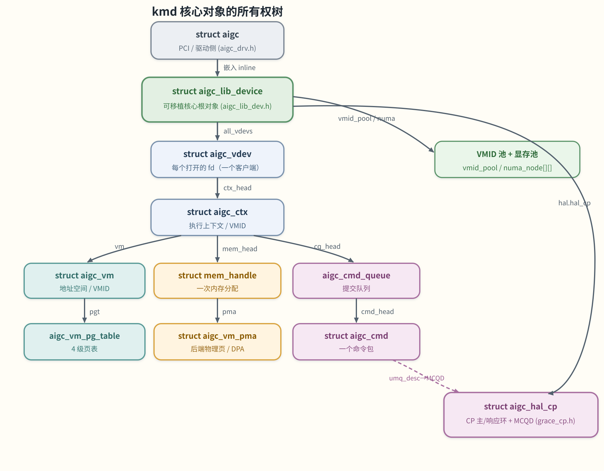

# 02 核心数据结构

> **这章解决什么问题**：kmd 里有十来个结构体，初看像一团乱麻。但它们其实排成一条清晰的「所有权链」
> ——从一块物理 GPU，一路往下到「一次提交的命令」。先把这条链和谁拥有谁记住，后面读任何子系统都
> 能对号入座。本章是一份**对象参考**；它们如何被一次请求驱动，见 [01 整体架构](<./01-architecture.md>)。

## 一条所有权链

把所有主对象串起来，就是下面这棵树。**箭头表示「拥有 / 指向」**，旁边的小字是连接它们的字段名：

> 图解源文件：[`05-ownership-tree.svg`](../../../_attachments/grace/kmd/diagrams/05-ownership-tree.svg)。

一句话概括这条链：
**一块物理 GPU（`aigc` + `aigc_lib_device`）→ 每个打开的 fd（`aigc_vdev`）→ 每个执行上下文
（`aigc_ctx`）→ 它的地址空间 / 内存 / 队列（`aigc_vm`、`mem_handle`、`aigc_cmd_queue`）→ 一个命令
（`aigc_cmd`）→ 最终绑定到 CP 硬件队列。**

## 物理 GPU 的两个根对象

一块物理 GPU 对应**两个**根对象：驱动侧的 `struct aigc`（PCI 胶水）和核心侧的
`struct aigc_lib_device`。前者把后者**内联嵌入**在自己里面。

### `struct aigc` — `kmd/aigc/aigc_drv.h`
**是什么**：一个已绑定的 PCI 功能的驱动私有状态，也就是设备的「操作系统那一半」。
**关键字段**：
- `minor` / `dev_id` — 字符设备次设备号（与设备 id 等同）。
- `chr_dev`、`pdev`、`pdev_dev` — `/dev/aigcN` 节点和背后的 PCI 设备。
- `membase`、`regbase`、`cfgbase` — ioremap 后的 MEM / REG / CFG 三类 BAR 基址。
- `msix_vectors`、`msix_num`、`irq`、`irq_type` — MSI-X / 中断记账。
- `irq_wq`、`irq_work`、`irq_work_pending` — 中断**下半部**工作队列；`irq_work_pending` 是一个
  `enum aigc_irq_work_bit` 位掩码。
- `lib_dev_handle[]` — 一个 8 字节对齐的柔性数组，把 `struct aigc_lib_device` **内联**存在这里。

**谁拥有它**：全局 `aigc_devs` 链表（`aigc_mutex` 保护），每个绑定的 PCI 功能一个。

### `struct aigc_lib_device` — `kmd/aigc/kmdlib/aigc_lib_dev.h`
**是什么**：可移植核心的根对象——kmdlib 处理一块物理 GPU 所需的一切。通过 `lib_device_*` 访问器从
`struct aigc` 到达。
**关键字段（挑重点）**：
- `working_mem_size` — 可用的设备 DRAM（可能被压到物理容量以下）。
- `pdev`、`membase`/`regbase`/`cfgbase` — 不透明 OS 设备句柄 + BAR 基址（镜像 `struct aigc`）。
- `all_vdevs` / `inact_*` / `ctx_handles` — 活跃/非活跃的 vdev/ctx 链表 + id→ctx 的 IDR。
- `vmid_pool` — 设备级 VMID 分配器；`vm` / `vm_refcount` — 共享地址空间。
- `cmd_sched`、`current_scheduler`、`sched_policy` — 命令调度状态。
- `text_pool`、`data_pool`、`gpu_va_pool`、`numa_node[][]` — 显存与 GPU-VA 分配器（按 die、按 cluster
  的 NUMA gen-pool）。
- `hal`（Grace HAL 聚合）、`aqm`（队列管理器）、`dm_ops`/`pte_ops`（显存 MMIO / 页表 ops）。
- `dev_prv`（芯片私有 ops 表）、`k_vdev`（内核自用 vdev）、`refcount`/`open_count`（生命周期）。

**谁拥有它**：内联在 `struct aigc.lib_dev_handle[]` 里。

## `struct aigc_vdev` — 每个打开的 fd
**文件**：`kmd/aigc/kmdlib/aigc_vdev.h`
**是什么**：设备上一个打开的文件句柄 = 一个用户进程 / 客户端。它拥有这个客户端的上下文、内存分配、
事件和 fence，并把它们绑定到所属任务。**提交路径从这里开始。**
**关键字段**：`lib_dev`（所属设备）、`ctx_head`/`ctx_lock`（该客户端的 GPU 上下文）、
`tsk`/`mm`/`pid`/`tgid`/`process_exit`（进程绑定与退出状态）、`mem_idr`/`evt_idr`（每-vdev 的内存/事件
id 分配器）、`fence`（命令完成跟踪）、`as`（设备地址空间窗口）、`event_tracker`（把中断/错误事件投递给
用户态工具的共享内存队列）、`refcount`（fd 完全关闭时归零 → `aigc_vdev_free`）。
**谁拥有它**：`file->private_data`；挂在 `lib_dev->all_vdevs`。

## `struct aigc_ctx` — 执行上下文 / VMID
**文件**：`kmd/aigc/kmdlib/aigc_ctx.h`
**是什么**：在 vdev 下创建的、每上下文一个的 GPU 执行域。它拥有一个 VM（地址翻译 / VMID）、一个队列 id
池、本上下文的命令队列和事件。可以理解为「一组资源的账本」。
**关键字段**：`type`（`KERNEL_CONTEXT` / `COMPUTE_CONTEXT`）、`id`、`vdev`（owner）、
`vm`（本上下文的页表 / VMID）、`db_base`（该 VMID 映射的 doorbell 窗口）、`qid_pool`（每上下文队列 id 的
位图分配器）、`queue_idr`/`cq_head`（id 索引的命令队列 / 待调度队列）、`mem_head`（这里拥有的内存句柄）、
`evt_head`（本上下文的事件）、`refcount`。
**谁拥有它**：挂在 `vdev->ctx_head`；在 `lib_dev->ctx_handles` 里登记。
**句柄打包**：上下文句柄打包成 `(node_id, minor, ctx_id)`，事件句柄打包成 `(minor, ctx_id, evt_id)`
——见 `mk_ctx_handle` / `mk_evt_handle`。

## `struct mem_handle` — 一次内存分配
**文件**：`kmd/aigc/kmdlib/aigc_mem_handle.h`
**是什么**：驱动对「一次分配」的中心描述符。它拥有一块物理内存区、被引用计数，并同时记录这块分配的
**用户态 VA** 和 **GPU VA**。
**关键字段**：`id`/`hdl_type`（`AIGC_MHT_MEM` / `_IB` / `_PTE` / `_FENCE` / `_DSMEM`）、
`sys_va_addr`（用户态 VA）、`dva`（GPU VA）、`size`、`heap`（`MH_HOST`/`MH_DEVICE`/`MH_OTHER_DEVICE`）、
`flags`（`AIGC_MF_*` 属性位）、`loc`（在系统内存还是设备内存）、`numa_mode`/`numa_node`、
`pma`（`struct aigc_vm_pma`——后端物理内存区，引用计数）、`ctx`/`ctx_node`（所属上下文及其在
`ctx->mem_head` 的链接）、`ref`（UMD lock 计数）/`refcount`（对象生命周期）/`export_refcount`、
`source`（导入句柄时指向原件）、`target_gpu_id`/`target_die_id`（DSMEM 分布式共享内存的目标）。
**谁拥有它**：挂在 `aigc_ctx->mem_head`，在 `vdev->mem_idr` 登记；分配句柄打包成 `(minor, ctx_id, mem_id)`。
**生命周期**：分配 → 落实后端（pin 系统页 / 分设备内存）→ 写页表 → 使用 → 解除映射 → 释放。详见
[04 内存与页表](<./04-memory-and-pagetables.md>)。

## `struct aigc_vm` / 页表 — 地址空间
**文件**：`kmd/aigc/kmdlib/aigc_vm.h`
- **`struct aigc_vm`**：一个 GPU 虚拟地址空间（一个 VMID / TTBA）+ 它的 op 向量 + 它的多级页表。关键字段：
  `vmid`（该地址空间的硬件 MMU 上下文索引）、`pgt`（背后的 4 级页表 `struct aigc_vm_pg_table`）、
  `ops`（init/destroy、mmap/munmap、VA 分配）、`refcount`（有映射存在就保活）。
- **`struct aigc_vm_pgt_attr`**：一种页表「风味」的完整属性集（系统内存映射一套、设备内存映射一套）。
  含每级几何 `pl0_attr..pl3_attr`（`page_shift`、`entry_num`、`mask`、`base_align`、页模式位）、
  `blk_mapping`（PL2 大页叶子）、`interleave_mode`（NUMA VA 交织）、`pg_mode`。
- **层级**：一个 VA 切成四级 `AIGC_VM_PTL0..PTL3`；PTL0 是根（PD3 / TTBA），PTL3 是叶子 PTE 级。详见
  [04 内存与页表](<./04-memory-and-pagetables.md>)。

## 提交相关对象
- **`struct aigc_cmd_queue`**（`aigc_cmd_queue.h`）：一个提交队列，由 queue-create ioctl 创建，坐在
  「上下文」和「CP 硬件环」之间。关键字段：`id`（上下文内句柄）、`stream_id`（MCQD/调度器用的硬件流 id）、
  `ctx`（owner）、`cmd_head`/`qSpinlock`（排在该流上的命令）、`umq_desc`（指向该队列 MCQD 的内核指针）、
  `refcount`。挂在 `ctx->cq_head`，在 `ctx->queue_idr` 登记。
- **`struct aigc_cmd`**（`aigc_cmd.h`）：一个可提交的 GPU 工作单元。关键字段：`cmd_type`
  （`INDIRECT_CMD_NODE` / `DIRECT_CMD_NODE` / `KMD_WAIT_CMD_NODE` / `TS_UPDATE_CMD_NODE` / `NOP_CMD_NODE`）、
  `q`（所属队列）、`pkt`（构好的 CP 包）、`cmd_buf`（间接缓冲 IB：`buf` 是内核 VA，`cp_va` 是 CP 取指的
  GPU VA）、`usr_fence`（完成时 signal 的用户态 fence）、`state`（在上下文里 vs 在全局调度链）。
- **CP ring**（`hal/grace/grace_cp.h`）：硬件前端。一个软件队列通过把 **MCQD**（`struct cp_mcqd`，镜像
  HCQD 寄存器：doorbell id、ring base/size、wptr、fetch/exec rptr、status、active）编程进
  `(pipe, hcqd)` 寄存器而绑定到 CP 硬件队列；之后 doorbell/wptr 驱动执行。`struct aigc_hal_cp` 还持有
  host→CP **主环**、CP→host **响应环**，以及和 `fw` 项目交换的固件 IPC 协议
  （`cp_fw_message_header` + 各 payload）。详见 [05 提交、事件与中断](<./05-submission-events-interrupts.md>)。

## 下一步
- 上一页：[01 整体架构](<./01-architecture.md>)
- 下一页：[03 ioctl 接口与 ABI](<./03-ioctl-abi.md>)
