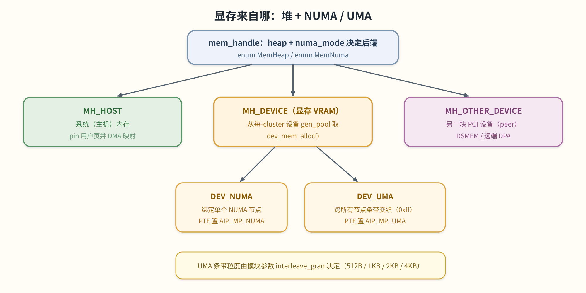
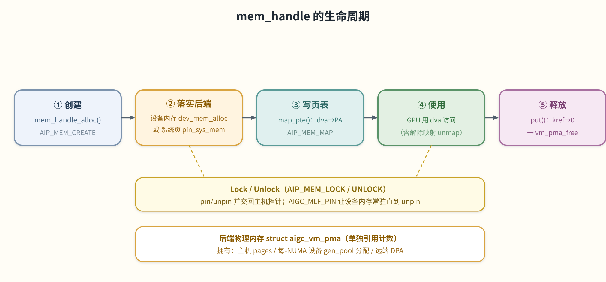
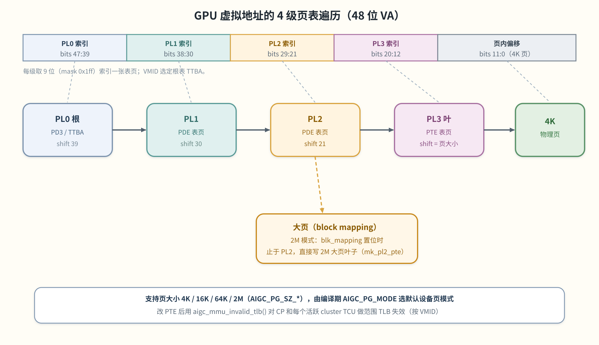

# 04 内存与页表

> **这章解决什么问题**：GPU 要算东西，先得有「能被 GPU 看见的内存」。本章讲两件事：① kmd 的内存模型
> ——一块分配从哪来、`mem_handle` 怎么走完一生；② 支撑每个 GPU 虚拟地址的**多级页表**——VA 怎么一步步
> 翻译成物理地址、TLB 怎么刷。涉及文件：`aigc_mem_handle.{c,h}`、`aigc_devm.{c,h}`、
> `aigc_page_table.{c,h}`、`aigc_vm.h`。

## 内存模型

### 堆（Heap）：内存从哪来
每次分配都用 `enum MemHeap`（`aigc_mem_handle.h`）选一个后端来源：

| 堆 | 含义 |
|---|---|
| `MH_HOST` | 系统（主机）内存；GPU 不能直接访问，需 pin + DMA 映射。 |
| `MH_DEVICE` | 设备本地内存（显存 VRAM）。 |
| `MH_OTHER_DEVICE` | 另一块 PCI 设备（peer）上的内存。 |

堆既决定**页从哪来**，也决定页表保护位的基底（`__heap_to_pte_prot()`：`AIP_MP_SYS_MEM` /
`AIP_MP_DEV_MEM` / `AIP_MP_PCI_MEM`）。设备（VRAM）分配从每-cluster 的设备 gen_pool 取，由
`mem_handle_dev_mem_alloc()` 服务；主机分配则要么登记一个已有用户指针，要么分配并 pin 页
（`mem_handle_pin_sys_mem()` / `mem_handle_sys_mem_alloc()`）再做 DMA 映射。

> 图解源文件：[`07-memory-heaps-numa.svg`](../../../_attachments/grace/kmd/diagrams/07-memory-heaps-numa.svg)。

### `mem_handle` 的生命周期
`struct mem_handle` 是「一次分配」的中心描述符（字段详见 [02 数据结构](<./02-data-structures.md>)）。
它由 `AIP_MEM_*` 系列 ioctl（见 [03](<./03-ioctl-abi.md>)）和 `mem_handle_*` API 驱动，走过五步：

> 图解源文件：[`06-mem-handle-lifecycle.svg`](../../../_attachments/grace/kmd/diagrams/06-mem-handle-lifecycle.svg)。

1. **创建** — `mem_handle_alloc()`，然后落实后端：设备内存走 `mem_handle_dev_mem_alloc()`，主机页走
   `mem_handle_pin_sys_mem()` / `mem_handle_sys_mem_alloc()`。（`AIP_MEM_CREATE`）
2. **锁定 / 解锁** — `aigc_mem_lock` / `aigc_mem_unlock` 做 pin/unpin 并交回主机指针；`AIGC_MLF_PIN` flag
   让设备内存常驻直到 unpin。（`AIP_MEM_LOCK` / `AIP_MEM_UNLOCK`）
3. **映射 / 解除** — 用 `aigc_mem_handle_map_pte()` / `aigc_mem_handle_setup_pte()` 在某 GPU VA 处写 PTE，
   用 `mem_handle_unset_pte()` 清除。（`AIP_MEM_MAP` / `AIP_MEM_UNMAP`）
4. **销毁** — `mem_handle_close()` / `mem_handle_put()` 减 kref；归零时释放后端 `aigc_vm_pma`
   （`vm_pma_free`）。（`AIP_MEM_DESTROY`）

物理后端住在一个**单独引用计数**的 `struct aigc_vm_pma` 里，它拥有：主机 `pages`、或每-NUMA 节点的设备
gen_pool 分配（`lm[NUMA_NUM]`）、或一个远端设备 DPA。软件 VA 区间则记在 `struct aigc_vm_vma` 里。

### NUMA 放置与 UMA 交织
设备内存放在哪由 `enum MemNuma` 选：
- **`DEV_NUMA`**：分配绑定到一个设备 NUMA 节点（`numa_node`），从该节点 gen_pool 取；映射打
  `AIP_MP_NUMA` PTE 位。
- **`DEV_UMA`**：分配跨所有设备节点**条带交织**；`pma->numa_node == 0xff` 标记 UMA，后端在 `NUMA_NUM`
  个池上均分（各释放 `size / NUMA_NUM`）；映射打 `AIP_MP_UMA` 位。

UMA 的交织粒度（VA 如何在通道间条带化）是 `struct aigc_vm_pgt_attr` 的 `interleave_mode` 字段
（`AIGC_VA_INTERLEAVE_*`），由模块参数 `interleave_gran` 设定（512B / 1KB / 2KB / 4KB）。

### DSMEM（设备间共享 / peer 内存）
类型为 `AIGC_MHT_DSMEM` 的句柄让一块设备去寻址另一块设备的本地内存。它的 GPU VA 不从池里分配，而是由目标
`gpu_id`/`die_id` 和封装模式**算出来**，锚在 `DSMEM_ADDR_START`（`0x800000000000`）：
- **2-die**（`PACKAGE_2DIE`）：bit 37 = `die_id`（1 位），bits 38–47 = `gpu_id`。
- **4-die**（`PACKAGE_4DIE`）：bits 37–38 = `die_id`（2 位），bits 39–47 = `gpu_id`。

`DSMEM_VA()` / `DSMEM_DPA()` 宏负责编码。DSMEM 句柄跳过 VA 分配器（它自带 `dva`），匹配的 DPA 在
`mem_handle_dev_mem_alloc()` 期间导出。

### 缓存与访问策略
每句柄属性 `mem_handle.flags`（`AIGC_MF_*`）由 `aigc_calc_pte_prot()`（`aigc_devm.h`）翻译成硬件 PTE
保护字，按位 OR 合并：堆基底位（SYS/DEV/PCI）+ NUMA/UMA 放置 + 只读（`AIGC_MF_RO`→`AIP_MP_RO`）+
可执行（`AIGC_MF_EXECUTABLE`→`AIP_MP_EXE`）+ 原子能力（`AIGC_MF_ATO`→`AIP_MP_ATO`）。一个 peer AIP id 可用
`AIP_MP_SET_AIP_ID()` 盖进保护字最高字节，让映射路由到正确的 peer 设备。

## 页表

设备每个 VM 用一张 **4 级**页表，建在 Grace 的 TCU/MMU 之上。软件模型在 `aigc_vm.h`，实现在
`aigc_page_table.c`。

> 图解源文件：[`08-pagetable-walk.svg`](../../../_attachments/grace/kmd/diagrams/08-pagetable-walk.svg)。

### 结构：PDE / PTE 各级
各级是 `AIGC_VM_PTL0..PTL3`。`PTL0` 是根（PD3 / TTBA），`PTL3` 是叶子 PTE 级。每个节点的软件视图是
`struct aigc_vm_pde_entry`（一个影子数组，镜像一张硬件表页，kref 计数，带 `parent`/`entries` 链），每个
叶子是 `union aigc_vm_pte_entry` 影子记录（`valid`、`pg_mode`、`mem_handle`）。硬件 PTE/PDE 位布局是
`aigc_common_def.h` 里的 `union aigc_grace_mmu_pte` / `union aigc_grace_mmu_pde`。一个 `struct aigc_vm`
拥有一个地址空间：它的 `vmid`（MMU 上下文槽 / TTBA 寄存器组）、op 向量、以及多级 `struct aigc_vm_pg_table`
（`root_entry` 根、序列化遍历的 `entry_mutex`、背后的内存池）。两套几何模板：`pgt_sys_attr`（主机映射）和
`pgt_dev_attr`（设备映射），按映射的保护 flag 选用。

### 一个 GPU VA 如何索引每一级
VA 是 48 位（`AIGC_GRACE_VA_BITS = 48`）。每级用 9 位索引（`mask = 0x1ff`），由 `aigc_page_table.c` 的
`__pde_index()` / `__pte_index()` 算成 `(addr >> page_shift) & mask`：
- **PL0** shift 39（bits 47–39）
- **PL1** shift 30（bits 38–30）
- **PL2** shift 21（bits 29–21）
- **PL3**（叶）shift = 页移位（4K=12、16K=14、64K=16、2M=21）

### 页大小与 block mapping
支持页大小 4K / 16K / 64K / 2M（`AIGC_PG_SZ_*`）。生效的设备页模式在 `aigc_grace_pgt_attrs_init()` 里由
编译期 `AIGC_PG_MODE` 选；主机（系统）属性集则跟随内核的 `OS_PAGE_SHIFT`。当 `attr->blk_mapping` 置位
（如 2M 模式），遍历**止于 PL2** 并在那里写一个大页 *block* 叶子（`mk_pl2_pte`），不再下降到 PL3 PTE 表
——这就是大页（huge-page）映射路径。

### 位图托管的页表内存池
每张硬件表页都从一个全局设备内存池 `struct aigc_vm_pgt_mem_pool` 分配（`aigc_grace_pgt_attrs_init()` 里建：
8 槽，`chunk_size = 16 × 2M`，`chunk_align = 4K`）。一个池 **chunk**（`aigc_vm_pgt_mem_chunk`）是一大块
设备分配，切成定长子槽，用 `bitmap` 跟踪（每槽一位，置位=占用）。`grace_vm_pgt_mem_pool_alloc()` 找有空槽的
chunk（按需 `chunk_mo_create` 新建），`grace_vm_pgt_mem_pool_free()` 清位并可能销毁全空 chunk。

### 引用计数
页表节点 kref 计数：每个 `aigc_vm_pde_entry.refcount` 跟踪它活着的子节点/PTE，归零时释放
（`vm_pgt_entry_release`），把后端内存还给池。根节点在首次使用时创建并编程 TTBA
（`__vm_pgt_root_entry_get` → `init_pgt_root_entry`），遍历期间对它持引用。

### TLB 失效
改完 PTE 后，`aigc_mmu_invalid_tlb()` 在 `mmu_spinlock` 下分派到后端 `invalid_tlb` op
（`__grace_mmu_invalid_tlb`）。它把 `[start, end)` 转成页帧号（`>> 12`），对 CP 和每个活跃 cluster TCU
编程范围失效寄存器（`REG_TCU_MMU_CTXT_INDEX = vmid`、`RANGE_INV_*_ADDR_*` 对、`REG_TCU_MMU_CTXT_INV_CFG`），
然后自旋等 `REG_TCU_MMU_CTXT_INV_STATUS` 完成 TBU/软件握手（状态 `2` = TBU 完成，`3` = 软件已确认）。

### Dump 路径
`aigc_vm_dump_pgtable()` 从 `root_entry` 遍历活表、读每个裸硬件项、把已填充的 PDE/PTE 记进
`struct aigc_vm_pgtable_dump`。用户态经 `AIP_DUMP_PGT` ioctl（`aigc_ioctl_dump_pgt`）到达，把收集到的计数
拷回调用者。

## 影响内存的模块参数
声明在 `kmd/aigc/aigc_drv.c`（和 `os_interface.c`）；完整列表与默认值见 [07 构建与测试](<./07-build-and-test.md>)。

| 参数 | 作用 |
|---|---|
| `interleave_gran` | UMA 交织粒度：0=512B, 1=1KB, 2=2KB, 3=4KB。 |
| `tbu_hash_mode` | TCU/TBU 用的地址哈希模式（0–3）。 |
| `cluster_hash_en` | 是否启用 cluster 哈希（0 / 1）。 |
| `cluster_num` | cluster 数量（影响每-cluster 设备内存池）。 |
| `pg_offset` / `pg_size` | 页区间偏移/大小（`PARTIAL_GOOD` 下编译）。 |

## 下一步
- 上一页：[03 ioctl 接口与 ABI](<./03-ioctl-abi.md>)
- 下一页：[05 提交、事件与中断](<./05-submission-events-interrupts.md>)
