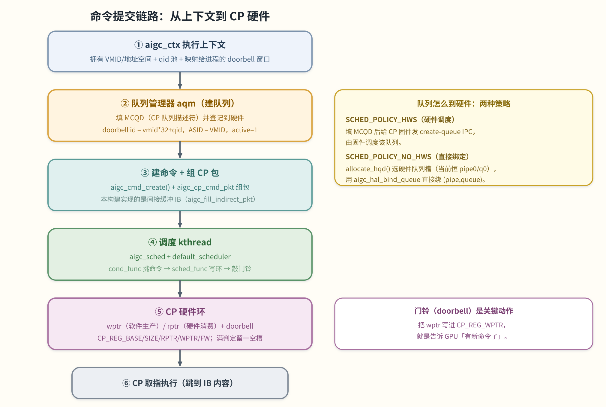
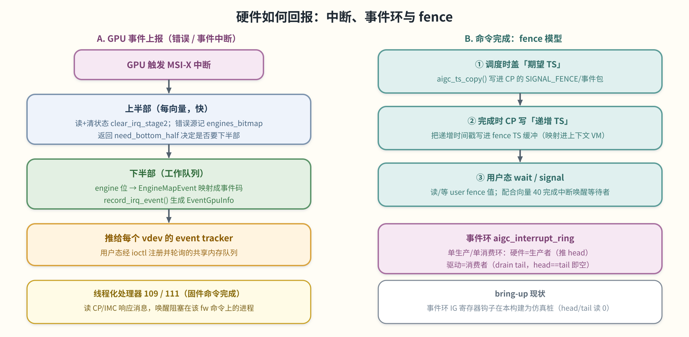

# 05 提交、事件与中断

> **这章解决什么问题**：跟着一个 GPU 工作单元走完闭环——命令怎么到命令处理器（CP）、驱动怎么调度它、
> 硬件怎么用中断和事件环上报进度、命令完成又怎么通过 fence 通知用户态。这是把前面几章（上下文、内存、
> 队列）真正「跑起来」的一章。涉及 `aigc_ctx.c`、`aigc_queue_manager.c`、`aigc_cmd*.c`、
> `aigc_cp_ring.c`、`aigc_sched.c`、`aigc_default_scheduler.c`、`aigc_interrupt*.c`、`aigc_kmd_fence.c`。

## 提交链路总览

所有权链是：`aigc_vdev`（fd）→ `aigc_ctx`（上下文/VMID）→ `aigc_cmd_queue`（提交队列，绑定到 CP 硬件环）
→ `aigc_cmd`（一个命令 = CP 包 + 可选间接缓冲）。一个上下文拥有一个或多个命令队列；每个队列绑定到一个 CP
硬件环。命令在队列上创建、组好 CP 包，调度 kthread 稍后把包拷进环并**敲门铃**，CP 就取走执行。



> 图解源文件：[`09-submission-chain.svg`](../../../_attachments/grace/kmd/diagrams/09-submission-chain.svg)。

> ⚠️ **回顾纠偏**：用户态**不**走 `ioctl(AIP_QUEUE_SUBMIT)` 提交（该路径当前 `return -EFAULT`，见
> [03](<./03-ioctl-abi.md>)）。真实模型是：kmd 建好队列/环/doorbell，用户态把命令写进映射的环并写 doorbell；
> 内核侧的调度 kthread 则负责把内核排队的命令（如 fence/wait）拷进环。本章描述的是内核侧这条链。

## 1. 上下文、队列与队列管理器

上下文（`aigc_ctx.c`）是执行域：拥有 VMID/地址空间、每上下文 `qid` 池、映射进进程的 doorbell 窗口、以及
命令队列链表。建队列要经过**设备队列管理器**（`aigc_queue_manager.c`，简称 aqm）：把一个建队列请求变成一个
硬件队列——填一个 **MCQD**（位于设备内存的 CP 队列描述符）并登记到硬件。

aqm 在 `aigc_queue_manager_init()` 里按 `lib_dev->sched_policy` 选两种策略之一：

| 策略 | 建队列 op | 队列怎么到硬件 |
|---|---|---|
| `SCHED_POLICY_HWS`（硬件调度） | `create_queue_cpsche` | 在上下文 `KCACHE_MD` 区填 MCQD，再给 CP 固件发 *create-queue* IPC（`aigc_hal_add_queue`），由固件调度。 |
| `SCHED_POLICY_NO_HWS`（直接绑定） | `create_queue_no_cpsche` | 从上下文 gslab 分配 MCQD，用 `allocate_hqd()` 选硬件队列槽（当前恒 pipe 0 / queue 0），用 `aigc_hal_bind_queue` 直接绑到该 `(pipe, queue)`。 |

`fill_mcqd_info()` 填 MCQD：doorbell id（`vmid * 32 + qid`）、ASID（= VMID）、ring base hi/lo、ring size、
清零的指针、wptr-shadow 地址、`active = 1`，用 IO 拷贝（`os_mem_copy_to_io`）写入。HWS 销毁发 *destroy-queue*
IPC；no-HWS 销毁无需撤销。

## 2. 建命令与组 CP 包

命令是 `struct aigc_cmd`，由 `aigc_cmd_create()` 在队列上按节点类型分配：`INDIRECT_CMD_NODE`（间接缓冲 IB，
常用路径）、`DIRECT_CMD_NODE`（内联）、`KMD_WAIT_CMD_NODE`（内核等待）、`TS_UPDATE_CMD_NODE`（时间戳/fence
更新）、`NOP_CMD_NODE`。命令携带组好的 CP 包（`struct cmd_packet pkt`），间接提交时还挂一个 IB
（`struct aigc_cnr_cmd_buf cmd_buf`，`buf` 是内核 VA、`cp_va` 是 CP 取指的 GPU VA）+ 一个 user fence。

CP 包由 `aigc_cp_cmd_pkt.c` 的 builder 按 CP opcode 组装（`enum AIP_CMD_*`：`DMA`、`INDIRECT`、`WAIT_FENCE`、
`SIGNAL_FENCE`、`TRAP`、`NOP`、`MEM_WRITE`、`CONST_FILL`、`SET_REG`、`POLL_MEM_REG`、`CACHE_OP` …）。MR 后端
op 表 `__mr_cp_pkt_ops[]` 把每个 opcode 映到一个 fill 函数和一个 size 函数。**本构建实现的 builder 是间接缓冲
包**（`aigc_fill_indirect_pkt`）：写入拆分的 64 位 IB 起始地址和 IB 大小，CP 之后跳到那个 IB 执行其内容。包
结构体是 `#pragma pack(push, 1)` 的字节精确硬件布局，**不可重排**。

## 3. CP 硬件环

`aigc_cp_ring.c` 是提交链路的最底层。一个 CP 环（`struct aigc_ring_desc`）是定长字节环，槽按 `CP_RING_ALIGNMENT`
对齐，每个调度器一页大，由 `aigc_mr_cp_ring_create()` 创建：分配后端页，再把环基址/大小编程进 CP 寄存器并使能固件：
```
CP_REG_BASE_LOW / CP_REG_BASE_HI   环基址
CP_REG_SIZE                        环大小（字节）
CP_REG_RPTR / CP_REG_WPTR          读 / 写指针
CP_REG_FW                          固件使能（写 0x01 启动）
```

**环机制**：
- `wptr` 是软件**生产者**偏移，`rptr` 是硬件**消费者**偏移。
- 环**永久留一个空槽**，以区分满和空：当 `((wptr + unit) % bytes) == rptr` 即为满。
- `aigc_cp_insert_ring()` 校验 `rptr` 槽对齐、命令能装进一个槽、且环未满（否则 `-EAGAIN`），然后在环锁下把
  命令的包拷进 `wptr` 处的槽，并把 `wptr` 前进一个槽（模环大小）。
- **doorbell**：插入后，调用方用 `aigc_cp_update_ring_wptr()` 把 `wptr` 发布到 `CP_REG_WPTR` 寄存器——
  写 wptr 就是告诉 GPU「有新命令了」。

环 op 表 `cp_ring_ops` 接好 `insert_ring`/`get_ring_rptr`/`update_ring_wptr`，`aigc_set_ring_funcs()` 为硬件
引擎 0（CP / 计算引擎）选它。
> 🔧 **bring-up 现状**：读硬件 rptr（`aigc_cp_get_ring_rptr`）在本构建是返回 0 的桩，所以满判定实际是和
> rptr 0 比较；NOP 填充辅助调用被注释掉（每次插入直接覆写槽）。

## 4. 调度器

派发由 `aigc_sched.c` 里的每-环内核线程 + `aigc_default_scheduler.c` 里的可插拔策略驱动。

**每-环 kthread**：`aigc_sched_init()` 选活动调度器（`lib_dev_select_scheduler()` 恒选 `DEFAULT_SCHEDULER`）
并拉起 `COMPUTE_ENGINE` 环。`init_eng_scheduler()` 做每引擎的事：① 分配队列锁和队列/运行命令链表；② 经引擎的
`ring_create` op 建硬件命令环；③ 起一个 kthread（`aigc_wait_event_kthread`）跑活动调度器的 `cond_func`/`sched_func`。
kthread 循环：`cond_func` 看下一个可运行命令，有就 `sched_func` 插入环并前进写指针。已存在但未使能的环（如未用的
codec 环）跳过线程创建。

**默认策略**：`aigc_default_sched_cond_func()` 把下一个可运行命令锁存进 `sched->current_cmd`；`aigc_peek_cmd()`
按优先级选下一个：上一轮带过来的 `current_cmd` → 高优先队列 `hi_queue` → 从 `cached_queue_head` 起对所有队列
轮询（FIFO，每队列自旋锁）。`aigc_default_sched_func()` 取锁存的命令，调 `aigc_insert_ring()`（把包拷进 CP 环），
记为运行中，再 `aigc_ring_update_wptr()` 敲门铃；插入返回非 0（如满环 `-EAGAIN`）则保留 `current_cmd` 下轮重试。
当 `ITR_KERNEL_MOD_FENCE` 开启时，`aigc_insert_ring()` 还会在插入前把命令的期望完成时间戳盖进 CP 包
（`aigc_ts_copy()`）。kthread 被进度中断唤醒后重扫队列，新入队的命令和上次没装下的命令在下一轮被取走。

## 5. 中断

GPU 发 **MSI-X** 中断，处理分两段。



> 图解源文件：[`10-interrupt-fence.svg`](../../../_attachments/grace/kmd/diagrams/10-interrupt-fence.svg)。

**上半部**（`aigc_lib_irq_*`，每向量）：读并清向量的硬件状态（`aigc_clear_irq_stage2()` 清位并回读确认线已静默），
错误源把「哪个引擎触发」记进 `lib_dev->engines_bitmap`，返回 `need_bottom_half` 告诉 OS 层是否要下半部。已知向量：

| 向量 | 来源 |
|---|---|
| 39 | CP TCU |
| 40 | CP 事件信号（计算引擎完成/事件） |
| 41 | CP 错误 |
| 46/50/54/58 | cluster 0..3 L2 缓存错误 |
| 47/51/55/59 | cluster 0..3 buffer-die / PA-ECC 错误 |
| 48/52/56/60 | cluster 0..3 TSV 错误 |
| 49/53/57/61 | cluster 0..3 TCU |
| 109 | IMC 固件 ack（线程化） |
| 111 | CP 固件 ack / test（线程化） |

**下半部**（`*_bh`）把引擎位翻译成事件：对每个置位的位，`EngineMapEvent` 表把引擎索引映到事件码（如
`aigc_lib_irq_cp_err_bh` 把 GCTRL/SDMA 错误映到 `INSTR_PARITY_ERROR`、`SDMA_ERROR`；`aigc_lib_irq_tcu_bh`
把 TCU 故障映到 `PTE_NON_INVALID` 等），经 `record_irq_event()` 发出后清位。

**`record_irq_event()`** 造一个 `EventGpuInfo`（info 字 + 时间戳），推给每个注册了 **event tracker** 的 vdev
（`tracker_record_irq_event()`）——这就是事件如何到达用户态那些经 ioctl ABI 轮询的事件跟踪器。

**线程化处理器**signal 的是固件命令完成而非 GPU 事件：`aigc_lib_irq_thread_fn_111` 读 CP 响应消息，遍历
`wait_cp_ack_ctx_head`，匹配到 create-queue / destroy-queue / stop-schedule 事件就解链并释放其信号量，唤醒阻塞在
该固件命令上的进程；`aigc_lib_irq_thread_fn_109` 对 IMC 固件 ack 做同样的事（回拷 reset 位图、fw-update 百分比/
状态、phase 后释放 IMC 等待者）。

## 6. 事件环

事件环（`struct aigc_intr_ring_desc`）是单生产/单消费的定长事件单元环。**硬件是生产者**（追加事件时推进 head/
写指针），**驱动是消费者**（drain 时推进 tail/读指针）。核心消费步骤 `aigc_intr_ring_read_one()`：`head == tail`
即空（`-EAGAIN`），否则把 `tail` 处单元拷给调用方、报告当前 head、并前进 `tail`（在 `total_units` 处回绕）。
> 🔧 **bring-up 现状**：碰 IG 硬件寄存器的 HAL 钩子（`get_head_hw`/`get_tail_hw`/`set_tail_hw`）在本构建为仿真桩
> （head/tail 读 0），环后端页的页表映射也被编译掉。

## 7. Fence —— 命令完成

完成通过映射进上下文 GPU 地址空间的一小块**时间戳（TS）缓冲**上报，模型三步（见上图右半）：
1. 派发时，调度器把命令的*期望* fence 值盖进 CP `SIGNAL_FENCE`/事件写包（`aigc_ts_copy()`）。
2. 命令完成时，**CP 把那个递增的时间戳写进** fence TS 缓冲。
3. 用户态读/等这个值（经它的 user fence）即知命令完成；完成中断（向量 40 / 事件环）+ 写入的时间戳一起构成
   释放等待者的 wait/signal 模型。

`aigc_kmd_fence.c` 分配并映射 TS 缓冲进上下文 VM，有两种构建变体：
- **非 `CONFIG_GTT_MEM`**：`aigc_kvdev_init_fence()` 分配系统页、映射进上下文 VM（`aigc_map_page`），记下 CPU
  指针/DMA 地址/dva。（🔧 本构建里 `fence_va`/`size` 暂清零，等待真实地址分配——bring-up TODO。）
- **`CONFIG_GTT_MEM`**：TS 缓冲从设备 GTT 池切出，按「每计算引擎环 × 事件类型」定大小；GTT 池未初始化时延后。

`aigc_kvdev_free_fence()` 在拆除时解除映射并释放缓冲。

## 下一步
- 上一页：[04 内存与页表](<./04-memory-and-pagetables.md>)
- 下一页：[06 Grace HAL](<./06-hal-grace.md>)
