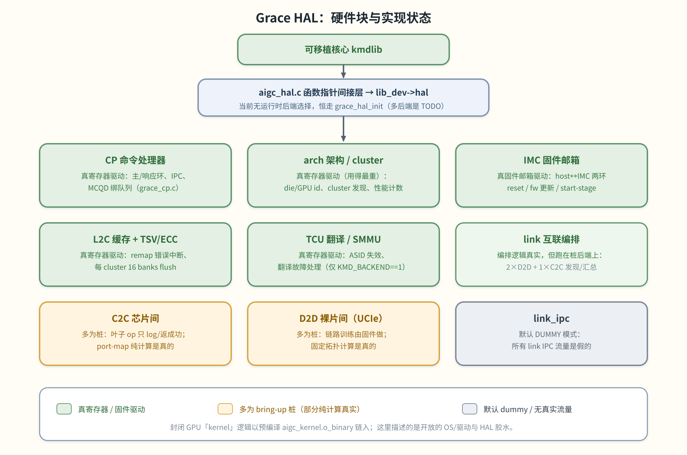

# 06 Grace HAL

> **这章解决什么问题**：前几章里可移植核心一遇到「要碰硬件」就调 `aigc_hal_*`。本章揭开这层：HAL 后端
> 怎么绑定、每个硬件块干什么、以及**哪些是真寄存器驱动、哪些还是 bring-up 占位**——这点对读代码、跑测试、
> 排查「为什么这条路返回假数据」至关重要。涉及 `aigc_hal.c`、`hal/grace/*`、`regs/*`。

Grace HAL 是 `aigc.ko` 的芯片专属后端。可移植核心通过函数指针 ops 调进来，HAL 把这些调用变成 Grace 寄存器
读写和固件 IPC。



> 图解源文件：[`11-hal-blocks.svg`](../../../_attachments/grace/kmd/diagrams/11-hal-blocks.svg)。

## 后端怎么绑定

`aigc_hal.c` 是一层薄间接：每个入口都经存在 `lib_dev->hal` 上的函数指针转发——`hal_cp.ops.*`（CP）、
`hal_imc.ops.*`（IMC）和 arch/拓扑钩子。**目前没有运行时后端选择**，`aigc_hal_init()` 无条件调 Grace 后端，
多后端派发留作 TODO：
```c
int aigc_hal_init(struct aigc_lib_device *lib_dev)
{
	/*TODO: FIXME in the future*/
	//if (lib_dev == GRACE)
	return grace_hal_init(lib_dev);
}
```

有序 bring-up 在 `hal/grace/grace_state.c`（`grace_hal_init` / `grace_hal_deinit`）：
1. `grace_imc_init()` → `grace_cp_init()`。
2. 若 `aigc_mparam_fw_boot_stage()` 置位，提前返回（只起 IMC + CP）。
3. 否则 `grace_arch_init()`，并在硬件后端（`#if KMD_BACKEND == 1`）`grace_tcu_init()`。
4. arch 初始化失败时，回卷 CP 和 IMC。

注意 **link 层不从 `grace_state.c` 拉起**：C2C/D2D/link 有自己的入口（`grace_link_hal_init`、
`grace_link_ipc_probe_init`、`grace_link_ipc_first_open`），由上层 link 驱动调用。

**Ops 表**：CP 由 `grace_cp_init()` 填 `hal_cp->ops`（约 20 个回调：`cp_ring_init`、`add_hw_queue`、
`bind_hw_queue`、`stop_schedule`、`get_db_base`、`wait_cp_ack` …）；IMC 由 `grace_imc_init()` 填
`hal_imc->ops`（`imc_ring_init`、`do_reset_ctrl`、`do_fw_update`、`get_imc_start_stage`、`wait_imc_ack` …）；
link 传输用 `grace_c2c_get_ops()` / `grace_d2d_get_ops()` 暴露 `const struct aigc_link_ops *`。
**`KMD_BACKEND`** 构建值在多个块里选访问路径：`0` = cmodel，`1` = emulator（默认），`2` = chip。

## 各硬件块

### CP — 命令处理器 —— *已实现*
（`grace_cp.c/.h`）接好 CP 环 ops 表，管 host→CP 主环和 CP→host 响应环，组并发固件 IPC（建/销队列、
stop-schedule）并等 ack，通过把 MCQD 编程进每-`(pipe, hcqd)` HCQD 寄存器把软件队列绑到硬件队列。做真寄存器 I/O
（如 `grace_query_hw_queue` 扫全部 4 pipe × 8 HCQD 槽）。小占位：`grace_pick_hw_queue` 恒返 0。

### arch — 架构 / cluster / 性能 / 功耗 —— *已实现*
（`grace_arch.c/.h`）用寄存器最重的一块。读 `TOP_CFG` 取 die/GPU id 和封装模式，发现存在的 cluster/core
（`tmask`/`tbmask`），复位并读每-core / L2C / CP 性能计数，武装 TSV/remap 错误中断，算 cluster 物理地址（NPA），
屏蔽 PCIe 中断。未完处：`__chip_cfg_init` 是占位（`#if 0`）、`grace_get_die_id` 恒返 `0`、
`grace_nocpa2_nodepa` 未实现、个别值带 `FIXME` 硬编码（如 `core_num = 7`）。

### IMC — 跨 die 内存控制器邮箱 —— *已实现*
（`grace_imc.c/.h`）host↔IMC 固件环缓冲消息。两条 MMIO 环（host→IMC 请求、IMC→host 响应），各是带读/写指针的
镜像回绕缓冲（基址 `REG_IMC_BASE = 0x4000000`，缓冲 `0x400`）。公开 ops（reset、固件更新、固件密码更新、IMC
start-stage 查询）组请求、推送、然后阻塞等 ack（由线程化 IMC 中断处理器释放，见 [05](<./05-submission-events-interrupts.md>)）。
这是 link IPC 层下面的固件传输。

### 互联：C2C / D2D / link / link_ipc
互联聚合两个 D2D（die-to-die，UCIe）子系统和一个 C2C（chip-to-chip）子系统，发现拓扑并暴露给上层 link 驱动。
**编排是真的；传输叶子 ops 和固件 IPC 在本构建是 bring-up 桩。**
- **c2c**（*多为桩*）：叶子 op（add、set/get_link_mode 恒 `SAFE`、rx_detect 恒 `true`、discovery_token 恒 0）
  只 log/返成功，`read_sid` 合成假 SID（`0xCC`）。**真的**是纯计算 port-map 构建（`_c2c_build_port_map`：3 口 ×4
  vs 6 口 ×2）和分阶段 bring-up 流（驱动 IPC 事件 61–64，但落到下面的 dummy IPC）。`local_gpuid`/`local_dieid`
  硬编码 0。
- **d2d**（*多为桩*）：链路训练由固件做，多数叶子 op 是桩（`trigger/poll_linkup` 恒 `linkup_done=true`、合成
  `read_sid`、`read_remote_info` 全 0）。**真的**是纯计算 `grace_d2d_get_fixed_topology`（按封装 die 数推每模块
  的对端 die：2-die 一条线、4-die 2×2 网格、单 die 无、未连标 `0xFF`）；拓扑 = 2 子系统 × 8 UCIe 模块。
- **link**（*真编排 + 桩后端*）：`grace_link_hal_init` 分配 link 设备信息、初始化 2 D2D + 1 C2C、统计并缓存链路；
  `grace_link_discover_hw_info` 把每条链路的 SID/邻居数据摊平给上层。编排逻辑真实，但操作的是桩后端 + dummy IPC
  产的数据；设备身份（gpuid/dieid/die 数）硬编码为 `0`/`2`（TODO）。
- **link_ipc**（*dummy / 桩*）：编译期 `AIGC_LINK_IPC_MODE` 默认 `AIGC_LINK_IPC_DUMMY`。每条命令（事件 60–64 +
  D2D 状态查询）都有 DUMMY 分支 log 并返合成数据；SYNC/ASYNC 分支是显式桩（`[STUB] actual IPC not implemented`）。
  **如编译，所有 link IPC 流量都是假的。**

### L2C — L2 缓存 + TSV/ECC —— *已实现*
（`grace_l2c.c/.h`）每 cluster 16 个 L2C bank + TSV AXI 通路 + FEC port-agent。真寄存器活：
`grace_enable_remapping_err`（PA_CFG bit 17、PBM flush-done 中断）、TSV/ECC 中断使能、`grace_l2c_flush`（对每
cluster 全部 16 bank 置 `PBM_FLUSH_OP` 并轮询约 1s 等 `0xffff` 完成位图）。占位：`aigc_l2c_pa_dump()` 空体。

### TCU — 翻译 / SMMU —— *已实现*
（`grace_tcu.c/.h`）驱动 CP 和每-cluster TCU 实例的 TCU/SMMU 翻译硬件：`__grace_tcu_init`（sync / check-bit）、
上下文（ASID）失效、MMU 翻译故障中断处理（解出故障 VA/上下文、dump 页表、清故障、重失效）。受 interleave 粒度和
TBU/cluster 哈希模块参数驱动。仅 `KMD_BACKEND == 1` 时编译。

## 寄存器映射（`kmd/aigc/kmdlib/regs/`）
按 die vs cluster 组织（而非按块）：
- **`grace_reg_define.h`**：中心寄存器映射。`REG_IMC_BASE = 0x4000000`。覆盖 IMC eFuse、IMC top（`REG_TOP`/
  `REG_TOP_CFG`）、TCU/MMU 窗口（`REG_TCU_SS = 0xA0000`：每-TBU 客户端 id、sync/全局失效握手、翻译故障信息、
  bypass）、CP 子系统（环、doorbell、HCQD 硬件队列、SDMA、GCTRL、事件表）、IMC↔CP / IMC↔PCIe 中断寄存器。它
  include `grace_reg_cluster.h`。
- **`grace_reg_cluster.h`**：每-cluster 映射。4 个 cluster 基址（`REG_CLUSTER0_BASE = 0x4800000` … `0x4b00000`，
  步长 `0x100000`）。块：TSV（INTC `0x1000`、FEC ECC `0x30000`）、16 个 L2C bank（`REG_L2C_00_BASE = 0x90000`，
  步长 `0x1000`）、cluster 控制（`0xc0000`）、regbank（`0x81000`）、PE core + 性能计数、每-cluster TCU 窗口。

## 小结：已实现 vs bring-up

| 块 | 状态 |
|---|---|
| CP | 真寄存器驱动（HW 队列选择有一个 TODO）。 |
| arch | 真寄存器驱动（几处硬编码/TODO）。 |
| IMC | 真固件邮箱驱动。 |
| L2C | 真寄存器驱动（PA port-agent dump 是 TODO）。 |
| TCU | 真寄存器驱动（仅 `KMD_BACKEND == 1`）。 |
| C2C | 多为桩——叶子 op log/返成功；port-map/流程逻辑真实。 |
| D2D | 多为桩——叶子 op log/返成功；固定拓扑计算真实。 |
| link | 真编排，跑在桩后端上。 |
| link_ipc | 默认 dummy 模式——无真实固件流量。 |

> 封闭 GPU「kernel」逻辑以预编译对象 `aigc_kernel.o_binary` 链入；本知识库描述的是开放的 OS/驱动与 HAL 胶水。
> `KMD_BACKEND` 与其它构建开关如何选这些路径，见 [07 构建与测试](<./07-build-and-test.md>)。

## 下一步
- 上一页：[05 提交、事件与中断](<./05-submission-events-interrupts.md>)
- 下一页：[07 构建与测试](<./07-build-and-test.md>)
