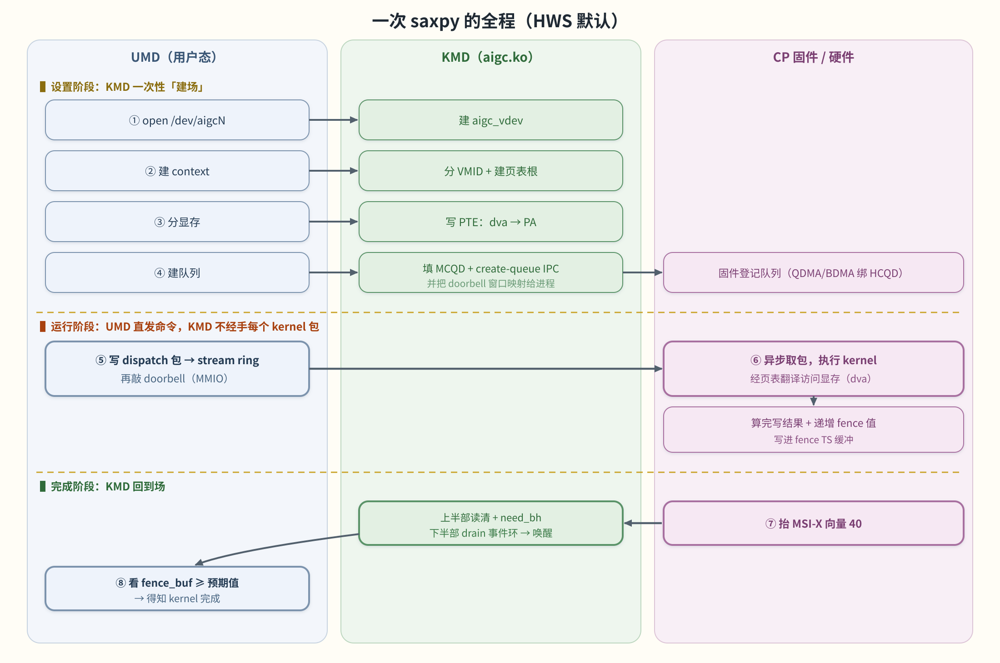

# 08 端到端：一次 saxpy 的全程

> **这章解决什么问题**：把前面 00–07 的所有子系统，用一次真实的 saxpy（`y = a*x + y`）计算串成一条
> 完整时间线。读完你应该能回答面试里最容易答错的一句话——「kernel 提交到底经不经过 KMD？」

## 一图看全程

下面这张泳道图分三条道（UMD / KMD / CP 固件硬件）、三个阶段。**关键在第二阶段**：运行时 UMD 直接把命令发给
硬件，KMD 不经手每个 kernel 包。

> 图解源文件：[`12-saxpy-timeline.svg`](../../../_attachments/grace/kmd/diagrams/12-saxpy-timeline.svg)。

## 一个正确的总印象

关于 KMD 最容易答错的一句话是：「kernel 提交时，KMD 负责把命令搬给 GPU。」**在默认的 HWS（硬件调度）模式下
这是错的。**

正确的总印象是：**KMD 只在初始化时一次性「建场」**（建 context、分显存写页表、建队列、发 IPC 通知固件），
之后**每个 kernel 包都由 UMD 直发**（UMD 自己写 ring buffer + 敲 doorbell），KMD 不经手；KMD 在运行期再次
出场，是在 kernel **算完之后**——处理完成中断、唤醒等结果的线程。

## 阶段 A：设置（KMD 一次性建场）

1. **open** — UMD 打开 `/dev/aigcN`，KMD 建每-fd 的 `aigc_vdev`。（→ [02](<./02-data-structures.md>)、[03](<./03-ioctl-abi.md>)）
2. **建 context** — KMD 分配一个 VMID 并建该上下文的页表根（`AIP_CONTEXT_CREATE`）。（→ [02](<./02-data-structures.md>)）
3. **分显存** — KMD 从堆/NUMA 池划物理内存，建 `mem_handle`，并在这个 context 的页表里写 `dva → PA` 的 PTE。
   之后 GPU 用 GPU 虚拟地址 `dva` 访问，硬件 TCU 走页表翻译到物理页。（`AIP_MEM_CREATE`，→ [04](<./04-memory-and-pagetables.md>)）
4. **建队列** — HWS 模式下 KMD 填好 MCQD、给 CP 固件发 *create-queue* IPC（固件用 QDMA/BDMA 把就绪 MCQD 动态
   绑到空闲 HCQD），并把**doorbell 窗口**映射进该进程地址空间。（`AIP_QUEUE_CREATE`，→ [05](<./05-submission-events-interrupts.md>)）

到此「场」建好了：地址空间、显存映射、队列与门铃都就位。

## 阶段 B：运行（UMD 直发，KMD 不经手）

5. **写命令 + 敲门铃** — UMD 把 dispatch 包写进 host 内存里的 stream ring buffer，然后**原子写 doorbell**
   （那是 KMD 在阶段 A 映射给它的 MMIO 寄存器）。
6. **硬件执行** — CP 固件异步从 ring 取包、执行 saxpy 的 kernel；执行时拿命令包里的 GPU 虚拟地址 `dva` 去访问
   输入/输出显存，硬件 TCU 走**这个 context 的页表**翻译成物理页（所以阶段 A 的「写 PTE」生死攸关——不写，CP
   找不到数据）。算完把结果写回输出显存，并把一个**递增的 fence 值**写进 fence TS 缓冲。

> ⚠️ **为什么这一步没有 KMD？** 因为 `ioctl(AIP_QUEUE_SUBMIT)` 当前 `return -EFAULT`（提交禁用，见
> [03](<./03-ioctl-abi.md>)），而 HWS 的设计本就是让 UMD 经映射的 ring + doorbell 直发、固件自调度。KMD 里那套
> `INDIRECT_CMD_NODE` + CP 环 + 调度 kthread（[05](<./05-submission-events-interrupts.md>)）服务的是内核侧排队的
> 命令（如事件/同步），不是 saxpy kernel 的主线。

## 阶段 C：完成（KMD 回到场）

7. **完成中断** — CP 完成时抬一个 **MSI-X 向量 40**（CP event-signal）。KMD 上半部读+清状态、置 `need_bh`，
   立刻返回；下半部在工作队列里 drain 事件环、把事件推给注册的客户端并**唤醒**等结果的用户线程。
   （→ [05](<./05-submission-events-interrupts.md>)）
8. **用户态确认** — UMD 看 `fence_buf ≥ 记下的预期值`（比大小，不读硬件状态寄存器，单调递增天然支持乱序/批量
   完成）即知 kernel 完成，取回结果。

## 一句话收尾

**建场（KMD）→ 直发（UMD）→ 执行（CP）→ 通知（KMD 中断 + fence）。** 把这条线和[全景图](<./index.md>)对上，
整套 kmd 就活了。想从「源码级追问/作答」的角度再过一遍，看附录的[面试向深入问答](<./appendix/interview-qa.md>)。

## 下一步
- 上一页：[07 构建与测试](<./07-build-and-test.md>)
- 附录：[术语表](<./appendix/glossary.md>) · [面试向深入问答](<./appendix/interview-qa.md>) · [代码评审记录](<./appendix/code-review.md>)
- 全栈视角：[[wiki/grace/overview/saxpy-kernel-end-to-end|saxpy 端到端长文]]（跨 UMD/thunk/kmd/fw）
