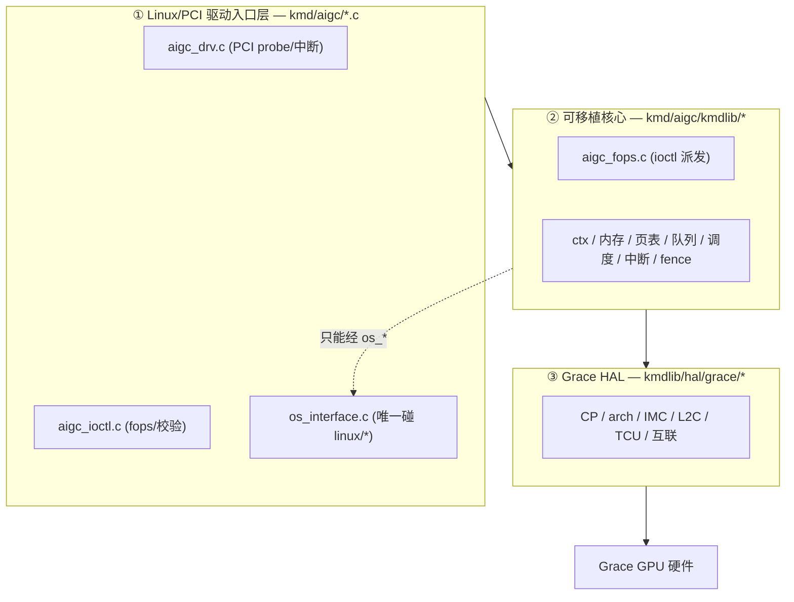

# KMD 架构总览

> kmd 按「离操作系统近 → 离硬件近」分三层：**Linux/PCI 驱动入口层**（唯一能直接调内核 API）、
> **可移植核心 kmdlib**（实现所有用户可见操作、不碰内核 API）、**Grace HAL**（芯片相关后端）。

## 本区页面

- [[wiki/grace/kmd/arch/layered-architecture|三层架构与 OS 抽象规则]]：每层各做什么、目录怎么对应、为什么这么分。
- [[wiki/grace/kmd/arch/request-path|一次 ioctl 的端到端路径]]：从 `open()` 到处理函数再到硬件，逐步走一遍。

## 一眼看懂的分层

## 延伸

- [[wiki/grace/kmd/index|KMD 内核驱动知识库]]
- [[wiki/grace/kmd/concepts/index|核心数据结构]]
- [[wiki/grace/kmd/ioctl/index|ioctl 接口与 ABI]]
