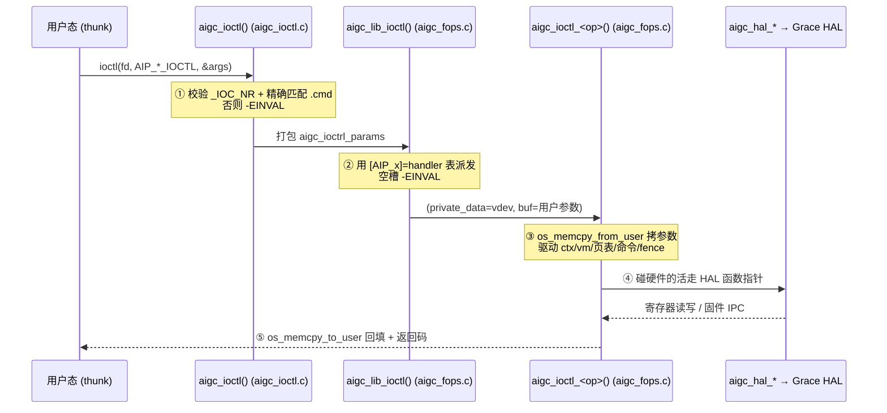

# 一次 ioctl 的端到端路径

**文件**: `kmd/aigc/aigc_ioctl.c`、`kmd/aigc/kmdlib/aigc_fops.c`
**关联**: [[wiki/grace/kmd/arch/layered-architecture]] | [[wiki/grace/kmd/ioctl/index|ioctl 接口与 ABI]] | [[aigc_vdev]]

> 每个用户操作都走同一条路。记住这条路，就能顺藤摸瓜读懂任意一个 `Thunk_*` 调用在内核里干了什么。

---

## 五步走完全程

1. **`open("/dev/aigcN")`** → `aigc_open()` 调 `aigc_lib_open()`，分配每 fd 的 [[aigc_vdev]]（`struct aigc_vdev`），存进 `file->private_data`。
2. **`ioctl(fd, cmd, arg)`** → `aigc_ioctl()`（`aigc_ioctl.c:95`）解 `_IOC_NR(cmd)` 和 `_IOC_SIZE(cmd)`，**校验**：编号要在 `aigc_ioctl_tbl[]` 范围内，**且**表项的 `.cmd` 必须和传入 `cmd` 完全相等，否则 `-EINVAL`。然后把 `private_data`、命令号、大小、用户缓冲打成 `struct aigc_ioctrl_params`，调 `aigc_lib_ioctl()`。
3. **派发** → `aigc_fops.c:3831` 的 `aigc_lib_ioctl()` 用第二张表 `[AIP_x] = handler`（也来自同一份 X-macro）按命令号取处理函数，转发 `(private_data, buf)`。两张表来自同一个宏列表，所以校验表和派发表永远不会跑偏。
4. **处理函数** → `aigc_ioctl_*` 用 `os_memcpy_from_user`/`os_memcpy_to_user` 进出参数，驱动 ctx / vm / 页表 / 命令 / fence 子系统。
5. **HAL** → 碰硬件的活调 `aigc_hal_*` 入口，经函数指针表落到 Grace 后端。

`mmap()`、`poll()` 形状相同：`aigc_mmap()` 按 `vm_pgoff` 选「显存映射 vs 调试映射」并调 `aigc_lib_mmap()`/`aigc_lib_debug_mmap()`；`aigc_poll()` 转 `aigc_lib_poll()`。

---

## 为什么是「两级派发」而不是一个 switch？（讲给应届生）

- **第一级在入口层**（`aigc_ioctl.c`），只做**校验**：把畸形/版本不匹配的请求挡在核心层之外。「精确匹配 `cmd`」
  意味着方向（读/写）或参数结构大小不对的请求会被 `-EINVAL` 挡掉，**fail closed**，而不是带着错参数往里冲。
- **第二级在核心层**（`aigc_fops.c`），只做**派发**：用编号当下标取函数指针。
- 两张表都由 `common/include/aigc_ioctl_tab.h` 这一个 X-macro 列表生成，所以「编号、名字、处理函数」三者天然
  同步，也和用户态 thunk 的 `AIP_*` 枚举对齐。改一处就全改，不会出现「校验表认得、派发表不认得」的裂缝。

细节见 [[wiki/grace/kmd/ioctl/ioctl-abi|ioctl ABI]]。

## 延伸

- [[wiki/grace/kmd/ioctl/index|ioctl 接口与 ABI]]
- [[aigc_vdev]]：`file->private_data` 里到底放了什么。
- [[wiki/grace/kmd/flows/index|端到端流程]]：把这条路径放进一次完整的 saxpy 计算里看。
- 单个 ioctl 处理函数内部的函数链，见各逐操作流程页：[[mem-create-flow]]、[[queue-create-flow]]、[[context-create-flow]]、[[command-submission-flow]]、[[completion-interrupt-flow]]。
