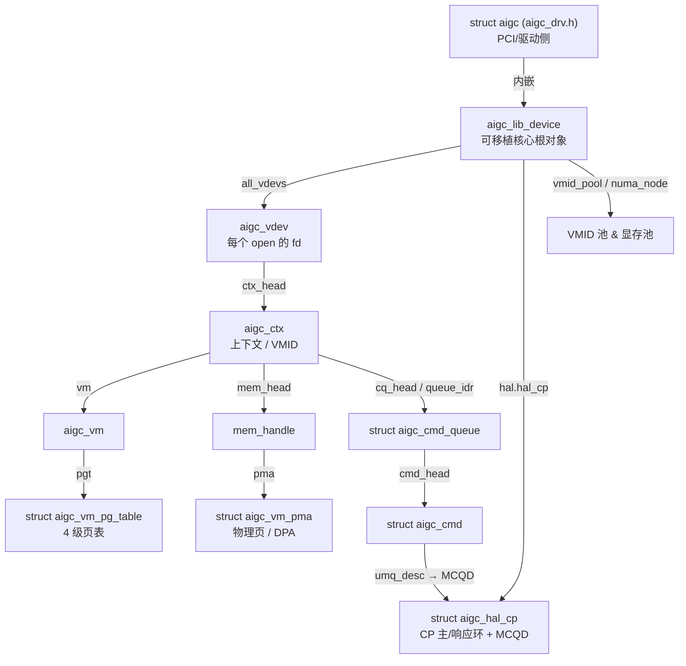

# KMD 核心数据结构

> kmd 的对象从「物理 GPU」一路往下嵌套，到「一条提交的命令」为止，形成一条单一所有权链。
> 认识这条链，就抓住了整个驱动的骨架。

## 所有权链（一张图记住）

## 本区词条

| 词条 | 一句话 |
|---|---|
| [[aigc]] | 驱动侧（PCI/OS 那一半）的每设备私有对象；内联存放 [[aigc_lib_device]]，构成「一颗 GPU 的两个根」。 |
| [[aigc_lib_device]] | 可移植核心的根对象——一颗物理 GPU 在 kmdlib 里需要的一切。 |
| [[aigc_vdev]] | 一个打开的 fd / 一个用户进程客户端；提交链路从这里开始。 |
| [[aigc_ctx]] | 一个 GPU 执行上下文（一个 VMID/地址空间），拥有 VM、队列、事件。 |
| [[aigc_vm]] | 一个 GPU 虚拟地址空间（一个 VMID/TTBA）+ 它的多级页表。 |
| [[mem_handle]] | 一次分配的中心描述符；引用计数，记录用户态 VA 与 GPU VA。 |

> 提交相关的 `struct aigc_cmd_queue`（提交队列）和 `struct aigc_cmd`（一条命令）细节放在
> [[wiki/grace/kmd/queue/index|命令队列与调度]] 里讲。

## 延伸

- [[wiki/grace/kmd/index|KMD 内核驱动知识库]]
- [[wiki/grace/kmd/arch/layered-architecture]]
