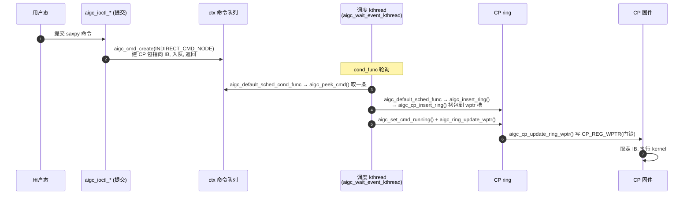

# 命令提交与下发代码流程

**文件**: `aigc_cmd.c` / `aigc_default_scheduler.c` / `aigc_cp_ring.c`
**关联**: [[aigc_cp_ring]] | [[aigc_sched]] | [[queue-create-flow]] | [[completion-interrupt-flow]]

> 这条流程是 saxpy 时间线第 5～7 步的代码展开。它有一个关键设计：**提交 ≠ 执行**。用户提交命令只是
> 把命令对象**入队**就返回；真正「把命令包写进 CP 环 + 敲门铃」由一个**调度 kthread 异步**完成。

---

## 调用链

## 关键步骤

### A. 提交（同步，立即返回）
1. 用户态提交命令的 ioctl 落到处理函数，`aigc_cmd_create(vdev, INDIRECT_CMD_NODE, ...)` 建命令对象，
   构建一条 **CP 间接缓冲（IB）包** 指向真正的 kernel 命令缓冲，挂进该 context 对应引擎的命令队列。
   到此**提交就返回**——命令还没下发到硬件。

### B. 下发（调度 kthread，异步）
调度 kthread 在 `init_eng_scheduler`（见 [[device-init-flow]] / `aigc_sched.c`）里被 `os_kthread_run`
起来，循环跑「条件函数 + 调度函数」：
2. **`aigc_default_sched_cond_func()`**（`aigc_default_scheduler.c`）调 `aigc_peek_cmd()` 从队列**取**一条
   待发命令并锁存到 `sched->current_cmd`；非空才唤醒调度函数。
3. **`aigc_default_sched_func()`** 把锁存的命令交给 `aigc_insert_ring()` → `aigc_cp_insert_ring()`
   （`aigc_cp_ring.c`）：检查读指针对齐与环是否满（留一个槽的 gap），把命令包**拷进 CP 环 wptr 处的槽**，
   再把 wptr 前进一个对齐槽（按环大小取模）。
4. `aigc_set_cmd_running()` 记录命令为运行中，`aigc_ring_update_wptr()` → `aigc_cp_update_ring_wptr()`
   把新的 wptr **写进 `CP_REG_WPTR` 寄存器**——这就是**敲门铃**，通知 CP「环里有新包」。
5. CP 固件按 wptr 取走包、顺着 IB 找到 kernel 命令缓冲、执行（saxpy kernel 是闭源 `aigc_kernel.o_binary`）。

## 给应届生

- **为什么要异步 kthread？** 提交和下发解耦：用户态 ioctl 不必等硬件，立刻返回去做别的；下发集中在一个
  kthread 里串行写环，避免多线程争用同一个 CP 环的 wptr。
- **环 + wptr/rptr + 门铃** 是经典的生产者/消费者：驱动是生产者（写包、推 wptr），CP 是消费者（读包、推 rptr）；
  留一个槽的 gap 用来区分「空」和「满」。
- **门铃就是一次寄存器写**：`aigc_cp_update_ring_wptr` 里 `aigc_reg_write(CP_REG_WPTR, wptr)` 一行，
  就是「提交动作」最终对硬件产生效果的那一下。

## 延伸

- [[aigc_cp_ring]] | [[aigc_sched]]
- [[completion-interrupt-flow]]：命令跑完之后怎么通知回用户态。
