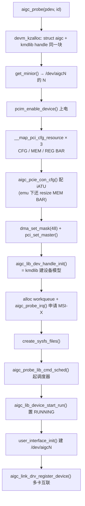

# 设备 probe 代码流程（aigc_probe）

**文件**: `kmd/aigc/aigc_drv.c::aigc_probe`
**关联**: [[wiki/grace/kmd/arch/request-path]] | [[aigc_lib_device]] | [[wiki/grace/kmd/hal/index|Grace HAL]] | [[wiki/grace/kmd/interrupt/index|中断]]

> PCI 子系统匹配到设备后调用 `aigc_probe()`，这是整张卡在操作系统里「从无到有」的过程。函数体已按
> `step N` 注释，这里把它串成一条调用链：分配上下文 → 上电映射 BAR → 交给 kmdlib 建模型 → 接中断 →
> 暴露 `/dev/aigcN` → 启动。任何一步失败都顺着 `err_*` 标签**逆序**回滚。

---

## 调用链

## 关键步骤（对应 aigc_probe 里的 step 注释）

1. **分配上下文**：`devm_kzalloc(sizeof(*aigc) + aigc_lib_dev_handle_size())` —— `struct aigc` 与
   kmdlib 句柄**挤在同一块** devm 内存里，设备拔出时一起自动释放。
2. **取 minor / per-cpu 统计**：`get_minior()` 决定 `/dev/aigcN`；`alloc_percpu` 建每 CPU 统计。
3. **上电 + 映射 3 个 BAR**：`pcim_enable_device()` → `__map_pci_cfg_resource()` 映射 CFG（配置/iATU 窗）、
   MEM（设备 DRAM 窗）、REG（寄存器）。CFG 窗为 1MB ⇒ 判定为模拟器（`is_emu`）。
4. **iATU + DMA**：`aigc_pcie_con_cfg()` 配 PCIe 入站 iATU 让 MEM BAR 指向设备 DRAM；`dma_set_mask(48)` +
   `pci_set_master()` 允许设备自主 DMA。
5. **交给 kmdlib**：`aigc_lib_dev_handle_init()` 是真正建「设备模型」的地方 —— 见 [[device-init-flow]]
   （内部再调 `hw_init=grace_hw_init`、`hal_init`、`sw_init=grace_sw_init`、`aigc_queue_manager_init`、开内核 vdev）。
6. **接中断**：`alloc_ordered_workqueue` 建下半部工作队列；`aigc_probe_irq()` 申请 MSI-X 向量。
7. **暴露与启动**：`create_sysfs_files()` → `aigc_probe_lib_cmd_sched()` 起调度 kthread →
   `aigc_lib_device_start_run()` 置 `AIGC_RUNNING` → `user_interface_init()` 建字符设备
   `/dev/aigcN`（这一步之后用户态才能 open）→ `aigc_link_drv_register_device()` 注册到多卡互联。

> 注：`aigc_lib_dev_handle_init` 这一步的内部细节单独成页见 [[device-init-flow]]（若未建可直接读
> `aigc_lib_dev.c::aigc_lib_dev_handle_init` 的 step 注释）。

## 给应届生：probe 的两条设计直觉

- **devm + pcim 托管**：用 `devm_kzalloc`/`pcim_enable_device` 这类「设备托管」接口，失败或卸载时内核
  自动回收，省掉一半手写释放——但**句柄/锁/中断**这种非托管资源仍要靠 `err_*` 标签逆序清。
- **fail closed 的逆序回滚**：`err_device_init → err_cmd_sched → … → err_out` 标签从下往上排，
  哪一步失败就 `goto` 到对应标签，只回滚「已经建起来的那部分」，顺序与初始化**严格相反**。

## 延伸

- [[wiki/grace/kmd/flows/index|端到端流程]] | [[saxpy-submission-flow]]
- [[aigc_lib_device]]：probe 填充的根对象。
