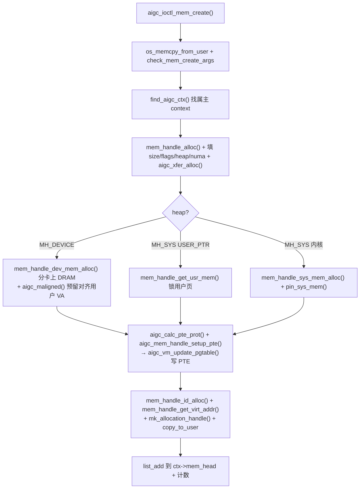

# 显存分配代码流程（AIP_MEM_CREATE）

**文件**: `aigc_fops.c::aigc_ioctl_mem_create` → `aigc_mem_handle.c::mem_handle_dev_mem_alloc` → `aigc_page_table.c`
**关联**: [[mem_handle]] | [[wiki/grace/kmd/memory/index|内存与页表]] | [[aigc_page_table]] | [[pgtable-mapping-flow]]

> `AIP_MEM_CREATE` 把「分一块显存（或注册一块系统内存）并映射进 GPU 地址空间」这件事做完。落到
> `aigc_ioctl_mem_create()`，核心是建一个 [[mem_handle]]、按 heap 选物理内存来源、再写 GPU 页表。

---

## 调用链

## 关键步骤（对应 aigc_ioctl_mem_create 的 step 注释）

1. **拷参 + 校验**：`os_memcpy_from_user` 把请求拷进内核，`check_mem_create_args` 验 size/heap/flags。
2. **找 context**：`find_aigc_ctx(lib_dev, ctx_handle_ctx_id(hContext))`——用句柄里打包的 ctx id 还原属主。
3. **建 mem_handle**：`mem_handle_alloc(ctx)` 出内核侧分配记录，`os_kref_init` 取引用，把请求字段
   （size/flags/heap/numa）抄进去，`aigc_xfer_alloc()` 建 DMA 传输态。
4. **按 heap 选物理来源**：
   - **MH_DEVICE（卡上 DRAM）**：size 向页粒度对齐 → `mem_handle_dev_mem_alloc()` 从 NUMA/UMA 池分（见
     `mem_handle_dev_mem_alloc` 的 step 注释，NUMA/UMA 两路）→ **仅在 ioctl 路径**用
     `aigc_maligned()` 预留一段对齐的用户 VA（内核线程上下文没有用户 mm，不能调）。
   - **MH_SYS（系统内存）**：带 `AIGC_MF_USER_PTR` 则 `mem_handle_get_usr_mem()` 直接锁用户给的缓冲；
     否则 `mem_handle_sys_mem_alloc()` 分内核系统内存再 `mem_handle_pin_sys_mem()` 锁页供 DMA。
5. **写 GPU 页表**：`aigc_calc_pte_prot()` 把 heap+flags 翻成硬件保护位，`aigc_mem_handle_setup_pte()`
   编排页表写入 → `aigc_vm_update_pgtable()` → `__create_ptl0_mapping()` 逐级建 PDE/PTE（见
   [[pgtable-mapping-flow]]）。这一步决定了 CP 之后能不能用这个 GPU VA 访问到这块内存。
6. **回填句柄**：`mem_handle_id_alloc()` 给 id，`mem_handle_get_virt_addr()` 读回 GPU VA，
   `mk_allocation_handle(minor, ctx->id, mem->id)` 打包句柄，`os_memcpy_to_user` 返回。
7. **挂链 + 计数**：`list_add_tail(&mem->ctx_node, &ctx->mem_head)` + `aigc_ctx_get` + 更新 ctx 显存统计。
   失败走 `err_out` 释放设备/系统内存与 mem_handle。

## 兄弟入口：pmem_create

`AIP_PMEM_CREATE`（`aigc_ioctl_pmem_create`）是简化版：**只**支持 MH_DEVICE，且**不建 GPU VA 映射**，
直接把卡上物理地址 dpa（`mem->pma->lm[0].dpa`）回给用户——用于需要裸物理地址的场景。

## 给应届生

- **heap 决定物理来源、flags 决定保护位**：同一个 `mem_handle` 既能背靠卡上 DRAM 也能背靠系统内存，
  上层用法不变——这就是「句柄抽象」屏蔽物理差异。
- **setup_pte 是关键的「打通」一步**：分到内存只是有了物理页，必须写进这个 context 的页表，CP 才能
  按 GPU VA 找到它（参见 [[saxpy-submission-flow]] 第 7 步）。

## 延伸

- [[mem_handle]] | [[aigc_page_table]] | [[wiki/grace/kmd/memory/index|内存与页表]]
