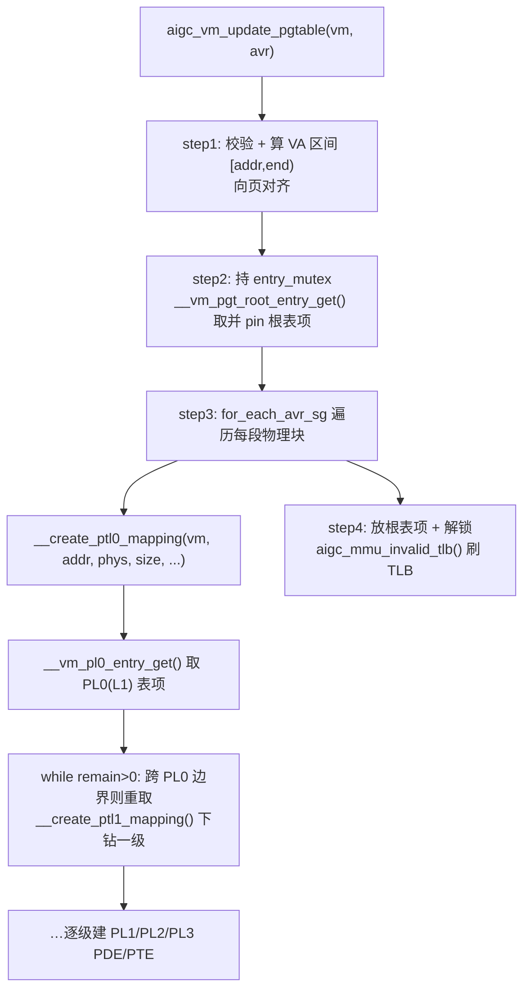

# GPU 页表写入代码流程（aigc_vm_update_pgtable）

**文件**: `aigc_page_table.c::aigc_vm_update_pgtable` → `__create_ptl0_mapping` → `__create_ptl1_mapping` …
**关联**: [[aigc_page_table]] | [[mem-create-flow]] | [[wiki/grace/kmd/memory/index|内存与页表]]

> [[mem-create-flow|显存分配]] 的第 5 步 `aigc_mem_handle_setup_pte` 最终落到这里：把一段 GPU 虚拟地址
> 区间 `aip_va_range` 映射到它的物理页，逐级建好 PDE/PTE，最后刷 TLB。这是「分到的物理内存」变成「CP 能用
> GPU VA 访问到」的关键一步。

---

## 调用链

## 关键步骤

### aigc_vm_update_pgtable（顶层，对应其 step 注释）
1. 校验 `vm/avr`，由 `avr` 算出 VA 区间 `[addr, end)`，向整页**向外**对齐（覆盖半页）。
2. 持 `vm->pgt->entry_mutex`，`__vm_pgt_root_entry_get(vm, addr)` 取得并 **pin** 覆盖该地址的根表项。
3. `for_each_avr_sg` 遍历区间里每一段**物理连续块**，对每块调 `__create_ptl0_mapping` 从 PL0 往下建各级
   表项；任一段失败即停。
4. 放掉根表项引用、解锁，`aigc_mmu_invalid_tlb(vm, va_addr, end, "setup")` 把这段 VA 从 TLB 刷掉，
   硬件这才看见新映射。
   > 注：`end` 用循环后的 `addr` 重算——UMA 交织时实际映射的 VA 是「每节点大小 × NUMA_NUM」，用循环后的
   > 末地址才能算对刷新区间。

### __create_ptl0_mapping（递归入口，对应其 step 注释）
1. `__vm_pl0_entry_get()` 取（或建）覆盖起始 VA 的 PL0（L1）表项。
2. `while (remain_size > 0)` 一次处理一个 PL0 大小的块。
3. 若地址越过当前 PL0 边界，先释放再 `__vm_pl0_entry_get` 取下一个 PL0 表项。
4. `__create_ptl1_mapping()` 下钻一级，把该块映进当前 PL0 之下的 PL1（及更低级）表项。

## 给应届生

- **页表是「逐级 get-or-create」**：从根到叶，每一级都「有就用、没有就建」一个表项并加引用计数；释放时
  逆向减引用、空了就回收（见 [[aigc_page_table]] 的 `_vm_pgt_cleanup`）。
- **改完页表必须刷 TLB**：硬件 MMU 会缓存旧的 VA→PA；不 `invalid_tlb`，CP 可能还按旧映射访问，导致读错地址。
- **持锁贯穿全程**：整段建表在 `entry_mutex` 下完成，避免并发建表把同一张表项建两遍或读到半建好的树。

## 延伸

- [[aigc_page_table]]：4 级页表的结构与遍历、PTE 位定义。
- [[mem-create-flow]]：谁、为什么会调到这里。
