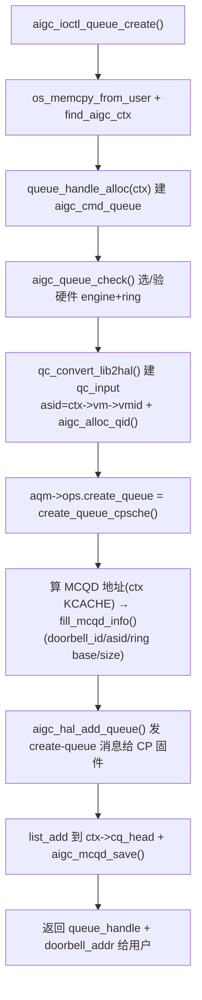

# 命令队列创建代码流程（AIP_QUEUE_CREATE）

**文件**: `aigc_fops.c::aigc_ioctl_queue_create` → `aigc_queue_manager.c::create_queue_cpsche`
**关联**: [[wiki/grace/kmd/queue/index|命令队列与调度]] | [[command-submission-flow]] | [[aigc_ctx]]

> 队列是用户态向 GPU 提交命令的「投递口」。`AIP_QUEUE_CREATE` 在内核建一个 `aigc_cmd_queue`，并通过
> **队列管理器（aqm）** 把它变成一个硬件队列：填好 MCQD（CP 队列描述符），按调度策略交给 CP 固件调度
> （HWS）或直接绑到硬件队列槽（no-HWS），最后把 **doorbell 地址**回给用户。

---

## 调用链

## 关键步骤

1. **拷参 + 找 ctx**：`os_memcpy_from_user` 拷请求；`find_aigc_ctx` 找属主 context。
2. **建队列对象**：`queue_handle_alloc(ctx)` 出 `struct aigc_cmd_queue`。
3. **选硬件资源**：`aigc_queue_check(lib_dev, &ring_id, engine_type, ctx->start_ring_id)` 校验并选定
   硬件引擎/环。
4. **建 HAL 描述 + 分 qid**：`qc_convert_lib2hal()` 把请求转成 HAL 级 `qc_input`，`asid = ctx->vm->vmid`
   把队列绑到本 context 地址空间；`aigc_alloc_qid(ctx)` 分一个队列 id。
5. **创建硬件队列**（`aqm->ops.create_queue`，HWS 策略 = `create_queue_cpsche`）：
   - 在 ctx 的 **KCACHE** 区算出 MCQD 地址（`mcqd_base + qid 槽`），映射到内核 VA 并清零；
   - `fill_mcqd_info()` 填 MCQD：`doorbell_id = vmid*32 + qid`、`asid=vmid`、ring base/size、影子 wptr 地址、`active=1`；
   - `aigc_hal_add_queue()` 把 create-queue 消息（ctx/stream id、优先级、MCQD 地址）发给 **CP 固件**，
     由固件开始调度这条队列。
     > no-HWS 策略（`create_queue_no_cpsche`）则不经固件：从 gslab 分 MCQD、`allocate_hqd()` 选硬件队列槽、
     > `aigc_hal_bind_queue()` 直接绑定。
6. **挂链 + 回填**：`list_add(&q->ctx_node, &ctx->cq_head)`、`aigc_mcqd_save(q)` 存门铃描述符；返回
   `queue_handle = mk_queue_handle(ctx->id, q->id)` 和
   `doorbell_addr = ctx->db_base + qid*sizeof(u32)`——这就是用户态后续「敲门铃」提交命令的 MMIO 地址。

## 给应届生

- **MCQD 是软硬件的「约定表」**：内核把环的基址/大小/门铃 id/asid 写进 MCQD，CP 固件读它就知道去哪取命令、
  写完成 wptr 到哪——所以 `fill_mcqd_info` 填错一个字段，硬件就找不到队列。
- **doorbell = 提交的触发器**：创建时把 doorbell 地址给用户；提交命令时用户/内核写 wptr 到这个地址，
  等于通知硬件「有新活了」（见 [[command-submission-flow]]）。
- **两种调度策略**：HWS 把调度交给 CP 固件（`create_queue_cpsche` + `aigc_hal_add_queue`），no-HWS 由驱动
  直接绑硬件槽——`aigc_queue_manager_init` 按 `sched_policy` 在 probe 时就选好了 ops。

## 延伸

- [[command-submission-flow]]：队列建好后命令怎么进环、怎么敲门铃。
- [[wiki/grace/kmd/queue/index|命令队列与调度]]
