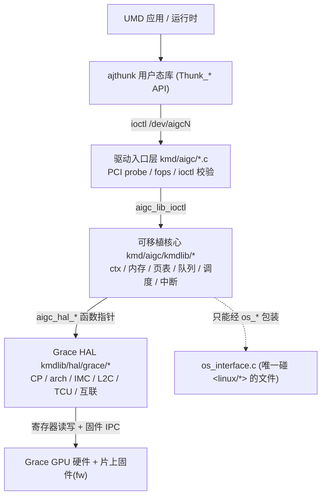

# KMD 内核驱动知识库

这是 **kmd**（AIGCIC **Grace** GPU 的 Linux 内核态驱动 `aigc.ko`）相关内容的统一入口。和 `wiki/grace/fw/`
（跑在芯片上的固件）相对，kmd 跑在 Host CPU 上，是 GPU 在操作系统里的「门面」：它把 GPU 注册成一个
PCI 设备、创建 `/dev/aigcN` 字符设备，把用户态发来的 `ioctl` 翻译成对 Grace 硬件的操作，管理显存与
页表，构建并提交命令，最后把完成事件/中断送回用户态。

> 给应届生的一句话：**上层 UMD（应用/运行时）→ ajthunk 用户态库（`Thunk_*` API）→ `/dev/aigc` 的
> ioctl → kmd（`aigc.ko`，本知识库）→ Grace GPU 硬件**。kmd 就是这条链路上「最贴近硬件的那层软件」。

## 推荐阅读顺序

1. [架构总览](<./arch/index.md>)：先建立「三层架构 + 一次请求怎么走完全程」的整体图景。
2. [核心数据结构](<./concepts/index.md>)：认识 5 个主对象（[[aigc_lib_device]]、[[aigc_vdev]]、[[aigc_ctx]]、[[aigc_vm]]、[[mem_handle]]）和它们的所有权关系。
3. [ioctl 接口与 ABI](<./ioctl/index.md>)：看用户态的每个请求如何经「两级派发」找到内核处理函数。
4. [内存与页表](<./memory/index.md>)：看显存怎么分配、`mem_handle` 的生命周期、4 级页表怎么走、TLB 怎么刷。
5. [命令队列与调度](<./queue/index.md>)：看 context → queue → CP ring → doorbell 的提交链路和调度线程。
6. [中断与 Fence](<./interrupt/index.md>)：看 MSI-X 中断的上/下半部、事件环、命令完成怎么用 fence 通知。
7. [OS 抽象层](<./os/index.md>)：理解为什么 kmdlib 不能直接调内核 API，以及 NVIDIA 式 conftest。
8. [Grace HAL](<./hal/index.md>)：看硬件后端（CP/arch/IMC/L2C/TCU/互联）哪些是真寄存器驱动、哪些是 bring-up 占位。
9. [端到端流程](<./flows/index.md>)：用一个 saxpy 计算把上面所有子系统串成一条完整时间线。
10. [代码评审意见](<./review/index.md>)：一份针对 kmd 代码的评审记录（注释/停用代码/TODO 等改进项）。

## 总图

## 分区入口

| 分区 | 入口 | 内容 |
|---|---|---|
| 架构 | [架构总览](<./arch/index.md>) | 三层分层、一次 ioctl 的端到端路径、子系统地图、OS 抽象规则。 |
| 概念 | [核心数据结构](<./concepts/index.md>) | aigc_lib_device / aigc_vdev / aigc_ctx / aigc_vm / mem_handle 的职责、字段与所有权树。 |
| ioctl | [ioctl 接口与 ABI](<./ioctl/index.md>) | `AIP_*` 操作集、X-macro 双表派发、`ioctl_*_args` ABI 与版本契约。 |
| 内存 | [内存与页表](<./memory/index.md>) | 堆/NUMA/UMA/DSMEM、mem_handle 生命周期、4 级页表遍历、引用计数、TLB 失效。 |
| 队列调度 | [命令队列与调度](<./queue/index.md>) | MCQD/HQD、CP ring 的 wptr/rptr/doorbell、调度 kthread 与默认调度器。 |
| 中断 | [中断与 Fence](<./interrupt/index.md>) | MSI-X 向量表、上/下半部、事件环、fence/timestamp 完成模型。 |
| OS 抽象 | [OS 抽象层](<./os/index.md>) | `os_interface.c` 这条可移植性缝隙 + NVIDIA 式 conftest。 |
| HAL | [Grace HAL](<./hal/index.md>) | CP/arch/IMC/L2C/TCU/C2C/D2D/link bring-up 状态、寄存器映射。 |
| 流程 | [端到端流程](<./flows/index.md>) | 从 `Thunk_*` 到硬件完成的完整链路（saxpy 实例）。 |
| 评审 | [代码评审意见](<./review/index.md>) | kmd 代码评审记录与注释改进项。 |
| 面试深入 | [KMD 面试向深入（aigc.ko 问答）](<./kmd-interview-deep-dive.md>) | 把句柄/IDR、ioctl 两级派发、页表 VMID、HWS、提交真相纠偏（QUEUE_SUBMIT 当前 -EFAULT）、fence+中断、`aigc_kernel.o_binary` 澄清串成问答长文。配套 [saxpy 端到端长文](<../overview/saxpy-kernel-end-to-end.md>)。 |
| 环境 | [服务器环境与构建](<./env.md>) | 远端源码路径、构建/加载命令（不含测试套件）。 |

## 新增 KMD 页面放哪里

| 新页面类型 | 放置目录 | 同步更新 |
|---|---|---|
| 架构/分层/请求路径分析 | `wiki/grace/kmd/arch/` | 本页 + 架构索引 |
| 数据结构/概念词条 | `wiki/grace/kmd/concepts/` | 本页 + 概念索引 |
| ioctl/ABI 分析 | `wiki/grace/kmd/ioctl/` | 本页 + ioctl 索引 |
| 内存/页表分析 | `wiki/grace/kmd/memory/` | 本页 + 内存索引 |
| 队列/调度/命令分析 | `wiki/grace/kmd/queue/` | 本页 + 队列索引 |
| 中断/fence 分析 | `wiki/grace/kmd/interrupt/` | 本页 + 中断索引 |
| OS 抽象/可移植性分析 | `wiki/grace/kmd/os/` | 本页 + OS 索引 |
| HAL/寄存器/bring-up 分析 | `wiki/grace/kmd/hal/` | 本页 + HAL 索引 |
| 端到端流程 | `wiki/grace/kmd/flows/` | 本页 + 流程索引 |
| 代码评审/调试复盘 | `wiki/grace/kmd/review/` | 本页 + 评审索引 |

## 延伸

- [[wiki/grace/fw/index|FW 技术知识库]]：跑在 GPU 上的固件，kmd 通过 CP/IMC IPC 环和它对话。
- [Wiki 总索引](<../../index.md>)
- [服务器环境与构建](<./env.md>)
