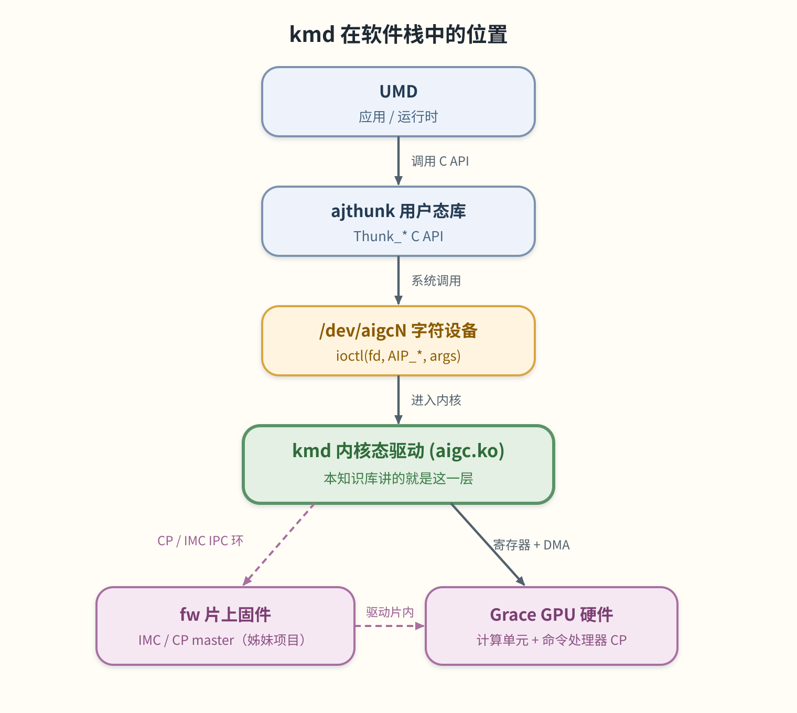
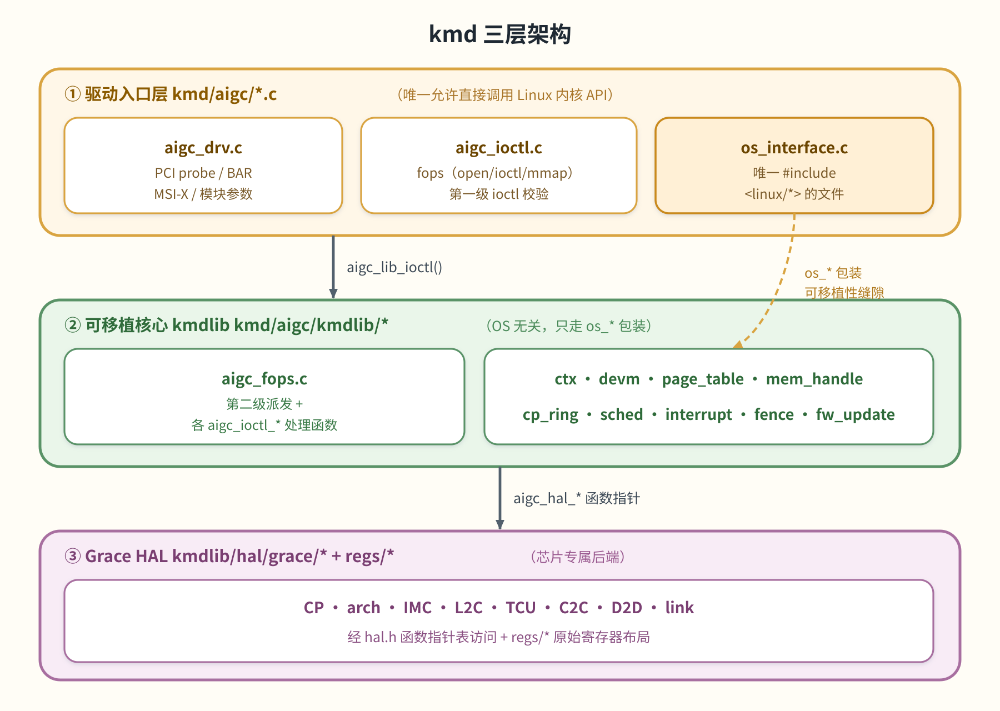

# KMD 内核驱动知识库

**kmd** 是 AIGCIC **Grace** GPU 的 Linux 内核态驱动，编译产物是一个可加载内核模块 **`aigc.ko`**。
它是 Grace GPU 在操作系统里的「门面」：把 GPU 注册成一个 PCI 设备、创建 `/dev/aigcN` 字符设备，
把用户态发来的 `ioctl` 翻译成对硬件的操作，管理显存与页表，组装并提交命令，最后把完成事件/中断
送回用户态。和 `wiki/grace/fw/`（跑在 GPU 片上微控制器里的固件）相对，kmd 跑在 **Host CPU** 上。

> **一句话定位**：上层 UMD（应用/运行时）→ ajthunk 用户态库（`Thunk_*` API）→ `/dev/aigc` 的
> `ioctl` → **kmd（`aigc.ko`，本知识库）** → Grace GPU 硬件。kmd 就是这条链路上「最贴近硬件的那层软件」。

> 图解源文件：[`01-panorama.svg`](../../../_attachments/grace/kmd/diagrams/01-panorama.svg)（飞书白板风手绘 SVG，可重渲染）。

## 这套文档怎么读

本知识库按 **线性编号** 组织，建议**从前往后**顺序阅读——后一章会用到前一章的概念。
每章开头都会先说清「这章解决什么问题」。如果你是第一次接触 GPU 驱动，先读 [00 大局观](<./00-big-picture.md>)。

| 章节 | 标题 | 一句话 |
|---|---|---|
| 00 | [大局观：一次请求的一生](<./00-big-picture.md>) | 不看代码，先用一个故事讲清楚「应用按下计算按钮后，kmd 到底做了什么」。 |
| 01 | [整体架构](<./01-architecture.md>) | 三层分层（驱动入口 / 可移植核心 / Grace HAL）、一次 ioctl 的请求路径、子系统地图、OS 抽象规则。 |
| 02 | [核心数据结构](<./02-data-structures.md>) | 5 个主对象（`aigc_lib_device` / `aigc_vdev` / `aigc_ctx` / `aigc_vm` / `mem_handle`）+ 队列对象 + 所有权树。 |
| 03 | [ioctl 接口与 ABI](<./03-ioctl-abi.md>) | `AIP_*` 操作集、X-macro 两级派发、`ioctl_*_args` ABI 与版本契约。 |
| 04 | [内存与页表](<./04-memory-and-pagetables.md>) | 堆 / NUMA / UMA / DSMEM、`mem_handle` 生命周期与引用计数、多级页表遍历、TLB 失效。 |
| 05 | [提交、事件与中断](<./05-submission-events-interrupts.md>) | context → queue → CP ring → doorbell 的提交链路、调度线程、MSI-X 中断、事件环、fence。 |
| 06 | [Grace HAL](<./06-hal-grace.md>) | 硬件后端：CP / arch / IMC / C2C / D2D / L2C / TCU、寄存器映射、哪些是真驱动 / 哪些是 bring-up 占位。 |
| 07 | [构建与测试](<./07-build-and-test.md>) | Kbuild + NVIDIA 式 conftest、模块参数与编译开关、`kmd_test.c` 测试套、QEMU CI 流水线。 |
| 08 | [端到端：一次 saxpy 的全程](<./08-end-to-end-saxpy.md>) | 用一次 saxpy 计算把上面所有子系统串成一条完整时间线。 |

附录：[术语表](<./appendix/glossary.md>) · [面试向深入问答](<./appendix/interview-qa.md>) · [代码评审记录](<./appendix/code-review.md>)。

## 三层架构速览

kmd 的代码从「靠操作系统」到「靠硬件」分三层。记住这张图，后面所有章节都挂在它上面：

> 图解源文件：[`02-layers.svg`](../../../_attachments/grace/kmd/diagrams/02-layers.svg)。详见 [01 整体架构](<./01-architecture.md>)。

## 30 秒术语速查

第一次读到陌生缩写时回来查这里，完整版见[术语表](<./appendix/glossary.md>)：

| 术语 | 白话 |
|---|---|
| **UMD** | User-Mode Driver，用户态驱动 / 运行时，kmd 的「客户」。 |
| **`aigc.ko`** | kmd 编译出的内核模块文件，`insmod` 进内核就生效。 |
| **`/dev/aigcN`** | kmd 暴露给用户态的字符设备节点，`N` 是第几张卡。 |
| **ioctl** | "I/O control"，用户态通过它给驱动下达带参数的命令。 |
| **`AIP_*`** | kmd 支持的每一种操作的编号（见 `common/aip_ioctl_nr.h`）。 |
| **kmdlib** | 可移植核心，kmd 的「大脑」，不直接碰 Linux API。 |
| **HAL** | Hardware Abstraction Layer，硬件抽象层，把「做什么」翻译成「碰哪个寄存器」。 |
| **CP** | Command Processor，命令处理器，GPU 上真正消费命令的硬件单元。 |
| **doorbell** | 「门铃」寄存器，用户态写一下它，硬件就知道有新命令要处理。 |
| **fence** | 「栅栏」，一种完成信号：命令做完了，硬件把某个值写到内存通知 CPU。 |

## 延伸

- [[wiki/grace/fw/index|FW 技术知识库]]：跑在 GPU 上的固件，kmd 通过 CP/IMC IPC 环和它对话。
- [[wiki/grace/overview/saxpy-kernel-end-to-end|saxpy 端到端长文]]：跨 UMD/thunk/kmd/fw 的全栈视角。
- [Grace 技术栈入口](<../index.md>) · [Wiki 总索引](<../../index.md>)
