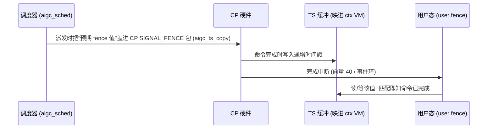

# aigc_kmd_fence — 命令完成 fence

**文件**: `kmd/aigc/kmdlib/aigc_kmd_fence.c`
**关联**: [[wiki/grace/kmd/interrupt/index|中断与 Fence]] | [[aigc_interrupt]] | [[wiki/grace/kmd/queue/aigc_sched]]

> 命令完成通过一个映进上下文 GPU 地址空间的小**时间戳（TS）缓冲**来报告。「写一个递增的时间戳」+「完成中断」
> 一起构成了 wait/signal 模型。

---

## 模型（三步）

1. 派发时，调度器把命令的*预期* fence 值盖进 CP 的 `SIGNAL_FENCE`/event-write 包（`aigc_ts_copy()`，在
   [[wiki/grace/kmd/queue/aigc_sched|aigc_sched]] 里）。
2. 命令完成时，**CP 把那个递增的时间戳写进 fence TS 缓冲**。
3. 用户态读/等它的 user fence 来得知命令完成；完成中断（向量 40 / 事件环）加写入的时间戳，一起释放等待者。

## 两种 build 变体

`aigc_kmd_fence.c` 在上下文 VM 里分配并映射 TS 缓冲：

- **非 `CONFIG_GTT_MEM`**：`aigc_kvdev_init_fence()` 分配系统页、映进上下文 VM（`aigc_map_page`），在 fence 管理器
  里记 CPU 指针、DMA 地址、dva。（本 build 里 `fence_va`/`size` 被清零，等真实地址赋值——一个 bring-up TODO。）
- **`CONFIG_GTT_MEM`**：TS 缓冲从设备 GTT 池切出，按「每计算引擎环 × 事件类型」定大小，记其 dva/CPU 指针；
  GTT 池未初始化时延后。

`aigc_kvdev_free_fence()` 在拆除时 unmap 并释放缓冲。

## 给应届生：fence 到底是什么？

fence 不是锁，而是「**一个单调递增的计数器/时间戳**」。GPU 干完一件事就把计数器加到某个值；CPU 想知道
「第 N 件事干完没」，只要看计数器有没有到 N。这种「比大小」的同步避免了 CPU 反复轮询硬件寄存器，配合完成中断
就能高效地「等命令完成」。

## 延伸

- [[aigc_interrupt]]：完成中断（向量 40）怎么来。
- [[wiki/grace/kmd/queue/aigc_sched]]：预期 fence 值在哪盖进 CP 包。
- [[aigc_vdev]]：fence 管理器挂在 vdev 上。
