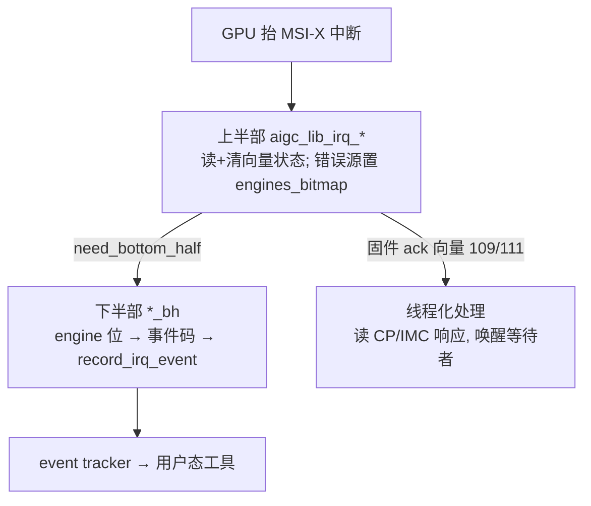

# KMD 中断与 Fence

> 命令发出去之后，硬件怎么把「进度」和「完成」告诉驱动和用户态？答案是 **MSI-X 中断 + 事件环 + fence**。

## 本区页面

- 本页：MSI-X 两段式处理全景 + 事件环（hardware 生产 / driver 消费）。
- [[aigc_interrupt]]：上半部/下半部/线程化处理函数的细节与向量表。
- [[aigc_kmd_fence]]：用时间戳（TS）缓冲做的命令完成模型。

## 两段式中断（一眼看懂）

- **上半部**（`aigc_lib_irq_*`）：每向量跑，读并清硬件状态，错误源记下哪个引擎抬的；返回值 `need_bottom_half`。
- **下半部**（`*_bh`）：把引擎位翻成事件码，经 `record_irq_event()` 推给注册了 event tracker 的每个 vdev。
- **线程化处理**（109/111）：处理固件命令完成（CP/IMC ack），唤醒阻塞在该固件命令上的进程。

## 事件环（`aigc_interrupt_ring.c`）

事件环（`struct aigc_intr_ring_desc`）是单生产者/单消费者环，单元固定大小（`GRACE_INTR_RING_ALIGNMENT`）。
**硬件是生产者**（追加事件、推 head/写指针），**驱动是消费者**（排空、推 tail/读指针）。

`aigc_intr_ring_read_one()` 是核心消费步：`head == tail` 即空（`-EAGAIN`）；否则把 `tail` 处单元拷给调用方、
报告当前 head、并推进 `tail`（在 `total_units` 处回绕）。「安全批量」sizer（`mr_dec_safe_intr_num`）按 head 与
读位置的距离限制每次排空数量。

> 本 build 注意点：碰 IG 硬件寄存器的 HAL 钩子（`get_head_hw`/`get_tail_hw`/`set_tail_hw`）为**仿真桩**
> （head/tail 读返回 0），环后备页的页表映射（`aigc_ring_setup_pte`/`clear_pte`）被编译掉。

## 延伸

- [[aigc_interrupt]]：向量表与处理函数细节。
- [[aigc_kmd_fence]]：完成怎么用 fence 通知。
- [[aigc_vdev]]：`event_tracker` 在哪。
